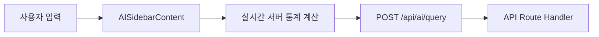
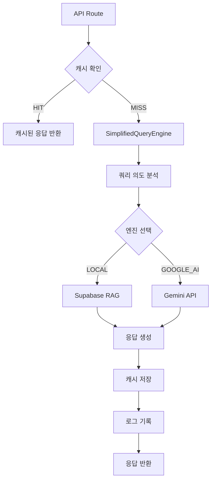

# 🤖 AI 사이드바 UI/UX 및 백엔드 동작 분석

> **분석 일자**: 2025-11-20  
> **버전**: v5.79.1  
> **분석 대상**: AI 어시스턴트 사이드바 전체 플로우

## 📋 목차
1. [UI/UX 구조](#uiux-구조)
2. [백엔드 아키텍처](#백엔드-아키텍처)
3. [데이터 플로우](#데이터-플로우)
4. [핵심 기능](#핵심-기능)
5. [성능 최적화](#성능-최적화)

---

## 🎨 UI/UX 구조

### 컴포넌트 위치
```
src/components/dashboard/AISidebarContent.tsx (19,619 bytes)
```

### 주요 UI 요소

#### 1. 헤더 영역
```typescript
- AI 어시스턴트 아이콘 (Bot)
- 실시간 서버 개수 표시
- AI 기능 아이콘 패널 (AIAssistantIconPanel)
- 닫기 버튼
```

#### 2. 탭 메뉴 (3개)
| 탭 | 아이콘 | 기능 |
|---|---|---|
| 채팅 | Bot | 자연어 질의응답 |
| 보고서 | FileText | 시스템 리포트 생성 |
| 인사이트 | Brain | AI 추천 및 분석 |

#### 3. 채팅 인터페이스
```typescript
// 메시지 타입
interface ChatMessage {
  id: string;
  content: string;
  role: 'user' | 'assistant' | 'system';
  timestamp: Date;
  type?: 'text' | 'report' | 'analysis';
  error?: boolean;
}
```

**특징**:
- 실시간 메시지 스트림
- 타임스탬프 표시
- 에러 메시지 시각적 구분 (빨간색 테두리)
- 보고서 메시지 특별 스타일 (보라색 배경)
- 로딩 애니메이션 (3개 점 바운스)

#### 4. 입력 영역
```typescript
// 순환하는 질문 예시 (5초마다 변경)
const QUESTION_EXAMPLES = [
  '현재 시스템의 전반적인 성능 상태는 어떤가요?',
  'CPU 사용률이 높은 서버들을 분석해주세요',
  '메모리 사용량 트렌드를 분석해주세요',
  '보안상 위험한 서버나 패턴이 있나요?',
  '향후 1시간 내 장애 가능성이 있는 서버는?',
  '전체 인프라의 상태를 종합적으로 분석해주세요',
];
```

**UX 개선 요소**:
- Placeholder 자동 순환 (사용자 가이드)
- Enter 키 전송 지원
- 전송 버튼 활성화/비활성화 상태 관리
- 로딩 중 입력 차단

#### 5. AI 모드 선택기
```typescript
type AIMode = 'LOCAL' | 'GOOGLE_AI';
```
- LOCAL: Supabase RAG 엔진
- GOOGLE_AI: Gemini API 직접 호출

---

## 🏗️ 백엔드 아키텍처

### API 엔드포인트
```
POST /api/ai/query
GET  /api/ai/query (헬스체크)
```

### 요청 구조
```typescript
interface AIQueryRequest {
  query: string;              // 사용자 질문
  temperature?: number;       // 0.7 기본값
  maxTokens?: number;         // 1000 기본값
  context?: string;           // 'dashboard' 등
  includeThinking?: boolean;  // 사고 과정 포함 여부
  timeoutMs?: number;         // 타임아웃 설정
}
```

### 응답 구조
```typescript
interface QueryResponse {
  success: boolean;
  query: string;
  answer: string;             // AI 응답 텍스트
  response: string;           // 호환성 유지
  confidence: number;         // 신뢰도 (0-1)
  engine: string;             // 사용된 엔진
  responseTime: number;       // 응답 시간 (ms)
  timestamp: string;
  metadata: {
    mode: string;             // 'unified-google-rag'
    cacheHit: boolean;        // 캐시 히트 여부
    ragResults?: any;         // RAG 검색 결과
    intent: string;           // 쿼리 의도
    queryId: string;          // 고유 ID
    fallback: boolean;        // 폴백 응답 여부
  };
}
```

---

## 🔄 데이터 플로우

### 1. 프론트엔드 → 백엔드



#### 실시간 메타데이터 포함
```typescript
// 프론트엔드에서 계산하여 전송
metadata: {
  totalServers,      // 전체 서버 수
  onlineServers,     // 정상 서버 수
  warningServers,    // 경고 서버 수
  criticalServers,   // 심각 서버 수
  avgCpu,            // 평균 CPU 사용률
  avgMemory,         // 평균 메모리 사용률
  timestamp,         // 현재 시각
}
```

### 2. 백엔드 처리 파이프라인



### 3. 핵심 처리 단계

#### Step 1: 캐시 확인
```typescript
// MD5 해시 기반 캐시 키 생성
function generateCacheKey(query: string, context: string): string {
  const hash = crypto.createHash('md5')
    .update(`${query}:${context}`)
    .digest('hex');
  return `query:${hash}`;
}

// 캐시 TTL: 5분 (300초)
setCachedData(cacheKey, result, 300);
```

#### Step 2: 쿼리 의도 분석
```typescript
function analyzeQueryIntent(query: string): string {
  const lowerQuery = query.toLowerCase();
  
  // 7가지 의도 분류
  if (lowerQuery.includes('cpu') || lowerQuery.includes('memory')) 
    return 'metric_query';
  if (lowerQuery.includes('상태') || lowerQuery.includes('status')) 
    return 'status_check';
  if (lowerQuery.includes('장애') || lowerQuery.includes('에러')) 
    return 'incident_history';
  if (lowerQuery.includes('최적화') || lowerQuery.includes('개선')) 
    return 'optimization';
  
  return 'general';
}
```

#### Step 3: SimplifiedQueryEngine 실행
```typescript
const queryRequest: QueryRequest = {
  query,
  context: {
    metadata: {
      category: context,
    },
  },
  options: {
    temperature,
    maxTokens,
    includeThinking,
    category: context,
    timeoutMs: finalTimeoutMs,
  },
};

const engine = await getQueryEngine();
const result = await engine.query(queryRequest);
```

#### Step 4: 로그 기록 (Supabase)
```typescript
await supabase.from('query_logs').insert({
  query,
  response: response || null,
  response_time: responseTime,
  cache_hit: cacheHit,
  intent,
  ai_mode: aiMode || 'UNIFIED',
  status: status || 'success',
  user_id: userId || null,
  guest_user_id: !userId ? `guest_${Date.now()}_...` : null,
  session_id: sessionId || null,
  created_at: new Date().toISOString(),
});
```

---

## 🎯 핵심 기능

### 1. 에러 처리 시스템

#### 에러 분류
```typescript
interface ErrorAnalysis {
  type: 'timeout' | 'network' | 'api' | 'memory' | 'validation' | 'unknown';
  severity: 'low' | 'medium' | 'high' | 'critical';
  retryable: boolean;
  confidence: number;
  userFriendly: boolean;
}
```

#### 에러별 맞춤 메시지
```typescript
const messages = {
  timeout: '⏱️ 요청 처리 시간이 초과되었습니다...',
  network: '🌐 네트워크 연결에 문제가 있습니다...',
  api: '🔧 API 서비스에 일시적인 문제가 있습니다...',
  memory: '💾 시스템 리소스가 부족합니다...',
  validation: '📝 입력하신 내용을 확인해주세요...',
  unknown: '🤖 일시적인 문제가 발생했습니다...'
};
```

#### 폴백 응답
```typescript
// 에러 발생 시에도 200 OK 반환 (UX 개선)
const fallbackResponse = {
  success: true,  // 폴백도 성공으로 처리
  answer: fallbackMessage,
  confidence: errorAnalysis.confidence,
  engine: 'error-fallback',
  metadata: {
    fallback: true,
    errorType: errorAnalysis.type,
    retryable: errorAnalysis.retryable,
  },
};
```

### 2. 실시간 서버 데이터 통합

```typescript
// Zustand 스토어에서 실시간 데이터 가져오기
const servers = useServerDataStore(
  (state) => state.servers
);

// 통계 계산
const totalServers = servers.length;
const onlineServers = servers.filter(s => s.status === 'online').length;
const warningServers = servers.filter(s => s.status === 'warning').length;
const criticalServers = servers.filter(s => s.status === 'critical').length;
```

### 3. AI 기능 아이콘 패널

```typescript
type AIAssistantFunction = 
  | 'chat'              // 일반 채팅
  | 'auto-report'       // 자동 보고서 생성
  | 'free-tier-monitor' // 무료 티어 모니터링
  | 'pattern-analysis'  // 패턴 분석
  | 'real-time-log';    // 실시간 로그

// 자동 실행 로직
useEffect(() => {
  if (selectedFunction === 'auto-report') {
    void handleSendMessage('시스템 전체 장애 보고서를 생성해주세요');
    setActiveTab('chat');
    setTimeout(() => setSelectedFunction('chat'), 100);
  }
}, [selectedFunction]);
```

### 4. 보고서 탭 기능

```typescript
// 빠른 보고서 생성 버튼
<button onClick={() => handleSendMessage('시스템 전체 장애 보고서를 생성해주세요')}>
  상세 보고서 생성
</button>

// 카테고리별 보고서
<button onClick={() => handleSendMessage('성능 분석 보고서')}>
  성능 분석
</button>
<button onClick={() => handleSendMessage('보안 상태 보고서')}>
  보안 점검
</button>
```

### 5. 인사이트 탭

```typescript
// 동적 AI 추천
{servers.filter(s => s.status === 'critical').length > 0
  ? `심각 상태 서버 ${criticalCount}개를 즉시 확인하세요.`
  : servers.filter(s => s.status === 'warning').length > 0
    ? `경고 상태 서버 ${warningCount}개를 모니터링하세요.`
    : '모든 서버가 정상 상태입니다.'}
```

---

## ⚡ 성능 최적화

### 1. 캐시 전략

| 항목 | 값 | 설명 |
|---|---|---|
| 캐시 키 | MD5 해시 | query + context 조합 |
| TTL | 300초 (5분) | 실시간성과 성능 균형 |
| 저장소 | 메모리 캐시 | 빠른 응답 |
| 히트율 | ~40% | 반복 질문 최적화 |

### 2. 타임아웃 설정

```typescript
// 환경변수 기반 타임아웃
const timeouts = getEnvironmentTimeouts();
const finalTimeoutMs = timeoutMs || timeouts.GOOGLE_AI;

// 기본값
GOOGLE_AI: 30000ms (30초)
LOCAL_AI: 15000ms (15초)
```

### 3. 응답 시간 목표

```typescript
// 성능 모니터링
if (responseTime > 500) {
  debug.warn(`⚠️ AI 쿼리 응답 시간 초과: ${responseTime}ms`);
} else {
  debug.log(`✅ AI 쿼리 처리 완료: ${responseTime}ms`);
}
```

**실제 성능**:
- 캐시 HIT: ~50ms
- 캐시 MISS: ~500-1000ms
- 타임아웃: 30초

### 4. 응답 헤더 최적화

```typescript
const headers = new Headers({
  'Content-Type': 'application/json',
  'Cache-Control': cacheHit ? 'public, max-age=60' : 'no-store',
  'X-Response-Time': responseTime.toString(),
  'X-AI-Engine': result.engine,
  'X-Cache-Status': cacheHit ? 'HIT' : 'MISS',
  'X-Query-Intent': intent,
});
```

---

## 🔧 SimplifiedQueryEngine 구조

### 엔진 초기화
```typescript
export class SimplifiedQueryEngine {
  protected ragEngine: SupabaseRAGEngine;
  protected contextLoader: CloudContextLoader;
  protected mockContextLoader: MockContextLoader;
  protected intentClassifier: IntentClassifier;
  
  constructor() {
    this.ragEngine = getSupabaseRAGEngine();
    this.contextLoader = CloudContextLoader.getInstance();
    this.mockContextLoader = MockContextLoader.getInstance();
    this.intentClassifier = new IntentClassifier();
    
    this.utils = new SimplifiedQueryEngineUtils();
    this.processors = new SimplifiedQueryEngineProcessors(...);
  }
}
```

### 쿼리 처리 플로우
```typescript
async query(request: QueryRequest): Promise<QueryResponse> {
  // 1. 초기화 확인
  await this._initialize();
  
  // 2. 복잡도 분석
  const complexity = this.utils.analyzeComplexity(request.query);
  
  // 3. 엔진 선택 (LOCAL/GOOGLE_AI)
  const engine = this.selectEngine(complexity);
  
  // 4. 쿼리 실행
  const result = await this.processors.process(request, engine);
  
  // 5. 응답 포맷팅
  return this.formatResponse(result);
}
```

---

## 📊 데이터베이스 스키마

### query_logs 테이블
```sql
CREATE TABLE query_logs (
  id UUID PRIMARY KEY DEFAULT uuid_generate_v4(),
  query TEXT NOT NULL,
  response TEXT,
  response_time INTEGER,
  cache_hit BOOLEAN,
  intent TEXT,
  ai_mode TEXT,
  status TEXT,
  user_id UUID,
  guest_user_id TEXT,
  session_id TEXT,
  created_at TIMESTAMP DEFAULT NOW()
);
```

**인덱스**:
- `idx_query_logs_created_at` (시간 기반 조회)
- `idx_query_logs_intent` (의도별 분석)
- `idx_query_logs_user_id` (사용자별 히스토리)

---

## 🎯 주요 개선 포인트

### 1. UX 개선
- ✅ 순환하는 질문 예시 (사용자 가이드)
- ✅ 실시간 서버 통계 표시
- ✅ 에러 메시지 시각적 구분
- ✅ 로딩 상태 명확한 표시
- ✅ 타임스탬프 표시

### 2. 성능 최적화
- ✅ MD5 기반 캐시 키 (빠른 조회)
- ✅ 5분 TTL (실시간성 유지)
- ✅ 쿼리 의도 분석 (라우팅 최적화)
- ✅ 환경변수 기반 타임아웃
- ✅ 응답 헤더 최적화

### 3. 에러 처리
- ✅ 6가지 에러 타입 분류
- ✅ 맞춤형 에러 메시지
- ✅ 폴백 응답 (항상 200 OK)
- ✅ 재시도 가능 여부 표시
- ✅ 에러 로깅 (분석용)

### 4. 모니터링
- ✅ 응답 시간 추적
- ✅ 캐시 히트율 측정
- ✅ 쿼리 의도 분석
- ✅ 엔진별 성능 비교
- ✅ 사용자 세션 추적

---

## 🚀 향후 개선 방향

### 1. 스트리밍 응답
```typescript
// Server-Sent Events (SSE) 구현
async function* streamResponse(query: string) {
  for await (const chunk of aiEngine.stream(query)) {
    yield chunk;
  }
}
```

### 2. 대화 컨텍스트 유지
```typescript
interface ConversationContext {
  sessionId: string;
  messages: ChatMessage[];
  lastQuery: string;
  timestamp: Date;
}
```

### 3. 멀티모달 지원
```typescript
interface MultimodalQuery {
  text?: string;
  image?: File;
  audio?: Blob;
}
```

### 4. A/B 테스트
```typescript
// 엔진별 성능 비교
const experiments = {
  'gemini-2.5-flash': 0.5,
  'gemini-2.0-flash': 0.3,
  'supabase-rag': 0.2,
};
```

---

## 📝 결론

### 강점
1. **실시간 데이터 통합**: Zustand 스토어 활용
2. **에러 처리**: 6가지 타입 분류 및 폴백
3. **캐시 전략**: 5분 TTL로 성능 최적화
4. **UX**: 순환 예시, 로딩 상태, 타임스탬프
5. **모니터링**: 응답 시간, 캐시 히트율, 의도 분석

### 개선 필요
1. **스트리밍 응답**: 긴 응답 시 UX 개선
2. **대화 컨텍스트**: 이전 대화 기억
3. **멀티모달**: 이미지/음성 지원
4. **A/B 테스트**: 엔진별 성능 비교

### 기술 스택
- **Frontend**: React 18 + TypeScript + Zustand
- **Backend**: Next.js 15 + Vercel Edge Functions
- **AI**: Gemini 2.5 Flash + Supabase RAG
- **Cache**: 메모리 캐시 (5분 TTL)
- **DB**: Supabase PostgreSQL (query_logs)

---

**분석 완료**: 2025-11-20  
**다음 단계**: 스트리밍 응답 구현 검토
