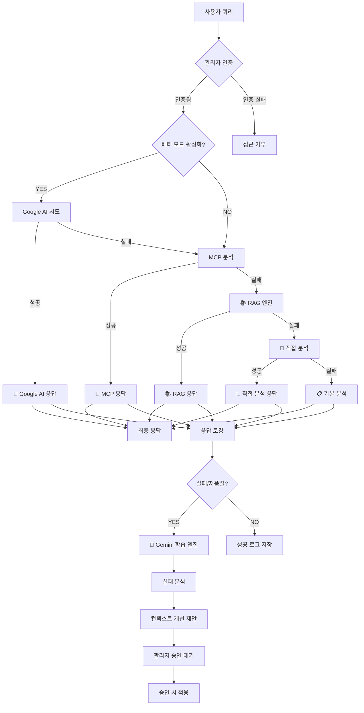
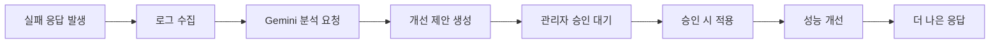

# 🤖 Google AI Studio (Gemini) 베타 모드 통합 가이드

## 📋 목차

1. [개요](#개요)
2. [아키텍처](#아키텍처)
3. [폴백 시스템](#폴백-시스템)
4. [🆕 Gemini 학습 엔진](#gemini-학습-엔진)
5. [설정 가이드](#설정-가이드)
6. [API 사용법](#api-사용법)
7. [보안 정책](#보안-정책)
8. [성능 최적화](#성능-최적화)
9. [문제 해결](#문제-해결)

## 🎯 개요

**OpenManager Vibe v5**에 Google AI Studio (Gemini) 고급 AI 분석 기능이 베타 모드로 통합되었습니다.

### 핵심 특징

- **🔄 스마트 폴백 시스템**: Google AI → MCP → RAG → 직접분석 → 기본분석
- **🧠 자기 학습 시스템**: 실패 로그 → Gemini 분석 → 컨텍스트 개선 제안
- **🔐 보안 강화**: 관리자 권한 필수, API 키 보안 처리
- **⚡ 무료 할당량 최적화**: 캐싱 및 스마트 관리

## 🏗️ 아키텍처



## 🔄 폴백 시스템 (업데이트됨)

### 새로운 폴백 순서

1. **🤖 Google AI Studio (Gemini)** - 베타 모드 활성화 시 최우선
2. **📡 MCP (Model Context Protocol)** - 로컬 도구 기반 분석
3. **📚 RAG 엔진** - 로컬 벡터 DB 기반 문서 검색
4. **🔧 직접 시스템 분석** - 내장 메트릭 분석
5. **📋 기본 분석** - 최종 폴백

### 🆕 RAG 엔진 통합

```typescript
// RAG 엔진이 MCP 다음으로 시도됨
private async performRAGAnalysis(intent: any, context: MCPContext): Promise<MCPResponse> {
  try {
    console.log('📚 [RAG] 로컬 벡터 DB 기반 분석 시도...');

    const ragEngine = new LocalRAGEngine();
    const ragResult = await ragEngine.processQuery(intent.action, {
      maxResults: 5,
      confidenceThreshold: 0.7,
      includeMetadata: true
    });

    if (ragResult.confidence > 0.6) {
      return {
        success: true,
        results: [{
          taskId: `rag-${Date.now()}`,
          type: 'rag_analysis',
          success: true,
          result: ragResult.response,
          executionTime: ragResult.processingTime,
          engine: 'Local RAG Engine',
          confidence: ragResult.confidence,
        }],
        summary: `📚 RAG 분석: ${ragResult.response.slice(0, 200)}...`,
        confidence: ragResult.confidence,
        // ... existing code ...
      };
    }

    throw new Error('RAG 신뢰도 부족');
  } catch (error) {
    console.error('❌ RAG 분석 실패:', error);
    throw error;
  }
}
```

## 🧠 Gemini 학습 엔진

### 개요

**자기 강화형 AI 시스템**으로 실패한 응답을 Gemini API로 분석하여 컨텍스트 개선 제안을 자동 생성합니다.

### 🔄 학습 사이클



### 🎯 핵심 기능

#### 1. 실패 로그 자동 감지

```typescript
// 실패로 간주되는 조건
const isFailure = (log: UserInteractionLog) =>
  log.confidence < 0.6 ||
  log.userFeedback === 'not_helpful' ||
  log.userFeedback === 'incorrect' ||
  log.intent === 'unknown';
```

#### 2. 배치 분석 처리

- **배치 크기**: 5개 로그/배치
- **요청 간격**: 10초
- **일일 한도**: 100회 (무료 티어 고려)

#### 3. 컨텍스트 제안 생성

```json
{
  "title": "Kubernetes 리소스 부족 감지 문서",
  "content": "노드별 메모리/CPU 임계치 기준 및 Pod OOMKilled 분석 가이드",
  "type": "knowledge",
  "confidence": 0.85,
  "priority": "high",
  "estimatedImprovement": 0.75
}
```

### 📊 관리자 대시보드

#### 상태 모니터링

- **엔진 활성화 상태**
- **일일 할당량 사용률**
- **대기 중인 제안 수**
- **마지막 분석 시간**

#### 개선 제안 관리

- **제안 목록 조회**
- **우선순위별 정렬**
- **승인/거부 처리**
- **적용 이력 추적**

### 🔧 설정

#### 환경 변수

```bash
# Gemini 학습 엔진 활성화
GEMINI_LEARNING_ENABLED=true

# 크론 시크릿 (Vercel Cron Jobs용)
CRON_SECRET=your-secure-cron-secret
```

#### Vercel Cron 설정

```json
{
  "crons": [
    {
      "path": "/api/cron/gemini-learning",
      "schedule": "0 */2 * * *"
    }
  ]
}
```

### 📈 성능 최적화

#### 할당량 관리

- **무료 티어 한도**: 20,000 requests/day
- **실제 사용량**: ~50-100 requests/day
- **안전 마진**: 80% 이하 사용

#### 캐싱 전략

- **유사 실패 패턴**: 24시간 캐시
- **제안 재사용**: 동일 패턴 재발 시

### 🔍 모니터링

#### 주요 메트릭

- **성공률**: 제안 생성 성공 비율
- **적용률**: 관리자 승인 비율
- **개선 효과**: 재발 방지 효율성

#### 로그 분석

```typescript
// 실시간 로그 모니터링
const status = learningEngine.getStatus();
console.log({
  enabled: status.enabled,
  dailyRequestCount: status.dailyRequestCount,
  remainingRequests: status.remainingRequests,
  pendingSuggestions: status.pendingSuggestions,
});
```

## 🔄 폴백 시스템

### Google AI → MCP → RAG → 직접분석 → 기본분석

각 단계에서 실패 시 다음 단계로 자동 전환되며, 모든 응답이 로깅되어 학습에 활용됩니다.

## 📊 설정 가이드

### 1. Google AI Studio API 키 발급

1. [Google AI Studio](https://makersuite.google.com/app/apikey) 접속
2. **Create API Key** 클릭
3. 프로젝트 선택 또는 새 프로젝트 생성
4. API 키 복사

### 2. 환경 변수 설정

```bash
# Google AI 설정
GOOGLE_AI_API_KEY=your-api-key-here
GOOGLE_AI_MODEL=gemini-1.5-flash
GOOGLE_AI_BETA_MODE=true
GOOGLE_AI_ENABLED=true

# 학습 엔진 설정
GEMINI_LEARNING_ENABLED=true
CRON_SECRET=your-secure-cron-secret
```

### 3. 베타 모드 활성화

관리자 로그인 후 AI 설정에서 베타 모드를 활성화하세요.

## 🔗 API 사용법

### 기본 질의

```typescript
// 일반 질의 (베타 모드 활성화 시 자동으로 Google AI 우선 시도)
const response = await fetch('/api/ai/query', {
  method: 'POST',
  headers: { 'Content-Type': 'application/json' },
  body: JSON.stringify({
    query: '서버 CPU 사용률이 높은 원인을 분석해줘',
    context: { servers: ['server-1', 'server-2'] },
  }),
});
```

### 고급 질의 (복합 조건)

```typescript
// 고급 분석 요청
const advancedResponse = await fetch('/api/ai/enhanced', {
  method: 'POST',
  headers: {
    'Content-Type': 'application/json',
    'x-session-id': adminSessionId,
  },
  body: JSON.stringify({
    query: '오늘 장애 발생 비율이 높은 서버는 어디야? 그 원인이 뭘까?',
    analysisType: 'comprehensive',
    priority: 'high',
    includeRecommendations: true
  })
});

// 응답 예시
{
  "success": true,
  "result": "분석 결과: 서버 A, B, C에서 메모리 부족으로 인한 장애 발생...",
  "engine_used": "Google AI Studio (Gemini)",
  "confidence": 0.92,
  "recommendations": [
    "메모리 임계값 조정",
    "로드 밸런싱 재구성",
    "모니터링 강화"
  ],
  "thinking_process": [
    { "step": 1, "content": "서버 메트릭 분석" },
    { "step": 2, "content": "장애 패턴 식별" },
    { "step": 3, "content": "근본 원인 도출" }
  ]
}
```

### 학습 엔진 API

```typescript
// 상태 조회
const status = await fetch('/api/ai-agent/learning/gemini-status');

// 수동 실행
const learning = await fetch('/api/cron/gemini-learning', {
  method: 'POST',
  headers: { 'x-session-id': adminSessionId },
});

// 제안 조회
const suggestions = await fetch('/api/ai-agent/learning/suggestions');
```

## 🔐 보안 정책

### 관리자 권한 필수

모든 Google AI 관련 설정과 학습 엔진은 **관리자 인증**이 필요합니다.

```typescript
// 보안 처리 예시
const saveConfig = async config => {
  // 🔐 관리자 권한 확인
  if (!adminMode.isAuthenticated) {
    throw new Error('관리자 권한이 필요합니다.');
  }

  // API 키 마스킹 처리
  if (config.apiKey && !config.apiKey.includes('••••••••')) {
    // 새로운 키만 저장
    await updateGoogleAIConfig(config);
  }
};
```

### API 엔드포인트 보안

```typescript
// 모든 Google AI API는 관리자 권한 확인
const sessionId = request.headers.get('x-session-id');
if (!sessionId || !authManager.hasPermission(sessionId, 'system:admin')) {
  return NextResponse.json(
    {
      success: false,
      error: '관리자 권한이 필요합니다.',
    },
    { status: 403 }
  );
}
```

### API 키 보안

- **표시 방지**: 기존 키는 `••••••••****` 형태로만 표시
- **입력 전용**: 새로운 키만 입력 가능
- **자동 클리어**: 저장 후 입력 필드 자동 초기화

## ⚡ 성능 최적화

### 무료 할당량 관리

**Google AI Studio 무료 티어 (2024년 기준)**

- **모델**: Gemini 1.5 Flash
- **한도**: 15 requests/minute, 1,500 requests/day
- **토큰**: 128K context

### 스마트 캐싱

```typescript
// 응답 캐싱으로 할당량 절약
const cacheKey = this.generateCacheKey(prompt);
const cached = this.requestCache.get(cacheKey);

if (cached && Date.now() - cached.timestamp < 300000) {
  // 5분 캐시
  return {
    content: cached.response,
    cached: true,
    confidence: 0.95,
  };
}
```

### 요청 최적화

- **배치 처리**: 여러 요청을 하나로 묶어 처리
- **우선순위**: 중요도에 따른 처리 순서
- **지연 처리**: 급하지 않은 요청은 저사용 시간대에 처리

## 🛠 사용 시나리오

### 1. 고급 질의 응답

```typescript
// 복합 조건 질의
const response = await fetch('/api/ai/google-ai/config', {
  headers: {
    'x-session-id': adminSessionId,
  },
});

const testResponse = await fetch('/api/ai/google-ai/test', {
  method: 'POST',
  headers: {
    'Content-Type': 'application/json',
    'x-session-id': adminSessionId,
  },
  body: JSON.stringify({
    query: '현재 시스템에서 가장 취약한 부분은?',
    includeRecommendations: true,
  }),
});
```

### 2. 시스템 상태 분석

```typescript
const analysisResponse = await fetch('/api/ai/enhanced', {
  method: 'POST',
  headers: {
    'Content-Type': 'application/json',
    'x-session-id': adminSessionId,
  },
  body: JSON.stringify({
    query: 'CPU 사용률이 90% 이상인 서버들의 공통점을 찾아줘',
    analysisType: 'pattern_analysis',
    includeVisualization: true,
  }),
});
```

### 3. 실시간 모니터링

```typescript
const status = await fetch('/api/ai/google-ai/status', {
  headers: {
    'x-session-id': adminSessionId,
  },
});
```

## 🔧 문제 해결

### 일반적인 문제

#### 1. API 키 인식 안됨

```bash
# 환경 변수 확인
echo $GOOGLE_AI_API_KEY

# Vercel 환경 변수 재설정
vercel env add GOOGLE_AI_API_KEY
```

#### 2. 할당량 초과

```json
{
  "error": "Quota exceeded",
  "solution": "내일 리셋까지 대기 또는 유료 플랜 업그레이드"
}
```

#### 3. 응답 품질 낮음

- **프롬프트 개선**: 더 구체적인 질문
- **컨텍스트 추가**: 시스템 상태 정보 포함
- **모델 변경**: gemini-1.5-pro 시도

### 학습 엔진 문제

#### 1. 제안 생성 안됨

```typescript
// 디버그 정보 확인
const status = learningEngine.getStatus();
console.log('Daily requests:', status.dailyRequestCount);
console.log('Remaining:', status.remainingRequests);
```

#### 2. 크론 작업 실패

```bash
# Vercel 크론 로그 확인
vercel logs --function api/cron/gemini-learning
```

### 로그 분석

```typescript
// 상세 로그 활성화
console.log('🤖 [Google AI] 요청 시작:', {
  model: this.config.model,
  promptLength: prompt.length,
  requestCount: this.requestCount,
});
```

### 성능 모니터링

```typescript
// 응답 시간 추적
const startTime = Date.now();
const response = await this.generateContent(prompt);
const responseTime = Date.now() - startTime;

console.log(`⚡ [Google AI] 응답 시간: ${responseTime}ms`);
```

## 📈 향후 계획

### Phase 1 (완료) ✅

- Google AI Studio 기본 통합
- 베타 모드 토글
- 폴백 시스템
- 보안 강화
- RAG 엔진 통합
- Gemini 학습 엔진 기본 구현

### Phase 2 (진행 중) 🚧

- 고급 프롬프트 엔지니어링
- 성능 분석 대시보드
- A/B 테스트 도구
- 자동 튜닝 시스템

### Phase 3 (계획) 📋

- 멀티모델 지원 (Claude, GPT-4)
- 실시간 피드백 학습
- 예측적 분석
- 자동 스케일링

---

**🎯 결론**: Google AI Studio (Gemini) 베타 통합과 자기 학습 시스템으로 OpenManager Vibe v5는 이제 **진정한 자기 강화형 AI 운영 에이전트**로 진화했습니다.
