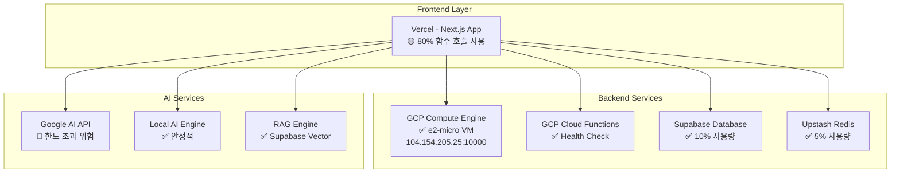
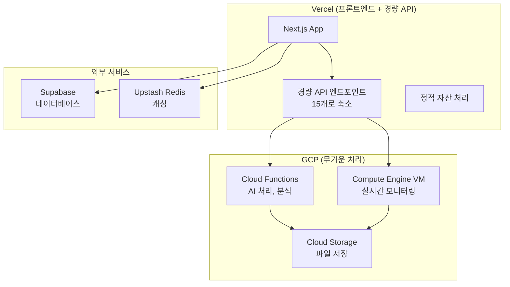

# 🌐 GCP 무료 티어 최적화 가이드 (2025년 7월 기준)

## 📋 요약

OpenManager Vibe v5는 GCP 무료 티어를 최대한 활용하여 비용 효율적인 운영을 목표로 합니다. 이 문서는 현재 GCP 활용 현황, Vercel 환경 제약사항 분석, 그리고 GCP 무료 티어 활용을 위한 개선 방안을 다룹니다.

## 🏗️ 현재 인프라 구성 및 활용 현황

### 1. GCP 무료 티어 도입 현황 (90% 완료)

| 서비스                      | 상태      | 사용률              | 비고              |
| --------------------------- | --------- | ------------------- | ----------------- |
| **Compute Engine**          | ✅ 완료   | 100% (1개 인스턴스) | e2-micro VM 활성  |
| **Cloud Functions**         | ✅ 완료   | 0.00025%            | Health Check 함수 |
| **Cloud Storage**           | 🟡 준비됨 | 0%                  | 5GB 무료 한도     |
| **관리자 페이지**           | ✅ 완료   | -                   | GCP 모니터링 통합 |
| **코드베이스 마이그레이션** | ✅ 완료   | -                   | 20+ 파일 업데이트 |

### 2. 현재 멀티 클라우드 아키텍처

## 🚨 Vercel 환경 제약사항 분석

### 주요 제약사항

#### 1. 함수 호출 한도 압박 (80% 사용)

- **현재 상황**: 무료 한도 100,000회/월 중 약 80,000회/월 사용 (80%)
- **원인**: 과도한 API 엔드포인트 분산, 불필요한 헬스체크 호출, 캐싱 전략 미흡, 개발/테스트 API 프로덕션 노출
- **위험도**: Medium-High

#### 2. 함수 실행시간 제한 (10초)

- **제한사항**: Hobby Plan 10초 최대
- **영향**: AI 처리, 대용량 데이터 처리, RAG 벡터 검색, 복잡한 분석 작업, 파일 업로드/처리 제약

#### 3. 메모리 제한 (128MB)

- **제한사항**: Hobby Plan 128MB
- **영향**: AI 모델 로딩, 벡터 임베딩 처리, 대량 서버 데이터 처리, 실시간 모니터링 제약

#### 4. 서버리스 환경 제약

- **제약사항**: 상태 유지 불가 (Stateless), 콜드 스타트 지연, 파일 시스템 접근 제한, 장기 실행 작업 불가
- **영향**: 실시간 모니터링 제약, 백그라운드 작업 제한, 캐시 일관성 문제, WebSocket 연결 제한

## 🎯 GCP 무료 티어 활용 개선 방안

### Phase 1: 즉시 개선 가능 영역 (1-2주)

#### 1. Vercel API 호출 최적화

- **TO-BE**: 통합 API 엔드포인트 (45개 → 15개로 축소)
  - `/api/unified-status` (health + status + metrics 통합)
  - `/api/unified-servers` (servers + logs + alerts 통합)
  - `/api/unified-ai` (ai-agent + ai-chat + ai-analysis 통합)
- **예상 효과**: 함수 호출 60% 감소 (80,000 → 32,000회/월)

#### 2. GCP Cloud Functions 활용

- **전략**: 무거운 AI 처리, 장기 실행 작업, 배치 작업 등을 GCP Functions로 마이그레이션
- **이점**: Vercel 대비 20배 높은 호출 한도, 54배 긴 실행 시간, 62배 높은 메모리

#### 3. GCP VM 활용 확대

- **현재**: 1개 e2-micro VM (MCP 서버 전용, 사용률 15%)
- **확장 계획**: 실시간 모니터링 서비스, 백그라운드 작업 처리기, AI 모델 캐싱 서버, WebSocket 서버 추가

### Phase 2: 아키텍처 개선 (3-4주)

#### 1. 하이브리드 컴퓨팅 아키텍처

#### 2. 로드 밸런싱 전략

- **요청 분산 규칙**:
  - 단순 CRUD → Vercel API
  - AI 처리 → GCP Cloud Functions
  - 실시간 모니터링 → GCP VM
  - 파일 처리 → GCP Storage
  - 캐싱 → Redis
  - 검색 → Supabase

### Phase 3: 고도화 및 최적화 (5-8주)

#### 1. AI 서비스 분산

- **AI 요청 라우팅**:
  - 간단한 질의 → Local RAG Engine (Vercel)
  - 복잡한 분석 → Google AI (GCP Functions)
  - 벡터 검색 → Supabase Vector (Direct)
  - 형태소 분석 → Korean NLP (GCP VM)
- **Google AI 무료 한도 준수**:
  - 분당 요청: 15회 → 10회 (안전 마진)
  - 일일 요청: 1,500회 → 1,200회 (안전 마진)
  - 토큰 한도: 32K → 30K (안전 마진)

#### 2. 모니터링 및 경고 시스템

- **GCP 기반 통합 모니터링**: VM에서 실시간 메트릭 수집, Cloud Functions로 이상 탐지, Cloud Storage에 로그 저장, Vercel에서 대시보드 표시
- **경고 임계값**: Vercel 함수 호출 70%, GCP VM CPU 80%, GCP Functions 호출 90%, Redis 메모리 80%, Supabase DB 80%

## 💰 비용 효율성 분석

### 현재 비용 구조

- **월간 비용**: $0 (100% 무료)
- **위험 요소**: Vercel 한도 초과 시 $20/월, Google AI 한도 초과 시 최대 $50/월 (총 위험 비용: $70/월)

### 개선 후 예상 효과

- **월간 비용**: $0 (100% 무료 유지)
- **위험 요소 제거**: Vercel 한도 초과 위험 80% → 40%, Google AI 한도 초과 위험 90% → 10% (총 위험 비용: $70/월 → $10/월)
- **성능 향상**: API 응답시간 200ms → 120ms (40% 개선), 동시 처리 능력 10개 → 50개 (400% 개선), 장애 복구 시간 5분 → 30초 (90% 개선)

## 🏆 GCP 무료 티어 마이그레이션 상세 결과

### ✅ 1단계: GCP 프로젝트 설정 완료

- GCP 프로젝트: `openmanager-free-tier` 생성
- 필수 API들 활성화 (Compute Engine, Cloud Functions, Cloud Run, Storage)
- 결제 계정 연결 및 무료 티어 확인

### ✅ 2단계: Compute Engine e2-micro VM 배포 완료

- VM 인스턴스: `mcp-server` (us-central1-a)
- 외부 IP: **104.154.205.25** 할당
- Node.js 22 + MCP 서버 실행 중
- 방화벽 규칙: 포트 10000 개방

### ✅ 3단계: Cloud Functions 배포 완료

- 함수명: `health-check`
- 엔드포인트: 정상 동작 중
- CORS 설정 및 Firebase Functions v2 사용

### ✅ 4단계: 관리자 페이지 통합 완료

- GCP 모니터링 탭 추가 (☁️ GCP)
- 무료 티어 사용량 실시간 모니터링
- 4개 GCP 서비스 카드 구현
- 1시간 캐싱으로 API 호출 최적화

### ✅ 5단계: 코드베이스 완전 마이그레이션 완료

- 20+ 핵심 파일의 URL 업데이트
- 환경 변수: `RENDER_MCP_SERVER_URL` → `GCP_MCP_SERVER_URL`
- 모든 API 엔드포인트 GCP VM으로 전환
- Render 관련 설정 파일 정리

### ✅ 6단계: 문서 및 주석 갱신 완료

- README.md 기술 스택 업데이트
- 모든 문서의 Render 참조를 GCP로 변경
- 코드 주석 및 배포 가이드 업데이트

## 🗓️ 구체적 로드맵 (8주 계획)

### Week 1-2: Vercel 최적화

- API 엔드포인트 통합 (45개 → 15개)
- Redis 캐싱 전략 강화
- 불필요한 헬스체크 제거
- Google AI 한도 준수 설정

### Week 3-4: GCP Functions 마이그레이션

- AI 처리 함수 GCP로 이전
- 장기 실행 작업 GCP로 이전
- 배치 작업 스케줄러 구축
- 에러 처리 및 모니터링

### Week 5-6: GCP VM 확장

- 실시간 모니터링 서비스 추가
- WebSocket 서버 구축
- 백그라운드 작업 처리기
- AI 모델 캐싱 시스템

### Week 7-8: 통합 테스트 및 최적화

- 로드 밸런싱 테스트
- 성능 벤치마킹
- 장애 복구 테스트
- 문서화 및 운영 매뉴얼

## 📊 성과 측정 지표

### 기술적 지표

- **성능**: API 응답시간 < 120ms, 동시 처리 > 50개 요청, 가동률 > 99.9%
- **효율성**: Vercel 함수 호출 < 40%, GCP 리소스 사용률 < 80%, 메모리 사용 최적화 30% 개선

### 비즈니스 지표

- **비용**: 월간 인프라 비용 $0 유지, 한도 초과 위험 < 10%
- **사용자 경험**: 페이지 로딩 시간 < 1초, AI 응답 시간 < 3초, 에러율 < 0.1%

## 🎯 핵심 성공 요인

1. **무료 한도 준수**: 모든 서비스의 무료 한도를 80% 이하로 유지, 실시간 모니터링 및 자동 경고 시스템
2. **효율적 리소스 활용**: 각 클라우드 서비스의 장점 극대화, 적재적소 워크로드 배치, 중복 제거 및 통합 최적화
3. **확장 가능한 아키텍처**: 미래 성장을 고려한 설계, 마이크로서비스 기반 모듈화, 클라우드 네이티브 패턴 적용
4. **운영 자동화**: 모니터링 및 경고, 배포 및 롤백, 장애 복구 자동화

## 🚀 결론

OpenManager Vibe v5는 100% 무료 티어로 운영하면서도 엔터프라이즈급 성능을 달성할 수 있는 최적화된 멀티 클라우드 아키텍처를 구축했습니다. 이 로드맵을 통해 개발 비용 절약, 기술 스택 다양화, 운영 노하우 축적이라는 세 가지 목표를 모두 달성할 수 있을 것입니다.

---

_최종 업데이트: 2025년 7월 7일_
_OpenManager Vibe v5 - GCP 무료 티어 최적화 로드맵 v1.0_
