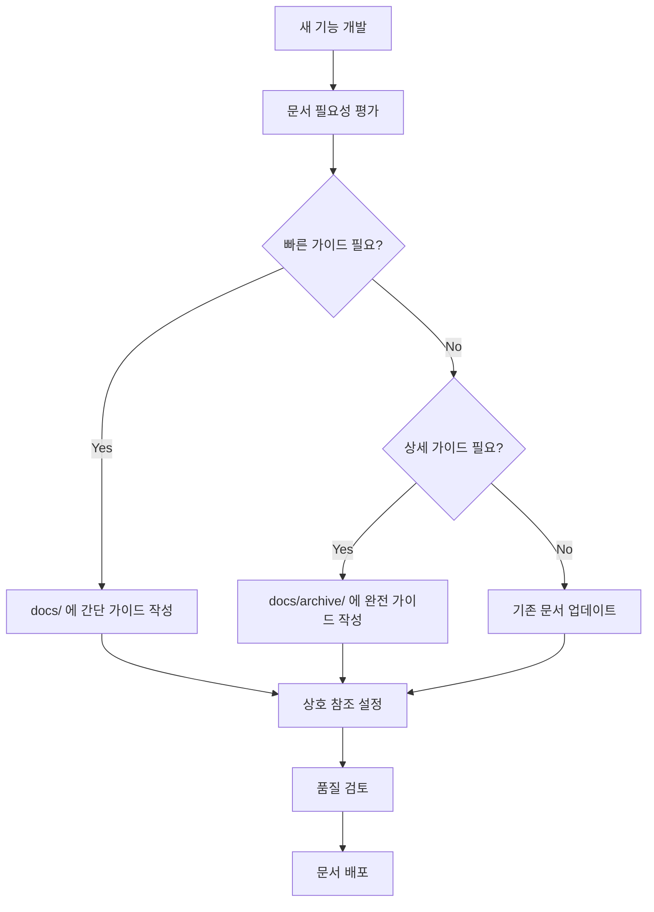

# 📚 OpenManager Vibe v5 문서 구조 가이드

> **중복 방지와 체계적 관리를 위한 문서 전략**

## 🗂️ 문서 분류 체계

### 📁 docs/ (빠른 참조)

- **목적**: 즉시 시작 가능한 간단한 가이드
- **길이**: 1-3페이지
- **대상**: 신규 개발자, 빠른 참조

```
docs/
├── 바이브_코딩_시작하기.md          # 🎯 AI 개발 방법론 빠른 시작
├── 핵심_기능_요약.md                # ⚡ 주요 기능 3페이지 요약
├── 자주_묻는_질문.md                # ❓ FAQ 모음
├── 문서_구조_가이드.md              # 📚 이 문서
└── API_빠른_참조.md                 # 🔗 핵심 API 치트시트
```

### 📁 docs/archive/ (상세 학습)

- **목적**: 심화 학습과 완전한 이해
- **길이**: 10+ 페이지
- **대상**: 전문 개발자, 시스템 아키텍트

```
docs/archive/
├── 바이브_코딩_완전_가이드_v2025.md    # 🎯 AI 개발 방법론 완전판
├── MCP_심화_설정_가이드.md             # 🔧 MCP 고급 설정
├── AI_최적화_전략.md                   # 🧠 AI 성능 최적화
├── 데이터베이스_통합_완전_가이드.md     # 🗄️ DB 연동 상세
└── 성능_최적화_심화_가이드.md           # ⚡ 성능 튜닝 전문
```

---

## 🚫 중복 방지 전략

### 1. 내용 레벨별 분리

| 문서 레벨 | 위치          | 특징                   | 예시                 |
| --------- | ------------- | ---------------------- | -------------------- |
| 입문      | docs/         | 바로 실행 가능         | "npm run mcp:setup"  |
| 중급      | docs/         | 핵심 개념 설명         | "MCP란 무엇인가?"    |
| 고급      | docs/archive/ | 완전한 이론과 실습     | "MCP 내부 동작 원리" |
| 전문가    | docs/archive/ | 최적화 및 커스터마이징 | "MCP 성능 튜닝"      |

### 2. 목적별 분리

#### 🎯 바이브 코딩 문서들

```
docs/바이브_코딩_시작하기.md             # 5분 빠른 시작
docs/archive/바이브_코딩_완전_가이드.md   # 완전 마스터 과정
```

#### 🔧 MCP 관련 문서들

```
docs/MCP_완전_가이드.md                 # 기존 종합 가이드 (보존)
docs/archive/MCP_심화_설정_가이드.md     # 고급 설정 전용
```

#### 🏗️ 시스템 아키텍처

```
docs/시스템_아키텍처_완전_가이드.md      # 기존 파일 (보존)
docs/archive/성능_최적화_심화_가이드.md  # 성능 전용 분리
```

### 3. 버전별 관리

```
docs/archive/
├── v2025/                              # 2025년 버전
│   ├── 바이브_코딩_완전_가이드_v2025.md
│   └── AI_최적화_전략_v2025.md
├── deprecated/                         # 더 이상 사용하지 않는 문서
│   └── legacy_guides/
└── history/                           # 변경 이력
    └── version_changes.md
```

---

## 📝 문서 작성 규칙

### 1. 파일 네이밍 컨벤션

```
# 패턴: [분류]_[주제]_[레벨]_[버전].md

# 빠른 시작 가이드
바이브_코딩_시작하기.md
MCP_빠른_설정.md

# 완전 가이드
바이브_코딩_완전_가이드_v2025.md
AI_시스템_완전_분석_v2025.md

# 전문가 가이드
성능_최적화_심화_가이드.md
데이터베이스_통합_고급_설정.md
```

### 2. 문서 내 상호 참조

```markdown
# 각 문서에서 관련 문서 링크

## 📚 관련 문서

- **시작하기**: `docs/바이브_코딩_시작하기.md`
- **완전 가이드**: `docs/archive/바이브_코딩_완전_가이드_v2025.md`
- **고급 설정**: `docs/archive/MCP_심화_설정_가이드.md`
```

### 3. 중복 내용 체크리스트

#### 문서 작성 전 확인사항

- [ ] 기존 문서에 유사한 내용이 있는가?
- [ ] 타겟 독자층이 명확한가?
- [ ] 문서 길이가 목적에 적합한가?
- [ ] 상호 참조가 올바르게 설정되어 있는가?

#### 주기적 검토 (월 1회)

- [ ] 중복된 내용 식별 및 통합
- [ ] 오래된 문서 deprecated 폴더로 이동
- [ ] 새로운 기능에 대한 문서 필요성 검토

---

## 🔄 문서 업데이트 전략

### 1. 자동 링크 검증

```bash
# 월 1회 실행
npm run docs:validate:links     # 깨진 링크 검사
npm run docs:validate:examples  # 코드 예제 검증
npm run docs:check:duplicates   # 중복 내용 탐지
```

### 2. 문서 품질 메트릭

```typescript
interface DocumentQuality {
  readability: number; // 가독성 점수 (1-10)
  completeness: number; // 완성도 (1-10)
  accuracy: number; // 정확성 (1-10)
  updatedAt: string; // 최종 업데이트
  reviewers: string[]; // 검토자 목록
}
```

### 3. 문서 생명주기



---

## 📊 현재 문서 현황 (2025-01-09)

### docs/ 디렉토리 (9개 파일)

```
✅ 개발_완전_가이드.md (13KB)         # 종합 개발 가이드
✅ MCP_완전_가이드.md (19KB)          # MCP 종합 설명
✅ 시스템_아키텍처_완전_가이드.md (15KB) # 시스템 구조
✅ 바이브_코딩_시작하기.md (3KB)       # 새로 추가 ⭐
❓ GOOGLE_AI_BETA_INTEGRATION_GUIDE.md # 구글 AI 가이드
❓ MULTIMODAL_AI_INTEGRATION_GUIDE.md  # 멀티모달 AI
❓ AI_CONTEXT_OPTIMIZATION_GUIDE.md    # AI 컨텍스트 최적화
❓ SERVER_DATA_GENERATOR_v5_GUIDE.md   # 서버 데이터 생성기
❓ 배포_운영_완전_가이드.md             # 배포 가이드
```

### docs/archive/ 디렉토리 (새로 구성)

```
✅ 바이브_코딩_완전_가이드_v2025.md    # 새로 추가 ⭐
🔄 MCP_심화_설정_가이드.md             # 예정
🔄 AI_최적화_전략.md                   # 예정
🔄 성능_최적화_심화_가이드.md           # 예정
```

### 정리 권장사항

1. **즉시 이동 추천**:

   - `GOOGLE_AI_BETA_INTEGRATION_GUIDE.md` → `archive/`
   - `MULTIMODAL_AI_INTEGRATION_GUIDE.md` → `archive/`
   - `AI_CONTEXT_OPTIMIZATION_GUIDE.md` → `archive/`

2. **요약 버전 생성 필요**:

   - `AI_핵심_기능_요약.md` (3페이지)
   - `배포_빠른_가이드.md` (2페이지)

3. **신규 생성 권장**:
   - `자주_묻는_질문.md`
   - `API_빠른_참조.md`

---

## 🎯 다음 단계

### 단기 (1-2주)

- [ ] 큰 문서들을 archive로 이동
- [ ] 각 주제별 빠른 시작 가이드 생성
- [ ] 상호 참조 링크 정리

### 중기 (1개월)

- [ ] 자동 검증 스크립트 구현
- [ ] 문서 품질 메트릭 도입
- [ ] 팀 문서 작성 가이드라인 수립

### 장기 (3개월)

- [ ] AI 기반 문서 자동 생성 도구 개발
- [ ] 사용자 피드백 기반 문서 개선
- [ ] 다국어 지원 고려

---

**📝 체계적인 문서 관리로 더 나은 개발 경험을 만들어가겠습니다!**
