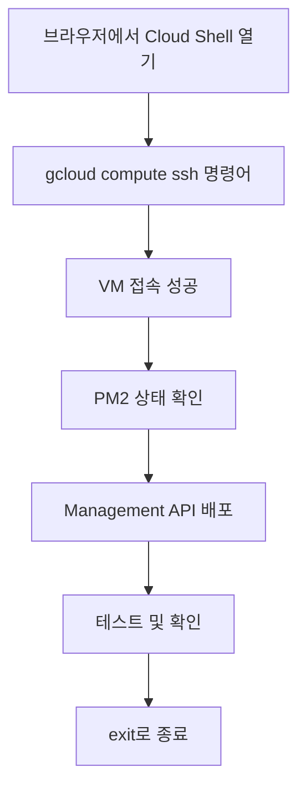

# 🌐 Cloud Shell에서 VM 접속 가이드

## 📍 Step 1: Cloud Shell 열기

### 방법 1: 직접 링크 (권장)
👉 **[이 링크를 클릭](https://shell.cloud.google.com/?project=openmanager-free-tier)** 하면 바로 열립니다

### 방법 2: GCP Console에서 열기
1. [Google Cloud Console](https://console.cloud.google.com) 접속
2. 상단 오른쪽 `>_` 아이콘 클릭
3. Cloud Shell 활성화

## 📍 Step 2: VM에 SSH 접속

Cloud Shell이 열리면 다음 명령어 입력:

```bash
gcloud compute ssh mcp-server --zone=us-central1-a
```

### 첫 접속 시 나타나는 메시지들:

1. **SSH 키 생성** (첫 접속시만)
```
Generating public/private rsa key pair.
Enter passphrase (empty for no passphrase): [Enter 키]
Enter same passphrase again: [Enter 키]
```
→ 그냥 Enter 두 번 누르면 됩니다

2. **호스트 확인**
```
The authenticity of host '104.154.205.25' can't be established.
Are you sure you want to continue connecting (yes/no)? yes
```
→ `yes` 입력 후 Enter

3. **접속 성공**
```
skyasu2@mcp-server:~$
```
→ VM에 접속 완료!

## 📍 Step 3: 현재 상태 확인

VM에 접속한 후 실행할 명령어들:

```bash
# PM2 프로세스 확인
pm2 status

# 현재 실행 중인 서버 확인
pm2 show simple

# 포트 확인
sudo netstat -tlnp | grep 10000

# 로그 확인
pm2 logs --lines 10

# API 테스트
curl http://localhost:10000/health
```

## 📍 Step 4: Management API 배포

### 옵션 1: 간단 배포 (복사-붙여넣기)

```bash
# 1. 새 파일 생성
cat > /tmp/mgmt-api.js << 'EOF'
[여기에 Management API 코드 붙여넣기]
EOF

# 2. PM2로 시작
pm2 stop simple
pm2 delete simple
pm2 start /tmp/mgmt-api.js --name mgmt-api
pm2 save

# 3. 확인
pm2 status
curl http://localhost:10000/health
```

### 옵션 2: nano 에디터 사용

```bash
# 1. nano로 파일 생성
nano /tmp/mgmt-api.js

# 2. 코드 붙여넣기
# - 마우스 우클릭 또는 Ctrl+Shift+V
# - 저장: Ctrl+O → Enter
# - 종료: Ctrl+X

# 3. 실행
pm2 start /tmp/mgmt-api.js --name mgmt-api
```

## 📍 Step 5: 종료

```bash
# VM에서 나가기
exit

# Cloud Shell 종료
exit
```

## 🔧 유용한 Cloud Shell 단축키

- **새 탭 열기**: Ctrl+Shift+T
- **붙여넣기**: Ctrl+V 또는 마우스 우클릭
- **복사**: 드래그 선택 후 Ctrl+C
- **화면 지우기**: Ctrl+L
- **명령 취소**: Ctrl+C

## 💡 꿀팁

### 1. Cloud Shell 세션 유지
- 30분간 활동 없으면 자동 종료
- 홈 디렉토리는 영구 보존 (5GB)
- `/tmp`는 세션 종료시 삭제

### 2. 파일 업로드/다운로드
Cloud Shell 상단 메뉴에서:
- **⋮** → Upload file (파일 업로드)
- **⋮** → Download file (파일 다운로드)

### 3. Web Preview
Cloud Shell에서 실행 중인 서비스 미리보기:
- 상단 **🔍 Web Preview** 버튼
- Change port → 10000 입력

## 🚨 자주 발생하는 문제

### 1. "Permission denied" 오류
```bash
# sudo 권한으로 실행
sudo [명령어]
```

### 2. PM2 not found
```bash
# PM2 설치
npm install -g pm2
```

### 3. 접속이 안 될 때
```bash
# 프로젝트 확인
gcloud config get-value project

# 프로젝트 설정
gcloud config set project openmanager-free-tier

# Zone 설정
gcloud config set compute/zone us-central1-a
```

## 📊 전체 프로세스 요약



## 🎯 최종 체크리스트

- [ ] Cloud Shell 열기
- [ ] `gcloud compute ssh mcp-server --zone=us-central1-a` 실행
- [ ] VM 접속 확인 (프롬프트가 `skyasu2@mcp-server:~$`로 변경)
- [ ] `pm2 status` 실행하여 현재 프로세스 확인
- [ ] Management API 배포
- [ ] `curl http://localhost:10000/health` 테스트
- [ ] `exit`로 VM 종료
- [ ] Cloud Shell 종료

---

**작성일**: 2025-08-14 13:30 KST
**난이도**: ⭐⭐ (따라하기 쉬움)
**소요시간**: 5-10분