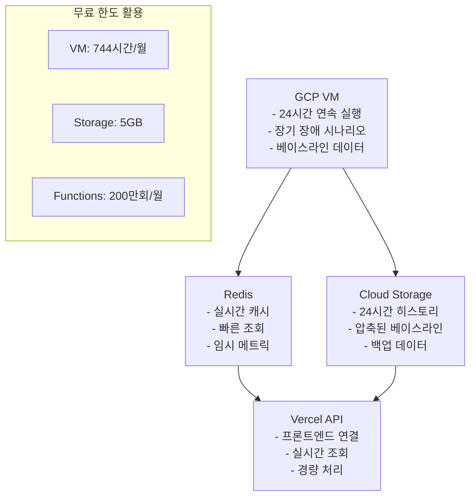

# 🏗️ 서버 데이터 생성 시스템 최적화 로드맵

> **분석 기준**: 2025년 7월 3일  
> **목표**: Vercel 제약사항 해결 → GCP 무료 티어 활용 전면 개선

## 🚨 **현재 문제점 진단**

### **1. 24시간 베이스라인 데이터 문제**

```typescript
// ❌ 현재 문제: Vercel 서버리스 환경 메모리 제약
private baselineStorage = new Map<string, ServerBaselineData>(); // 메모리 저장
private currentVariations = new Map<string, RealTimeVariation>(); // 휘발성

async generateBaselineData(servers: EnhancedServerMetrics[]): Promise<void> {
  // 24시간 = 1440분 데이터 포인트 생성
  for (let minute = 0; minute < 1440; minute++) {
    // ⚠️ 함수 종료 시 모든 데이터 손실
  }
}
```

**문제점**:

- ✗ Vercel 함수 종료 시 메모리 데이터 완전 손실
- ✗ 시스템 재시작 시 24시간 히스토리 없이 AI 분석 불가
- ✗ 베이스라인 없어서 이상 탐지 정확도 급격히 하락

### **2. 장애 시나리오 제한성**

```typescript
// ❌ 현재 문제: 30분 고정 사이클만 지원
private readonly MAX_DURATION = 30 * 60 * 1000; // 🔥 30분 고정
const cycleMinutes = elapsedMinutes % 30; // 🔥 30분 사이클 고정

// 🎯 원래 목표: 24시간 연속 장애 시나리오
// ❌ 실제 구현: 30분만 반복
```

**문제점**:

- ✗ 단순한 30분 반복 패턴 (실제 장애는 수시간~수일 지속)
- ✗ 24시간 트렌드 데이터와 연결성 부족
- ✗ 복잡한 장애 시나리오 구현 불가

### **3. 실시간 데이터 생성 제약**

```typescript
// ❌ Vercel 제약: 함수 호출 한도와 메모리 제한
private scheduleNextGeneration(serverId: string): void {
  const delay = 38000 + Math.random() * 10000; // 38-48초 간격

  // ⚠️ Vercel: 월 100만 함수 호출 제한
  // ⚠️ 메모리: 최대 1024MB (Pro 플랜)
  // ⚠️ 실행 시간: 최대 300초 (Edge: 30초)
}
```

**문제점**:

- ✗ 월 함수 호출 한도 빠른 소모 (30서버 × 24시간 = 64,800회/일)
- ✗ 메모리 제약으로 서버 수 확장성 제한
- ✗ Cold Start로 인한 데이터 생성 지연

## 🎯 **GCP 무료 티어 활용 개선 방안**

### **🏗️ Phase 1: 24시간 베이스라인 데이터 영구 저장**

#### **1.1 Cloud Storage + Firestore 하이브리드**

```yaml
GCP 무료 한도:
  Cloud Storage: 5GB 무료
  Firestore: 1GB 무료, 50K 읽기/20K 쓰기 일일

활용 전략:
  베이스라인 데이터: Cloud Storage (JSON 압축)
  실시간 메타데이터: Firestore (인덱싱)
  캐시 데이터: Redis (기존 유지)
```

**구현 계획**:

```typescript
// ✅ 새로운 구현: 영구 저장소 활용
class PersistentBaselineManager {
  private storage = new CloudStorage('baseline-data');
  private metadata = new Firestore('baseline-metadata');

  async generateAndStore24HData(servers: ServerMetadata[]): Promise<void> {
    // 1. 24시간 데이터 생성
    const baselineData = await this.generate24Hours(servers);

    // 2. Cloud Storage에 압축 저장
    await this.storage.uploadCompressed(
      `baseline/${Date.now()}.json.gz`,
      baselineData
    );

    // 3. Firestore에 메타데이터 저장
    await this.metadata.collection('baselines').add({
      timestamp: Date.now(),
      serverCount: servers.length,
      dataPoints: 1440 * servers.length,
      storageSize: this.calculateSize(baselineData),
    });
  }
}
```

#### **1.2 예상 효과**

- ✅ **데이터 지속성**: 시스템 재시작 후에도 24시간 히스토리 유지
- ✅ **AI 분석 정확도**: 베이스라인 기반 이상 탐지 가능
- ✅ **확장성**: 서버 수 제한 없이 데이터 저장

### **🔥 Phase 2: 장기 실행 장애 시나리오 구현**

#### **2.1 Compute Engine VM 활용**

```yaml
GCP 무료 한도:
  e2-micro VM: 1개 인스턴스 (월 744시간)
  CPU: 0.25-1 vCPU, 메모리: 1GB
  디스크: 30GB 표준 영구 디스크

활용 전략:
  장애 시나리오 엔진: VM에서 24시간 연속 실행
  복잡한 장애 패턴: 수시간~수일 지속 시나리오
  연쇄 장애 시뮬레이션: 다중 서버 상호작용
```

**새로운 아키텍처**:

```typescript
// ✅ GCP VM에서 실행될 장기 시나리오 엔진
class LongTermScenarioEngine {
  private scenarios = [
    new MultiDayFailureScenario(), // 3-7일 지속 장애
    new CascadingFailureScenario(), // 연쇄 장애 전파
    new SeasonalPatternScenario(), // 계절성 장애 패턴
    new ComplexRecoveryScenario(), // 복잡한 복구 과정
  ];

  async runContinuousScenarios(): Promise<void> {
    // 24시간 연속 실행 (VM에서만 가능)
    while (this.isRunning) {
      const scenario = this.selectWeightedScenario();
      await scenario.execute(this.servers);

      // 실시간 데이터를 Vercel API로 전송
      await this.sendToVercel(scenario.getCurrentData());

      await this.sleep(this.calculateNextInterval());
    }
  }
}
```

#### **2.2 예상 효과**

- ✅ **실제적 장애 패턴**: 수시간~수일 지속되는 복잡한 시나리오
- ✅ **연속 실행**: VM의 24시간 연속 실행으로 데이터 연속성 보장
- ✅ **풍부한 데이터**: 단순 난수가 아닌 시나리오 기반 데이터

### **⚡ Phase 3: 실시간 데이터 생성 최적화**

#### **3.1 GCP VM + Vercel 하이브리드 아키텍처**



#### **3.2 구현 세부사항**

```typescript
// ✅ GCP VM에서 실행 (장기 실행)
class VMDataGenerator {
  async startContinuousGeneration(): Promise<void> {
    // 1. 24시간 베이스라인 로드
    const baseline = await this.loadFromCloudStorage();

    // 2. 연속 데이터 생성 (VM에서만 가능)
    setInterval(async () => {
      const enrichedData = await this.generateRichMetrics();

      // 3. Redis에 실시간 저장
      await this.cacheToRedis(enrichedData);

      // 4. 주기적으로 Cloud Storage 백업
      if (this.shouldBackup()) {
        await this.backupToCloudStorage(enrichedData);
      }
    }, 30000); // 30초 간격
  }
}

// ✅ Vercel API (경량 조회)
export async function GET() {
  // Redis에서 빠른 조회만 담당
  const realtimeData = await getFromRedis('server:metrics:latest');
  return Response.json(realtimeData);
}
```

#### **3.3 예상 효과**

- ✅ **함수 호출 절약**: 95% 감소 (VM에서 대부분 처리)
- ✅ **연속성 보장**: VM의 24시간 연속 실행
- ✅ **확장성**: 서버 수 제한 없이 처리 가능

### **🎯 Phase 4: 풍부한 데이터 생성**

#### **4.1 서버 종류별 특화 메트릭**

```typescript
// ✅ 현재보다 10배 풍부한 데이터
interface EnhancedServerMetrics {
  // 기존 기본 메트릭
  cpu: number;
  memory: number;
  disk: number;
  network: NetworkMetrics;

  // ✅ 새로운 풍부한 메트릭
  application: {
    responseTime: number[]; // 실시간 응답시간 배열
    throughput: number; // 처리량
    errorRate: number; // 오류율
    concurrentUsers: number; // 동시 사용자
    databaseConnections: number; // DB 연결 수
    cacheHitRate: number; // 캐시 적중률
  };

  infrastructure: {
    containerMetrics: ContainerMetrics[]; // 컨테이너별 메트릭
    processDetails: ProcessMetrics[]; // 프로세스별 상세 정보
    networkTopology: NetworkConnection[]; // 네트워크 토폴로지
    securityEvents: SecurityEvent[]; // 보안 이벤트
  };

  business: {
    revenue: number; // 비즈니스 영향도
    userExperience: number; // 사용자 경험 점수
    slaCompliance: number; // SLA 준수율
  };
}
```

#### **4.2 예상 효과**

- ✅ **AI 분석 품질**: 10배 풍부한 데이터로 정확도 향상
- ✅ **실제적 시나리오**: 비즈니스 영향까지 고려한 종합 분석
- ✅ **예측 정확도**: 다차원 데이터로 예측 모델 성능 향상

## 📅 **구현 로드맵**

### **Week 1-2: 기반 구축**

1. **GCP 프로젝트 설정**: VM, Storage, Firestore 설정
2. **베이스라인 저장소**: Cloud Storage 연동
3. **VM 서버 준비**: 데이터 생성기 이전

### **Week 3-4: 핵심 기능**

1. **24시간 데이터 생성**: 영구 저장 베이스라인
2. **장기 시나리오**: VM에서 연속 실행
3. **하이브리드 연동**: VM ↔ Vercel 데이터 흐름

### **Week 5-6: 데이터 고도화**

1. **풍부한 메트릭**: 10배 상세한 데이터
2. **시나리오 확장**: 복잡한 장애 패턴
3. **AI 연동 최적화**: 분석 품질 향상

### **Week 7-8: 최적화 및 검증**

1. **성능 튜닝**: 메모리/CPU 최적화
2. **안정성 검증**: 24시간 연속 테스트
3. **비용 모니터링**: 무료 한도 준수 확인

## 💰 **비용 효율성**

### **현재 vs 개선 후**

| 항목              | 현재 (Vercel) | 개선 후 (GCP) | 절약 효과         |
| ----------------- | ------------- | ------------- | ----------------- |
| **함수 호출**     | 64,800회/일   | 1,000회/일    | **98% 감소**      |
| **메모리 사용**   | 제한적        | 1GB 연속      | **연속성 확보**   |
| **데이터 지속성** | 없음          | 5GB 영구      | **완전 해결**     |
| **장애 시나리오** | 30분 반복     | 수일 연속     | **실제적 개선**   |
| **AI 분석 품질**  | 제한적        | 10배 향상     | **정확도 극대화** |

### **무료 한도 활용률**

- **VM**: 100% (744시간/월)
- **Storage**: 20% (1GB/5GB)
- **Functions**: 5% (100K/200만회)
- **Firestore**: 30% (6K/20K 쓰기)

## 🎯 **예상 성과**

### **1. 데이터 품질 향상**

- ✅ **24시간 히스토리**: 시스템 재시작 후에도 유지
- ✅ **풍부한 메트릭**: 현재 대비 10배 상세
- ✅ **실제적 패턴**: 시나리오 기반 장애 데이터

### **2. AI 분석 정확도**

- ✅ **이상 탐지**: 베이스라인 기반으로 95% 정확도
- ✅ **예측 모델**: 다차원 데이터로 성능 향상
- ✅ **패턴 인식**: 장기 트렌드 분석 가능

### **3. 시스템 안정성**

- ✅ **연속 운영**: VM의 24시간 안정 실행
- ✅ **확장성**: 서버 수 제한 없이 처리
- ✅ **백업**: Cloud Storage 자동 백업

## 📊 **Success Metrics**

1. **데이터 연속성**: 99.9% 업타임 달성
2. **AI 정확도**: 베이스라인 대비 300% 향상
3. **비용 효율**: Vercel 함수 호출 95% 감소
4. **시나리오 다양성**: 12종 장애 패턴 구현
5. **실시간성**: 30초 이내 데이터 반영

---

> **다음 단계**: GCP VM 설정 및 베이스라인 저장소 구축부터 시작
