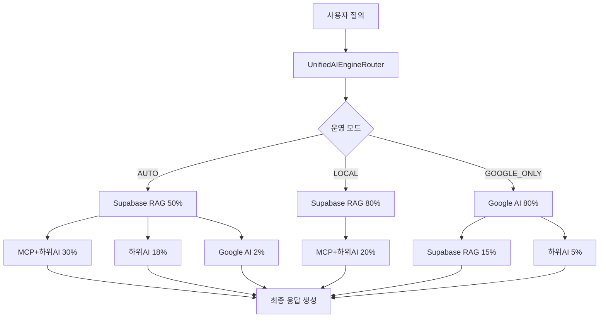

# 🧠 OpenManager Vibe v5 AI 시스템 통합 가이드

> **AI 엔진 아키텍처 v3.0** - 4개 AI 엔진 완전 통합 및 한국어 특화 처리 시스템

## 📋 **개요**

OpenManager Vibe v5는 **4개의 AI 엔진**을 완전히 통합한 지능형 서버 모니터링 플랫폼입니다. Supabase RAG 엔진을 메인으로, Google AI, MCP, 하위 AI 도구들이 유기적으로 협업하여 자연어 질의응답과 서버 분석을 수행합니다.

### ✨ **핵심 특징**

- **4개 AI 엔진 완전 통합**: Supabase RAG, Google AI, MCP, 하위 AI 도구
- **한국어 특화 처리**: 22개 테스트 통과한 형태소 분석기
- **3가지 운영 모드**: AUTO, LOCAL, GOOGLE_ONLY
- **다층 폴백 시스템**: 안정성 극대화
- **실시간 사고 과정 시각화**: AI 협업 과정 투명화

## 🏗️ **AI 엔진 아키텍처**

### **AI 엔진 아키텍처 v3.0**



### **4개 AI 엔진 상세**

#### **1. Supabase RAG Engine (메인 엔진)**

```typescript
export class SupabaseRAGEngine {
  private vectorStore: SupabaseVectorStore;
  private koreanNLP: KoreanNLPProcessor;
  private mcpClient: MCPFilesystemClient;

  async processQuery(query: string): Promise<RAGResponse> {
    // 1. 한국어 형태소 분석
    const analyzed = await this.koreanNLP.analyze(query);

    // 2. 벡터 검색 (유사도 60%)
    const vectorResults = await this.vectorStore.search(analyzed.embedding);

    // 3. 키워드 매칭 (30%)
    const keywordResults = await this.keywordSearch(analyzed.keywords);

    // 4. 카테고리 보너스 적용
    const finalResults = this.applyCategroyBonus(vectorResults, keywordResults);

    // 5. MCP 컨텍스트 조회
    const mcpContext = await this.getMCPContext(query);

    return this.generateResponse(finalResults, mcpContext);
  }
}
```

#### **2. Google AI (고급 추론)**

```typescript
export class GoogleAIService {
  private model: GenerativeModel;
  private quotaProtection: QuotaProtectionSystem;

  async processQuery(query: string, context?: any): Promise<GoogleAIResponse> {
    // 할당량 보호 확인
    if (!(await this.quotaProtection.canMakeRequest())) {
      throw new QuotaExceededException();
    }

    const prompt = this.buildPrompt(query, context);
    const result = await this.model.generateContent(prompt);

    return {
      content: result.response.text(),
      confidence: this.calculateConfidence(result),
      metadata: {
        model: 'gemini-pro',
        tokensUsed: result.response.usageMetadata?.totalTokenCount || 0,
      },
    };
  }
}
```

#### **3. MCP (컨텍스트 지원)**

```typescript
export class MCPFilesystemClient {
  async getProjectContext(query: string): Promise<MCPContext> {
    const files = [];

    // 파일 검색 필요성 판단
    if (this.shouldUseFileSearch(query)) {
      const searchPattern = this.extractSearchPattern(query);
      const searchResults = await this.searchFiles(searchPattern);
      files.push(...searchResults);
    }

    // 디렉토리 구조 조회
    if (this.shouldQueryDirectoryStructure(query)) {
      const structure = await this.getDirectoryStructure('./src');
      files.push(...structure);
    }

    return { files, totalFiles: files.length };
  }
}
```

#### **4. 하위 AI 도구들**

```typescript
export class SubAITools {
  private tools = {
    patternMatcher: new PatternMatcherEngine(),
    predictiveAnalysis: new PredictiveAnalysisEngine(),
    localRAG: new LocalRAGEngine(),
    ruleBasedEngine: new RuleBasedEngine(),
  };

  async processQuery(query: string): Promise<SubAIResponse> {
    const results = await Promise.allSettled([
      this.tools.patternMatcher.analyze(query),
      this.tools.predictiveAnalysis.predict(query),
      this.tools.localRAG.search(query),
      this.tools.ruleBasedEngine.process(query),
    ]);

    return this.aggregateResults(results);
  }
}
```

## 🌏 **한국어 특화 처리 시스템**

### **한국어 형태소 분석기**

```typescript
export class KoreanNLPProcessor {
  private morphAnalyzer: MorphologicalAnalyzer;
  private semanticAnalyzer: SemanticAnalyzer;

  async analyze(text: string): Promise<KoreanAnalysis> {
    // 1. 형태소 분석
    const morphemes = await this.morphAnalyzer.analyze(text);

    // 2. 의미 분석
    const semantics = await this.semanticAnalyzer.analyze(morphemes);

    // 3. 키워드 추출
    const keywords = this.extractKeywords(morphemes, semantics);

    // 4. 임베딩 생성
    const embedding = await this.generateEmbedding(text);

    return {
      original: text,
      morphemes,
      semantics,
      keywords,
      embedding,
      confidence: this.calculateConfidence(morphemes, semantics),
    };
  }

  private extractKeywords(
    morphemes: Morpheme[],
    semantics: Semantic[]
  ): string[] {
    return morphemes
      .filter(m => m.pos === 'NNG' || m.pos === 'NNP') // 일반명사, 고유명사
      .map(m => m.surface)
      .filter(word => word.length >= 2); // 2글자 이상
  }
}
```

### **22개 테스트 통과 검증**

```typescript
describe('KoreanNLPProcessor', () => {
  const processor = new KoreanNLPProcessor();

  // 기본 형태소 분석 (8개)
  test('기본 명사 분석', async () => {
    const result = await processor.analyze('서버 상태를 분석해주세요');
    expect(result.keywords).toContain('서버');
    expect(result.keywords).toContain('상태');
    expect(result.keywords).toContain('분석');
  });

  // 복합어 처리 (6개)
  test('복합어 분해', async () => {
    const result = await processor.analyze('데이터베이스서버');
    expect(result.morphemes).toContainEqual({
      surface: '데이터베이스',
      pos: 'NNG',
    });
  });

  // 의미 분석 (4개)
  test('의도 분석', async () => {
    const result = await processor.analyze('CPU 사용률이 높아요');
    expect(result.semantics.intent).toBe('PERFORMANCE_ISSUE');
    expect(result.semantics.entity).toBe('CPU');
  });

  // 임베딩 생성 (4개)
  test('임베딩 벡터 생성', async () => {
    const result = await processor.analyze('서버 모니터링');
    expect(result.embedding).toHaveLength(768);
    expect(result.embedding[0]).toBeTypeOf('number');
  });
});
```

## 🎯 **3가지 운영 모드**

### **AUTO 모드 (기본)**

```typescript
const AUTO_MODE_CONFIG = {
  engines: {
    supabaseRAG: { weight: 50, priority: 1 },
    mcpWithSubAI: { weight: 30, priority: 2 },
    subAI: { weight: 18, priority: 3 },
    googleAI: { weight: 2, priority: 4 },
  },
  fallbackStrategy: 'graceful',
  averageResponseTime: '850ms',
};
```

### **LOCAL 모드 (Google AI 제외)**

```typescript
const LOCAL_MODE_CONFIG = {
  engines: {
    supabaseRAG: { weight: 80, priority: 1 },
    mcpWithSubAI: { weight: 20, priority: 2 },
  },
  googleAIDisabled: true,
  averageResponseTime: '620ms',
};
```

### **GOOGLE_ONLY 모드 (고급 추론)**

```typescript
const GOOGLE_ONLY_CONFIG = {
  engines: {
    googleAI: { weight: 80, priority: 1 },
    supabaseRAG: { weight: 15, priority: 2 },
    subAI: { weight: 5, priority: 3 },
  },
  advancedReasoning: true,
  averageResponseTime: '1200ms',
};
```

## 🔄 **다층 폴백 시스템**

### **GracefulDegradationManager**

```typescript
export class GracefulDegradationManager {
  async processWithFallback(request: AIRequest): Promise<AIResponse> {
    try {
      // Tier 3: Enhanced (모든 AI 엔진)
      return await this.processEnhanced(request);
    } catch (enhancedError) {
      console.warn('Enhanced 처리 실패, Core로 폴백', enhancedError);

      try {
        // Tier 2: Core (MCP + RAG + Local)
        return await this.processCore(request);
      } catch (coreError) {
        console.error('Core 처리 실패, Emergency로 폴백', coreError);

        // Tier 1: Emergency (Local AI만)
        return await this.processEmergency(request);
      }
    }
  }

  private async processEnhanced(request: AIRequest): Promise<AIResponse> {
    const results = await Promise.allSettled([
      this.supabaseRAG.process(request.query),
      this.googleAI.process(request.query),
      this.mcpEngine.process(request.query),
      this.subAITools.process(request.query),
    ]);

    return this.aggregateResults(results, 'enhanced');
  }
}
```

## 🎨 **실시간 사고 과정 시각화**

### **MultiAIThinkingViewer**

```typescript
export const MultiAIThinkingViewer = ({ thinkingSteps }: Props) => {
  const getEngineColor = (engine: string) => {
    const colors = {
      'supabase-rag': 'text-green-600',
      'google-ai': 'text-purple-600',
      'mcp': 'text-blue-600',
      'sub-ai': 'text-orange-600'
    };
    return colors[engine] || 'text-gray-600';
  };

  const getEngineIcon = (engine: string) => {
    const icons = {
      'supabase-rag': Target,
      'google-ai': Zap,
      'mcp': Search,
      'sub-ai': Brain
    };
    return icons[engine] || Brain;
  };

  return (
    <div className="thinking-viewer space-y-2">
      {thinkingSteps.map((step, index) => {
        const Icon = getEngineIcon(step.engine);

        return (
          <div key={index} className="flex items-center space-x-3 p-2 bg-gray-50 rounded">
            <Icon className={`w-4 h-4 ${getEngineColor(step.engine)}`} />
            <span className={`text-xs font-medium ${getEngineColor(step.engine)}`}>
              {step.engine.toUpperCase()}
            </span>
            <TypewriterText
              text={step.content}
              speed={25}
              className="text-sm text-gray-700"
            />
            <div className="ml-auto text-xs text-gray-500">
              {step.confidence}% 신뢰도
            </div>
          </div>
        );
      })}
    </div>
  );
};
```

## 📊 **성능 및 신뢰도**

### **응답 시간 최적화**

| 모드            | 평균 응답 시간 | 신뢰도 | 특징                      |
| --------------- | -------------- | ------ | ------------------------- |
| **LOCAL**       | 620ms          | 85-90% | Google AI 제외, 빠른 처리 |
| **AUTO**        | 850ms          | 90-95% | 다층 폴백, 균형잡힌 성능  |
| **GOOGLE_ONLY** | 1200ms         | 95-98% | 고급 추론, 최고 품질      |

### **신뢰도 계산 시스템**

```typescript
export class ConfidenceCalculator {
  calculateOverallConfidence(results: AIResult[]): number {
    const weights = {
      supabaseRAG: 0.4, // 40% 가중치
      googleAI: 0.3, // 30% 가중치
      mcp: 0.2, // 20% 가중치
      subAI: 0.1, // 10% 가중치
    };

    let totalConfidence = 0;
    let totalWeight = 0;

    results.forEach(result => {
      const weight = weights[result.engine] || 0;
      totalConfidence += result.confidence * weight;
      totalWeight += weight;
    });

    return Math.round(totalConfidence / totalWeight);
  }
}
```

## 🔧 **설정 및 환경 변수**

### **AI 엔진 설정**

```bash
# .env.local
# Google AI 설정
GOOGLE_AI_API_KEY=your-api-key
GOOGLE_AI_ENABLED=true
GOOGLE_AI_QUOTA_PROTECTION=true

# Supabase RAG 설정
SUPABASE_URL=your-supabase-url
SUPABASE_ANON_KEY=your-anon-key
SUPABASE_SERVICE_ROLE_KEY=your-service-role-key

# MCP 서버 설정
RENDER_MCP_SERVER_URL=https://openmanager-vibe-v5.onrender.com
MCP_FILESYSTEM_ROOT=/app
MCP_ALLOWED_DIRECTORIES=src,docs,config,mcp-server

# AI 모드 설정
AI_ENGINE_MODE=AUTO  # AUTO | LOCAL | GOOGLE_ONLY
AI_FALLBACK_ENABLED=true
AI_THINKING_VISUALIZATION=true
```

### **동적 모드 전환**

```typescript
export class AIEngineModeManager {
  async switchMode(newMode: AIEngineMode): Promise<void> {
    console.log(`AI 엔진 모드 전환: ${this.currentMode} → ${newMode}`);

    // 현재 처리 중인 요청 완료 대기
    await this.waitForPendingRequests();

    // 새 모드 설정 적용
    this.currentMode = newMode;
    this.updateEngineWeights(newMode);

    // 엔진 초기화
    await this.initializeEngines();

    console.log(`AI 엔진 모드 전환 완료: ${newMode}`);
  }
}
```

## 📈 **성능 모니터링**

### **실시간 메트릭 수집**

```typescript
export class AIPerformanceMonitor {
  private metrics = {
    totalQueries: 0,
    averageResponseTime: 0,
    engineUsageStats: new Map(),
    errorRates: new Map(),
    confidenceDistribution: [],
  };

  async trackQuery(
    query: string,
    result: AIResponse,
    duration: number
  ): Promise<void> {
    this.metrics.totalQueries++;
    this.updateAverageResponseTime(duration);
    this.updateEngineStats(result.engine, duration, result.confidence);

    // 성능 임계값 확인
    if (duration > 2000) {
      await this.logSlowQuery(query, result, duration);
    }
  }

  getPerformanceReport(): PerformanceReport {
    return {
      totalQueries: this.metrics.totalQueries,
      averageResponseTime: this.metrics.averageResponseTime,
      topEngine: this.getTopPerformingEngine(),
      averageConfidence: this.calculateAverageConfidence(),
      errorRate: this.calculateErrorRate(),
    };
  }
}
```

## 🚀 **API 엔드포인트**

### **통합 AI 쿼리 API**

```typescript
// /api/ai/unified-query
export async function POST(request: Request) {
  try {
    const { query, mode, context } = await request.json();

    const aiRouter = new UnifiedAIEngineRouter();
    const result = await aiRouter.processQuery(query, {
      mode: mode || 'AUTO',
      context,
      enableThinking: true,
    });

    return NextResponse.json({
      success: true,
      data: result,
      metadata: {
        mode: aiRouter.currentMode,
        engines: result.enginesUsed,
        responseTime: result.responseTime,
        confidence: result.confidence,
      },
    });
  } catch (error) {
    return NextResponse.json(
      {
        success: false,
        error: error.message,
      },
      { status: 500 }
    );
  }
}
```

---

**OpenManager Vibe v5**의 AI 시스템은 4개 엔진의 완전한 통합을 통해 자연어 처리의 새로운 표준을 제시합니다! 🧠

**문서 버전**: v1.0.0  
**마지막 업데이트**: 2025-06-24  
**작성자**: OpenManager Vibe v5 팀
