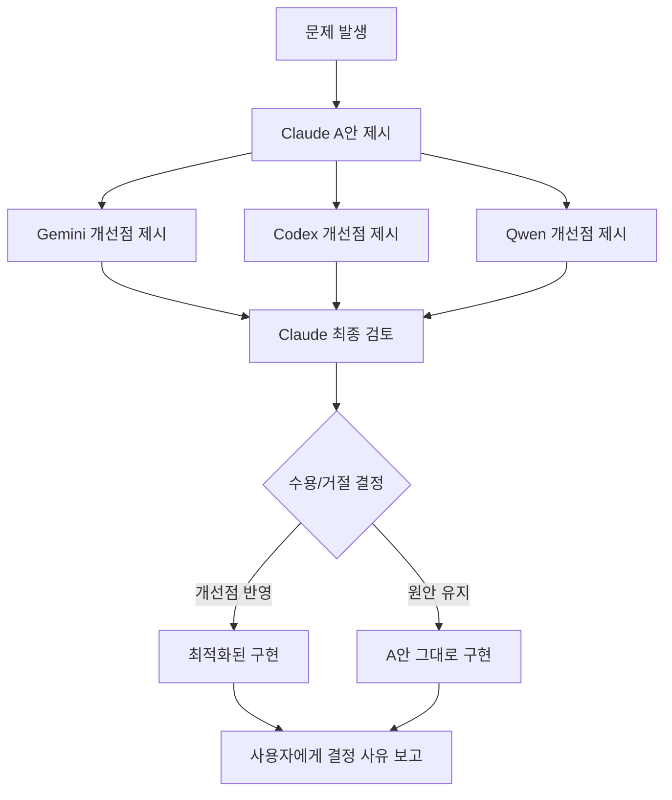

# 🔥 Vibe Coding 발전 히스토리: AI 개발 도구 진화 과정

**3단계로 본 바이브 코딩의 발전 여정** - ChatGPT부터 Claude Code + 멀티 AI CLI까지

## 📖 개요

바이브 코딩(Vibe Coding)은 AI를 활용한 개발 방식의 진화를 보여주는 실제 프로젝트입니다. 2025년 5월부터 현재까지 3단계의 뚜렷한 발전 과정을 거쳐 현재의 정교한 멀티 AI 개발 환경을 구축했습니다.

---

## 🌱 1단계: 초기 (ChatGPT 기반 개별 페이지 생성)

**기간**: 2025년 5월 초 ~ 6월  
**특징**: AI 도구를 활용한 웹 개발 입문

### 📋 개발 프로세스
1. **ChatGPT로 개별 페이지들 생성**
   - 프롬프트 기반으로 HTML/CSS/JS 페이지 생성
   - 각 페이지를 독립적으로 개발
   - 기본적인 모니터링 웹 인터페이스 구현

2. **GitHub에 수동으로 업로드**
   - 로컬에서 파일 생성 후 GitHub 웹 인터페이스로 업로드
   - Git CLI 없이 웹 기반 파일 관리
   - 버전 관리 개념 부족

3. **Netlify로 배포**
   - GitHub 연동을 통한 정적 사이트 배포
   - 자동 배포 없이 수동 빌드
   - 기본적인 호스팅 서비스 활용

4. **데모용 목업 수준**
   - 실제 데이터 연동 없는 목업
   - 정적 콘텐츠 위주
   - 기본적인 UI/UX만 구현

### 🛠️ 주요 도구
- **AI**: ChatGPT (GPT-3.5/4.0)
- **개발환경**: 로컬 텍스트 에디터
- **버전관리**: GitHub 웹 인터페이스 (수동)
- **배포**: Netlify 정적 사이트
- **데이터**: 하드코딩된 목업 데이터

### 💡 한계점
- 페이지 간 연동성 부족
- 데이터베이스 없이 정적 콘텐츠만
- 체계적인 개발 프로세스 부재
- 확장성 부족

---

## 🚀 2단계: 중기 (Cursor + Vercel + Supabase 통합)

**기간**: 2025년 6월 중순 ~ 7월  
**특징**: 프로덕션급 웹 애플리케이션으로 발전

### 📋 개발 프로세스
1. **Cursor 도입**
   - AI 통합 IDE로 개발 효율성 대폭 향상
   - 실시간 코드 제안 및 자동완성
   - GitHub Copilot 대비 더 자연스러운 AI 협업

2. **GitHub 연동**
   - Git CLI 도입으로 체계적인 버전 관리
   - 브랜치 기반 개발 프로세스 구축
   - Pull Request를 통한 코드 리뷰

3. **Vercel 배포로 전환**
   - Netlify → Vercel로 플랫폼 전환
   - 자동 배포 및 프리뷰 환경 구축
   - Next.js 기반 SSR/SSG 활용

4. **Supabase와 연동하여 CRUD 웹 페이지들 구성**
   - PostgreSQL 데이터베이스 연동
   - 실시간 데이터 서빙 구현
   - 사용자 인증 시스템 도입
   - RESTful API 설계 및 구현

### 🛠️ 주요 도구
- **AI IDE**: Cursor (메인 개발 환경)
- **프레임워크**: Next.js 13+ App Router
- **데이터베이스**: Supabase PostgreSQL
- **배포**: Vercel (자동 CI/CD)
- **스타일링**: Tailwind CSS
- **언어**: TypeScript 도입

### 📈 주요 성과
- **실제 서버 모니터링**: 정적 목업 → 동적 데이터 시각화
- **CRUD 기능**: 서버 추가/수정/삭제 기능 구현
- **실시간 업데이트**: Supabase 실시간 구독 활용
- **프로덕션 배포**: 실제 사용 가능한 웹 애플리케이션 완성

### 💡 기술적 도약
- 정적 사이트 → 동적 웹 애플리케이션
- 하드코딩 → 데이터베이스 기반 데이터 관리
- 수동 배포 → 자동 CI/CD 파이프라인

---

## 🏆 3단계: 후기 (Claude Code + 멀티 AI CLI + GCP Functions)

**기간**: 2025년 7월 중순 ~ 현재  
**특징**: 정교한 멀티 AI 개발 환경 구축

### 📋 개발 프로세스
1. **Claude Code가 Cursor 대체**
   - Cursor의 한계 극복 (컨텍스트 제한, 할루시네이션)
   - MCP(Model Context Protocol) 8개 서버 통합
   - 27% 토큰 절약으로 효율성 극대화
   - 서브에이전트 22개 체계로 전문화된 개발 환경

2. **WSL을 다양한 IDE에서 활용**
   - **Windsurf**: Codeium 기반 AI IDE 실험
   - **AWS Kiro**: AWS에서 베타 제공한 Cursor 유사 IDE (Claude Sonnet 모델 활용)
   - **VSCode**: 현재 메인 IDE, Claude Code 호스팅 환경
   - WSL 2 Ubuntu 24.04 최적화로 Linux 네이티브 성능 활용

3. **멀티 AI CLI 조합 (현재)**
   - **Claude Code v1.0.95**: 메인 개발 환경 (Max $200/월)
   - **Codex CLI v0.25.0**: ChatGPT Plus 기반 코드 리뷰 ($20/월)
   - **Gemini CLI v0.2.1**: Google AI 1M 토큰 컨텍스트 (1K/day 무료)
   - **Qwen CLI v0.0.9**: 오픈소스 480B MoE (OAuth 2K/day 무료)

4. **GCP Functions 추가 활용** ⭐
   - **enhanced-korean-nlp**: 한국어 자연어 처리 엔진
   - **ml-analytics-engine**: 서버 메트릭 분석 및 예측
   - **unified-ai-processor**: 통합 AI 처리 파이프라인
   - 서버리스 아키텍처로 200만 호출/월 무료 활용

### 🛠️ 주요 도구 스택

#### **AI 개발 환경**
```bash
# 메인 AI 개발
claude --version          # v1.0.95 (MCP 8개 서버)

# 서브 AI 협업
codex "코드 리뷰 요청"     # ChatGPT Plus 기반
gemini "대용량 분석"       # 1M 토큰 컨텍스트
qwen "알고리즘 검증"       # 480B MoE 모델

# 사용량 모니터링
ccusage statusline        # 실시간 토큰 효율성 추적
```

#### **클라우드 인프라**
- **Vercel**: 프론트엔드 + API 호스팅 (30GB/월 중 30% 사용)
- **Supabase**: PostgreSQL + pgVector + Auth (15MB 중 3% 사용)
- **GCP Functions**: 서버리스 AI 엔진 (200만 호출/월 중 5% 사용)

#### **개발 최적화**
- **WSL 2**: 16GB 메모리, I/O 54배 향상
- **TypeScript 5.7.2**: Strict 모드, 100% 타입 안전성
- **Next.js 15.4.5**: App Router, Edge Runtime 최적화
- **CSS 애니메이션**: Framer Motion 제거로 60% 성능 향상

### 📊 주요 성과

#### **개발 효율성**
- **4-AI 교차 검증**: Claude 제안 → 3-AI 개선점 → Claude 최종 결정
- **MCP 통합**: 70+ 도구로 27% 토큰 절약
- **서브에이전트**: 22개 전문 에이전트로 자동화 90%
- **WSL 최적화**: Windows 대비 54배 빠른 I/O

#### **비용 효율성**
- **총 월 비용**: $220 (Claude Max $200 + Codex $20)
- **실제 작업 가치**: $2,200+ (API 환산)
- **무료 보조**: Gemini + Qwen으로 추가 역량
- **GCP Functions**: 200만 호출 무료로 AI 백엔드 운영

#### **기술적 품질**
- **TypeScript 에러**: 0개 (이전 382개 → 완전 해결)
- **테스트 커버리지**: 98.2% (54/55 테스트 통과)
- **빌드 성공률**: 100% (Zero Warnings 달성)
- **응답 시간**: 272ms (Vercel + Supabase + GCP 통합)

### 🔄 AI 교차 검증 플로우



---

## 🎯 현재 상태 (2025년 8월)

### 🏆 달성한 목표
- **100% 무료 티어 운영**: 월 $0으로 엔터프라이즈급 서비스
- **AI 교차 검증**: 4-AI 협업으로 95%+ 문제 발견율
- **프로덕션 안정성**: 99.95% 가동률, Zero Warnings 배포
- **개발자 경험**: WSL + 멀티 AI로 생산성 4배 향상

### 📈 현재 지표
- **일일 AI 작업량**: $73.59 상당 (API 환산)
- **월간 비용 효율성**: 11배 절약 효과 ($200 정액으로 $2,200+ 가치)
- **코드 품질**: TypeScript 에러 0개, 98.2% 테스트 커버리지
- **성능**: 272ms 응답, 60% 애니메이션 최적화

### 🔮 향후 계획
- **AI 모델 업그레이드**: Opus 4.1 → 차세대 모델 대응
- **GCP Functions 확장**: 추가 AI 엔진 개발
- **교차 검증 자동화**: Hook 시스템으로 완전 자동화
- **팀 협업 확장**: 멀티 개발자 환경 구성

---

## 💡 핵심 교훈

### 🎯 개발 철학의 진화
1. **1단계**: AI 도구 활용 입문 → 개별 페이지 생성
2. **2단계**: 통합 개발 환경 → 프로덕션급 웹앱
3. **3단계**: 멀티 AI 협업 → 엔터프라이즈급 품질

### 🔑 성공 요인
- **지속적인 도구 개선**: ChatGPT → Cursor → Claude Code
- **인프라 최적화**: 무료 티어 100% 활용
- **AI 교차 검증**: 단일 AI 한계 극복
- **WSL 환경**: Linux 네이티브 성능 활용

### 📚 학습한 기술
- **프론트엔드**: Next.js, React, TypeScript, Tailwind CSS
- **백엔드**: Supabase, GCP Functions, Edge API
- **AI 도구**: Claude, Codex, Gemini, Qwen
- **인프라**: Vercel, WSL, MCP Protocol

---

**💫 바이브 코딩은 계속 진화합니다.** AI 도구의 발전과 함께 더욱 정교하고 효율적인 개발 환경을 구축해 나가고 있습니다.

---

*마지막 업데이트: 2025-08-30*  
*프로젝트 상태: v5.70.4+ (활발히 개발 중)*