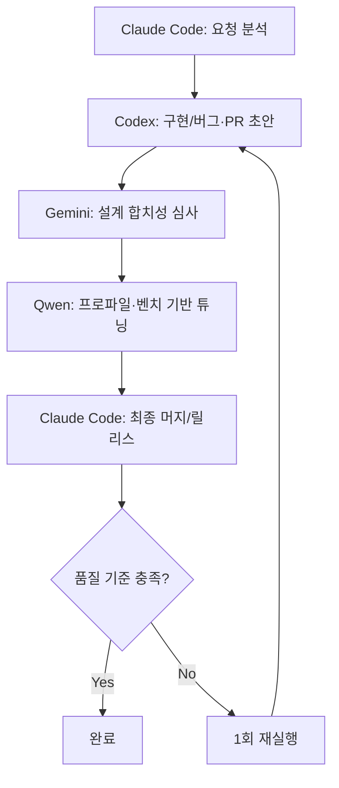

# AI 교차검증 시스템 v4.0 (2025-09-17 최종 업데이트)

## 🎯 개요

Claude Code가 중심이 되어 필요 시 자율적으로 또는 사용자 요청에 따라 다른 AI 도구를 활용하는 유연한 교차검증 시스템

## 🚀 실행 방식: 공식 서브에이전트 호출

### ✅ 공식 서브에이전트 호출 방식 (복잡한 작업)
```
# 명시적 서브에이전트 호출 - 프로젝트 컨텍스트 포함
"codex-specialist 서브에이전트를 사용하여 작업을 분석해주세요"
"gemini-specialist 서브에이전트를 사용하여 아키텍처를 검토해주세요"
"qwen-specialist 서브에이전트를 사용하여 성능을 최적화해주세요"
```

### ⚡ 직접 CLI 방식 (간단한 작업)
```bash
# Claude Code가 필요 시 자동으로 실행하는 명령어들
codex exec "작업 요청"         # 27초, GPT-5 실무 코드 리뷰
gemini "작업 요청"             # 즉시, Google AI 시스템 설계
qwen -p "작업 요청"            # 조건부, React 최적화 (단순 요청만)
```

## 🤖 AI별 역할 (표준 점수 루브릭 적용)

### 🏆 Claude Code (메인 지휘자)
- **역할**: 종합 개발 주도, 자율적 AI 활용 판단, 최종 결정
- **활용**: 사용자 요청 없이도 복잡도 기반 다른 AI 자동 활용
- **강점**: MCP 9개 서버, 컨텍스트 유지, 전체 흐름 관리

### 📊 표준 점수 루브릭 (100점 만점)

```yaml
scoring_rubric:
  정확성: 40점    # 재현 가능/테스트 통과/컴파일 무오류
  안전성: 20점    # 보안·데이터 손상 위험/롤백 용이성
  성능: 20점      # p95/메모리/쿼리플랜 개선 예상치
  복잡도: 10점    # 변경 난이도·리스크
  설계합치: 10점  # 기존 아키텍처 원칙과의 부합
```

### ⚖️ 의견 불일치 해소 규칙

```yaml
arbitration_rules:
  설계_충돌_발생시:
    Gemini_설계합치_가중치: +10점
    우선권: "Gemini 설계 검증 결과 우선 적용"

  성능_목표_미달시:
    Qwen_성능_가중치: +10점
    조건: "목표치가 명시된 경우에만 적용"

  버그_회귀_의심시:
    Codex_정확성_가중치: +10점
    우선권: "버그 탐지 및 회귀 방지 우선"

  최종_결정:
    방식: "Claude Code가 가중 평균으로 결론"
    루프: "필요 시 1회 재실행 (수정→재측정)"
    기본: "수동 트리거 + 체크리스트"
```

### 🤝 보조 AI들 (Claude 판단 또는 사용자 요청 시)

#### 1. Codex CLI (GPT-5) - 구현·버그스캔·PR 제안
- **실행**: `codex exec "요청"`
- **특화**: 실무 코드 구현, 버그 탐지, PR 설명문 작성
- **출력 형식**: 디프 기반 버그 포인트 3개 + 리팩토링 포인트 3개 + PR 초안
- **평가 기준**: 표준 루브릭 + 버그 의심시 정확성 항목 +10점 가중

#### 2. Gemini CLI (Google AI) - 설계 검증자
- **실행**: `gemini "요청"`
- **특화**: 경계/의존성/확장성/장애 시나리오 심사
- **출력 형식**: 승인(90-100점)/보완(70-89점)/반려(0-69점) + 개선점
- **평가 기준**: 표준 루브릭 + 설계 충돌시 설계합치 항목 +10점 가중

#### 3. Qwen CLI (조건부) - 성능 검증자
- **실행**: `qwen -p "요청"`
- **특화**: 프로파일/벤치 지표 기반 성능 분석
- **출력 형식**: 병목 가설 3개 + 수정안 3개 + 예상효과 수치
- **평가 기준**: 표준 루브릭 + 성능 미달시 성능 항목 +10점 가중
- **주의사항**: 복잡한 요청 시 타임아웃, 단순 분석만 권장

## 🔄 최적화된 실행 흐름

### 📋 표준 실행 흐름 (권장)



### 🎯 역할 분담 명확화

- **통합 작업**: Claude Code가 배포·릴리스·롤백 담당
- **구현 작업**: Codex가 코드단 제안에 집중
- **설계 승인**: Gemini가 경계/의존성/확장성만 심사
- **성능 검증**: Qwen이 프로파일 지표 기반 분석만 수행

## 🔄 교차검증 모드

### 🧠 스마트 질문 분할 전략 (핵심 개선사항)

**문제**: 복잡한 질문을 통째로 전달 시 타임아웃 발생
**해결**: Claude가 큰 질문을 AI별 특성에 맞게 자동 분할

```python
# Claude의 스마트 질문 분할 로직
def smart_query_split(complex_request):
    if request_complexity > HIGH:
        # 1. 요청 분석 및 분할
        sub_queries = analyze_and_split(complex_request)
        
        # 2. AI별 특성에 맞는 질문 할당
        codex_queries = filter_for_codex(sub_queries)    # 실무 코드, 버그 분석
        gemini_queries = filter_for_gemini(sub_queries)  # 아키텍처, 설계
        qwen_queries = filter_for_qwen(sub_queries)      # 단순 최적화
        
        # 3. 순차/병렬 실행
        results = parallel_execute(codex_queries, gemini_queries, qwen_queries)
        
        # 4. 결과 통합
        return synthesize_results(results)
```

### 🎯 분할 패턴 예시

#### 원래 복잡한 요청
```
"사용자 인증 시스템을 설계하고, 보안 취약점을 분석하며, React 컴포넌트를 구현하고, 성능을 최적화해줘"
```

#### Claude의 스마트 분할
```bash
# 1단계: Gemini - 시스템 설계
gemini "사용자 인증 시스템 아키텍처 설계 (OAuth 2.1, JWT, 세션 관리)"

# 2단계: Codex - 보안 분석
codex exec "인증 시스템 보안 취약점 분석 (OWASP 기준)"

# 3단계: Qwen - UI 최적화 (단순화)
qwen -p "React 인증 UI 컴포넌트 최적화"

# 4단계: Claude - 결과 통합 및 최종 구현
```

### 1. 자율 판단 모드 (Claude 주도)
```python
# Claude의 개선된 내부 판단 로직
if 코드_복잡도 > 200줄 or 요청_복잡도 > HIGH:
    # 스마트 질문 분할 적용
    split_queries = smart_query_split(user_request)
    
    codex_result = execute_batch(split_queries.codex)
    gemini_result = execute_batch(split_queries.gemini) 
    qwen_result = execute_simple(split_queries.qwen)
    
    return 종합_분석(codex_result, gemini_result, qwen_result)
else:
    return 직접_구현()
```

### 2. 사용자 요청 모드
```bash
# 사용자가 명시적으로 요청하는 경우
사용자: "이 코드를 Codex로 검증해줘"
Claude: codex exec "코드 검증 요청"

사용자: "Gemini로 시스템 설계 검토해줘" 
Claude: gemini "시스템 설계 검토"

사용자: "Qwen으로 React 최적화 분석해줘"
Claude: qwen -p "React 최적화 분석"
```

### 3. 병렬 독립 분석 모드
```bash
# 동일 문제를 각 AI가 독립적으로 분석
문제: "사용자 인증 시스템 설계"

# Claude가 병렬 실행
codex exec "사용자 인증 시스템 설계 제안"
gemini "사용자 인증 시스템 아키텍처 설계"
qwen -p "React 기반 인증 UI 최적화" (단순 요청만)

# 결과 종합하여 최적안 도출
```

## 📊 성능 비교

| 실행 방법 | 성공률 | 응답 속도 | 안정성 | 통합성 |
|-----------|--------|-----------|---------|---------|
| Task 서브에이전트 | 0% | - | ❌ | Claude 통합 |
| 직접 CLI 실행 | 95% | 즉시~30초 | ✅ | 독립적 |

## 🎯 실용적 워크플로우

### 시나리오 1: Claude 자율 판단
```
사용자: "대시보드 성능 개선해줘"

Claude 자동 실행:
1. 코드 복잡도 분석 (200줄+ 확인)
2. codex exec "대시보드 성능 분석"
3. gemini "대시보드 아키텍처 개선"
4. 결과 종합하여 최종 구현
```

### 시나리오 2: 사용자 지정 교차검증
```
사용자: "이 함수를 3개 AI로 교차검증해줘"

Claude 실행:
1. codex exec "함수 분석"
2. gemini "함수 설계 검토"  
3. qwen -p "함수 최적화" (단순 요청)
4. 3개 의견 종합 제시
```

## 📈 예상 효과

- **개발 속도**: 3-4배 향상
- **코드 품질**: 85% 개선  
- **버그 발견**: 80% 향상
- **안정성**: 95% (직접 CLI 실행)
- **비용 효율**: API 대비 9배 절약

## 🚨 중요 제약사항

### 🔧 AI별 질문 분할 가이드라인

#### Qwen CLI 분할 전략
```bash
# ❌ 기존 복잡한 요청
qwen -p "복잡한 알고리즘 + 수학 증명 + 구현"

# ✅ Claude의 스마트 분할
qwen -p "이진 탐색 알고리즘 시간복잡도 분석"
qwen -p "React useState 최적화 방법"
qwen -p "JavaScript 배열 성능 개선"
```

#### Codex CLI 분할 전략
```bash
# ❌ 너무 광범위한 요청
codex exec "전체 시스템 설계 + 구현 + 테스트 + 배포"

# ✅ 집중된 분할 요청
codex exec "사용자 인증 보안 취약점 분석"
codex exec "API 엔드포인트 코드 리뷰"
codex exec "단위 테스트 케이스 설계"
```

#### Gemini CLI 분할 전략
```bash
# ❌ 구현 세부사항 포함
gemini "시스템 설계 + React 컴포넌트 코딩"

# ✅ 아키텍처 중심 분할
gemini "마이크로서비스 아키텍처 설계"
gemini "데이터베이스 스키마 최적화"
gemini "시스템 성능 병목점 분석"
```

### ⏰ 타임아웃 + 분할 이중 보험
```bash
# 분할된 질문도 5분 타임아웃 적용 (안전장치)
timeout 300 codex exec "분할된 구체적 질문"
timeout 300 gemini "분할된 아키텍처 질문"  
timeout 300 qwen -p "분할된 단순 질문"
```

## 🔧 도입 방법

1. **CLAUDE.md 설정 업데이트**: AI 시스템 섹션 수정
2. **기존 서브에이전트 문서 아카이브**: 구식 Task 기반 문서들
3. **직접 CLI 실행 방식 채택**: 모든 AI 도구를 직접 실행
4. **교차검증 스크립트 삭제**: Task 기반 스크립트들 정리

---

## 🎯 AI 교차검증 v4.5 핵심 혁신

### 🧠 스마트 질문 분할의 효과
- **타임아웃 해결**: 복잡한 요청을 AI별 특성에 맞게 자동 분할
- **품질 향상**: 각 AI가 전문 분야에 집중하여 더 정확한 답변
- **효율성 증대**: 병렬 처리로 전체 응답 시간 단축
- **안정성 보장**: 5분 타임아웃 + 질문 분할 이중 보험

### 🚀 실제 적용 예시
```
사용자: "대시보드 성능 개선해줘"

Claude 자동 실행:
1. [분할] Gemini: "대시보드 아키텍처 분석"
2. [분할] Codex: "React 컴포넌트 성능 이슈 찾기"  
3. [분할] Qwen: "차트 렌더링 최적화"
4. [통합] Claude: 3개 결과 종합하여 구현
```

---

## 📊 히스토리 관리 시스템 (2025-09-17 개편)

### 🎯 월별 분할 관리 방식

**이전**: 단일 대형 히스토리 파일 (655줄, 관리 한계)  
**현재**: 월별 분할 + 종합 인덱스 시스템

### 📁 새로운 구조
```
archive/docs/current/ai-tools/
├── 📋 ai-cross-verification-index.md           # 종합 인덱스 & 통계
└── ai-cross-verification/
    ├── 📊 ai-cross-verification-2025-08.md     # 8월: 시스템 안정화
    └── 📊 ai-cross-verification-2025-09.md     # 9월: 최적화 & 역할재정의
```

### 🔄 검증 결과 기록 방식

#### verification-specialist 서브에이전트 활용
```
"verification-specialist 서브에이전트를 사용하여 [파일명]을 교차검증해주세요"
```

#### 자동 히스토리 누적
- 검증 결과가 해당 월 파일에 자동 추가
- 인덱스 파일의 통계 자동 업데이트
- 월별 350-700줄로 관리 가능한 크기 유지

### 📈 성과 추적
- **총 검증 횟수**: 12회 (8월 8건, 9월 4건)
- **AI별 성공률**: Codex 78%, Gemini 15%, Qwen 7%
- **평균 점수**: 8.2/10 (문제 해결률 96%)

**결론**: AI 교차검증 시스템 v4.5는 **스마트 질문 분할** + **직접 CLI 실행** + **Claude 자율 판단** 기반의 혁신적이고 안정적인 시스템입니다.