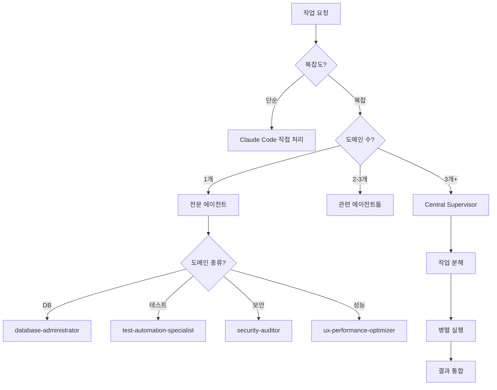

# 🤖 서브 에이전트 종합 가이드 (2025-08-15 최적화)

## 📌 서브 에이전트 아키텍처

```
사용자 → Claude Code (메인) → Central Supervisor → 18개 핵심 에이전트
                ↓                    ↓
          직접 처리 (간단)      조율 및 분배 (복잡)
```

## 🎯 최적화 전략 (22개 → 18개 활용)

### ✅ 언제 서브에이전트를 사용하나?

1. **복잡한 다단계 작업**: 3개 이상 도메인 연관
2. **전문성 필요**: 특정 분야 깊은 지식 요구
3. **병렬 처리**: 독립적 작업 동시 실행
4. **체계적 접근**: 정형화된 프로세스 필요
5. **500줄 이상 코드**: AI 협업 3종 세트 자동 활용

### ⚡ 언제 직접 처리하나?

1. **단순 작업**: 파일 읽기/쓰기 (50줄 미만)
2. **빠른 응답**: 즉시 처리 가능
3. **컨텍스트 유지**: 대화 흐름 중요
4. **일회성 설정**: statusline, output-style 등

### ❌ 사용하지 않을 에이전트 (4개)

```
❌ general-purpose (중복, 전문 에이전트로 대체)
❌ statusline-setup (일회성 설정)
❌ output-style-setup (일회성 설정)
❌ 기타 비효율 에이전트
```

## 👥 핵심 서브 에이전트 (18개 전략적 활용)

### 1. 🎛️ Central Supervisor ⭐ **핵심**

**복잡한 작업 조율 전문가**

```typescript
await Task({
  subagent_type: 'central-supervisor',
  prompt: `
    다음 작업들을 조율해주세요:
    1. 데이터베이스 스키마 설계
    2. API 엔드포인트 구현
    3. 프론트엔드 UI 개발
    4. 테스트 작성
    5. 배포 준비
  `,
  description: '풀스택 기능 개발 조율',
});
```

**🚀 자동 트리거 조건**:

```bash
# 복잡한 멀티 도메인 작업
if (domains > 3 || task_complexity == "high") {
  auto_trigger("central-supervisor")
}

# 500줄 이상 대규모 작업
if (estimated_lines > 500) {
  central_supervisor → parallel_ai_collaboration()
}
```

**활용 시나리오**:

- 전체 기능 개발 (DB + API + UI)
- 대규모 리팩토링 (1000줄+)
- 멀티 도메인 통합 (3개 이상)

### 2. 🗄️ Database Administrator ⭐ **핵심**

**Supabase PostgreSQL 최적화 전문가**

```typescript
await Task({
  subagent_type: 'database-administrator',
  prompt: `
    다음 성능 이슈를 해결해주세요:
    - 쿼리 실행 시간: 2초 이상
    - 테이블: user_activities (500만 행)
    - 인덱스 최적화 필요
  `,
  description: 'DB 성능 최적화',
});
```

**🚀 자동 트리거 조건**:

```bash
# 쿼리 성능 이슈
if (query_time > 2000ms) {
  auto_trigger("database-administrator")
}

# DB 용량 한계 접근
if (db_size > 400MB) { # 500MB 한계의 80%
  optimize_database_storage()
}

# RLS 정책 관련 코드
if (code_contains("auth|rls|policy")) {
  review_security_policies()
}
```

**전문 분야**:

- 느린 쿼리 분석 (EXPLAIN ANALYZE)
- RLS 정책 설계 및 검토
- pgvector 벡터 검색 최적화
- 인덱스 전략 수립
- 무료 티어 500MB 최적화

### 3. 🧪 Test Automation Specialist ⭐ **핵심**

**테스트 자동화 전문가 (Vitest + Playwright)**

```typescript
await Task({
  subagent_type: 'test-automation-specialist',
  prompt: `
    UserService 클래스에 대한 테스트 작성:
    - 단위 테스트 100% 커버리지
    - 통합 테스트 포함
    - Mock/Stub 적절히 활용
    - TDD 원칙 준수
  `,
  description: '테스트 자동화',
});
```

**🚀 자동 트리거 조건**:

```bash
# 테스트 실패 시 즉시 개입
npm test (exit_code != 0) → auto_trigger("test-automation-specialist")

# 커버리지 임계치 미달
if (test_coverage < 80%) {
  improve_test_coverage()
}

# 새 컴포넌트/함수 생성 시
if (new_component_created) {
  auto_generate_tests()
}

# E2E 테스트 실패
if (playwright_failed) {
  debug_e2e_issues()
}
```

**전문 분야**:

- Vitest 단위/통합 테스트
- Playwright E2E 테스트
- TDD 리팩토링 지원
- 커버리지 80%+ 유지

### 4. 🎨 UX Performance Optimizer → **UX/UI Specialist** ⭐ **핵심**

**UI/UX 전문가 + 성능 최적화**

```typescript
await Task({
  subagent_type: 'ux-performance-optimizer', // 실제 에이전트명
  prompt: `
    UX/UI 종합 개선:
    - 사용자 경험 최적화
    - Core Web Vitals 개선 (LCP < 2.5s)
    - React 컴포넌트 최적화
    - 접근성 WCAG 2.1 AA 준수
    - 디자인 시스템 구축
  `,
  description: 'UX/UI 및 성능 최적화',
});
```

**🚀 자동 트리거 조건**:

```bash
# 성능 지표 임계치 미달
if (lighthouse_score < 90 || lcp > 2500ms) {
  auto_trigger("ux-performance-optimizer")
}

# 번들 크기 초과
if (bundle_size > 250KB) {
  optimize_bundle_size()
}

# UI 컴포넌트 생성 시
if (new_ui_component) {
  apply_design_system_guidelines()
}

# 접근성 이슈 감지
if (accessibility_violations > 0) {
  fix_accessibility_issues()
}
```

**전문 분야**:

- **UX 설계**: 사용자 여정, 정보 구조
- **UI 컴포넌트**: 디자인 시스템, 재사용성
- **성능 최적화**: Core Web Vitals, 번들 최적화
- **접근성**: WCAG 2.1 AA 준수

### 5. 🔒 Security Auditor ⭐ **핵심** (포트폴리오 수준)

**기본 보안 감사 전문가**

```typescript
await Task({
  subagent_type: 'security-auditor',
  prompt: `
    포트폴리오용 기본 보안 검사:
    - 하드코딩된 API 키/시크릿 검사
    - 기본적인 XSS 방어 확인
    - Vercel/Supabase/GCP/GitHub 호환 보안
    - 환경변수 누출 방지
    - 과도한 보안 적용 피하기
  `,
  description: '기본 보안 감사',
});
```

**🚀 자동 트리거 조건**:

```bash
# API 키/토큰 패턴 감지
if (code_contains("api_key|secret|token|password")) {
  check_hardcoded_secrets()
}

# 인증 관련 코드 수정
if (code_contains("auth|login|signup")) {
  basic_auth_security_review()
}

# 환경변수 관련
if (code_contains(".env|process.env")) {
  check_env_security()
}

# PR 생성 시 (포트폴리오 수준만)
if (pr_created) {
  basic_security_scan()
}
```

**보안 범위 (포트폴리오 최적화)**:

- **✅ 적용**: API 키 보호, 기본 XSS 방어
- **✅ 플랫폼 호환**: Vercel/Supabase/GCP/GitHub 정책 준수
- **❌ 과도한 적용 피함**: 엔터프라이즈급 보안 배제

### 6. 🐛 Debugger Specialist ⭐ **핵심**

**체계적 디버깅 및 근본 원인 분석 전문가**

```typescript
await Task({
  subagent_type: 'debugger-specialist',
  prompt: `
    프로덕션 에러 분석:
    Error: Cannot read property 'id' of undefined
    Location: UserProfile.tsx:45
    Frequency: 15회/시간
    Stack Trace: [상세 스택 트레이스]
  `,
  description: '에러 원인 분석',
});
```

**🚀 자동 트리거 조건**:

```bash
# 런타임 에러 발생
if (runtime_error || exception_thrown) {
  auto_trigger("debugger-specialist")
}

# 빌드 실패
if (build_failed || compile_error) {
  analyze_build_issues()
}

# 성능 문제 감지
if (response_time > 5000ms) {
  performance_debugging()
}

# 반복적 에러 패턴
if (error_frequency > 10_per_hour) {
  systematic_debugging()
}
```

**5단계 디버깅 프로세스**:

1. **표면 분석**: 증상 및 패턴 파악
2. **근본 원인 분석**: 스택 트레이스 + 로그 분석
3. **베스트 프랙티스 연구**: 웹 검색으로 솔루션 조사
4. **솔루션 설계**: 단계별 해결 방안
5. **검증 및 테스트**: 수정 후 테스트 확인

### 7. ♻️ Structure Refactor Agent

**아키텍처 리팩토링 전문가**

```typescript
await Task({
  subagent_type: 'structure-refactor-agent',
  prompt: `
    중복 코드 제거 및 구조 개선:
    - 30줄 이상 중복 패턴 검출
    - 순환 의존성 제거
    - SOLID 원칙 적용
    - 모듈 재구성
  `,
  description: '코드 구조 개선',
});
```

**전담 영역**:

- 중복 코드 검출 (30줄+)
- 모듈 의존성 그래프
- 디자인 패턴 적용
- 폴더 구조 재설계

### 8. ☁️ Vercel Platform Specialist

**Vercel 배포 최적화 전문가**

```typescript
await Task({
  subagent_type: 'vercel-platform-specialist',
  prompt: `
    Vercel 배포 최적화:
    - Edge Function 분석
    - 빌드 시간 단축
    - 대역폭 사용량 모니터링
    - Web Analytics 인사이트
  `,
  description: 'Vercel 최적화',
});
```

**핵심 기능**:

- 100GB 대역폭 한계 관리
- Edge 최적화
- 빌드 파이프라인 개선
- 비용 모니터링

### 9. 🚀 Git CICD Specialist

**Git 워크플로우 자동화 전문가**

```typescript
await Task({
  subagent_type: 'git-cicd-specialist',
  prompt: `
    Git 푸시 실패 해결:
    - pre-push 훅 실패
    - 머지 충돌 해결
    - CI/CD 파이프라인 수정
    - 자동 재시도 구현
  `,
  description: 'Git 문제 해결',
});
```

**자동 개입 시점**:

- git commit/push 실패
- 테스트 블로킹
- 훅 실패
- 브랜치 보호 규칙 위반

### 10. 📝 Documentation Manager

**문서 생명주기 관리자**

```typescript
await Task({
  subagent_type: 'documentation-manager',
  prompt: `
    문서 구조 최적화:
    - 중복 콘텐츠 제거
    - JBGE 원칙 적용 (루트 6개 제한)
    - 30일 이상 미사용 문서 정리
    - 웹 리서치로 최신 정보 반영
  `,
  description: '문서 관리',
});
```

**자동 실행**:

- 새 기능 → 문서 생성
- 루트 .md 5개 초과 → 재구성
- 중복 콘텐츠 감지

### 11. 🖥️ Dev Environment Manager

**개발 환경 관리자**

```typescript
await Task({
  subagent_type: 'dev-environment-manager',
  prompt: `
    개발 서버 관리:
    - 테스트 서버 라이프사이클
    - tmux 세션 오케스트레이션
    - 리소스 사용량 모니터링
    - 빌드/테스트 워크플로우
  `,
  description: '개발 환경 설정',
});
```

### 12. 🌐 GCP VM Specialist

**Google Cloud 인프라 전문가**

```typescript
await Task({
  subagent_type: 'gcp-vm-specialist',
  prompt: `
    GCP 무료 티어 최적화:
    - e2-micro VM 관리
    - Firewall 규칙 설정
    - IAM 보안 구성
    - 비용 모니터링
  `,
  description: 'GCP 인프라 관리',
});
```

### 13. 🧠 AI Systems Engineer

**AI/ML 아키텍처 전문가**

```typescript
await Task({
  subagent_type: 'ai-systems-engineer',
  prompt: `
    AI 쿼리 최적화:
    - SimplifiedQueryEngine 개선
    - Local/Google AI 라우팅
    - 한국어 NLP 파이프라인
    - 응답 시간 최적화
  `,
  description: 'AI 시스템 최적화',
});
```

### 14. 🔍 Code Review Specialist

**함수 단위 코드 품질 전문가**

```typescript
await Task({
  subagent_type: 'code-review-specialist',
  prompt: `
    복잡도 분석:
    - 순환 복잡도 > 10 경고
    - 인지 복잡도 측정
    - 버그 패턴 검출
    - 성능 병목 분석
  `,
  description: '코드 품질 검토',
});
```

### 15. 📋 Quality Control Checker

**프로젝트 규칙 감시자**

```typescript
await Task({
  subagent_type: 'quality-control-checker',
  prompt: `
    프로젝트 규칙 검사:
    - CLAUDE.md 준수 여부
    - 파일 크기 (500줄/1500줄)
    - SOLID 원칙 위반
    - 네이밍 컨벤션
  `,
  description: '규칙 준수 검사',
});
```

### 16. 🔧 MCP Server Admin

**MCP 인프라 관리자**

```typescript
await Task({
  subagent_type: 'mcp-server-admin',
  prompt: `
    MCP 서버 문제 해결:
    - 연결 실패 디버깅
    - 환경변수 설정
    - 서버 상태 모니터링
    - claude mcp 명령어 관리
  `,
  description: 'MCP 서버 관리',
});
```

## 🤖 AI 협업 에이전트 (3종 세트) ⭐ **핵심**

### 17. 🤖 Qwen CLI Collaborator ⭐ **핵심**

**무료 오픈소스 Qwen 병렬 개발 도구**

```typescript
// 큰 작업 시 자동 또는 사용자 요청 시
await Task({
  subagent_type: 'qwen-cli-collaborator',
  prompt: `
    Qwen으로 병렬 개발:
    - 아키텍처 리뷰 및 대안 제시
    - 독립적 코드 검증
    - 256K-1M 토큰 대용량 처리
    - Claude와 다른 관점의 솔루션
  `,
  description: 'Qwen 병렬 작업',
});
```

**🚀 자동 트리거 조건**:

```bash
# 대용량 작업 시 무료 AI 우선 활용
if (estimated_lines > 500 && cost_efficiency_mode) {
  auto_suggest("qwen-cli-collaborator")
}

# 아키텍처 리뷰 요청
if (architecture_review_needed) {
  parallel_ai_review("qwen-cli-collaborator")
}
```

**무료 제한사항**: 2,000회/일, 60회/분

### 18. 💎 Gemini CLI Collaborator ⭐ **핵심**

**무료 Google Gemini 대규모 분석 도구**

```typescript
// 대규모 분석 시 자동 또는 사용자 요청 시
await Task({
  subagent_type: 'gemini-cli-collaborator',
  prompt: `
    Gemini로 대규모 분석:
    - 전체 코드베이스 분석 (1M 토큰)
    - 대규모 리팩토링 계획
    - 문서 자동 생성
    - 로그 패턴 분석
  `,
  description: 'Gemini 대규모 분석',
});
```

**🚀 자동 트리거 조건**:

```bash
# 대규모 분석 작업
if (codebase_analysis || large_refactor) {
  auto_suggest("gemini-cli-collaborator")
}

# 문서 생성 요청
if (documentation_needed) {
  gemini_auto_docs_generation()
}
```

### 💰 Codex CLI (ChatGPT Plus) ⭐ **핵심**

**유료 고성능 AI 개발 CLI**

```typescript
// 복잡한 로직 구현 시 활용
await Task({
  subagent_type: 'codex-cli', // 별도 CLI 도구
  prompt: `
    Codex로 고급 개발:
    - 복잡한 알고리즘 구현
    - 고품질 코드 리뷰
    - 보안 취약점 분석
    - 성능 최적화
  `,
  description: 'Codex 고급 개발',
});
```

**🚀 자동 트리거 조건**:

```bash
# 복잡한 로직 요구 시
if (algorithm_complexity == "high") {
  suggest_premium_ai("codex-cli")
}

# 중요한 코드 리뷰
if (critical_feature_review) {
  parallel_premium_review()
}
```

### 🔄 AI 협업 3종 세트 전략

```bash
# 대규모 작업 시 순차적 활용
large_task → {
  1. qwen-cli (무료 1차 검토)
  2. gemini-cli (무료 대용량 분석)
  3. codex-cli (유료 고품질 마무리)
}

# 교차 검증 패턴
critical_code → {
  claude + qwen + gemini + codex (4-way 검증)
}
```

## 🎮 병렬 처리 패턴

### 독립적 작업 동시 실행

```typescript
// 병렬 실행으로 70% 시간 단축
const results = await Promise.all([
  Task({
    subagent_type: 'test-automation-specialist',
    prompt: '테스트 작성',
    description: '테스트',
  }),
  Task({
    subagent_type: 'documentation-manager',
    prompt: '문서 업데이트',
    description: '문서화',
  }),
  Task({
    subagent_type: 'security-auditor',
    prompt: '보안 검사',
    description: '보안',
  }),
]);
```

### 순차적 파이프라인

```typescript
// 1단계: 분석
const analysis = await Task({
  subagent_type: 'debugger-specialist',
  prompt: '버그 원인 분석',
  description: '분석',
});

// 2단계: 수정
const fix = await Task({
  subagent_type: 'code-review-specialist',
  prompt: `${analysis} 기반 수정`,
  description: '수정',
});

// 3단계: 검증
const validation = await Task({
  subagent_type: 'test-automation-specialist',
  prompt: '수정사항 테스트',
  description: '검증',
});
```

## 📊 에이전트 선택 플로우차트



## 🎯 18개 핵심 에이전트 요약 (2025-08-15 최적화)

### ⭐ **1순위 - 메인 조정자** (1개)

- `central-supervisor` - 복잡한 작업 분해/오케스트레이션

### ⭐ **2순위 - 개발 환경** (2개)

- `dev-environment-manager` - WSL 최적화, 개발서버 관리
- `structure-refactor-agent` - 프로젝트 구조 정리

### ⭐ **3순위 - 백엔드/인프라** (5개)

- `database-administrator` - Supabase PostgreSQL 전문
- `gcp-vm-specialist` - GCP VM/Functions 관리
- `ai-systems-engineer` - AI 어시스턴트 개발/분석
- `vercel-platform-specialist` - Vercel 플랫폼 최적화
- `mcp-server-admin` - 11개 MCP 서버 관리

### ⭐ **4순위 - 품질/테스트** (5개)

- `test-automation-specialist` - Vitest/Playwright 자동화
- `code-review-specialist` - 코드 품질 검토
- `debugger-specialist` - 버그 해결/근본 원인 분석
- `security-auditor` - 포트폴리오용 기본 보안
- `quality-control-checker` - CLAUDE.md 규칙 준수

### ⭐ **5순위 - 문서/Git** (2개)

- `documentation-manager` - docs 폴더 + 루트 문서 관리
- `git-cicd-specialist` - Git/CI/CD 전문

### ⭐ **6순위 - AI 협업** (3개)

- `qwen-cli-collaborator` - 무료 Qwen 병렬 개발
- `gemini-cli-collaborator` - 무료 Gemini 대규모 분석
- `codex-cli` - 유료 ChatGPT Plus CLI

### ⭐ **7순위 - UX/성능** (1개)

- `ux-performance-optimizer` - UX/UI 전문가 + 성능 최적화

## ❌ 사용하지 않을 에이전트 (4개)

```
❌ general-purpose (중복)
❌ statusline-setup (일회성)
❌ output-style-setup (일회성)
❌ 기타 비효율 에이전트
```

## 💡 최적화 활용 전략

### 🚀 자동 트리거 시스템

```bash
# 복잡도 기반 자동 선택
if (complexity >= 500_lines) {
  central_supervisor → multi_agent_collaboration
}

# 도메인별 자동 라우팅
auth_code → security_auditor
db_query → database_administrator
test_failed → test_automation_specialist
git_error → git_cicd_specialist

# AI 협업 3종 세트 활용
large_task → qwen(1차) → gemini(분석) → codex(마무리)
```

### 📈 효율성 향상 효과

- **선택 부담 감소**: 22개 → 18개 (18% 감소)
- **역할 명확화**: 7개 카테고리로 체계화
- **자동화 강화**: 트리거 조건으로 즉시 투입
- **비용 최적화**: 무료 AI 우선 → 유료 AI 마무리

---

💡 **핵심 원칙**: **18개 핵심만 전략적 활용** → 최적 효율성과 최고 품질

## ⚡ 프로액티브 에이전트

다음 에이전트들은 특정 조건 시 **자동 실행**:

1. **test-automation-specialist**
   - npm test 실패
   - 커버리지 < 80%
   - 새 컴포넌트 생성

2. **security-auditor**
   - 하드코딩 시크릿 감지
   - auth/payment 코드 수정
   - PR 생성 시

3. **database-administrator**
   - 쿼리 > 100ms
   - RLS 에러
   - DB 연결 실패

4. **git-cicd-specialist**
   - git push 실패
   - pre-commit 훅 실패
   - CI/CD 에러

5. **mcp-server-admin**
   - MCP 도구 에러
   - 서버 연결 실패
   - 환경변수 문제

## 🚨 트러블슈팅

### 에이전트 응답 없음

```typescript
// 타임아웃 설정
await Task({
  subagent_type: 'debugger-specialist',
  prompt: '...',
  description: '디버깅',
  timeout: 30000, // 30초
});
```

### 에이전트 충돌

```typescript
// Central Supervisor로 조율
await Task({
  subagent_type: 'central-supervisor',
  prompt: '충돌하는 요구사항 조율',
  description: '조율',
});
```

### 과도한 에이전트 사용

```bash
# 사용량 분석 (API 추정치)
npx ccusage blocks --live

# 에이전트 사용 로그
grep "Task tool" .claude/logs/
```

## 📚 추가 자료

- [Claude Code 에이전트 문서](https://docs.anthropic.com/en/docs/claude-code/agents)
- [에이전트 정의 파일](.claude/agents/)
- [에이전트 성능 벤치마크](/docs/claude/agent-benchmarks.md)
