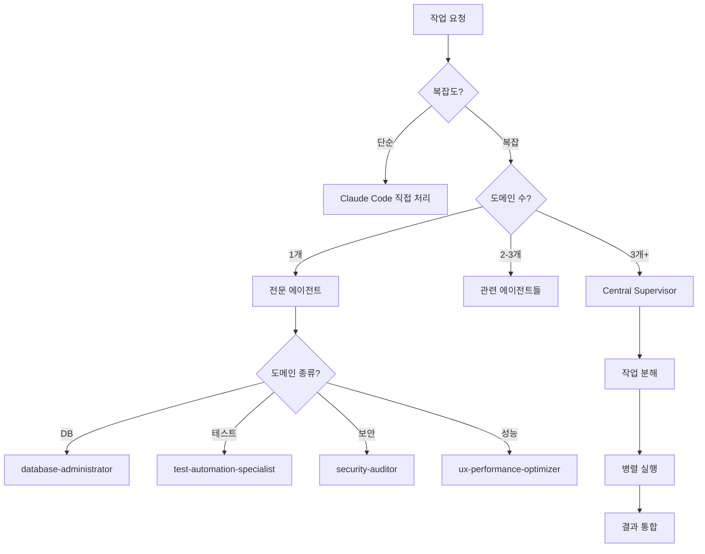

# 🤖 서브 에이전트 종합 가이드

## 📌 서브 에이전트 아키텍처

```
사용자 → Claude Code (메인) → Central Supervisor → 전문 에이전트들
                ↓                    ↓
          직접 처리 (간단)      조율 및 분배 (복잡)
```

## 🎯 에이전트 활용 전략

### 언제 사용하나?
1. **복잡한 다단계 작업**: 3개 이상 도메인 연관
2. **전문성 필요**: 특정 분야 깊은 지식 요구
3. **병렬 처리**: 독립적 작업 동시 실행
4. **체계적 접근**: 정형화된 프로세스 필요

### 언제 직접 처리하나?
1. **단순 작업**: 파일 읽기/쓰기
2. **빠른 응답**: 즉시 처리 가능
3. **컨텍스트 유지**: 대화 흐름 중요

## 👥 주요 서브 에이전트 (25개)

### 1. 🎛️ Central Supervisor
**복잡한 작업 조율 전문가**
```typescript
await Task({
  subagent_type: 'central-supervisor',
  prompt: `
    다음 작업들을 조율해주세요:
    1. 데이터베이스 스키마 설계
    2. API 엔드포인트 구현
    3. 프론트엔드 UI 개발
    4. 테스트 작성
    5. 배포 준비
  `,
  description: "풀스택 기능 개발 조율"
});
```
**활용 시나리오**:
- 전체 기능 개발 (DB + API + UI)
- 대규모 리팩토링
- 멀티 도메인 통합

### 2. 🗄️ Database Administrator
**Supabase PostgreSQL 최적화 전문가**
```typescript
await Task({
  subagent_type: 'database-administrator',
  prompt: `
    다음 성능 이슈를 해결해주세요:
    - 쿼리 실행 시간: 2초 이상
    - 테이블: user_activities (500만 행)
    - 인덱스 최적화 필요
  `,
  description: "DB 성능 최적화"
});
```
**전문 분야**:
- 느린 쿼리 분석 (EXPLAIN ANALYZE)
- RLS 정책 설계
- pgvector 벡터 검색 최적화
- 인덱스 전략
- 무료 티어 500MB 최적화

### 3. 🧪 Test Automation Specialist
**테스트 자동화 전문가**
```typescript
await Task({
  subagent_type: 'test-automation-specialist',
  prompt: `
    UserService 클래스에 대한 테스트 작성:
    - 단위 테스트 100% 커버리지
    - 통합 테스트 포함
    - Mock/Stub 적절히 활용
    - TDD 원칙 준수
  `,
  description: "테스트 자동화"
});
```
**자동 감지 및 실행**:
- `npm test` 실패 시 자동 개입
- 커버리지 80% 미만 시 보완
- 새 컴포넌트 생성 시 테스트 추가

### 4. 🎨 UX Performance Optimizer
**UI/UX 및 성능 최적화 전문가**
```typescript
await Task({
  subagent_type: 'ux-performance-optimizer',
  prompt: `
    대시보드 페이지 최적화:
    - Core Web Vitals 개선 (LCP < 2.5s)
    - React 컴포넌트 최적화
    - 번들 크기 250KB 이하
    - 접근성 WCAG 2.1 AA 준수
  `,
  description: "UI 성능 최적화"
});
```
**핵심 지표**:
- Lighthouse 90+ 점수
- FCP < 1.8s, CLS < 0.1
- 번들 크기 최적화
- 코드 스플리팅

### 5. 🔒 Security Auditor
**보안 감사 전문가**
```typescript
await Task({
  subagent_type: 'security-auditor',
  prompt: `
    결제 시스템 보안 감사:
    - 하드코딩된 시크릿 검사
    - SQL Injection 취약점
    - XSS/CSRF 방어
    - RLS 정책 검증
  `,
  description: "보안 감사"
});
```
**자동 실행 조건**:
- API 키/토큰 패턴 감지
- auth/payment 코드 수정
- PR 생성 시 보안 리뷰

### 6. 🐛 Debugger Specialist
**체계적 디버깅 전문가**
```typescript
await Task({
  subagent_type: 'debugger-specialist',
  prompt: `
    프로덕션 에러 분석:
    Error: Cannot read property 'id' of undefined
    Location: UserProfile.tsx:45
    Frequency: 15회/시간
  `,
  description: "에러 원인 분석"
});
```
**5단계 프로세스**:
1. 표면 분석 (증상)
2. 근본 원인 분석
3. 베스트 프랙티스 연구
4. 솔루션 설계
5. 검증 및 테스트

### 7. ♻️ Structure Refactor Agent
**아키텍처 리팩토링 전문가**
```typescript
await Task({
  subagent_type: 'structure-refactor-agent',
  prompt: `
    중복 코드 제거 및 구조 개선:
    - 30줄 이상 중복 패턴 검출
    - 순환 의존성 제거
    - SOLID 원칙 적용
    - 모듈 재구성
  `,
  description: "코드 구조 개선"
});
```
**전담 영역**:
- 중복 코드 검출 (30줄+)
- 모듈 의존성 그래프
- 디자인 패턴 적용
- 폴더 구조 재설계

### 8. ☁️ Vercel Platform Specialist
**Vercel 배포 최적화 전문가**
```typescript
await Task({
  subagent_type: 'vercel-platform-specialist',
  prompt: `
    Vercel 배포 최적화:
    - Edge Function 분석
    - 빌드 시간 단축
    - 대역폭 사용량 모니터링
    - Web Analytics 인사이트
  `,
  description: "Vercel 최적화"
});
```
**핵심 기능**:
- 100GB 대역폭 한계 관리
- Edge 최적화
- 빌드 파이프라인 개선
- 비용 모니터링

### 9. 🚀 Git CICD Specialist
**Git 워크플로우 자동화 전문가**
```typescript
await Task({
  subagent_type: 'git-cicd-specialist',
  prompt: `
    Git 푸시 실패 해결:
    - pre-push 훅 실패
    - 머지 충돌 해결
    - CI/CD 파이프라인 수정
    - 자동 재시도 구현
  `,
  description: "Git 문제 해결"
});
```
**자동 개입 시점**:
- git commit/push 실패
- 테스트 블로킹
- 훅 실패
- 브랜치 보호 규칙 위반

### 10. 📝 Documentation Manager
**문서 생명주기 관리자**
```typescript
await Task({
  subagent_type: 'documentation-manager',
  prompt: `
    문서 구조 최적화:
    - 중복 콘텐츠 제거
    - JBGE 원칙 적용 (루트 6개 제한)
    - 30일 이상 미사용 문서 정리
    - 웹 리서치로 최신 정보 반영
  `,
  description: "문서 관리"
});
```
**자동 실행**:
- 새 기능 → 문서 생성
- 루트 .md 5개 초과 → 재구성
- 중복 콘텐츠 감지

### 11. 🖥️ Dev Environment Manager
**개발 환경 관리자**
```typescript
await Task({
  subagent_type: 'dev-environment-manager',
  prompt: `
    개발 서버 관리:
    - 테스트 서버 라이프사이클
    - tmux 세션 오케스트레이션
    - 리소스 사용량 모니터링
    - 빌드/테스트 워크플로우
  `,
  description: "개발 환경 설정"
});
```

### 12. 🌐 GCP VM Specialist
**Google Cloud 인프라 전문가**
```typescript
await Task({
  subagent_type: 'gcp-vm-specialist',
  prompt: `
    GCP 무료 티어 최적화:
    - e2-micro VM 관리
    - Firewall 규칙 설정
    - IAM 보안 구성
    - 비용 모니터링
  `,
  description: "GCP 인프라 관리"
});
```

### 13. 🧠 AI Systems Engineer
**AI/ML 아키텍처 전문가**
```typescript
await Task({
  subagent_type: 'ai-systems-engineer',
  prompt: `
    AI 쿼리 최적화:
    - SimplifiedQueryEngine 개선
    - Local/Google AI 라우팅
    - 한국어 NLP 파이프라인
    - 응답 시간 최적화
  `,
  description: "AI 시스템 최적화"
});
```

### 14. 🔍 Code Review Specialist
**함수 단위 코드 품질 전문가**
```typescript
await Task({
  subagent_type: 'code-review-specialist',
  prompt: `
    복잡도 분석:
    - 순환 복잡도 > 10 경고
    - 인지 복잡도 측정
    - 버그 패턴 검출
    - 성능 병목 분석
  `,
  description: "코드 품질 검토"
});
```

### 15. 📋 Quality Control Checker
**프로젝트 규칙 감시자**
```typescript
await Task({
  subagent_type: 'quality-control-checker',
  prompt: `
    프로젝트 규칙 검사:
    - CLAUDE.md 준수 여부
    - 파일 크기 (500줄/1500줄)
    - SOLID 원칙 위반
    - 네이밍 컨벤션
  `,
  description: "규칙 준수 검사"
});
```

### 16. 🔧 MCP Server Admin
**MCP 인프라 관리자**
```typescript
await Task({
  subagent_type: 'mcp-server-admin',
  prompt: `
    MCP 서버 문제 해결:
    - 연결 실패 디버깅
    - 환경변수 설정
    - 서버 상태 모니터링
    - claude mcp 명령어 관리
  `,
  description: "MCP 서버 관리"
});
```

### 17. 🤖 Qwen CLI Collaborator
**오픈소스 Qwen 병렬 개발 도구**
```typescript
// 사용자가 명시적으로 요청 시에만
await Task({
  subagent_type: 'qwen-cli-collaborator',
  prompt: `
    Qwen으로 병렬 개발:
    - 아키텍처 리뷰
    - 독립적 검증
    - 대안 접근법 제시
  `,
  description: "Qwen 병렬 작업"
});
```
**제한사항**: 2,000회/일, 60회/분

### 18. 💎 Gemini CLI Collaborator
**Google Gemini 대규모 분석 도구**
```typescript
// 사용자가 "Gemini로" 요청 시에만
await Task({
  subagent_type: 'gemini-cli-collaborator',
  prompt: `
    Gemini로 대규모 분석:
    - 전체 코드베이스 분석 (1M 토큰)
    - 대규모 리팩토링
    - 병렬 처리
  `,
  description: "Gemini 분석"
});
```

## 🎮 병렬 처리 패턴

### 독립적 작업 동시 실행
```typescript
// 병렬 실행으로 70% 시간 단축
const results = await Promise.all([
  Task({
    subagent_type: 'test-automation-specialist',
    prompt: '테스트 작성',
    description: '테스트'
  }),
  Task({
    subagent_type: 'documentation-manager',
    prompt: '문서 업데이트',
    description: '문서화'
  }),
  Task({
    subagent_type: 'security-auditor',
    prompt: '보안 검사',
    description: '보안'
  })
]);
```

### 순차적 파이프라인
```typescript
// 1단계: 분석
const analysis = await Task({
  subagent_type: 'debugger-specialist',
  prompt: '버그 원인 분석',
  description: '분석'
});

// 2단계: 수정
const fix = await Task({
  subagent_type: 'code-review-specialist',
  prompt: `${analysis} 기반 수정`,
  description: '수정'
});

// 3단계: 검증
const validation = await Task({
  subagent_type: 'test-automation-specialist',
  prompt: '수정사항 테스트',
  description: '검증'
});
```

## 📊 에이전트 선택 플로우차트



## ⚡ 프로액티브 에이전트

다음 에이전트들은 특정 조건 시 **자동 실행**:

1. **test-automation-specialist**
   - npm test 실패
   - 커버리지 < 80%
   - 새 컴포넌트 생성

2. **security-auditor**
   - 하드코딩 시크릿 감지
   - auth/payment 코드 수정
   - PR 생성 시

3. **database-administrator**
   - 쿼리 > 100ms
   - RLS 에러
   - DB 연결 실패

4. **git-cicd-specialist**
   - git push 실패
   - pre-commit 훅 실패
   - CI/CD 에러

5. **mcp-server-admin**
   - MCP 도구 에러
   - 서버 연결 실패
   - 환경변수 문제

## 🚨 트러블슈팅

### 에이전트 응답 없음
```typescript
// 타임아웃 설정
await Task({
  subagent_type: 'debugger-specialist',
  prompt: '...',
  description: '디버깅',
  timeout: 30000  // 30초
});
```

### 에이전트 충돌
```typescript
// Central Supervisor로 조율
await Task({
  subagent_type: 'central-supervisor',
  prompt: '충돌하는 요구사항 조율',
  description: '조율'
});
```

### 과도한 에이전트 사용
```bash
# 사용량 모니터링
npx ccusage blocks --live

# 에이전트 사용 로그
grep "Task tool" .claude/logs/
```

## 📚 추가 자료

- [Claude Code 에이전트 문서](https://docs.anthropic.com/en/docs/claude-code/agents)
- [에이전트 정의 파일](.claude/agents/)
- [에이전트 성능 벤치마크](/docs/claude/agent-benchmarks.md)