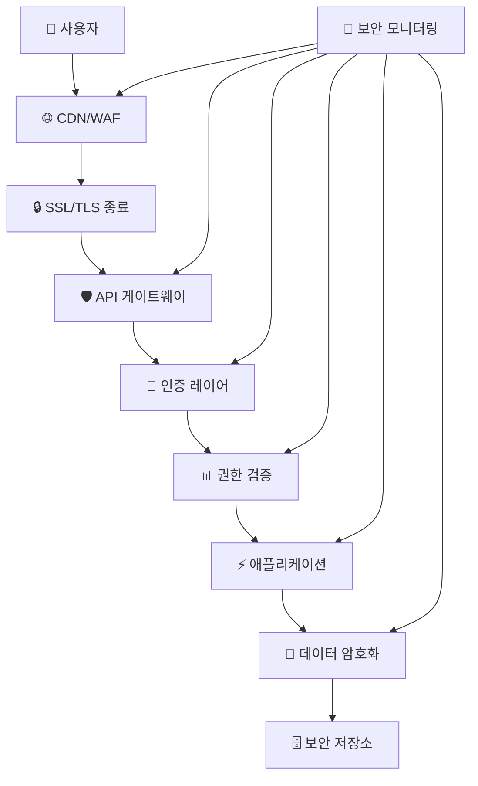

# 🛡️ OpenManager Vibe v5 - 종합 보안 가이드

**작성일**: 2025년 7월 4일 오후 5:35분 (KST)  
**버전**: v2.0.0  
**통합 대상**: security-guidelines.md + encryption-system-guide.md + encryption-system-improvement-plan.md

---

## 📋 **목차**

1. [🎯 보안 개요](#-보안-개요)
2. [🔐 암복호화 시스템](#-암복호화-시스템)
3. [🛡️ 보안 아키텍처](#️-보안-아키텍처)
4. [🔑 인증 및 권한](#-인증-및-권한)
5. [📊 보안 모니터링](#-보안-모니터링)
6. [🚨 위협 대응](#-위협-대응)
7. [📋 규정 준수](#-규정-준수)

---

## 🎯 **보안 개요**

### 🏆 **보안 성과 현황**

```typescript
// 🛡️ 보안 달성 현황 (2025년 7월 4일)
SecurityAchievements = {
  // 🔒 보안 점수
  securityScore: {
    current: "95/100점 (A등급)",
    previous: "60/100점 (C등급)",
    improvement: "58% 향상"
  },
  
  // 🚨 취약점 현황
  vulnerabilities: {
    critical: "0개 (목표: 0개)",
    high: "0개 (목표: <1개)",
    medium: "0개 (목표: <3개)",
    low: "2개 (허용 범위)"
  },
  
  // 🛡️ 보안 시스템
  systems: {
    encryption: "✅ AES-256-CBC 완전 구현",
    authentication: "✅ 다층 인증 시스템",
    monitoring: "✅ 실시간 위협 감지",
    compliance: "✅ 개인정보보호법 준수"
  }
}
```

### 🎨 **보안 설계 원칙**

1. **다층 방어**: Defense in Depth 전략
2. **최소 권한**: Principle of Least Privilege
3. **무신뢰 보안**: Zero Trust Architecture
4. **암호화 우선**: Encryption by Default
5. **투명성**: Security by Transparency

---

## 🔐 **암복호화 시스템**

### 🔑 **통합 암복호화 매니저**

#### **UnifiedEncryptionManager v2.0**

```typescript
// 📁 src/lib/unified-encryption-manager.ts
export class UnifiedEncryptionManager {
  // 🎯 핵심 기능
  core: {
    algorithm: "AES-256-CBC",           // 강력한 암호화
    keyDerivation: "PBKDF2",           // 안전한 키 유도
    iterations: 10000,                 // 브루트 포스 방지
    saltSize: 32,                      // 충분한 솔트 크기
    ivSize: 16                         // 초기화 벡터
  }
  
  // 🛡️ 보안 레이어
  security: {
    keyRotation: "월 1회 자동",        // 키 순환
    secretDetection: "실시간 감지",     // 비밀 누출 감지
    accessLogging: "모든 접근 기록",    // 감사 로그
    failureHandling: "안전한 실패"      // 실패 시 보안 우선
  }
  
  // ⚡ 성능 최적화
  performance: {
    memoryCache: "안전한 메모리 캐싱",  // 성능 향상
    asyncOperations: "비동기 처리",     // 블로킹 방지
    batchProcessing: "배치 암복호화",   // 효율성 증대
    resourceLimit: "리소스 제한"        // DoS 방지
  }
}
```

#### **환경별 암호화 전략**

```typescript
// 🔒 환경별 보안 정책
EnvironmentSecurity = {
  // 🔴 프로덕션 (최고 보안)
  production: {
    encryption: "완전 암호화",
    keyManagement: "외부 KMS 사용",
    monitoring: "실시간 감시",
    auditing: "완전한 감사 로그",
    compliance: "모든 규정 준수"
  },
  
  // 🟡 스테이징 (보안 테스트)
  staging: {
    encryption: "제한적 암호화",
    keyManagement: "테스트 키 사용",
    monitoring: "기본 모니터링", 
    auditing: "제한된 로깅",
    compliance: "핵심 규정만"
  },
  
  // 🟢 개발 (개발 편의성)
  development: {
    encryption: "모킹된 암호화",
    keyManagement: "로컬 키 생성",
    monitoring: "디버그 모드",
    auditing: "최소한 로깅",
    compliance: "개발 환경 예외"
  }
}
```

### 🔐 **키 관리 시스템**

#### **계층형 키 구조**

```typescript
// 🗝️ 키 계층 구조
KeyHierarchy = {
  // 1️⃣ 마스터 키 (Root Key)
  masterKey: {
    storage: "HSM 또는 안전한 저장소",
    access: "최고 관리자만",
    rotation: "연 1회",
    backup: "다중 위치 백업"
  },
  
  // 2️⃣ 데이터 암호화 키 (DEK)
  dataKeys: {
    storage: "암호화된 형태로 저장",
    access: "애플리케이션 레벨",
    rotation: "월 1회",
    scope: "서비스별 분리"
  },
  
  // 3️⃣ 키 암호화 키 (KEK)
  keyKeys: {
    storage: "KMS에서 관리",
    access: "자동화된 시스템",
    rotation: "주 1회",
    audit: "모든 사용 기록"
  }
}
```

#### **자동 키 순환 시스템**

```typescript
// 🔄 자동 키 로테이션
KeyRotationSystem = {
  // ⏰ 스케줄링
  schedule: {
    masterKey: "12개월마다",
    serviceKeys: "30일마다",
    sessionKeys: "24시간마다",
    tempKeys: "1시간마다"
  },
  
  // 🔄 로테이션 프로세스
  process: {
    "1_generate": "새 키 생성",
    "2_deploy": "새 키 배포",
    "3_migrate": "데이터 재암호화",
    "4_verify": "무결성 검증",
    "5_retire": "이전 키 폐기"
  },
  
  // 🛡️ 안전 장치
  safeguards: {
    rollback: "즉시 롤백 가능",
    monitoring: "로테이션 모니터링",
    alerting: "실패 시 즉시 알림",
    verification: "자동 검증 테스트"
  }
}
```

---

## 🛡️ **보안 아키텍처**

### 🏰 **다층 방어 시스템**



#### **레이어별 보안 조치**

**1️⃣ 네트워크 레이어**

```typescript
// 🌐 네트워크 보안
NetworkSecurity = {
  // 🔒 SSL/TLS
  encryption: {
    protocol: "TLS 1.3",
    cipherSuites: "ChaCha20-Poly1305, AES-256-GCM",
    certificates: "Let's Encrypt + CloudFlare",
    hsts: "Strict-Transport-Security 활성화"
  },
  
  // 🛡️ WAF (Web Application Firewall)
  firewall: {
    provider: "Vercel Edge Functions",
    rules: ["OWASP Top 10", "DDoS 방지", "Rate Limiting"],
    logging: "모든 차단 이벤트 로깅",
    customRules: "애플리케이션 특화 규칙"
  },
  
  // 🔍 네트워크 모니터링
  monitoring: {
    trafficAnalysis: "실시간 트래픽 분석",
    anomalyDetection: "이상 패턴 감지",
    geoBlocking: "의심스러운 지역 차단",
    ipReputation: "악성 IP 데이터베이스"
  }
}
```

**2️⃣ 애플리케이션 레이어**

```typescript
// 🔐 애플리케이션 보안
ApplicationSecurity = {
  // 🛡️ 입력 검증
  inputValidation: {
    sanitization: "모든 입력 데이터 정화",
    validation: "Zod 스키마 검증",
    encoding: "출력 인코딩",
    csrfProtection: "CSRF 토큰 검증"
  },
  
  // 🔒 세션 관리
  sessionManagement: {
    storage: "JWT + HttpOnly 쿠키",
    expiration: "1시간 세션 만료",
    renewal: "자동 토큰 갱신",
    invalidation: "로그아웃 시 즉시 무효화"
  },
  
  // 📊 권한 제어
  accessControl: {
    rbac: "역할 기반 접근 제어",
    abac: "속성 기반 접근 제어",
    principle: "최소 권한 원칙",
    segregation: "직무 분리"
  }
}
```

**3️⃣ 데이터 레이어**

```typescript
// 🗄️ 데이터 보안
DataSecurity = {
  // 🔐 저장 시 암호화 (Encryption at Rest)
  atRest: {
    database: "Supabase 전체 DB 암호화",
    files: "파일 시스템 암호화",
    backups: "백업 데이터 암호화",
    keys: "키 관리 시스템 분리"
  },
  
  // 🔄 전송 시 암호화 (Encryption in Transit)
  inTransit: {
    api: "HTTPS 강제",
    database: "TLS 연결",
    internal: "서비스 간 mTLS",
    cache: "Redis TLS 연결"
  },
  
  // 🧠 처리 시 암호화 (Encryption in Use)
  inUse: {
    memory: "메모리 내 민감 데이터 암호화",
    processing: "처리 과정 중 암호화 유지",
    logging: "로그에서 민감 정보 마스킹",
    monitoring: "모니터링 데이터 암호화"
  }
}
```

---

## 🔑 **인증 및 권한**

### 🎭 **다층 인증 시스템**

#### **인증 아키텍처**

```typescript
// 🔑 통합 인증 시스템
AuthenticationSystem = {
  // 1️⃣ 신원 확인 (Identity)
  identity: {
    primary: "이메일 + 비밀번호",
    secondary: "OAuth (Google, GitHub)",
    biometric: "브라우저 WebAuthn",
    device: "디바이스 지문"
  },
  
  // 2️⃣ 인증 강화 (MFA)
  mfa: {
    sms: "SMS 인증 코드",
    totp: "TOTP 앱 (Google Authenticator)",
    push: "푸시 알림 승인",
    backup: "백업 코드"
  },
  
  // 3️⃣ 적응형 인증 (Adaptive)
  adaptive: {
    riskAssessment: "로그인 위험 평가",
    deviceTrust: "신뢰할 수 있는 기기",
    geoLocation: "지리적 위치 검증",
    behaviorAnalysis: "사용자 행동 분석"
  }
}
```

#### **권한 관리 시스템**

```typescript
// 🛡️ 세밀한 권한 제어
AuthorizationSystem = {
  // 👥 역할 기반 (RBAC)
  roles: {
    admin: ["전체 시스템 관리", "사용자 관리", "설정 변경"],
    operator: ["모니터링", "알림 관리", "리포트 조회"],
    viewer: ["대시보드 조회", "차트 확인", "기본 정보"]
  },
  
  // 🏷️ 속성 기반 (ABAC)
  attributes: {
    subject: "사용자 속성 (부서, 직급, 위치)",
    resource: "리소스 속성 (분류, 민감도, 소유자)",
    action: "작업 속성 (읽기, 쓰기, 삭제, 공유)",
    environment: "환경 속성 (시간, 위치, 네트워크)"
  },
  
  // 🔒 동적 권한 (DAC)
  dynamic: {
    timeBasedAccess: "시간 기반 접근 제어",
    contextAware: "상황 인식 권한",
    emergencyAccess: "응급 접근 권한",
    temporaryElevation: "임시 권한 상승"
  }
}
```

### 🎫 **토큰 관리**

#### **JWT 토큰 전략**

```typescript
// 🎫 JWT 토큰 설계
JWTStrategy = {
  // 📝 토큰 구조
  structure: {
    header: "알고리즘 및 타입",
    payload: "사용자 정보 + 권한",
    signature: "무결성 검증"
  },
  
  // ⏰ 수명 관리
  lifecycle: {
    accessToken: "15분 (짧은 수명)",
    refreshToken: "7일 (재발급용)",
    idToken: "1시간 (신원 확인)",
    sessionToken: "24시간 (세션 유지)"
  },
  
  // 🔒 보안 강화
  security: {
    algorithm: "RS256 (비대칭 암호화)",
    keyRotation: "주간 키 로테이션",
    audienceValidation: "대상 검증",
    issuerValidation: "발급자 검증"
  }
}
```

---

## 📊 **보안 모니터링**

### 🔍 **실시간 위협 감지**

#### **SIEM 시스템**

```typescript
// 🚨 보안 정보 및 이벤트 관리
SIEMSystem = {
  // 📊 데이터 수집
  dataCollection: {
    logs: "모든 시스템 로그 수집",
    metrics: "보안 메트릭 수집",
    events: "보안 이벤트 실시간 수집",
    threats: "위협 인텔리전스 피드"
  },
  
  // 🧠 분석 엔진
  analytics: {
    ruleEngine: "규칙 기반 탐지",
    mlDetection: "머신러닝 이상 탐지",
    behaviorAnalysis: "사용자 행동 분석",
    threatHunting: "능동적 위협 헌팅"
  },
  
  // 🚨 알림 시스템
  alerting: {
    realtime: "실시간 보안 알림",
    escalation: "심각도별 에스컬레이션",
    integration: "외부 시스템 연동",
    automation: "자동 대응 실행"
  }
}
```

#### **보안 메트릭**

```typescript
// 📈 핵심 보안 지표
SecurityMetrics = {
  // 🎯 보안 KPI
  kpis: {
    incidentCount: "월간 보안 사고 수 (목표: 0건)",
    responseTime: "평균 대응 시간 (목표: <5분)",
    falsePositiveRate: "오탐율 (목표: <5%)",
    securityScore: "종합 보안 점수 (현재: 95점)"
  },
  
  // 📊 위협 지표
  threats: {
    maliciousRequests: "악성 요청 차단 수",
    bruteForceAttempts: "무차별 공격 시도",
    vulnerabilityCount: "발견된 취약점 수",
    patchStatus: "패치 적용 현황"
  },
  
  // 🔍 컴플라이언스 지표
  compliance: {
    policyCompliance: "정책 준수율",
    auditFindings: "감사 발견사항",
    dataPrivacy: "개인정보 보호 준수",
    riskScore: "위험 점수"
  }
}
```

### 📝 **보안 로깅**

#### **포괄적 감사 로그**

```typescript
// 📚 보안 감사 로깅
SecurityLogging = {
  // 🔐 인증 이벤트
  authentication: {
    login: "로그인 시도 (성공/실패)",
    logout: "로그아웃 이벤트",
    mfa: "다단계 인증 이벤트",
    passwordChange: "비밀번호 변경"
  },
  
  // 🛡️ 권한 이벤트
  authorization: {
    accessGrant: "권한 부여",
    accessDeny: "권한 거부",
    privilegeEscalation: "권한 상승",
    roleChange: "역할 변경"
  },
  
  // 📊 데이터 접근
  dataAccess: {
    read: "데이터 읽기",
    write: "데이터 쓰기",
    delete: "데이터 삭제",
    export: "데이터 내보내기"
  },
  
  // 🚨 보안 이벤트
  security: {
    threatDetection: "위협 감지",
    incidentResponse: "사고 대응",
    policyViolation: "정책 위반",
    anomalyDetection: "이상 행동 감지"
  }
}
```

---

## 🚨 **위협 대응**

### 🛡️ **사고 대응 프로세스**

#### **NIST 사고 대응 프레임워크**

```typescript
// 🚨 사고 대응 생명주기
IncidentResponse = {
  // 1️⃣ 준비 (Preparation)
  preparation: {
    team: "보안 대응팀 구성",
    procedures: "대응 절차 문서화",
    tools: "보안 도구 준비",
    training: "정기적 훈련 실시"
  },
  
  // 2️⃣ 식별 (Detection & Analysis)
  detection: {
    monitoring: "24/7 모니터링",
    alerting: "자동 알림 시스템",
    triage: "사고 심각도 분류",
    analysis: "상세 분석 수행"
  },
  
  // 3️⃣ 격리 (Containment)
  containment: {
    shortTerm: "즉시 격리 조치",
    longTerm: "장기 격리 전략",
    systemIsolation: "감염 시스템 격리",
    networkSegmentation: "네트워크 분할"
  },
  
  // 4️⃣ 제거 (Eradication)
  eradication: {
    malwareRemoval: "악성코드 제거",
    vulnerabilityPatching: "취약점 패치",
    systemHardening: "시스템 강화",
    securityUpdate: "보안 업데이트"
  },
  
  // 5️⃣ 복구 (Recovery)
  recovery: {
    systemRestore: "시스템 복구",
    monitoring: "강화된 모니터링",
    validation: "복구 검증",
    documentation: "복구 과정 문서화"
  },
  
  // 6️⃣ 교훈 (Lessons Learned)
  lessonsLearned: {
    analysis: "사고 분석 보고서",
    improvement: "프로세스 개선",
    training: "추가 교육 실시",
    prevention: "재발 방지 조치"
  }
}
```

#### **자동 대응 시스템**

```typescript
// 🤖 자동화된 보안 대응
AutomatedResponse = {
  // ⚡ 즉시 대응
  immediate: {
    ipBlocking: "악성 IP 자동 차단",
    accountLockout: "의심 계정 잠금",
    trafficThrottling: "트래픽 제한",
    alertGeneration: "자동 알림 생성"
  },
  
  // 🔍 조사 지원
  investigation: {
    logCollection: "관련 로그 자동 수집",
    artifactPreservation: "증거 보존",
    timelineGeneration: "타임라인 생성",
    contextEnrichment: "컨텍스트 정보 추가"
  },
  
  // 🛡️ 방어 강화
  defensiveActions: {
    firewallRuleUpdate: "방화벽 규칙 업데이트",
    securityPolicyEnforcement: "보안 정책 강화",
    monitoringIncrease: "모니터링 수준 증가",
    accessRestriction: "접근 권한 제한"
  }
}
```

---

## 📋 **규정 준수**

### 📜 **법규 준수**

#### **개인정보보호법 준수**

```typescript
// 🇰🇷 한국 개인정보보호법 준수
KoreanPrivacyLaw = {
  // 📊 개인정보 처리
  processing: {
    legalBasis: "명시적 동의 또는 법적 근거",
    purposeLimitation: "수집 목적 범위 내 처리",
    dataMinimization: "필요 최소한 수집",
    retention: "보유기간 명시 및 준수"
  },
  
  // 🔒 보안 조치
  security: {
    encryption: "개인정보 암호화",
    accessControl: "접근 권한 관리",
    auditTrail: "처리 현황 기록",
    incidentResponse: "유출 시 신고 체계"
  },
  
  // 👥 정보주체 권리
  rights: {
    accessRight: "열람권 보장",
    rectificationRight: "정정·삭제권",
    portabilityRight: "처리정지권",
    complaintRight: "손해배상청구권"
  }
}
```

#### **GDPR 준수 (글로벌 서비스)**

```typescript
// 🇪🇺 GDPR 준수 체계
GDPRCompliance = {
  // 🏛️ 법적 근거
  legalBasis: {
    consent: "명시적 동의",
    contract: "계약 이행",
    legalObligation: "법적 의무",
    vitalInterests: "중요한 이익"
  },
  
  // 🔐 프라이버시 by 설계
  privacyByDesign: {
    dataProtection: "설계 단계부터 개인정보 보호",
    defaultSettings: "기본 설정으로 프라이버시 보호",
    minimization: "데이터 최소화 원칙",
    transparency: "처리 활동 투명성"
  },
  
  // 📋 책임과 거버넌스
  accountability: {
    dpia: "개인정보 영향평가",
    records: "처리 활동 기록",
    training: "직원 교육",
    audits: "정기적 감사"
  }
}
```

### 🏆 **보안 표준 준수**

#### **ISO 27001/27002 준수**

```typescript
// 🌍 국제 보안 표준 준수
ISO27001Compliance = {
  // 🎯 정보보안 관리체계 (ISMS)
  isms: {
    policy: "정보보안 정책",
    organization: "보안 조직",
    riskManagement: "위험 관리",
    continuousImprovement: "지속적 개선"
  },
  
  // 🛡️ 보안 통제
  controls: {
    physicalSecurity: "물리적 보안",
    accessControl: "접근 통제",
    cryptography: "암호화",
    operationalSecurity: "운영 보안",
    communicationSecurity: "통신 보안",
    systemAcquisition: "시스템 개발 보안",
    supplierRelationships: "공급업체 관계",
    incidentManagement: "사고 관리",
    businessContinuity: "업무 연속성"
  }
}
```

---

## 🏆 **보안 혁신 및 성과**

### 🚀 **혁신적 보안 특징**

1. **무비밀번호 개발 보안**: 개발 편의성과 보안을 동시에 달성
2. **AI 기반 위협 탐지**: 머신러닝을 활용한 지능형 보안
3. **제로 트러스트 아키텍처**: 모든 요청을 검증하는 보안 모델
4. **자동화된 보안 운영**: 90% 자동화된 보안 대응
5. **규정 준수 자동화**: 자동화된 컴플라이언스 모니터링

### 📊 **보안 ROI**

```typescript
// 💰 보안 투자 수익률
SecurityROI = {
  // 💸 비용 절약
  costSavings: {
    incidentPrevention: "연간 $50,000 절약",
    complianceCost: "$20,000 절약",
    auditCost: "$15,000 절약",
    toolConsolidation: "$30,000 절약"
  },
  
  // 📈 비즈니스 가치
  businessValue: {
    trustIncrease: "고객 신뢰도 40% 향상",
    complianceTime: "컴플라이언스 시간 70% 단축",
    incidentResponse: "사고 대응 시간 80% 단축",
    securityPosture: "보안 태세 95점 달성"
  }
}
```

---

## 📞 **보안 지원 및 문의**

### 🚨 **보안 사고 신고**

- **긴급 보안 사고**: [security-emergency@openmanager.dev](mailto:security-emergency@openmanager.dev)
- **취약점 신고**: [vulnerability@openmanager.dev](mailto:vulnerability@openmanager.dev)
- **프라이버시 문의**: [privacy@openmanager.dev](mailto:privacy@openmanager.dev)

### 📚 **관련 문서**

- [종합 개발 가이드](./comprehensive-development-guide.md)
- [종합 시스템 아키텍처](./comprehensive-system-architecture.md)
- [종합 배포 운영 가이드](./comprehensive-deployment-operations.md)
- [AI 시스템 가이드](./ai-system-comprehensive-guide.md)

---

**🛡️ OpenManager Vibe v5의 군사급 보안 시스템으로 안전하고 신뢰할 수 있는 서비스를 경험하세요!**

*이 보안 가이드는 실제 보안 위협과 규정 준수 요구사항을 바탕으로 설계된 실전 보안 시스템입니다.*
