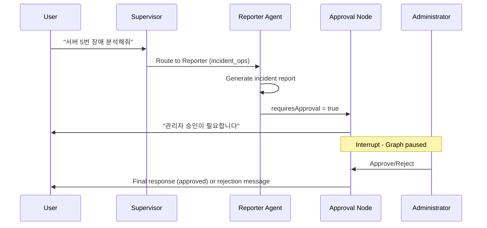
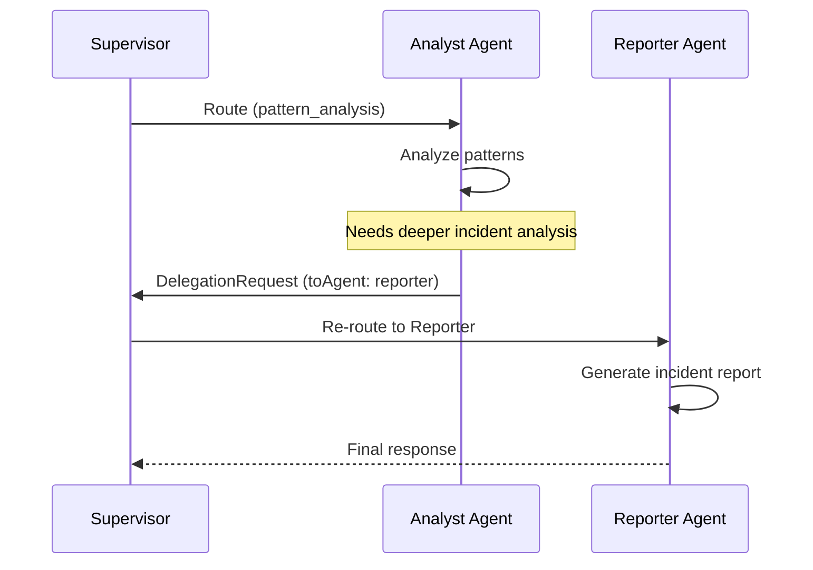

# AI Assistant Architecture

> **버전**: v3.4 (2025-12-26)
> **환경**: Next.js 16, React 19, TypeScript 5.9 strict, LangGraph StateGraph (Cloud Run)

## Overview

The AI Assistant is built on a **LangGraph Multi-Agent System** that orchestrates specialized agents for server monitoring tasks. It uses a **Hybrid Architecture**:

- **Frontend (Vercel)**: Next.js UI, API proxy routes
- **AI Engine (Cloud Run)**: LangGraph StateGraph, all AI processing

> **Note**: LangGraph was migrated from Vercel to Cloud Run (2025-12-16) due to Edge response issues. See [ai-engine-architecture.md](../architecture/ai/ai-engine-architecture.md) for detailed backend architecture.

## Core Components

### 1. Frontend: Dual-Mode Architecture

#### Mode Comparison

| 항목 | 사이드바 모드 | 풀페이지 모드 |
|:-----|:-------------|:-------------|
| **진입점** | `AISidebarV4.tsx` | `AIWorkspace.tsx` |
| **레이아웃** | 우측 패널 (~400px) | 3-column 전체 화면 |
| **라우트** | 대시보드 내 컴포넌트 | `/dashboard/ai-assistant` |
| **사용 시나리오** | 빠른 질의 | 심층 분석, 보고서 |

#### Sidebar Mode (`AISidebarV4`)

- **Location**: `src/domains/ai-sidebar/components/AISidebarV4.tsx`
- **Framework**: React + Vercel AI SDK (`useChat` hook)
- **Endpoint**: `/api/ai/supervisor`
- **Features**:
  - Real-time streaming response
  - Agent routing visualization
  - Tool invocation display
  - Session persistence

#### Fullpage Mode (`AIWorkspace`)

- **Location**: `src/components/ai/AIWorkspace.tsx`
- **Layout**: 3-column (Left Nav / Center Content / Right Context)
- **Features**:
  - 좌측: 기능 선택 네비게이션
  - 중앙: EnhancedAIChat 또는 기능별 페이지
  - 우측: 시스템 컨텍스트 패널

### 2. Backend: LangGraph Multi-Agent System

- **Location**: `cloud-run/ai-engine/src/` (TypeScript Hono)
- **Framework**: LangGraph StateGraph
- **Deployment**: Google Cloud Run (migrated 2025-12-16)
- **Proxy**: `/api/ai/*` routes on Vercel forward to Cloud Run

#### Agent Architecture

```
START
  │
  ▼
┌─────────────────────────────────────────────────┐
│              SUPERVISOR                          │
│   Provider: Groq (Llama 3.3-70b)                │
│   Role: Intent classification & LangGraph handoff│
└─────────────────────────────────────────────────┘
  │
  ├──▶ "nlq"      ──▶ NLQ SubGraph (Groq 70b)
  │                    └─ 5-node workflow
  │                    └─ getServerMetricsAdvanced
  │
  ├──▶ "analyst"  ──▶ Analyst Agent (Groq 70b)
  │                    └─ analyzePattern, detectAnomalies, predictTrends
  │
  ├──▶ "reporter" ──▶ Reporter Agent (Groq 70b)
  │                    └─ searchKnowledgeBase (GraphRAG)
  │                    └─ recommendCommands
  │                    └─ [Approval Check] ──▶ Human Interrupt
  │
  ├──▶ "parallel" ──▶ Parallel Analysis Node
  │                    └─ NLQ + Analyst (concurrent)
  │
  └──▶ "reply"    ──▶ Direct Response (greetings)
                       │
                       ▼
             ┌─────────────────────────────┐
             │     VERIFIER AGENT          │
             │  Provider: Mistral (24B)    │
             │  Role: Quality validation    │
             └─────────────────────────────┘
                       │
                       ▼
                      END
```

> **Dual-Provider Strategy (v5.89.0)**:
> - **Groq**: Supervisor, NLQ, Analyst, Reporter (LangGraph handoff 호환 필수)
> - **Mistral**: Verifier (24B 파라미터로 품질 검증 향상)

## 3 AI Features

### 1. Natural Language Query (Chat)

| 항목 | 값 |
|------|-----|
| **컴포넌트** | `EnhancedAIChat.tsx` |
| **API** | `/api/ai/supervisor` |
| **에이전트** | Supervisor → NLQ/Analyst/Reporter |

### 2. Auto Incident Report

| 항목 | 값 |
|------|-----|
| **컴포넌트** | `AutoReportPage.tsx` |
| **API** | `/api/ai/incident-report` |
| **에이전트** | Reporter Agent (Llama 70b) |

### 3. Intelligent Monitoring

| 항목 | 값 |
|------|-----|
| **컴포넌트** | `IntelligentMonitoringPage.tsx` |
| **API** | `/api/ai/intelligent-monitoring` |
| **에이전트** | Analyst Agent (Gemini Pro) |

## Tool System

The AI uses specialized tools within each agent for domain-specific operations.

### NLQ Agent Tools (SubGraph v5.89.0)

| Tool | Description |
|------|-------------|
| `getServerMetricsAdvanced` | Advanced metrics with time range, filters, aggregation support |

**NLQ SubGraph 5-Node Workflow**:
1. **parse_intent**: Intent classification (metrics, logs, status, comparison)
2. **extract_params**: Korean NLP parsing (time expressions, filters)
3. **validate**: Rule-based parameter validation
4. **execute_query**: Tool invocation with extracted parameters
5. **format_response**: User-friendly response formatting

### Analyst Agent Tools

| Tool | Description |
|------|-------------|
| `detectAnomalies` | 6-hour moving average + 2σ deviation anomaly detection |
| `predictTrends` | Linear Regression based trend prediction |
| `analyzePattern` | Comprehensive pattern analysis (combines above tools) |

**Intent Detection**: The Analyst Agent auto-detects query intent:
- `anomaly` → Executes `detectAnomalies`
- `trend` → Executes `predictTrends`
- `pattern` → Executes `analyzePattern`
- `comprehensive` → Executes all tools

### Reporter Agent Tools

| Tool | Description |
|------|-------------|
| `searchKnowledgeBase` | RAG search using Supabase pgvector (384 dimensions) |
| `recommendCommands` | Suggests runbook commands for incident resolution |

## Data Flow

1. **User Query**: User types a message in `AISidebarV4`
2. **API Request**: `useChat` sends POST to `/api/ai/supervisor`
3. **Proxy to Cloud Run**: Vercel API route forwards request to Cloud Run
4. **LangGraph Execution**: StateGraph processes request on Cloud Run
5. **Supervisor Routing**: Groq Llama classifies intent and routes to appropriate agent
6. **Agent Execution**: Selected agent processes query with tools
7. **Approval Check** (Reporter only): Critical actions require human approval
8. **Response**: AI SDK v5 Data Stream Protocol (`0:"text"\n`, `d:{...}\n`)

## Human-in-the-Loop Workflow



### Approval Types

| Action Type | Trigger | Requires Approval |
|-------------|---------|-------------------|
| `incident_report` | Root cause analysis completed | Yes |
| `system_command` | Risky operations | Yes |
| `critical_alert` | High-severity alerts | Yes |

## A2A (Agent-to-Agent) Communication

LangGraph supports agent-to-agent communication via the **Return-to-Supervisor** pattern:



### DelegationRequest Interface

```typescript
interface DelegationRequest {
  fromAgent: AgentType;     // Origin agent
  toAgent: AgentType;       // Target agent (optional)
  reason: string;           // Why delegation is needed
  context?: unknown;        // Additional context
}
```

### State Fields for A2A

| Field | Type | Purpose |
|-------|------|---------|
| `returnToSupervisor` | boolean | Signals delegation request |
| `delegationRequest` | DelegationRequest \| null | Delegation details |
| `agentResults` | AgentResult[] | Context propagation between agents |

### When A2A is Triggered

- Analyst detects critical anomaly → Delegates to Reporter for incident report
- NLQ finds multiple alerts → Delegates to Analyst for pattern analysis
- Reporter needs fresh metrics → Delegates to NLQ for data retrieval

## Parallel Analysis

When comprehensive analysis is needed (both metrics and patterns), the Supervisor routes to the `parallel_analysis` node:

```typescript
// Promise.all for concurrent execution
const [analystResult, nlqResult] = await Promise.all([
  analystAgentNode(state),
  nlqAgentNode(state),
]);

// Results merged into combined response
```

Benefits:
- 2x faster than sequential execution
- Unified response combining metrics + insights
- Automatic result aggregation

## Session Persistence

Sessions are persisted using Supabase PostgresCheckpointer:

```typescript
const checkpointer = PostgresSaver.fromConnString(
  process.env.SUPABASE_DATABASE_URL
);

// Graph compiled with checkpointer
const graph = workflow.compile({
  checkpointer,
  interruptBefore: ['approval_check'],
});
```

Features:
- Conversation history preserved across requests
- Resume from interrupt points (Human-in-the-Loop)
- Thread-based isolation per session

## Circuit Breaker

Model health is monitored with Circuit Breaker pattern:

| State | Behavior | Transition |
|-------|----------|------------|
| **Closed** | Normal operation | 3 failures → Open |
| **Open** | Block requests, use fallback | 60s cooldown → Half-Open |
| **Half-Open** | Test single request | Success → Closed, Failure → Open |

## Integration Points

| Integration | Technology | Purpose |
|-------------|------------|---------|
| **Supabase** | pgvector | RAG knowledge base |
| **Supabase** | PostgresCheckpointer | Session persistence |
| **Supabase** | Realtime | Live updates |
| **Supabase** | `approval_history` | HITL approval audit trail |
| **GraphRAG** | pgvector + graph | Hybrid vector + graph search |
| **Upstash Redis** | REST API | L2 response caching |
| **Scenario Loader** | `src/services/scenario/` | Demo metrics data |

## Recent Updates (v3.3)

### GraphRAG Hybrid Search

The Reporter Agent now uses GraphRAG for enhanced knowledge retrieval:

| Feature | Description |
|---------|-------------|
| **Vector Search** | Semantic similarity via pgvector (cosine distance) |
| **Graph Traversal** | Entity-relationship exploration |
| **Hybrid Scoring** | Weighted combination for better relevance |

### Redis L2 Caching

Response caching layer for performance optimization:

| Cache Type | TTL | Purpose |
|------------|-----|---------|
| Response Cache | 1h | Repeated query optimization |
| Session Cache | 24h | Conversation state |
| Embedding Cache | 7d | Embedding reuse |

### Verifier Agent (Mistral 24B, v5.89.0)

Post-processing validation agent upgraded to Mistral Small 3.2 (24B parameters):

```
[Agent Output] → [Verifier Agent] → [Final Response]
                     │
                     ├─ Hallucination check
                     ├─ Safety validation
                     └─ Confidence scoring
```

> **Provider Change (v5.89.0)**: Groq Llama 8B → Mistral Small 24B for improved verification quality

### Approval History Persistence

HITL approval records are now persisted to PostgreSQL for audit:

```typescript
interface ApprovalRecord {
  id: string;
  sessionId: string;
  actionType: string;
  status: 'pending' | 'approved' | 'rejected';
  requestedAt: string;
  decidedAt?: string;
  decidedBy?: string;
}
```
