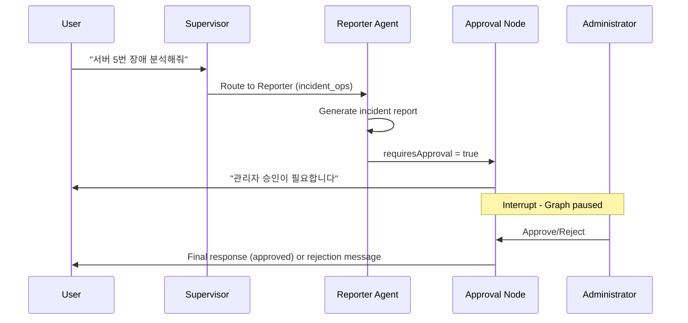

# AI Assistant Architecture

## Overview

The AI Assistant is built on a **LangGraph Multi-Agent System** that orchestrates specialized agents for server monitoring tasks. It features a hybrid deployment model with Cloud Run as the primary backend and local execution as fallback.

## Core Components

### 1. Frontend: AI Sidebar (`AISidebarV4`)

- **Location**: `src/domains/ai-sidebar/components/AISidebarV4.tsx`
- **Framework**: React + Vercel AI SDK (`useChat` hook)
- **Endpoint**: `/api/ai/unified-stream`
- **Features**:
  - Real-time streaming response
  - Agent routing visualization
  - Tool invocation display
  - Session persistence

### 2. Backend: LangGraph Multi-Agent System

- **Cloud Run**: `cloud-run/ai-backend/src/` (Hono/TypeScript)
- **Local Fallback**: `src/services/langgraph/` (Next.js)
- **Framework**: LangGraph StateGraph

#### Agent Architecture

```
START
  │
  ▼
┌─────────────────────────────────────────────────┐
│              SUPERVISOR                          │
│   Model: Groq llama-3.1-8b-instant              │
│   Role: Intent classification & routing          │
└─────────────────────────────────────────────────┘
  │
  ├──▶ "nlq"      ──▶ NLQ Agent (Gemini 2.5 Flash)
  │                    └─ getServerMetrics
  │
  ├──▶ "analyst"  ──▶ Analyst Agent (Gemini 2.5 Pro)
  │                    └─ analyzePattern
  │
  ├──▶ "reporter" ──▶ Reporter Agent (Llama 3.3-70b)
  │                    └─ searchKnowledgeBase (RAG)
  │                    └─ [Approval Check] ──▶ Human Interrupt
  │
  ├──▶ "parallel" ──▶ Parallel Analysis Node
  │                    └─ NLQ + Analyst (concurrent)
  │
  └──▶ "reply"    ──▶ Direct Response (greetings)
                       │
                       ▼
                      END
```

## Tool System

The AI uses specialized tools within each agent for domain-specific operations.

### NLQ Agent Tools

| Tool | Description |
|------|-------------|
| `getServerMetrics` | Retrieves CPU/Memory/Disk metrics from scenario data |

### Analyst Agent Tools

| Tool | Description |
|------|-------------|
| `analyzePattern` | Detects trends, anomalies, and patterns in metrics |

### Reporter Agent Tools

| Tool | Description |
|------|-------------|
| `searchKnowledgeBase` | RAG search using Supabase pgvector (384 dimensions) |

## Data Flow

1. **User Query**: User types a message in `AISidebarV4`
2. **API Request**: `useChat` sends POST to `/api/ai/unified-stream`
3. **Backend Selection**:
   - If `CLOUD_RUN_ENABLED=true`: Proxy to Cloud Run
   - Otherwise: Execute local LangGraph
4. **Supervisor Routing**: Groq Llama classifies intent and routes to appropriate agent
5. **Agent Execution**: Selected agent processes query with tools
6. **Approval Check** (Reporter only): Critical actions require human approval
7. **Response**: Streaming or JSON response returned to client

## Human-in-the-Loop Workflow



### Approval Types

| Action Type | Trigger | Requires Approval |
|-------------|---------|-------------------|
| `incident_report` | Root cause analysis completed | Yes |
| `system_command` | Risky operations | Yes |
| `critical_alert` | High-severity alerts | Yes |

## Parallel Analysis

When comprehensive analysis is needed (both metrics and patterns), the Supervisor routes to the `parallel_analysis` node:

```typescript
// Promise.all for concurrent execution
const [analystResult, nlqResult] = await Promise.all([
  analystAgentNode(state),
  nlqAgentNode(state),
]);

// Results merged into combined response
```

Benefits:
- 2x faster than sequential execution
- Unified response combining metrics + insights
- Automatic result aggregation

## Session Persistence

Sessions are persisted using Supabase PostgresCheckpointer:

```typescript
const checkpointer = PostgresSaver.fromConnString(
  process.env.SUPABASE_DATABASE_URL
);

// Graph compiled with checkpointer
const graph = workflow.compile({
  checkpointer,
  interruptBefore: ['approval_check'],
});
```

Features:
- Conversation history preserved across requests
- Resume from interrupt points (Human-in-the-Loop)
- Thread-based isolation per session

## Circuit Breaker

Model health is monitored with Circuit Breaker pattern:

| State | Behavior | Transition |
|-------|----------|------------|
| **Closed** | Normal operation | 3 failures → Open |
| **Open** | Block requests, use fallback | 60s cooldown → Half-Open |
| **Half-Open** | Test single request | Success → Closed, Failure → Open |

## Integration Points

| Integration | Technology | Purpose |
|-------------|------------|---------|
| **Supabase** | pgvector | RAG knowledge base |
| **Supabase** | PostgresCheckpointer | Session persistence |
| **Supabase** | Realtime | Live updates |
| **Scenario Loader** | `src/services/scenario/` | Demo metrics data |
