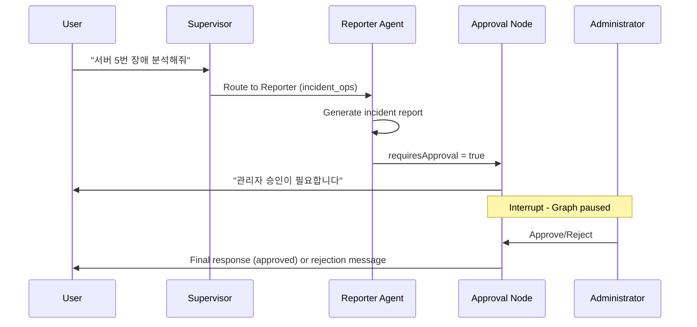
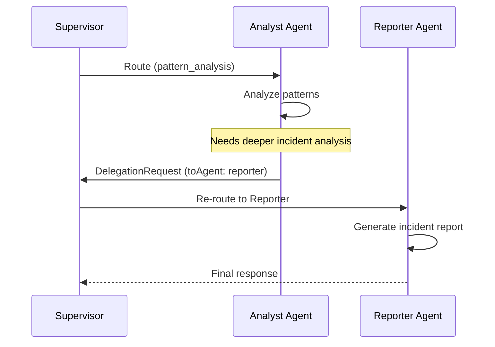

# AI Assistant Architecture

> **버전**: v2.0 (2025-12-14)
> **환경**: Next.js 16, React 19, LangGraph StateGraph

## Overview

The AI Assistant is built on a **LangGraph Multi-Agent System** that orchestrates specialized agents for server monitoring tasks. It runs directly on **Vercel Edge** using Next.js API routes.

> **Note**: Cloud Run ai-backend was removed (2025-12-14). LangGraph now runs exclusively on Vercel.

## Core Components

### 1. Frontend: Dual-Mode Architecture

#### Mode Comparison

| 항목 | 사이드바 모드 | 풀페이지 모드 |
|:-----|:-------------|:-------------|
| **진입점** | `AISidebarV4.tsx` | `AIWorkspace.tsx` |
| **레이아웃** | 우측 패널 (~400px) | 3-column 전체 화면 |
| **라우트** | 대시보드 내 컴포넌트 | `/dashboard/ai-assistant` |
| **사용 시나리오** | 빠른 질의 | 심층 분석, 보고서 |

#### Sidebar Mode (`AISidebarV4`)

- **Location**: `src/domains/ai-sidebar/components/AISidebarV4.tsx`
- **Framework**: React + Vercel AI SDK (`useChat` hook)
- **Endpoint**: `/api/ai/unified-stream`
- **Features**:
  - Real-time streaming response
  - Agent routing visualization
  - Tool invocation display
  - Session persistence

#### Fullpage Mode (`AIWorkspace`)

- **Location**: `src/components/ai/AIWorkspace.tsx`
- **Layout**: 3-column (Left Nav / Center Content / Right Context)
- **Features**:
  - 좌측: 기능 선택 네비게이션
  - 중앙: EnhancedAIChat 또는 기능별 페이지
  - 우측: 시스템 컨텍스트 패널

### 2. Backend: LangGraph Multi-Agent System

- **Location**: `src/services/langgraph/` (Next.js API Routes)
- **Framework**: LangGraph StateGraph
- **Deployment**: Vercel Edge (no external backend required)

#### Agent Architecture

```
START
  │
  ▼
┌─────────────────────────────────────────────────┐
│              SUPERVISOR                          │
│   Model: Groq llama-3.1-8b-instant              │
│   Role: Intent classification & routing          │
└─────────────────────────────────────────────────┘
  │
  ├──▶ "nlq"      ──▶ NLQ Agent (Gemini 2.5 Flash)
  │                    └─ getServerMetrics
  │
  ├──▶ "analyst"  ──▶ Analyst Agent (Gemini 2.5 Pro)
  │                    └─ analyzePattern
  │
  ├──▶ "reporter" ──▶ Reporter Agent (Llama 3.3-70b)
  │                    └─ searchKnowledgeBase (RAG)
  │                    └─ [Approval Check] ──▶ Human Interrupt
  │
  ├──▶ "parallel" ──▶ Parallel Analysis Node
  │                    └─ NLQ + Analyst (concurrent)
  │
  └──▶ "reply"    ──▶ Direct Response (greetings)
                       │
                       ▼
                      END
```

## 3 AI Features

### 1. Natural Language Query (Chat)

| 항목 | 값 |
|------|-----|
| **컴포넌트** | `EnhancedAIChat.tsx` |
| **API** | `/api/ai/unified-stream` |
| **에이전트** | Supervisor → NLQ/Analyst/Reporter |

### 2. Auto Incident Report

| 항목 | 값 |
|------|-----|
| **컴포넌트** | `AutoReportPage.tsx` |
| **API** | `/api/ai/incident-report` |
| **에이전트** | Reporter Agent (Llama 70b) |

### 3. Intelligent Monitoring

| 항목 | 값 |
|------|-----|
| **컴포넌트** | `IntelligentMonitoringPage.tsx` |
| **API** | `/api/ai/intelligent-monitoring` |
| **에이전트** | Analyst Agent (Gemini Pro) |

## Tool System

The AI uses specialized tools within each agent for domain-specific operations.

### NLQ Agent Tools

| Tool | Description |
|------|-------------|
| `getServerMetrics` | Retrieves CPU/Memory/Disk metrics from scenario data |

### Analyst Agent Tools

| Tool | Description |
|------|-------------|
| `detectAnomalies` | 26-hour moving average + 2σ deviation anomaly detection |
| `predictTrends` | Linear Regression based trend prediction |
| `analyzePattern` | Comprehensive pattern analysis (combines above tools) |

**Intent Detection**: The Analyst Agent auto-detects query intent:
- `anomaly` → Executes `detectAnomalies`
- `trend` → Executes `predictTrends`
- `pattern` → Executes `analyzePattern`
- `comprehensive` → Executes all tools

### Reporter Agent Tools

| Tool | Description |
|------|-------------|
| `searchKnowledgeBase` | RAG search using Supabase pgvector (384 dimensions) |
| `recommendCommands` | Suggests runbook commands for incident resolution |

## Data Flow

1. **User Query**: User types a message in `AISidebarV4`
2. **API Request**: `useChat` sends POST to `/api/ai/unified-stream`
3. **LangGraph Execution**: StateGraph processes request on Vercel
4. **Supervisor Routing**: Groq Llama classifies intent and routes to appropriate agent
5. **Agent Execution**: Selected agent processes query with tools
6. **Approval Check** (Reporter only): Critical actions require human approval
7. **Response**: AI SDK v5 Data Stream Protocol (`0:"text"\n`, `d:{...}\n`)

## Human-in-the-Loop Workflow



### Approval Types

| Action Type | Trigger | Requires Approval |
|-------------|---------|-------------------|
| `incident_report` | Root cause analysis completed | Yes |
| `system_command` | Risky operations | Yes |
| `critical_alert` | High-severity alerts | Yes |

## A2A (Agent-to-Agent) Communication

LangGraph supports agent-to-agent communication via the **Return-to-Supervisor** pattern:



### DelegationRequest Interface

```typescript
interface DelegationRequest {
  fromAgent: AgentType;     // Origin agent
  toAgent: AgentType;       // Target agent (optional)
  reason: string;           // Why delegation is needed
  context?: unknown;        // Additional context
}
```

### State Fields for A2A

| Field | Type | Purpose |
|-------|------|---------|
| `returnToSupervisor` | boolean | Signals delegation request |
| `delegationRequest` | DelegationRequest \| null | Delegation details |
| `agentResults` | AgentResult[] | Context propagation between agents |

### When A2A is Triggered

- Analyst detects critical anomaly → Delegates to Reporter for incident report
- NLQ finds multiple alerts → Delegates to Analyst for pattern analysis
- Reporter needs fresh metrics → Delegates to NLQ for data retrieval

## Parallel Analysis

When comprehensive analysis is needed (both metrics and patterns), the Supervisor routes to the `parallel_analysis` node:

```typescript
// Promise.all for concurrent execution
const [analystResult, nlqResult] = await Promise.all([
  analystAgentNode(state),
  nlqAgentNode(state),
]);

// Results merged into combined response
```

Benefits:
- 2x faster than sequential execution
- Unified response combining metrics + insights
- Automatic result aggregation

## Session Persistence

Sessions are persisted using Supabase PostgresCheckpointer:

```typescript
const checkpointer = PostgresSaver.fromConnString(
  process.env.SUPABASE_DATABASE_URL
);

// Graph compiled with checkpointer
const graph = workflow.compile({
  checkpointer,
  interruptBefore: ['approval_check'],
});
```

Features:
- Conversation history preserved across requests
- Resume from interrupt points (Human-in-the-Loop)
- Thread-based isolation per session

## Circuit Breaker

Model health is monitored with Circuit Breaker pattern:

| State | Behavior | Transition |
|-------|----------|------------|
| **Closed** | Normal operation | 3 failures → Open |
| **Open** | Block requests, use fallback | 60s cooldown → Half-Open |
| **Half-Open** | Test single request | Success → Closed, Failure → Open |

## Integration Points

| Integration | Technology | Purpose |
|-------------|------------|---------|
| **Supabase** | pgvector | RAG knowledge base |
| **Supabase** | PostgresCheckpointer | Session persistence |
| **Supabase** | Realtime | Live updates |
| **Scenario Loader** | `src/services/scenario/` | Demo metrics data |
