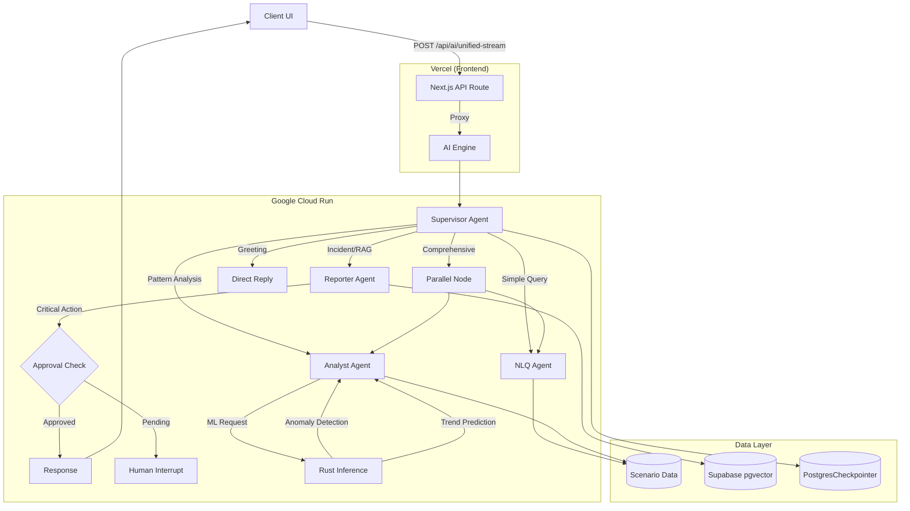

# AI Engine Architecture

## Overview

The AI Engine for OpenManager Vibe is a **Multi-Agent System** built on **LangGraph StateGraph**. It uses a Supervisor-Worker pattern with specialized agents for different tasks, running on **Google Cloud Run** with frontend on **Vercel**.

## Architecture (v5.83.0)

### Deployment Mode

| Mode | Backend | Status |
|------|---------|--------|
| **Cloud Run** | `cloud-run/ai-engine/` (LangGraph) | ✅ Active (Primary) |
| **Cloud Run** | `cloud-run/rust-inference/` (ML) | ✅ Active |
| **Vercel** | `src/app/` (Next.js Frontend) | ✅ Active (Frontend Only) |
| ~~Cloud Run~~ | ~~`cloud-run/supabase-mcp/`~~ | ❌ Deprecated |

> **Note**: LangGraph was migrated from Vercel to Cloud Run (2025-12-16) due to Edge response issues. Vercel now serves the Next.js frontend only, while Cloud Run handles all AI processing. Supabase MCP Bridge is deprecated (direct Supabase JS client used instead).

### Agent Stack

| Agent | Model | Role | Tools |
|-------|-------|------|-------|
| **Supervisor** | Groq `llama-3.1-8b-instant` | Intent classification & routing | - |
| **NLQ Agent** | Gemini 2.5 Flash | Server metrics queries | `getServerMetrics` |
| **Analyst Agent** | Gemini 2.5 Flash | Pattern analysis, anomaly detection | `detectAnomalies`, `predictTrends`, `analyzePattern` |
| **Reporter Agent** | Llama 3.3-70b | Incident reports, Root Cause Analysis | `searchKnowledgeBase` (RAG), `recommendCommands` |

### Key Features

- **Parallel Analysis**: Analyst + NLQ agents run concurrently for comprehensive reports
- **Human-in-the-Loop (HITL)**: Critical actions require approval via LangGraph `interruptBefore`
- **Return-to-Supervisor**: Agents can route back to supervisor for re-evaluation
- **A2A Delegation**: Inter-agent task delegation via Command pattern
- **Circuit Breaker**: Model health monitoring with automatic failover
- **Session Persistence**: Supabase PostgresCheckpointer for conversation continuity

### Agent Communication Patterns

| Pattern | Description | Use Case |
|---------|-------------|----------|
| **Return-to-Supervisor** | Agent sets `returnToSupervisor=true` | Need different agent's expertise |
| **Command Pattern** | Explicit `toAgent` in DelegationRequest | Direct delegation to specific agent |
| **HITL Interrupt** | `requiresApproval=true` triggers interrupt | Critical incident reports |

## Architecture Diagram



### Interactive Diagrams (FigJam)

| Diagram | Description | Link |
|---------|-------------|------|
| **System Architecture** | Full AI engine overview | [View](https://www.figma.com/online-whiteboard/create-diagram/9a4b29bd-0376-4e0a-8e22-3b9bd008854a) |
| **Agent Routing Flow** | Supervisor → Agent routing | [View](https://www.figma.com/online-whiteboard/create-diagram/22dbc5b3-44c1-44e7-9eee-1fa0cf8e402a) |
| **A2A Communication** | Inter-agent delegation | [View](https://www.figma.com/online-whiteboard/create-diagram/a32f26ab-5d3c-40f6-a8ed-4eb5ec0ed843) |
| **HITL Workflow** | Human-in-the-Loop approval | [View](https://www.figma.com/online-whiteboard/create-diagram/da114603-ca00-4416-9e1a-9bb422826093) |

## State Interfaces

### AgentState (16 Fields)

The core state interface for LangGraph orchestration:

| Field | Type | Purpose |
|-------|------|---------|
| `messages` | BaseMessage[] | Conversation history |
| `sessionId` | string | Session identifier |
| `iteration` | number | Current iteration count |
| `routerDecision` | RouterDecision | Supervisor routing decision |
| `targetAgent` | AgentType | Selected agent for execution |
| `taskType` | TaskType | Classified task type |
| `delegationRequest` | DelegationRequest \| null | A2A delegation info |
| `returnToSupervisor` | boolean | Flag for re-routing |
| `agentResults` | AgentResult[] | Results from executed agents |
| `requiresApproval` | boolean | HITL flag |
| `approvalStatus` | 'pending' \| 'approved' \| 'rejected' | Approval state |
| `pendingAction` | PendingAction \| null | Action awaiting approval |
| `modelHealth` | CircuitBreakerState | Model health tracking |
| `parallelAgents` | AgentType[] | Agents for parallel execution |
| `toolResults` | ToolResult[] | Tool invocation results |
| `finalResponse` | string | Final response to user |

### DelegationRequest

```typescript
interface DelegationRequest {
  fromAgent: AgentType;     // Origin agent
  toAgent?: AgentType;      // Target agent (optional)
  reason: string;           // Delegation reason
  context?: unknown;        // Additional context
  priority?: 'low' | 'normal' | 'high';
}
```

### PendingAction (HITL)

```typescript
interface PendingAction {
  actionType: string;       // e.g., 'incident_report'
  description: string;      // Human-readable description
  payload: unknown;         // Action data
  requestedAt: string;      // ISO timestamp
  requestedBy: AgentType;   // Requesting agent
}
```

### CircuitBreakerState

```typescript
interface CircuitBreakerState {
  models: Record<string, ModelHealthState>;
  threshold: number;        // Failure threshold (default: 3)
  resetTimeMs: number;      // Reset cooldown (default: 60000)
}

interface ModelHealthState {
  failures: number;
  isOpen: boolean;          // Circuit open = blocked
  lastFailure?: string;
  halfOpenAttempts: number;
}
```

## API Specification

### Endpoint

**`POST /api/ai/unified-stream`** - Unified AI endpoint (streaming + JSON)

### Request Format

```json
{
  "messages": [
    { "role": "user", "content": "서버 5번 CPU 상태 알려줘" }
  ],
  "sessionId": "optional-session-id"
}
```

### Response Format (JSON)

```json
{
  "success": true,
  "response": "서버 5번의 CPU 사용률은 현재 45%입니다...",
  "toolResults": [...],
  "targetAgent": "nlq",
  "sessionId": "session_1234567890",
  "_backend": "vercel"
}
```

### Response Format (Streaming - AI SDK v5 Protocol)

```
Headers:
- Content-Type: text/plain; charset=utf-8
- X-Session-Id: session_1234567890

Body:
0:"안녕하세요! "
0:"서버 상태를 확인해드릴게요.\n"
d:{"finishReason":"stop"}
```

## Data & Memory

| Component | Technology | Purpose |
|-----------|------------|---------|
| **Vector Store** | Supabase (pgvector) | RAG knowledge base |
| **Checkpointer** | PostgresCheckpointer | Session state persistence |
| **Realtime** | Supabase Realtime | Live dashboard updates |
| **Client State** | Zustand | Chat history, UI state |

## Environment Variables

| Variable | Required | Description |
|----------|----------|-------------|
| `GOOGLE_AI_API_KEY` | Yes | Gemini 2.5 API key (Primary) |
| `GOOGLE_AI_API_KEY_SECONDARY` | Yes | Gemini 2.5 API key (Round-robin) |
| `GROQ_API_KEY` | Yes | Groq (Llama) API key |
| `NEXT_PUBLIC_SUPABASE_URL` | Yes | Supabase project URL |
| `SUPABASE_SERVICE_ROLE_KEY` | Yes | Supabase service role key |
| `CLOUD_RUN_AI_ENGINE_URL` | Yes | Cloud Run AI Engine endpoint |
| `CLOUD_RUN_SECRET` | Yes | Cloud Run service auth secret |

## File Structure

```
# Cloud Run Services (Primary Backend)
cloud-run/
├── ai-engine/              # LangGraph Supervisor Engine
│   ├── src/server.ts       # Hono HTTP server
│   ├── src/graph/          # LangGraph StateGraph
│   │   ├── graph-builder.ts
│   │   ├── state-definition.ts
│   │   └── agents/
│   └── package.json        # @langchain/langgraph, ai-sdk
│
└── rust-inference/         # ML Support Service (Axum)
    ├── src/main.rs         # Anomaly detection, Trend prediction
    └── Cargo.toml          # axum, tokio, serde

# Vercel Frontend
src/app/api/ai/
├── unified-stream/route.ts # Proxy to Cloud Run AI Engine
└── approval/route.ts       # HITL approval endpoint

# Legacy (Deprecated - kept for reference)
src/services/langgraph/     # Old Vercel-based LangGraph (superseded by cloud-run/ai-engine/)
cloud-run/supabase-mcp/     # Deprecated - direct Supabase JS client used instead
```

## Deprecated Components

| Component | Status | Replacement |
|-----------|--------|-------------|
| `src/services/langgraph/` (Vercel) | Deprecated (2025-12-16) | `cloud-run/ai-engine/` |
| `cloud-run/supabase-mcp/` | Deprecated (2025-12-16) | Direct Supabase JS client |
| GCP VM | Removed (2025-12-16) | Cloud Run |
| `/api/ai/query` | Removed | `/api/ai/unified-stream` |
| Python Unified Processor | Removed | TypeScript LangGraph agents |
| GCP Cloud Functions | Removed | Cloud Run |
| `ml-analytics-engine` (Python) | Removed | `cloud-run/rust-inference/` |
| `SmartRoutingEngine` | Removed | LangGraph Supervisor Agent |

## Cloud Run Services

### ai-engine (LangGraph)

- **Runtime**: Node.js 22 + Hono
- **Framework**: LangGraph StateGraph, Vercel AI SDK
- **Models**: Groq Llama 8b (Supervisor), Gemini 2.5 Flash/Pro (Agents)
- **Endpoint**: `https://ai-engine-xxxxx.run.app`

### rust-inference (ML)

- **Runtime**: Rust + Axum
- **Features**: Anomaly Detection (Moving Average + 2σ), Trend Prediction (Linear Regression)
- **Endpoint**: `https://rust-inference-xxxxx.run.app`
