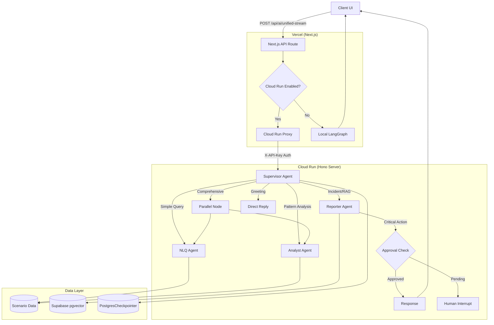

# AI Engine Architecture

## Overview

The AI Engine for OpenManager Vibe is a **Hybrid Multi-Agent System** built on **LangGraph StateGraph**. It uses a Supervisor-Worker pattern with specialized agents for different tasks, featuring **Cloud Run** as the primary backend with local fallback.

## Architecture (v5.80.0)

### Deployment Modes

| Mode | Backend | When Used |
|------|---------|-----------|
| **Cloud Run** (Primary) | `cloud-run/ai-backend/` (Hono/TypeScript) | `CLOUD_RUN_ENABLED=true` |
| **Local** (Fallback) | `src/services/langgraph/` (Next.js) | Cloud Run unavailable or disabled |

### Agent Stack

| Agent | Model | Role | Tools |
|-------|-------|------|-------|
| **Supervisor** | Groq `llama-3.1-8b-instant` | Intent classification & routing | - |
| **NLQ Agent** | Gemini 2.5 Flash | Server metrics queries | `getServerMetrics` |
| **Analyst Agent** | Gemini 2.5 Pro | Pattern analysis, anomaly detection | `analyzePattern` |
| **Reporter Agent** | Llama 3.3-70b | Incident reports, Root Cause Analysis | `searchKnowledgeBase` (RAG) |

### Key Features

- **Parallel Analysis**: Analyst + NLQ agents run concurrently for comprehensive reports
- **Human-in-the-Loop (HITL)**: Critical actions require approval via LangGraph `interruptBefore`
- **Return-to-Supervisor**: Agents can route back to supervisor for re-evaluation
- **A2A Delegation**: Inter-agent task delegation via Command pattern
- **Circuit Breaker**: Model health monitoring with automatic failover
- **Session Persistence**: Supabase PostgresCheckpointer for conversation continuity

### Agent Communication Patterns

| Pattern | Description | Use Case |
|---------|-------------|----------|
| **Return-to-Supervisor** | Agent sets `returnToSupervisor=true` | Need different agent's expertise |
| **Command Pattern** | Explicit `toAgent` in DelegationRequest | Direct delegation to specific agent |
| **HITL Interrupt** | `requiresApproval=true` triggers interrupt | Critical incident reports |

## Architecture Diagram



## API Specification

### Endpoint

**`POST /api/ai/unified-stream`** - Unified AI endpoint (streaming + JSON)

### Request Format

```json
{
  "messages": [
    { "role": "user", "content": "서버 5번 CPU 상태 알려줘" }
  ],
  "sessionId": "optional-session-id"
}
```

### Response Format (JSON)

```json
{
  "success": true,
  "response": "서버 5번의 CPU 사용률은 현재 45%입니다...",
  "toolResults": [...],
  "targetAgent": "nlq",
  "sessionId": "session_1234567890",
  "_backend": "cloud-run"
}
```

### Response Format (Streaming)

```
Headers:
- Content-Type: text/plain; charset=utf-8
- X-Session-Id: session_1234567890
- X-Backend: cloud-run | local
```

## Data & Memory

| Component | Technology | Purpose |
|-----------|------------|---------|
| **Vector Store** | Supabase (pgvector) | RAG knowledge base |
| **Checkpointer** | PostgresCheckpointer | Session state persistence |
| **Realtime** | Supabase Realtime | Live dashboard updates |
| **Client State** | Zustand | Chat history, UI state |

## Environment Variables

| Variable | Required | Description |
|----------|----------|-------------|
| `CLOUD_RUN_ENABLED` | No | Enable Cloud Run backend (`true`/`false`) |
| `CLOUD_RUN_AI_URL` | If enabled | Cloud Run service URL |
| `CLOUD_RUN_API_SECRET` | If enabled | API key for authentication |
| `GOOGLE_AI_API_KEY` | Yes | Gemini 2.5 API key |
| `GROQ_API_KEY` | Yes | Groq (Llama) API key |

## File Structure

```
# Cloud Run Backend
cloud-run/ai-backend/
├── src/
│   ├── index.ts                    # Hono server entry
│   ├── routes/
│   │   ├── health.ts               # Health check endpoints
│   │   ├── unified-stream.ts       # AI route handler
│   │   └── approval.ts             # HITL approval endpoints
│   └── services/langgraph/
│       ├── graph-builder.ts        # StateGraph assembly + HITL
│       ├── state-definition.ts     # AgentState + DelegationRequest
│       ├── checkpointer.ts         # Supabase PostgresSaver
│       └── agents/
│           ├── supervisor.ts       # Routing + delegation handling
│           ├── nlq-agent.ts        # Metrics queries
│           ├── analyst-agent.ts    # Pattern analysis + anomaly
│           └── reporter-agent.ts   # Incident reports + HITL trigger

# Next.js API Proxy
src/app/api/ai/
├── unified-stream/route.ts         # Main AI proxy
└── approval/route.ts               # HITL approval proxy

# Vercel Proxy Utilities
src/lib/cloud-run/
└── proxy.ts                        # Cloud Run proxy utilities

# Local Fallback
src/services/langgraph/
└── (mirrors cloud-run structure)
```

## Deprecated Components

| Component | Status | Replacement |
|-----------|--------|-------------|
| `/api/ai/query` | Removed | `/api/ai/unified-stream` |
| Python Unified Processor | Removed | TypeScript LangGraph agents |
| GCP Cloud Functions | Removed | Cloud Run (containerized) |
| `ml-analytics-engine` | Removed | Analyst Agent (Gemini 2.5 Pro) |
| `SmartRoutingEngine` | Removed | LangGraph Supervisor Agent |
