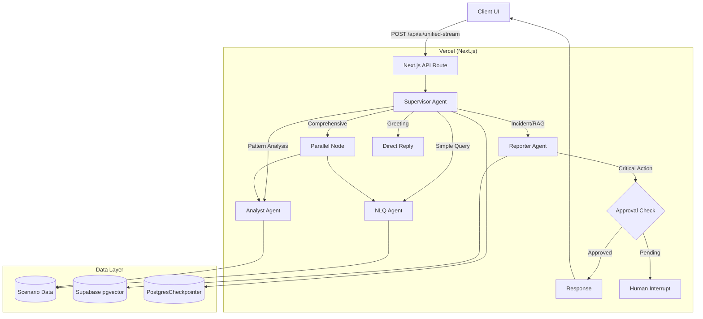

# AI Engine Architecture

## Overview

The AI Engine for OpenManager Vibe is a **Multi-Agent System** built on **LangGraph StateGraph**. It uses a Supervisor-Worker pattern with specialized agents for different tasks, running directly on **Vercel Edge**.

## Architecture (v5.82.0)

### Deployment Mode

| Mode | Backend | Status |
|------|---------|--------|
| **Vercel** | `src/services/langgraph/` (Next.js) | ✅ Active (Primary) |
| ~~Cloud Run~~ | ~~`cloud-run/ai-backend/`~~ | ❌ Removed (2025-12-14) |

> **Note**: Cloud Run ai-backend was removed as redundant. LangGraph runs directly on Vercel with full functionality. Cloud Run is reserved for Supabase MCP Bridge (`cloud-run/supabase-mcp/`).

### Agent Stack

| Agent | Model | Role | Tools |
|-------|-------|------|-------|
| **Supervisor** | Groq `llama-3.1-8b-instant` | Intent classification & routing | - |
| **NLQ Agent** | Gemini 2.5 Flash | Server metrics queries | `getServerMetrics` |
| **Analyst Agent** | Gemini 2.5 Pro | Pattern analysis, anomaly detection | `analyzePattern` |
| **Reporter Agent** | Llama 3.3-70b | Incident reports, Root Cause Analysis | `searchKnowledgeBase` (RAG) |

### Key Features

- **Parallel Analysis**: Analyst + NLQ agents run concurrently for comprehensive reports
- **Human-in-the-Loop (HITL)**: Critical actions require approval via LangGraph `interruptBefore`
- **Return-to-Supervisor**: Agents can route back to supervisor for re-evaluation
- **A2A Delegation**: Inter-agent task delegation via Command pattern
- **Circuit Breaker**: Model health monitoring with automatic failover
- **Session Persistence**: Supabase PostgresCheckpointer for conversation continuity

### Agent Communication Patterns

| Pattern | Description | Use Case |
|---------|-------------|----------|
| **Return-to-Supervisor** | Agent sets `returnToSupervisor=true` | Need different agent's expertise |
| **Command Pattern** | Explicit `toAgent` in DelegationRequest | Direct delegation to specific agent |
| **HITL Interrupt** | `requiresApproval=true` triggers interrupt | Critical incident reports |

## Architecture Diagram



## API Specification

### Endpoint

**`POST /api/ai/unified-stream`** - Unified AI endpoint (streaming + JSON)

### Request Format

```json
{
  "messages": [
    { "role": "user", "content": "서버 5번 CPU 상태 알려줘" }
  ],
  "sessionId": "optional-session-id"
}
```

### Response Format (JSON)

```json
{
  "success": true,
  "response": "서버 5번의 CPU 사용률은 현재 45%입니다...",
  "toolResults": [...],
  "targetAgent": "nlq",
  "sessionId": "session_1234567890",
  "_backend": "vercel"
}
```

### Response Format (Streaming - AI SDK v5 Protocol)

```
Headers:
- Content-Type: text/plain; charset=utf-8
- X-Session-Id: session_1234567890

Body:
0:"안녕하세요! "
0:"서버 상태를 확인해드릴게요.\n"
d:{"finishReason":"stop"}
```

## Data & Memory

| Component | Technology | Purpose |
|-----------|------------|---------|
| **Vector Store** | Supabase (pgvector) | RAG knowledge base |
| **Checkpointer** | PostgresCheckpointer | Session state persistence |
| **Realtime** | Supabase Realtime | Live dashboard updates |
| **Client State** | Zustand | Chat history, UI state |

## Environment Variables

| Variable | Required | Description |
|----------|----------|-------------|
| `GOOGLE_AI_API_KEY` | Yes | Gemini 2.5 API key |
| `GROQ_API_KEY` | Yes | Groq (Llama) API key |
| `NEXT_PUBLIC_SUPABASE_URL` | Yes | Supabase project URL |
| `SUPABASE_SERVICE_ROLE_KEY` | Yes | Supabase service role key |

## File Structure

```
# LangGraph Multi-Agent (Vercel)
src/services/langgraph/
├── graph-builder.ts        # StateGraph assembly + HITL
├── state-definition.ts     # AgentState + DelegationRequest
├── checkpointer.ts         # Supabase PostgresSaver
└── agents/
    ├── supervisor.ts       # Routing + delegation handling
    ├── nlq-agent.ts        # Metrics queries
    ├── analyst-agent.ts    # Pattern analysis + anomaly
    └── reporter-agent.ts   # Incident reports + HITL trigger

# Next.js API Routes
src/app/api/ai/
├── unified-stream/route.ts # Main AI endpoint
└── approval/route.ts       # HITL approval endpoint

# Cloud Run (Supabase MCP Only)
cloud-run/supabase-mcp/     # Database MCP Bridge
└── src/index.ts            # Hono server for Supabase tools
```

## Deprecated Components

| Component | Status | Replacement |
|-----------|--------|-------------|
| `cloud-run/ai-backend/` | Removed (2025-12-14) | `src/services/langgraph/` |
| `/api/ai/query` | Removed | `/api/ai/unified-stream` |
| Python Unified Processor | Removed | TypeScript LangGraph agents |
| GCP Cloud Functions | Removed | Vercel Edge |
| `ml-analytics-engine` | Removed | Analyst Agent (Gemini 2.5 Pro) |
| `SmartRoutingEngine` | Removed | LangGraph Supervisor Agent |
