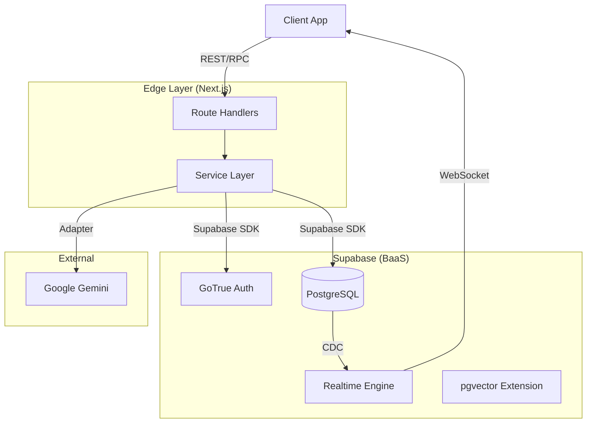

# 🔙 Backend Architecture

## Overview

The backend architecture is built on **Supabase** (BaaS) and a custom **Service Layer** running on Next.js Edge Functions. It follows an **Event-Driven Architecture** to handle real-time monitoring data.

## 🏗️ Core Stack

| Component | Technology | Purpose |
|-----------|------------|---------|
| **Database** | PostgreSQL | Relational data, Vector embeddings (pgvector) |
| **Auth** | Supabase Auth | JWT-based authentication, RLS policies |
| **Realtime** | Supabase Realtime | WebSocket subscriptions for DB changes |
| **API** | Next.js Route Handlers | Edge-compatible API endpoints |
| **Services** | TypeScript Classes | Business logic encapsulation |

## 📐 Architecture Diagram

## 🛡️ Service Layer Pattern

We use a **Service Layer** pattern to decouple business logic from API routes.

- **`src/services/`**: Contains all business logic.
    - `UnifiedMetricsManager.ts`: Central hub for metric processing.
    - `IncidentReportService.ts`: Manages incident creation and resolution.
    - `LoggingService.ts`: Centralized logging.
- **`src/lib/supabase/`**: Supabase client initialization (Server/Client/Admin).

## 🔒 Security (RLS)

- **Row Level Security (RLS)** is enabled on all tables.
- Policies ensure users can only access data they are authorized to see.
- **Service Role Key** is used strictly within secure server-side contexts (e.g., cron jobs, admin tasks).

## 🚀 Scalability

- **Edge Functions**: Serverless execution scales automatically with traffic.
- **Connection Pooling**: Supabase handles connection pooling for PostgreSQL.
- **Read Replicas**: (Future) Can be enabled in Supabase for high-read workloads.
