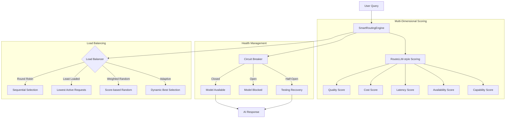

# Dynamic AI Model Routing Architecture

## Overview
OpenManager Vibe v5 uses **SmartRoutingEngine** - a multi-dimensional AI routing engine that optimizes for quality, cost, latency, and availability. The system implements industry best practices including RouteLLM-style scoring, Circuit Breaker pattern, and adaptive load balancing.

## Architecture Diagram



## Key Features (v5.80.0)

### 1. RouteLLM-style Multi-Dimensional Scoring

Each model is scored across 5 dimensions with configurable weights:

| Dimension | Weight | Description |
|-----------|--------|-------------|
| Quality | 0.25 | Model capability and output quality |
| Cost | 0.20 | Token cost efficiency |
| Latency | 0.20 | Response speed |
| Capability | 0.20 | Feature support (tools, vision, reasoning) |
| Availability | 0.15 | Rate limit and health status |

### 2. Task-Based Model Specialization

| Task Type | Specialized Models | Use Case |
|-----------|-------------------|----------|
| `fast-response` | llama-3.1-8b-instant | Simple queries, greetings |
| `reasoning` | qwen-qwq-32b, gemini-2.5-pro | Complex analysis |
| `code-generation` | llama-3.3-70b-versatile | Code tasks |
| `vision` | gemini-2.5-flash, gemini-2.5-pro | Image analysis |
| `general` | All models | Default routing |

### 3. Circuit Breaker Pattern

Protects against cascading failures:

| State | Behavior | Transition |
|-------|----------|------------|
| **Closed** | Normal operation | → Open (3 consecutive failures) |
| **Open** | Block requests | → Half-Open (after 30s cooldown) |
| **Half-Open** | Test with single request | → Closed (success) or Open (failure) |

### 4. Load Balancing Strategies

| Strategy | Algorithm | Best For |
|----------|-----------|----------|
| `round-robin` | Sequential rotation | Even distribution |
| `least-loaded` | Minimum active requests | High throughput |
| `weighted-random` | Score-weighted random | Quality optimization |
| `adaptive` | Score × Success Rate | Production (default) |

## Routing Logic (v5.80.0)

| Complexity | Intent Examples | Primary Model | Fallback Chain | Latency Target |
|------------|-----------------|---------------|----------------|----------------|
| **Level 1** | Greetings, FAQ | llama-3.1-8b-instant | gemini-2.5-flash | < 300ms |
| **Level 2** | Server Status | gemini-2.5-flash | llama-3.1-8b | < 800ms |
| **Level 3** | Simple Metrics | gemini-2.5-flash | llama-3.3-70b | < 1.5s |
| **Level 4** | Pattern Analysis | llama-3.3-70b-versatile | gemini-2.5-flash | < 3s |
| **Level 5** | Complex Reasoning | gemini-2.5-pro | qwen-qwq-32b | Variable |

> **Note**: Model selection is now dynamic based on real-time health, load, and availability.

---

## 2. Integration with Unified AI Processor

For high-complexity tasks (typically Level 4+ or specific analytic intents), the Router delegates execution to the **Unified AI Processor** (Python/GCP).

-   **Endpoint**: `/api/ai/unified-stream` (Streaming) or `/api/ai/query` (Legacy/Sync)
-   **Role**: The Next.js API acts as a gateway. It calls the local `UnifiedAIProcessor` class (or external GCP Function if configured) to perform heavy lifting like:
    -   Korean NLP processing (KoNLPy)
    -   ML-based Anomaly Detection (Scikit-learn)
    -   RAG (Supabase pgvector)

### Architecture Flow

```mermaid
graph TD
    User[User Query] --> Router[Next.js API Route /api/ai/unified-stream]
    Router --> Classifier{Query Classifier}
    
    Classifier -- Simple (L1-3) --> Direct[Direct Response / Tool Call]
    Classifier -- Complex (L4-5) --> Unified[Unified Processor (Python)]
    
    Direct --> Gemini[Gemini 2.5 Flash]
    Unified --> GeminiPro[Gemini 2.5 Pro (Reasoning)]
    
    Unified --> NLP[NLP Engine]
    Unified --> ML[ML Analytics]
    Unified --> RAG[Knowledge Base]
```

## 3. Environment Configuration

Ensure the following environment variables are set in `.env.local`:

-   `GOOGLE_AI_API_KEY`: API Key for Gemini 2.5
-   `GROQ_API_KEY`: API Key for Groq (Llama models)
-   `NEXT_PUBLIC_GCP_UNIFIED_PROCESSOR_ENDPOINT`: (Optional) URL for external GCP Cloud Function deployment
