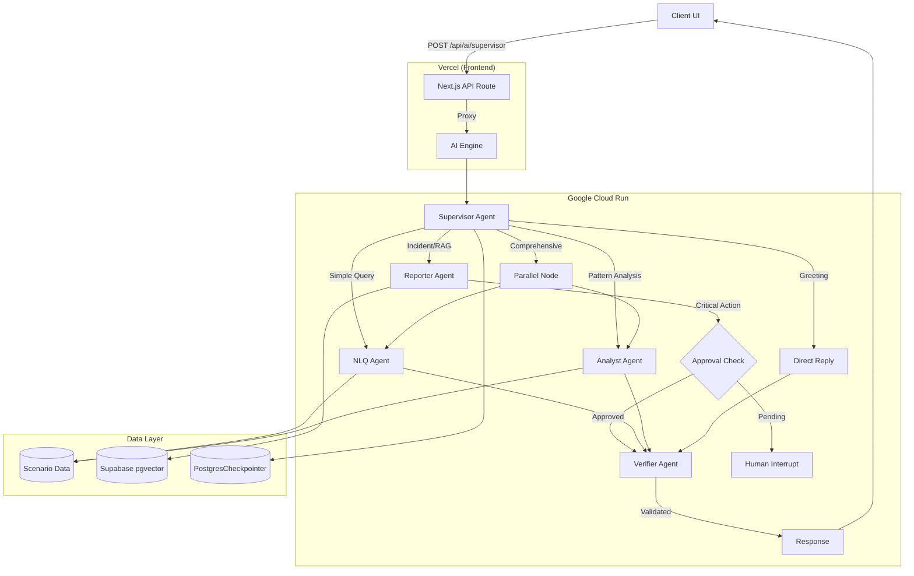
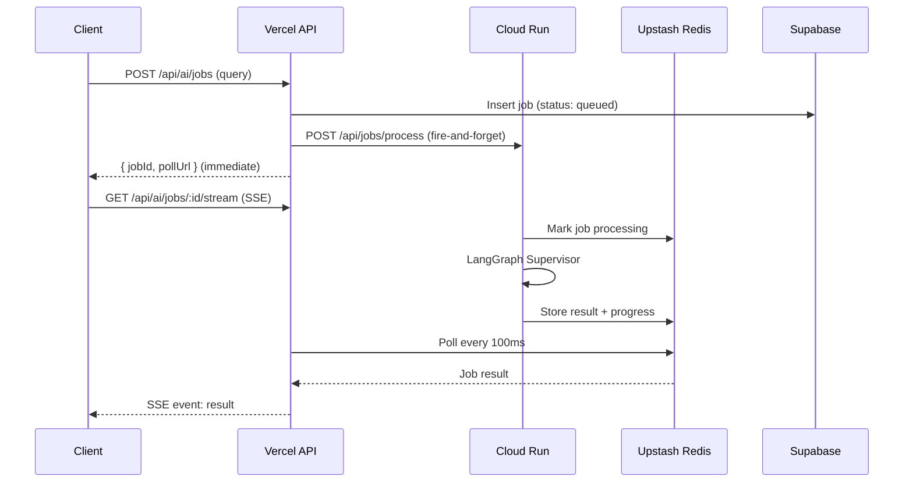
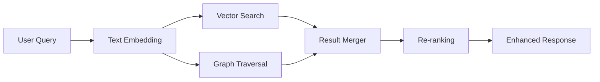

# AI Engine Architecture

## Overview

The AI Engine for OpenManager Vibe is a **Multi-Agent System** built on **LangGraph StateGraph**. It uses a Supervisor-Worker pattern with specialized agents for different tasks, running on **Google Cloud Run** with frontend on **Vercel**.

## Architecture (v5.89.0, Updated 2025-12-26)

### Deployment Mode

| Mode | Backend | Status |
|------|---------|--------|
| **Cloud Run** | `cloud-run/ai-engine/` (LangGraph) | ✅ Active (Primary) |
| **Vercel** | `src/app/` (Next.js Frontend) | ✅ Active (Frontend Only) |
| ~~Cloud Run~~ | ~~`cloud-run/rust-inference/`~~ | ❌ Removed |
| ~~Cloud Run~~ | ~~`cloud-run/supabase-mcp/`~~ | ❌ Deprecated |

> **Note**: LangGraph was migrated from Vercel to Cloud Run (2025-12-16) due to Edge response issues. Vercel now serves the Next.js frontend only, functioning as a strict proxy for AI requests. Rust ML service has been removed in favor of LLM-based analysis.

### Agent Stack

| Agent | Provider | Model | Role | Tools |
|-------|----------|-------|------|-------|
| **Supervisor** | Groq | Llama 3.3-70b | Intent classification & LangGraph handoff | - |
| **NLQ Agent** | Groq | Llama 3.3-70b | Server metrics queries (SubGraph) | `getServerMetricsAdvanced` |
| **Analyst Agent** | Groq | Llama 3.3-70b | Pattern analysis, anomaly detection | `detectAnomalies`, `predictTrends`, `analyzePattern` |
| **Reporter Agent** | Groq | Llama 3.3-70b | Incident reports, Root Cause Analysis | `searchKnowledgeBase` (RAG), `recommendCommands` |
| **Verifier Agent** | Mistral | Small 3.2 (24B) | Post-processing validation & safety check | `comprehensiveVerify`, `validateMetricRanges`, `detectHallucination` |

> **Dual-Provider Strategy**: Groq (Primary) handles LangGraph handoff-compatible agents, Mistral (Secondary) provides higher-quality verification with 24B parameters. Combined rate limit: ~1M TPM free tier.

### Key Features

- **Parallel Analysis**: Analyst + NLQ agents run concurrently for comprehensive reports
- **Human-in-the-Loop (HITL)**: Critical actions require approval via LangGraph `interruptBefore`
- **Return-to-Supervisor**: Agents can route back to supervisor for re-evaluation
- **Multi-Agent Delegation**: Inter-agent task delegation via Command pattern
- **Circuit Breaker**: Model health monitoring with automatic failover
- **Session Persistence**: Supabase PostgresCheckpointer for conversation continuity
- **Context Compression**: Token-based conversation compression for long sessions (85%+ threshold)

- **Verifier Integration**: Dedicated agent for post-processing validation and safety checks (v5.85.0)
- **Groq Compatibility**: Custom state modifier to adapt Gemini tool calls for Groq Llama models
- **Protocol Adaptation**: Simulated SSE with Keep-Alive to prevent timeouts on Vercel/Cloud Run
- **Gemini API Key Failover**: Primary → Secondary key rotation on rate limit exhaustion (v5.88.0)
- **maxRetries: 0 Fix**: Disabled LangChain SDK internal retries to prevent timeout cascades (v5.88.0)

#### New in v5.89.0 (2025-12-26)

- **Dual-Provider Architecture**: Groq (Primary) + Mistral (Secondary) for rate limit distribution
- **Supervisor Migration**: Gemini → Groq Llama 3.3-70b for LangGraph handoff compatibility
- **Verifier Upgrade**: Groq 8B → Mistral Small 3.2 (24B) for improved verification quality
- **NLQ SubGraph**: 5-node workflow (parse→extract→validate→execute→format) with advanced tool support
- **Korean NLP Helpers**: Time/metric/filter expression parsing for natural language queries

#### New in v5.88.0

- **Gemini API Key Failover**: Automatic primary → secondary key rotation when rate limit exhausted
- **LangChain maxRetries Fix**: Set `maxRetries: 0` to prevent SDK internal retry timeout cascades
- **Verifier Agent Migration**: Moved from Gemini 2.5 Flash to Groq Llama 3.1-8b for cost optimization
- **Enhanced Hallucination Detection**: Improved metric range validation and factual consistency checks

#### New in v5.87.0

- **GraphRAG Hybrid Search**: Vector + graph-based knowledge retrieval for enhanced RAG accuracy
- **Redis L2 Caching**: Upstash Redis integration for response caching and session optimization
- **Approval History Persistence**: PostgreSQL storage for HITL approval records with audit trail

### Agent Communication Patterns

| Pattern | Description | Use Case |
|---------|-------------|----------|
| **Return-to-Supervisor** | Agent sets `returnToSupervisor=true` | Need different agent's expertise |
| **Command Pattern** | Explicit `toAgent` in DelegationRequest | Direct delegation to specific agent |
| **HITL Interrupt** | `requiresApproval=true` triggers interrupt | Critical incident reports |
| **Verification Loop** | Verifier checks output before response | Quality assurance & hallucination check |

## Architecture Diagram



### Interactive Diagrams (FigJam)

| Diagram | Description | Link |
|---------|-------------|------|
| **System Architecture** | Full AI engine overview | [View](https://www.figma.com/online-whiteboard/create-diagram/9a4b29bd-0376-4e0a-8e22-3b9bd008854a) |
| **Agent Routing Flow** | Supervisor → Agent routing | [View](https://www.figma.com/online-whiteboard/create-diagram/22dbc5b3-44c1-44e7-9eee-1fa0cf8e402a) |
| **Multi-Agent Communication** | Inter-agent delegation | [View](https://www.figma.com/online-whiteboard/create-diagram/a32f26ab-5d3c-40f6-a8ed-4eb5ec0ed843) |
| **HITL Workflow** | Human-in-the-Loop approval | [View](https://www.figma.com/online-whiteboard/create-diagram/da114603-ca00-4416-9e1a-9bb422826093) |
| **Supervisor Execution Flow** | Query → Supervisor → Agents → Verifier flow | [View](https://www.figma.com/online-whiteboard/create-diagram/eb37f54b-2795-4320-bd2e-c41854a7ec52) |

## State Interfaces

### AgentState (16 Fields)

The core state interface for LangGraph orchestration:

| Field | Type | Purpose |
|-------|------|---------|
| `messages` | BaseMessage[] | Conversation history |
| `sessionId` | string | Session identifier |
| `iteration` | number | Current iteration count |
| `routerDecision` | RouterDecision | Supervisor routing decision |
| `targetAgent` | AgentType | Selected agent for execution |
| `taskType` | TaskType | Classified task type |
| `delegationRequest` | DelegationRequest \| null | A2A delegation info |
| `returnToSupervisor` | boolean | Flag for re-routing |
| `agentResults` | AgentResult[] | Results from executed agents |
| `requiresApproval` | boolean | HITL flag |
| `approvalStatus` | 'pending' \| 'approved' \| 'rejected' | Approval state |
| `pendingAction` | PendingAction \| null | Action awaiting approval |
| `modelHealth` | CircuitBreakerState | Model health tracking |
| `parallelAgents` | AgentType[] | Agents for parallel execution |
| `toolResults` | ToolResult[] | Tool invocation results |
| `finalResponse` | string | Final response to user |

### DelegationRequest

```typescript
interface DelegationRequest {
  fromAgent: AgentType;     // Origin agent
  toAgent?: AgentType;      // Target agent (optional)
  reason: string;           // Delegation reason
  context?: unknown;        // Additional context
  priority?: 'low' | 'normal' | 'high';
}
```

### PendingAction (HITL)

```typescript
interface PendingAction {
  actionType: string;       // e.g., 'incident_report'
  description: string;      // Human-readable description
  payload: unknown;         // Action data
  requestedAt: string;      // ISO timestamp
  requestedBy: AgentType;   // Requesting agent
}
```

### CircuitBreakerState

```typescript
interface CircuitBreakerState {
  models: Record<string, ModelHealthState>;
  threshold: number;        // Failure threshold (default: 3)
  resetTimeMs: number;      // Reset cooldown (default: 60000)
}

interface ModelHealthState {
  failures: number;
  isOpen: boolean;          // Circuit open = blocked
  lastFailure?: string;
  halfOpenAttempts: number;
}
```

## API Specification

### Main Endpoint

**`POST /api/ai/supervisor`** - Multi-Agent AI Processing (Cloud Run)

### Request Format

```json
{
  "messages": [
    { "role": "user", "content": "서버 5번 CPU 상태 알려줘" }
  ],
  "sessionId": "optional-session-id"
}
```

### Response Format (Streaming - AI SDK v5 Protocol)
The Cloud Run engine uses a simulated streaming protocol compatible with Vercel AI SDK v5, enhanced with custom events.

```
Headers:
- Content-Type: text/event-stream; charset=utf-8
- X-Vercel-AI-Data-Stream: v1
- X-Backend: cloud-run

Body Parts:
0:"Hello! I'm checking the server status..."  // Text content
8:[{"type":"progress","message":"Analyzing metrics..."}] // Custom annotation (Keep-alive)
8:[{"type":"verification","isValid":true,"confidence":0.98}] // Verification result
d:{"finishReason":"stop","verified":true}     // Finish signal
```

> **Note**: The frontend proxy (`src/app/api/ai/supervisor/route.ts`) parses this stream and converts `0:` parts to plain text for the client, while handling `8:` parts for UI updates (progress, verification status).

### Additional Cloud Run Endpoints

| Endpoint | Method | Purpose |
|----------|--------|---------|
| `/api/ai/embedding` | POST | Single text embedding |
| `/api/ai/embedding/batch` | POST | Batch text embeddings |
| `/api/ai/embedding/stats` | GET | Embedding service statistics |
| `/api/ai/generate` | POST | Text generation (non-streaming) |
| `/api/ai/generate/stream` | POST | Text generation (streaming SSE) |
| `/api/ai/generate/stats` | GET | Generate service statistics |
| `/api/ai/approval/status` | GET | Check pending HITL approval |
| `/api/ai/approval/decide` | POST | Submit approval decision |
| `/api/ai/approval/history` | GET | Get approval history (PostgreSQL) |
| `/api/ai/approval/stats` | GET | Approval store statistics |
| `/api/ai/graphrag/search` | POST | GraphRAG hybrid search |
| `/api/ai/graphrag/stats` | GET | GraphRAG statistics |
| `/api/ai/cache/stats` | GET | Redis cache statistics |
| `/api/ai/cache/invalidate` | POST | Invalidate cache entries |
| `/health` | GET | Health check |
| `/warmup` | GET | Cold start warmup |
| `/api/jobs/process` | POST | Async job processing (from Vercel) |
| `/api/jobs/:id` | GET | Get job result from Redis |
| `/api/jobs/:id/progress` | GET | Get job progress for UI feedback |

### Async Job Queue (v5.89.1)

For long-running AI queries that may exceed Vercel's 120s timeout, an async job queue pattern is implemented:



**Key Components:**
- **Vercel SSE**: `/api/ai/jobs/:id/stream` - Server-side polling with SSE streaming to client
- **Cloud Run Worker**: `/api/jobs/process` - Background job processing
- **Redis Store**: Job results cached with 1-hour TTL, progress with 10-minute TTL

**Benefits:**
- No Vercel timeout issues (job creation returns immediately)
- Real-time progress updates via SSE
- 93% reduction in Redis commands vs polling (6K vs 90K/month)
- Cancellable long-running queries

## Data & Memory

| Component | Technology | Purpose |
|-----------|------------|---------|
| **Vector Store** | Supabase (pgvector) | RAG knowledge base |
| **GraphRAG** | Supabase + pgvector | Hybrid vector + graph knowledge retrieval |
| **Checkpointer** | PostgresCheckpointer | Session state persistence |
| **Redis L2 Cache** | Upstash Redis | Response caching, session optimization (TTL: 1hr) |
| **Metrics History** | Supabase `server_metrics_history` | Server metrics for anomaly detection (6hr window) |
| **Conversation History** | Supabase `conversation_history` | Compressed conversation storage |
| **Approval History** | Supabase `approval_history` | HITL approval records with audit trail |
| **Realtime** | Supabase Realtime | Live dashboard updates |
| **Client State** | Zustand | Chat history, UI state |

### GraphRAG Architecture



GraphRAG combines:
- **Vector Search**: Semantic similarity via pgvector (cosine distance)
- **Graph Traversal**: Entity-relationship exploration for context
- **Hybrid Scoring**: Weighted combination of vector + graph relevance

### Redis Caching Strategy

| Cache Type | TTL | Key Pattern | Purpose |
|------------|-----|-------------|---------|
| **Response Cache** | 1 hour | `ai:response:{hash}` | Repeated query optimization |
| **Session Cache** | 24 hours | `ai:session:{sessionId}` | Conversation state |
| **Embedding Cache** | 7 days | `ai:embed:{hash}` | Embedding reuse |
| **Job Result** | 1 hour | `job:{jobId}` | Async job result storage |
| **Job Progress** | 10 min | `job:progress:{jobId}` | Real-time progress updates |

## Environment Variables

### Vercel (Frontend + Proxy)

| Variable | Required | Description |
|----------|----------|-------------|
| `CLOUD_RUN_AI_URL` | Yes | Cloud Run AI Engine endpoint |
| `CLOUD_RUN_API_SECRET` | Yes | Cloud Run authentication secret |
| `CLOUD_RUN_ENABLED` | Yes | Enable Cloud Run backend (`true`) |
| `NEXT_PUBLIC_SUPABASE_URL` | Yes | Supabase project URL |
| `SUPABASE_SERVICE_ROLE_KEY` | Yes | Supabase service role key |
| `USE_LOCAL_DOCKER` | Dev | Force local Docker in development |
| `AI_ENGINE_MODE` | Dev | `AUTO` (local) or `CLOUD` (Cloud Run) |

### Cloud Run (AI Engine)

| Variable | Required | Description |
|----------|----------|-------------|
| `GROQ_API_KEY` | Yes | Groq (Llama 3.3-70b) API key - Primary |
| `MISTRAL_API_KEY` | Yes | Mistral (Small 3.2 24B) API key - Verifier |
| `GOOGLE_AI_API_KEY` | No | Gemini API key (Legacy, optional) |
| `GOOGLE_AI_API_KEY_SECONDARY` | No | Gemini API key (Legacy, optional) |
| `CLOUD_RUN_API_SECRET` | Yes | API authentication secret |
| `UPSTASH_REDIS_URL` | Yes | Upstash Redis REST URL |
| `UPSTASH_REDIS_TOKEN` | Yes | Upstash Redis REST token |
| `SUPABASE_URL` | Yes | Supabase project URL (for GraphRAG) |
| `SUPABASE_SERVICE_KEY` | Yes | Supabase service role key |
| `PORT` | No | Server port (default: 8080) |

## File Structure

```
# Cloud Run AI Engine (Primary Backend)
cloud-run/ai-engine/
├── src/
│   ├── server.ts               # Hono HTTP server (main entry)
│   ├── lib/
│   │   ├── model-config.ts     # Dual-provider model configuration (Groq + Mistral)
│   │   ├── nlq-state.ts        # NLQ SubGraph state definition & Korean NLP helpers
│   │   ├── nlq-subgraph.ts     # NLQ 5-node SubGraph workflow
│   │   ├── redis-client.ts     # Upstash Redis client (L2 cache)
│   │   ├── job-notifier.ts     # Async job result storage (Redis)
│   │   ├── hybrid-cache.ts     # Multi-tier caching orchestration
│   │   ├── graph-rag-service.ts # GraphRAG hybrid search service
│   │   ├── embedding.ts        # Text embedding utilities
│   │   ├── config-parser.ts    # YAML config parsing
│   │   └── context-compression/ # Context compression for long conversations
│   │       ├── compression-trigger.ts    # Token threshold detection
│   │       ├── summary-generator.ts      # Conversation summarization
│   │       └── context-compressor.ts     # Compression orchestration
│   ├── agents/
│   │   └── reporter-agent.ts   # Reporter agent with RAG tools
│   ├── routes/
│   │   └── jobs.ts             # Async job processing endpoints
│   └── services/
│       ├── langgraph/          # LangGraph StateGraph
│       │   └── multi-agent-supervisor.ts
│       ├── embedding/          # Embedding service
│       │   └── embedding-service.ts
│       ├── generate/           # Generate service
│       │   └── generate-service.ts
│       ├── approval/           # HITL approval store
│       │   └── approval-store.ts        # In-memory + PostgreSQL persistence
│       │   └── approval-store.test.ts   # Unit tests
│       └── scenario/           # Demo data loader
│           └── scenario-loader.ts
├── package.json                # @langchain/langgraph, hono, ai, @upstash/redis
└── Dockerfile

# Vercel Proxy Layer
src/lib/ai-proxy/
└── proxy.ts                    # Cloud Run proxy with env detection

# Vercel API Routes (Proxy to Cloud Run)
src/app/api/ai/
├── supervisor/route.ts         # Main AI endpoint proxy
├── embedding/route.ts          # Embedding proxy
├── generate/route.ts           # Generate proxy
├── approval/route.ts           # HITL approval proxy
└── jobs/
    ├── route.ts                # Job creation (POST), list (GET)
    └── [id]/
        ├── route.ts            # Job status (GET), cancel (DELETE)
        ├── stream/route.ts     # SSE streaming (Redis polling)
        └── progress/route.ts   # Progress update (PATCH)

# Frontend Hooks
src/hooks/ai/
├── useAsyncAIQuery.ts          # Async AI query with SSE
└── useJobPolling.ts            # Job polling (legacy fallback)

# Legacy (Deprecated)
src/services/langgraph/         # Superseded by cloud-run/ai-engine/
cloud-run/supabase-mcp/         # Deprecated - direct Supabase JS client
```

## Deprecated Components

| Component | Status | Replacement |
|-----------|--------|-------------|
| `src/services/langgraph/` (Vercel) | Deprecated (2025-12-16) | `cloud-run/ai-engine/` |
| `cloud-run/supabase-mcp/` | Deprecated (2025-12-16) | Direct Supabase JS client |
| GCP VM | Removed (2025-12-16) | Cloud Run |
| `/api/ai/query` | Removed | `/api/ai/supervisor` |
| Python Unified Processor | Removed | TypeScript LangGraph agents |
| GCP Cloud Functions | Removed | Cloud Run |
| `ml-analytics-engine` (Python) | Removed | LangGraph Agents |
| `cloud-run/rust-inference/` (Rust) | Removed (2025-12-24) | LangGraph Agents |
| `SmartRoutingEngine` | Removed | LangGraph Supervisor Agent |

## Cloud Run Services

### ai-engine (LangGraph)

- **Runtime**: Node.js 22 + Hono
- **Framework**: LangGraph StateGraph, Vercel AI SDK
- **Models**:
  - Groq Llama 3.3-70b (Supervisor, NLQ, Analyst, Reporter)
  - Mistral Small 3.2 24B (Verifier)
- **Endpoint**: `https://ai-engine-xxxxx.run.app`
