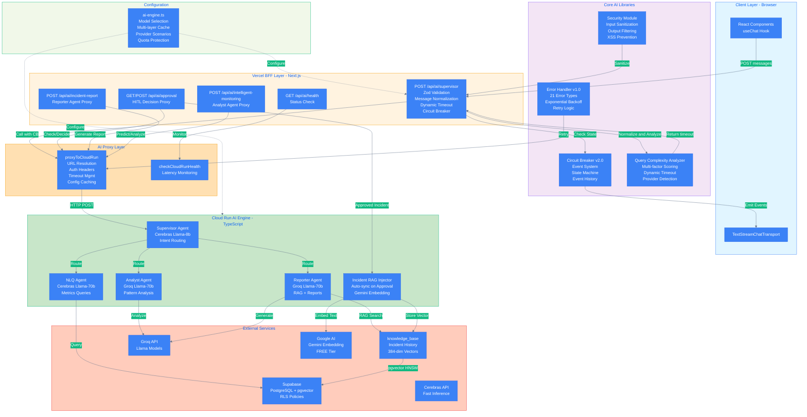

# Architecture Diagrams

OpenManager VIBE v5.83.14 아키텍처 다이어그램입니다.

## 파일 목록

| 다이어그램 | SVG | PNG | 용도 |
|-----------|-----|-----|------|
| Dashboard | `dashboard-architecture.svg` | `dashboard-architecture.png` | 대시보드 컴포넌트 구조 |
| AI Engine | `ai-engine-architecture.svg` | `ai-engine-architecture.png` | AI 엔진 아키텍처 (RAG 포함) |

## 다이어그램 미리보기

### Dashboard Architecture


### AI Engine Architecture


## 소스 파일

| 다이어그램 | Mermaid 소스 |
|-----------|-------------|
| Dashboard | [`../dashboard-architecture.mmd`](../dashboard-architecture.mmd) |
| AI Engine | [`../ai-engine-architecture.mmd`](../ai-engine-architecture.mmd) |

- **테마**: Dark Theme with transparent background

## 다이어그램 재생성

```bash
# mmdc CLI 사용 (mermaid-cli v11.12.0)
# Dashboard
mmdc -i ../dashboard-architecture.mmd -o dashboard-architecture.svg -t dark -b transparent
mmdc -i ../dashboard-architecture.mmd -o dashboard-architecture.png -t dark -b transparent -s 2

# AI Engine
mmdc -i ../ai-engine-architecture.mmd -o ai-engine-architecture.svg -t dark -b transparent
mmdc -i ../ai-engine-architecture.mmd -o ai-engine-architecture.png -t dark -b transparent -s 2
```

## 다이어그램 구성 요소

- **Pages**: Next.js App Router 페이지 컴포넌트
- **Client Components**: React 클라이언트 컴포넌트
- **Custom Hooks**: 데이터 및 상태 관리 훅
- **Zustand Stores**: 전역 상태 저장소
- **API Routes**: Next.js API 엔드포인트
- **Data Sources**: Supabase 및 Mock 데이터

_Last Updated: 2025-12-30 with mermaid-cli v11.12.0_
