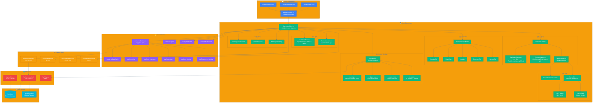

# Dashboard Architecture Diagrams

OpenManager VIBE v5.83.1 대시보드 아키텍처 다이어그램입니다.

## 파일 목록

| 파일 | 형식 | 용도 |
|------|------|------|
| `dashboard-architecture.svg` | SVG | 웹 문서 삽입, 확대/축소 지원 |
| `dashboard-architecture.png` | PNG | 마크다운, README, 이미지 뷰어 |

## 다이어그램 미리보기



## 소스 파일

- **Mermaid 소스**: [`../dashboard-architecture.mmd`](../dashboard-architecture.mmd)
- **테마**: Dark Theme with transparent background

## 다이어그램 재생성

```bash
# mmdc CLI 사용 (mermaid-cli)
mmdc -i ../dashboard-architecture.mmd -o dashboard-architecture.svg -t dark -b transparent
mmdc -i ../dashboard-architecture.mmd -o dashboard-architecture.png -t dark -b transparent -s 2
```

## 다이어그램 구성 요소

- **Pages**: Next.js App Router 페이지 컴포넌트
- **Client Components**: React 클라이언트 컴포넌트
- **Custom Hooks**: 데이터 및 상태 관리 훅
- **Zustand Stores**: 전역 상태 저장소
- **API Routes**: Next.js API 엔드포인트
- **Data Sources**: Supabase 및 Mock 데이터

_Generated: 2025-12-19 with mermaid-cli v11.12.0_
