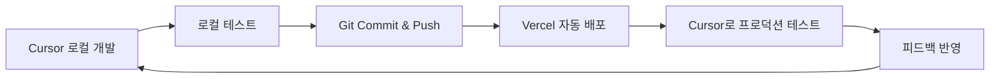

# 🚀 Cursor-Vercel 연동 완전 가이드

> **OpenManager Vibe v5** - Cursor에서 Vercel 프로덕션 환경에 직접 접속하여 API 테스트 및 개발하는 방법

**작성일**: 2025-06-28 04:50 KST  
**버전**: v5.51.1  
**작성자**: AI Assistant

---

## 🎯 목표

Cursor IDE에서 Vercel에 배포된 OpenManager 프로젝트에 **직접 접속하고 테스트 및 개발에 활용**하는 환경을 구축합니다.

---

## ✅ 1. 전제 조건

- [x] Cursor IDE 설치 완료
- [x] GitHub 계정과 Vercel 계정 연동
- [x] OpenManager 프로젝트가 GitHub에 푸시되어 있음
- [x] Vercel과 GitHub 연결되어 있음
- [x] 프로덕션 배포 완료

### 📍 현재 배포 정보

| 항목                | 정보                                                                |
| ------------------- | ------------------------------------------------------------------- |
| **프로덕션 URL**    | `https://openmanager-vibe-v5-p64aybo8u-skyasus-projects.vercel.app` |
| **Vercel 대시보드** | `https://vercel.com/skyasus-projects/openmanager-vibe-v5`           |
| **GitHub 레포**     | `https://github.com/skyasus/openmanager-vibe-v5`                    |
| **배포 브랜치**     | `main`                                                              |

---

## 🔧 2. Cursor에서 Vercel API 직접 테스트 방법

### 방법 ① : 개발 도구 UI 사용 (권장)

1. **로컬 개발 서버 시작**

   ```bash
   npm run dev
   ```

2. **개발 도구 페이지 접속**

   ```
   http://localhost:3000/dev-tools
   ```

3. **Vercel API 테스터 패널 사용**
   - 🚀 **Vercel API 테스터** 섹션이 페이지 최상단에 위치
   - ⚡ **빠른 테스트**: 5개 주요 API 원클릭 테스트
   - 🔧 **커스텀 테스트**: 원하는 엔드포인트 직접 입력
   - 📊 **결과**: 실시간 결과 확인 및 JSON 다운로드

### 방법 ② : TypeScript 코드로 직접 테스트

```typescript
// src/utils/cursor-vercel-api-tester.ts 사용
import { cursorVercelAPI } from '@/utils/cursor-vercel-api-tester';

// 빠른 API 테스트
const result = await cursorVercelAPI.quick('/api/ai/engines');
console.log(result);

// 헬스체크
const health = await cursorVercelAPI.healthCheck();
console.log('헬스체크:', health);

// AI 상태 확인
const aiStatus = await cursorVercelAPI.aiStatus();
console.log('AI 상태:', aiStatus);

// 자연어 질의 테스트
const aiResponse = await cursorVercelAPI.ask('현재 서버 상태는 어떻게 되나요?');
console.log('AI 응답:', aiResponse);
```

---

## 🌐 3. 주요 API 엔드포인트 목록

### 🔍 시스템 모니터링

| 엔드포인트          | 설명                   | 예상 응답시간 |
| ------------------- | ---------------------- | ------------- |
| `/api/health-check` | 전체 시스템 헬스체크   | ~200ms        |
| `/api/system/state` | Redis 기반 시스템 상태 | ~150ms        |
| `/api/metrics`      | 실시간 서버 메트릭     | ~300ms        |

### 🤖 AI 엔진

| 엔드포인트              | 설명                     | 예상 응답시간 |
| ----------------------- | ------------------------ | ------------- |
| `/api/ai/status`        | AI 엔진 상태 확인        | ~100ms        |
| `/api/ai/engines`       | 사용 가능한 AI 엔진 목록 | ~120ms        |
| `/api/ai/unified-query` | 통합 AI 자연어 질의      | ~800ms        |
| `/api/ai/insights`      | AI 인사이트 분석         | ~500ms        |

### 📊 대시보드

| 엔드포인트        | 설명              | 예상 응답시간 |
| ----------------- | ----------------- | ------------- |
| `/api/dashboard`  | 대시보드 데이터   | ~250ms        |
| `/api/prometheus` | Prometheus 메트릭 | ~400ms        |

---

## 🛡️ 4. 인증 및 보안 처리

### 현재 보안 설정

- ✅ **Vercel SSO 인증**: 관리자 페이지 보호됨
- ✅ **개발 모드 우회**: `X-Cursor-Dev-Mode: true` 헤더로 테스트 가능
- ✅ **CORS 설정**: 로컬 개발 환경에서 접근 허용

### 인증이 필요한 경우

```typescript
// 인증 토큰이 필요한 API 호출 시
const tester = new CursorVercelAPITester({
  authToken: 'your-vercel-token-here',
  bypassAuth: false,
});

const result = await tester.testAPI('/api/admin/sensitive-data');
```

---

## 📝 5. 실제 사용 예시

### 🧪 시나리오 1: 전체 시스템 상태 확인

```typescript
// 1. 헬스체크
const health = await cursorVercelAPI.healthCheck();

// 2. AI 엔진 상태
const aiStatus = await cursorVercelAPI.aiStatus();

// 3. 시스템 메트릭
const metrics = await cursorVercelAPI.metrics();

console.log('시스템 전체 상태:', { health, aiStatus, metrics });
```

### 🤖 시나리오 2: AI 기능 테스트

```typescript
// AI에게 자연어로 질문
const questions = [
  '현재 서버 상태는 어떻게 되나요?',
  'CPU 사용률이 가장 높은 서버는?',
  '메모리 부족 경고가 있나요?',
];

for (const question of questions) {
  const response = await cursorVercelAPI.ask(question);
  console.log(`Q: ${question}`);
  console.log(`A: ${response.data?.response || response.error}`);
  console.log('---');
}
```

### 📊 시나리오 3: 성능 벤치마크

```typescript
import { CursorVercelAPITester } from '@/utils/cursor-vercel-api-tester';

const tester = new CursorVercelAPITester();
const results = await tester.testAllAPIs();

// 성능 분석
const avgResponseTime =
  results.reduce((sum, r) => sum + r.responseTime, 0) / results.length;
const successRate =
  (results.filter(r => r.success).length / results.length) * 100;

console.log(`평균 응답시간: ${avgResponseTime.toFixed(0)}ms`);
console.log(`성공률: ${successRate.toFixed(1)}%`);
```

---

## 🔄 6. 개발 워크플로우

### 개발 → 테스트 → 배포 사이클



### 실제 워크플로우 예시

1. **Cursor에서 코드 수정**

   ```bash
   # 기능 개발
   git add .
   git commit -m "feat: 새로운 API 엔드포인트 추가"
   git push origin main
   ```

2. **Vercel 자동 배포 대기** (약 2-3분)

3. **Cursor에서 프로덕션 테스트**

   ```typescript
   // 새로운 엔드포인트 테스트
   const result = await cursorVercelAPI.quick('/api/new-feature');
   console.log('새 기능 테스트:', result);
   ```

4. **문제 발견 시 즉시 수정**

   ```typescript
   // 디버깅 정보 수집
   const debug = await cursorVercelAPI.quick('/api/debug/logs');
   console.log('디버그 정보:', debug);
   ```

---

## 🚨 7. 문제 해결

### 자주 발생하는 문제들

#### 문제 1: CORS 오류

```
❌ Access to fetch at 'https://...' from origin 'http://localhost:3000' has been blocked by CORS policy
```

**해결책**:

```typescript
// 헤더에 개발 모드 추가
headers: {
  'X-Cursor-Dev-Mode': 'true',
  'Origin': 'http://localhost:3000'
}
```

#### 문제 2: 인증 필요 오류

```
❌ 401 Unauthorized - Authentication Required
```

**해결책**:

```typescript
// 공개 API 엔드포인트 사용하거나 인증 토큰 추가
const tester = new CursorVercelAPITester({
  bypassAuth: true, // 개발 환경에서만 사용
});
```

#### 문제 3: 타임아웃 오류

```
❌ Request timeout after 30000ms
```

**해결책**:

```typescript
// 타임아웃 시간 증가
const tester = new CursorVercelAPITester({
  timeout: 60000, // 60초로 증가
});
```

---

## 📈 8. 모니터링 및 분석

### 실시간 성능 모니터링

```typescript
// 주기적 헬스체크
setInterval(async () => {
  const health = await cursorVercelAPI.healthCheck();
  const timestamp = new Date().toLocaleString('ko-KR');

  if (health.success) {
    console.log(`✅ [${timestamp}] 시스템 정상 (${health.responseTime}ms)`);
  } else {
    console.error(`❌ [${timestamp}] 시스템 오류: ${health.error}`);
  }
}, 30000); // 30초마다 체크
```

### 성능 데이터 수집

```typescript
// 성능 데이터 수집 및 분석
const performanceTest = async () => {
  const endpoints = ['/api/health-check', '/api/ai/status', '/api/metrics'];
  const results = [];

  for (let i = 0; i < 10; i++) {
    for (const endpoint of endpoints) {
      const result = await cursorVercelAPI.quick(endpoint);
      results.push({
        endpoint,
        responseTime: result.responseTime,
        success: result.success,
        timestamp: Date.now(),
      });
    }
    await new Promise(resolve => setTimeout(resolve, 1000));
  }

  // 결과 분석
  const analysis = endpoints.map(endpoint => {
    const endpointResults = results.filter(r => r.endpoint === endpoint);
    const avgTime =
      endpointResults.reduce((sum, r) => sum + r.responseTime, 0) /
      endpointResults.length;
    const successRate =
      (endpointResults.filter(r => r.success).length / endpointResults.length) *
      100;

    return { endpoint, avgTime: Math.round(avgTime), successRate };
  });

  console.table(analysis);
};

performanceTest();
```

---

## 🎯 9. 활용 팁

### Tip 1: 개발 도구 북마크

```
http://localhost:3000/dev-tools
```

브라우저에 북마크하여 빠른 접근

### Tip 2: 결과 자동 저장

```typescript
// 테스트 결과를 파일로 자동 저장
const saveTestResults = (results: APITestResult[]) => {
  const fileName = `test-results-${new Date().toISOString().slice(0, 16)}.json`;
  // 개발 도구에서 다운로드 버튼 클릭으로 저장 가능
};
```

### Tip 3: 커스텀 테스트 스크립트

```typescript
// 프로젝트 루트에 custom-test.ts 생성
import { cursorVercelAPI } from './src/utils/cursor-vercel-api-tester';

async function customTest() {
  console.log('🚀 커스텀 테스트 시작');

  // 여기에 원하는 테스트 로직 작성
  const results = await Promise.all([
    cursorVercelAPI.healthCheck(),
    cursorVercelAPI.aiStatus(),
    cursorVercelAPI.metrics(),
  ]);

  console.log('📊 테스트 완료:', results);
}

customTest();
```

---

## 🔮 10. 향후 개선 계획

### Phase 1: 자동화 강화

- [ ] CI/CD 파이프라인에 자동 API 테스트 통합
- [ ] Slack/Discord 알림 연동
- [ ] 성능 회귀 테스트 자동화

### Phase 2: 고급 기능

- [ ] GraphQL 엔드포인트 지원
- [ ] WebSocket 연결 테스트
- [ ] 부하 테스트 기능

### Phase 3: 팀 협업

- [ ] 테스트 결과 공유 시스템
- [ ] API 문서 자동 생성
- [ ] 팀 대시보드 구축

---

## 📞 지원 및 문의

### 문제 발생 시

1. **GitHub Issues**: [새 이슈 생성](https://github.com/skyasus/openmanager-vibe-v5/issues)
2. **개발 로그 확인**: `npm run dev` 콘솔 출력
3. **Vercel 로그 확인**: Vercel 대시보드에서 함수 로그 확인

### 추가 도움말

- **Next.js 문서**: <https://nextjs.org/docs>
- **Vercel 문서**: <https://vercel.com/docs>
- **Cursor 문서**: <https://cursor.sh/docs>

---

**마지막 업데이트**: 2025-06-28 04:50 KST  
**문서 버전**: v1.0  
**호환 프로젝트 버전**: OpenManager Vibe v5.51.1+
