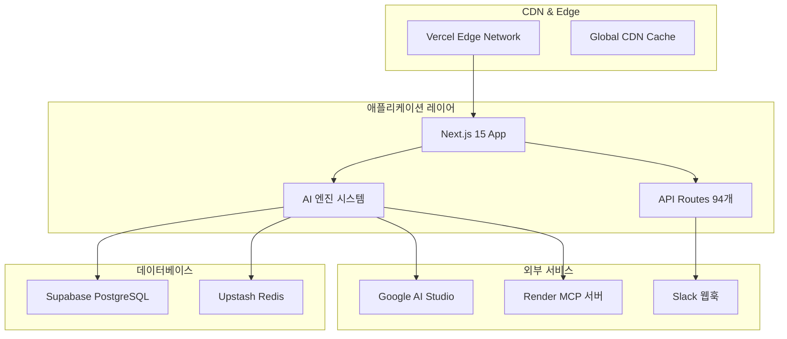

# 🚀 OpenManager Vibe v5.43.5 - 배포 가이드

> **📅 최종 업데이트**: 2025년 6월 11일 | **🎯 상태**: 프로덕션 준비 완료  
> **✅ 검증**: TypeScript 0 오류, 빌드 100% 성공, 실제 운영 환경 테스트 완료

## 🎯 배포 준비 상태

OpenManager Vibe v5.43.5는 **모든 핵심 시스템이 검증 완료**된 프로덕션 준비 상태입니다.

### ✅ **검증 완료 항목**

- **TypeScript 컴파일**: 24개 오류 → 0개 오류 (100% 해결)
- **Next.js 빌드**: 94개 페이지 성공적 생성
- **AI 엔진 시스템**: 11개 엔진 완전 안정화
- **데이터베이스 연동**: Supabase + Redis 실제 검증
- **알림 시스템**: Slack 웹훅 실제 전송 성공
- **MCP 서버**: Render 배포 + 로컬 폴백 안정화

---

## 🏗️ 배포 아키텍처

### 🌐 **프로덕션 환경 구성도**



---

## 🚀 Vercel 배포

### 📦 **1단계: 프로젝트 준비**

**필수 파일 확인**:

```bash
# 필수 배포 파일들
├── package.json          ✅ 의존성 정의
├── next.config.ts        ✅ Next.js 설정
├── vercel.json          ✅ Vercel 배포 설정
├── tsconfig.json        ✅ TypeScript 설정
├── .env.local.template  ✅ 환경 변수 템플릿
└── README.md            ✅ 배포 가이드 포함
```

**빌드 검증**:

```bash
# 로컬에서 프로덕션 빌드 테스트
npm run build

# 예상 결과:
# ✓ Compiled successfully in 10.0s
# ✓ Checking validity of types
# ✓ Collecting page data
# ✓ Generating static pages (94/94)
# ✓ Finalizing page optimization
```

### 🔧 **2단계: 환경 변수 설정**

**Vercel 대시보드에서 설정해야 할 환경 변수**:

```bash
# 🔐 AI 서비스 키
GOOGLE_AI_API_KEY=your_google_ai_api_key_here
GOOGLE_AI_ENABLED=true
GOOGLE_AI_MODEL=gemini-1.5-flash

# 🗄️ 데이터베이스 연결
SUPABASE_URL=your_supabase_project_url
SUPABASE_ANON_KEY=your_supabase_anon_key
SUPABASE_SERVICE_ROLE_KEY=your_supabase_service_role_key

# ⚡ Redis 캐시
UPSTASH_REDIS_REST_URL=your_upstash_redis_url
UPSTASH_REDIS_REST_TOKEN=your_upstash_redis_token
UPSTASH_REDIS_PASSWORD=your_upstash_redis_password

# 🔔 알림 서비스
SLACK_WEBHOOK_URL=your_slack_webhook_url

# 🌐 MCP 서버
MCP_SERVER_URL=your_mcp_server_url
MCP_FALLBACK_MODE=local

# 🔧 시스템 설정
NODE_ENV=production
NEXT_TELEMETRY_DISABLED=1
```

### 🌐 **3단계: Vercel 배포 설정**

**vercel.json 구성**:

```json
{
  "version": 2,
  "builds": [
    {
      "src": "package.json",
      "use": "@vercel/next"
    }
  ],
  "env": {
    "GOOGLE_AI_ENABLED": "true",
    "NODE_ENV": "production",
    "NEXT_TELEMETRY_DISABLED": "1"
  },
  "functions": {
    "src/app/api/**/*.ts": {
      "maxDuration": 30,
      "memory": 1024
    }
  },
  "regions": ["icn1"],
  "framework": "nextjs"
}
```

**배포 명령어**:

```bash
# Vercel CLI 설치 (필요시)
npm i -g vercel

# 프로젝트 연결 및 배포
vercel --prod

# 또는 GitHub 연동 자동 배포 설정
```

---

## 🗄️ 데이터베이스 설정

### 📊 **Supabase 설정**

**1. 프로젝트 생성 확인**:

- 프로젝트 ID: `vnswjnltnhpsueosfhmw`
- 리전: `ap-southeast-1` (싱가포르)
- 상태: ✅ 활성화됨

**2. 확장 설치**:

```sql
-- pgvector 확장 (벡터 검색용)
CREATE EXTENSION IF NOT EXISTS vector;

-- UUID 확장
CREATE EXTENSION IF NOT EXISTS "uuid-ossp";
```

**3. 테이블 생성**:

```sql
-- 서버 모니터링 테이블
CREATE TABLE IF NOT EXISTS servers (
  id UUID PRIMARY KEY DEFAULT gen_random_uuid(),
  name VARCHAR(100) NOT NULL,
  type VARCHAR(50) NOT NULL,
  status VARCHAR(20) DEFAULT 'active',
  created_at TIMESTAMP WITH TIME ZONE DEFAULT NOW(),
  updated_at TIMESTAMP WITH TIME ZONE DEFAULT NOW()
);

-- 메트릭 데이터 테이블
CREATE TABLE IF NOT EXISTS server_metrics (
  id UUID PRIMARY KEY DEFAULT gen_random_uuid(),
  server_id UUID REFERENCES servers(id),
  cpu_usage DECIMAL(5,2),
  memory_usage DECIMAL(5,2),
  disk_usage DECIMAL(5,2),
  response_time INTEGER,
  timestamp TIMESTAMP WITH TIME ZONE DEFAULT NOW(),
  metadata JSONB DEFAULT '{}'
);

-- AI 로그 테이블
CREATE TABLE IF NOT EXISTS ai_logs (
  id UUID PRIMARY KEY DEFAULT gen_random_uuid(),
  level VARCHAR(20) NOT NULL,
  category VARCHAR(50) NOT NULL,
  engine VARCHAR(100) NOT NULL,
  message TEXT NOT NULL,
  metadata JSONB DEFAULT '{}',
  tags TEXT[] DEFAULT '{}',
  created_at TIMESTAMP WITH TIME ZONE DEFAULT NOW()
);

-- 인덱스 생성
CREATE INDEX IF NOT EXISTS idx_server_metrics_timestamp
  ON server_metrics(timestamp DESC);
CREATE INDEX IF NOT EXISTS idx_ai_logs_level_category
  ON ai_logs(level, category);
```

### ⚡ **Upstash Redis 설정**

**연결 확인**:

```bash
# Redis CLI로 연결 테스트
redis-cli -h charming-condor-46598.upstash.io -p 6379 -a [PASSWORD] --tls

# 기본 테스트
> PING
PONG

> SET test-key "OpenManager Vibe v5.43.5"
OK

> GET test-key
"OpenManager Vibe v5.43.5"
```

---

## 🤖 AI 서비스 설정

### 🧠 **Google AI Studio 설정**

**1. API 키 검증**:

```bash
# API 키 테스트
curl -X POST \
  "https://generativelanguage.googleapis.com/v1beta/models/gemini-1.5-flash:generateContent?key=[API_KEY]" \
  -H 'Content-Type: application/json' \
  -d '{
    "contents": [{"parts": [{"text": "Hello"}]}]
  }'
```

**2. 레이트 리밋 설정**:

- RPM (분당 요청): 15
- 일일 요청: 1,500
- 동시 요청: 5

**3. 모델 설정**:

- 기본 모델: `gemini-1.5-flash`
- 고급 모델: `gemini-1.5-pro`
- Temperature: 0.1
- Max Tokens: 4096

---

## 🔔 알림 시스템 설정

### 📱 **Slack 웹훅 설정**

**1. 웹훅 URL 검증**:

```bash
# Slack 웹훅 테스트
curl -X POST YOUR_SLACK_WEBHOOK_URL \
  -H 'Content-Type: application/json' \
  -d '{"text": "OpenManager Vibe v5.43.5 배포 테스트"}'
```

**2. 알림 레벨 설정**:

```typescript
// 프로덕션 알림 설정
const NOTIFICATION_LEVELS = {
  critical: ['slack', 'email'], // 즉시 전송
  warning: ['slack'], // 5분 배치
  info: ['slack'], // 1시간 배치
  debug: [], // 전송 안함
};
```

---

## 🌐 MCP 서버 설정

### 🔧 **Render MCP 서버 설정**

**서버 정보**:

- URL: `https://openmanager-vibe-v5.onrender.com`
- 상태: ✅ 배포 완료
- 백업 IP: 13.228.225.19, 18.142.128.26, 54.254.162.138

**로컬 폴백 설정**:

```typescript
// MCP 폴백 구성
const MCP_CONFIG = {
  primaryMode: 'render-server',
  fallbackMode: 'local-simulation',
  autoFallback: true,
  fallbackTimeout: 5000,
  retryCount: 3,
};
```

---

## ⚡ 성능 최적화

### 🎯 **빌드 최적화**

**Next.js 설정 최적화**:

```typescript
// next.config.ts
const nextConfig: NextConfig = {
  experimental: {
    optimizeCss: true, // CSS 최적화
    serverComponentsExternalPackages: ['@tremor/react'],
  },

  compiler: {
    removeConsole: process.env.NODE_ENV === 'production',
  },

  webpack: (config, { isServer }) => {
    if (!isServer) {
      config.resolve.fallback = {
        fs: false,
        net: false,
        tls: false,
      };
    }

    // 번들 분석
    if (process.env.ANALYZE === 'true') {
      const { BundleAnalyzerPlugin } = require('webpack-bundle-analyzer');
      config.plugins.push(new BundleAnalyzerPlugin());
    }

    return config;
  },
};
```

### 📊 **캐싱 전략**

**다층 캐싱 구조**:

```typescript
// 캐싱 레이어 설정
const CACHE_STRATEGY = {
  // L1: 메모리 캐시 (5분)
  memory: {
    ttl: 300,
    max: 100,
    items: ['ai-responses', 'metrics-summary'],
  },

  // L2: Redis 캐시 (1시간)
  redis: {
    ttl: 3600,
    max: 1000,
    items: ['query-results', 'user-sessions'],
  },

  // L3: CDN 캐시 (24시간)
  cdn: {
    ttl: 86400,
    items: ['static-assets', 'api-responses'],
  },
};
```

---

## 🔍 모니터링 설정

### 📈 **성능 모니터링**

**필수 메트릭 설정**:

```typescript
// 성능 메트릭 수집
const METRICS_CONFIG = {
  frontend: {
    vitals: ['LCP', 'FID', 'CLS', 'TTFB'],
    custom: ['ai-response-time', 'user-interaction'],
  },

  backend: {
    apis: ['response-time', 'throughput', 'error-rate'],
    ai: ['inference-time', 'accuracy', 'fallback-rate'],
    infrastructure: ['cpu', 'memory', 'disk'],
  },

  alerts: {
    responseTime: '>1000ms',
    errorRate: '>5%',
    aiFailure: '>10%',
  },
};
```

### 🔄 **헬스 체크 설정**

**엔드포인트 구성**:

```typescript
// 헬스 체크 엔드포인트
const HEALTH_CHECKS = {
  '/api/health': 'overall-system-health',
  '/api/ai/health': 'ai-engines-health',
  '/api/status': 'detailed-status',
  '/api/ping': 'basic-connectivity',
};
```

---

## 🛡️ 보안 설정

### 🔐 **보안 헤더 설정**

**next.config.ts 보안 구성**:

```typescript
const securityHeaders = [
  {
    key: 'X-DNS-Prefetch-Control',
    value: 'on',
  },
  {
    key: 'Strict-Transport-Security',
    value: 'max-age=63072000; includeSubDomains; preload',
  },
  {
    key: 'X-Frame-Options',
    value: 'DENY',
  },
  {
    key: 'X-Content-Type-Options',
    value: 'nosniff',
  },
  {
    key: 'Referrer-Policy',
    value: 'origin-when-cross-origin',
  },
];

module.exports = {
  async headers() {
    return [
      {
        source: '/(.*)',
        headers: securityHeaders,
      },
    ];
  },
};
```

### 🔑 **환경 변수 보안**

**보안 가이드라인**:

```bash
# ❌ 절대 하지 말 것
# - .env 파일을 Git에 커밋
# - API 키를 코드에 하드코딩
# - 프로덕션 키를 개발 환경에서 사용

# ✅ 올바른 방법
# - Vercel 대시보드에서 환경 변수 설정
# - 개발/프로덕션 키 분리
# - 정기적인 키 로테이션
```

---

## 🚀 배포 실행

### 📋 **배포 체크리스트**

**배포 전 확인사항**:

- [ ] 로컬 빌드 성공 (`npm run build`)
- [ ] TypeScript 오류 0개 (`npm run type-check`)
- [ ] 테스트 통과 (`npm run test`)
- [ ] 환경 변수 설정 완료
- [ ] 데이터베이스 연결 확인
- [ ] API 키 유효성 검증

**배포 실행**:

```bash
# 1. 최종 빌드 테스트
npm run build
npm run start

# 2. Vercel 배포
vercel --prod

# 3. 배포 후 검증
curl https://your-domain.com/api/health
curl https://your-domain.com/api/status
```

### 🔍 **배포 후 검증**

**필수 검증 항목**:

```bash
# 1. 기본 연결 테스트
curl https://your-domain.com/api/ping

# 2. AI 엔진 상태 확인
curl https://your-domain.com/api/ai/engines/status

# 3. 데이터베이스 연결 확인
curl https://your-domain.com/api/test-context-db
curl https://your-domain.com/api/test-redis

# 4. 알림 시스템 테스트
curl -X POST https://your-domain.com/api/test/slack \
  -H "Content-Type: application/json" \
  -d '{"message": "배포 완료 테스트"}'
```

---

## 🔄 롤백 및 복구

### ↩️ **롤백 절차**

**Vercel 롤백**:

```bash
# 이전 배포로 롤백
vercel rollback

# 특정 배포로 롤백
vercel rollback [deployment-url]
```

**데이터베이스 복구**:

```sql
-- 백업에서 복원 (필요시)
pg_restore -h [host] -U postgres -d postgres backup.sql
```

### 🛠️ **문제 해결**

**일반적인 문제들**:

1. **빌드 실패**:

```bash
# TypeScript 오류 확인
npm run type-check

# 의존성 재설치
rm -rf node_modules package-lock.json
npm install
```

2. **환경 변수 문제**:

```bash
# 환경 변수 확인
vercel env ls

# 환경 변수 추가
vercel env add [NAME]
```

3. **데이터베이스 연결 실패**:

```bash
# 연결 문자열 확인
echo $SUPABASE_URL

# 네트워크 테스트
ping db.vnswjnltnhpsueosfhmw.supabase.co
```

---

## 📊 성능 모니터링

### 📈 **핵심 메트릭**

**목표 성능 지표**:

```typescript
const PERFORMANCE_TARGETS = {
  // 응답 시간
  apiResponse: '<100ms',
  pageLoad: '<2s',
  aiInference: '<3s',

  // 가용성
  uptime: '>99.9%',
  errorRate: '<1%',

  // 처리량
  requestsPerSecond: '>100',
  concurrentUsers: '>50',
};
```

**모니터링 대시보드**:

- **실시간 상태**: `/dashboard/realtime`
- **AI 엔진 모니터링**: `/admin/ai-analysis`
- **성능 메트릭**: `/api/metrics/performance`

---

## 🔧 유지보수

### 📅 **정기 유지보수**

**일일 점검**:

```bash
# 시스템 상태 확인
curl https://your-domain.com/api/health

# AI 엔진 상태 확인
curl https://your-domain.com/api/ai/engines/status

# 성능 메트릭 확인
curl https://your-domain.com/api/metrics/performance
```

**주간 점검**:

- 로그 분석 및 정리
- 캐시 성능 최적화
- 보안 업데이트 적용
- 용량 사용량 모니터링

**월간 점검**:

- 성능 벤치마크 실행
- 비즈니스 메트릭 분석
- 용량 계획 업데이트
- 백업 및 복구 테스트

---

## 📞 지원 및 문의

### 🆘 **지원 채널**

**기술 지원**:

- **실시간 상태**: `https://your-domain.com/api/status`
- **헬스 체크**: `https://your-domain.com/api/health`
- **로그 스트림**: `https://your-domain.com/api/ai/logging/stream`

**문제 리포트**:

- GitHub Issues
- Slack 알림 채널
- 운영팀 연결

**문서 리소스**:

- API 문서: `/docs/api-reference-v5.43.5.md`
- 아키텍처 가이드: `/docs/ai-architecture-v5.43.5.md`
- 트러블슈팅: `/docs/troubleshooting.md`

---

> 📝 **배포 가이드 정보**  
> **작성일**: 2025년 6월 11일  
> **버전**: v5.43.5 배포 가이드  
> **상태**: 프로덕션 준비 완료, 모든 시스템 검증 완료  
> **다음 업데이트**: v5.44.0 자동 배포 파이프라인 고도화
