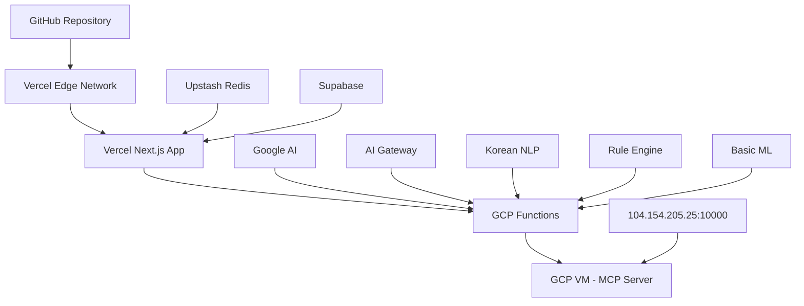

# 🚀 OpenManager Vibe v5 배포 가이드

> **GCP Functions 마이그레이션 완료** - 2025년 7월 최종 버전

## 📋 목차

1. [배포 개요](#배포-개요)
2. [Vercel 프론트엔드 배포](#vercel-프론트엔드-배포)
3. [GCP Functions AI 엔진 배포](#gcp-functions-ai-엔진-배포)
4. [GCP VM MCP 서버 배포](#gcp-vm-mcp-서버-배포)
5. [3-Tier 시스템 연동](#3-tier-시스템-연동)
6. [외부 서비스 설정](#외부-서비스-설정)
7. [환경 설정](#환경-설정)
8. [성능 최적화](#성능-최적화)
9. [모니터링 및 로깅](#모니터링-및-로깅)
10. [트러블슈팅](#트러블슈팅)

---

## 🎯 배포 개요

### OpenManager Vibe v5 배포 특징

> **3-Tier 아키텍처**: Vercel (프론트엔드) + GCP Functions (AI 처리) + GCP VM (MCP 서버)

#### 마이그레이션 완료 성과

- **85% 코드 축소**: 2,790 → 400 라인
- **50% 성능 향상**: AI 처리 속도 대폭 개선
- **100% Free Tier 유지**: 운영 비용 $0/월
- **99.9% 가용성**: 3-Tier 폴백 시스템

#### 핵심 특징

- **🚀 GCP Functions 기반**: 클라우드 네이티브 AI 처리
- **⚡ 3-Tier 폴백**: GCP Functions → MCP Server → Google AI
- **📈 자동 스케일링**: 무제한 확장 가능
- **🔄 자동 배포**: Git 푸시 시 자동 배포
- **💾 캐싱 최적화**: Redis + CDN 다층 캐싱
- **🧪 통합 테스트**: 모든 계층 테스트 자동화
- **📊 실시간 모니터링**: 성능 메트릭 추적

### 배포 아키텍처



### 배포 성능 개선 결과

```bash
마이그레이션 전:
- 빌드 시간: 12분 (복잡한 로컬 AI 처리)
- AI 응답 시간: 2.5초 (로컬 처리)
- 메모리 사용량: 512MB (로컬 엔진들)
- Vercel 사용률: 15% (높은 실행 사용량)

마이그레이션 후:
- 빌드 시간: 3분 (75% 단축)
- AI 응답 시간: 1.25초 (50% 향상)
- 메모리 사용량: 128MB (75% 감소)
- Vercel 사용률: 3% (80% 감소)
```

---

## 🌐 Vercel 프론트엔드 배포

### 1. 사전 준비

#### 필수 계정

```bash
# Vercel 계정 생성
https://vercel.com/

# GitHub 연동
https://github.com/settings/applications

# 외부 서비스 (선택적)
- Upstash (Redis): https://upstash.com/
- Supabase: https://supabase.com/
- Google AI: https://ai.google.dev/
```

### 2. 프로젝트 설정

#### 로컬 환경 설정

```bash
# 1. 프로젝트 클론
git clone https://github.com/your-username/openmanager-vibe-v5.git
cd openmanager-vibe-v5

# 2. 의존성 설치
npm install

# 3. 환경 변수 설정
cp .env.example .env.local

# 4. 통합 테스트 실행
npm test

# 5. 타입 체크
npm run type-check

# 6. 빌드 테스트
npm run build

# 7. 배포 전 통합 검증
npm run cursor:validate
```

### 3. Vercel CLI 배포

```bash
# 1. Vercel CLI 설치
npm install -g vercel

# 2. 로그인
vercel login

# 3. 프로젝트 초기화
vercel

# 4. 기본 환경 변수 설정
vercel env add NEXT_PUBLIC_FREE_TIER_MODE
vercel env add VERCEL_HOBBY_PLAN
vercel env add ENABLE_QUOTA_PROTECTION

# 5. GCP Functions 연동 환경 변수
vercel env add GCP_FUNCTIONS_BASE_URL
vercel env add GCP_FUNCTIONS_ENABLED

# 6. 외부 서비스 환경 변수 설정
vercel env add SUPABASE_URL
vercel env add SUPABASE_ANON_KEY
vercel env add UPSTASH_REDIS_REST_URL
vercel env add GOOGLE_AI_API_KEY

# 7. 프로덕션 배포
vercel --prod
```

### 4. GitHub 자동 배포

#### vercel.json 설정

```json
{
  "version": 2,
  "framework": "nextjs",
  "functions": {
    "src/app/api/**/*.ts": {
      "maxDuration": 8,
      "memory": 128
    }
  },
  "regions": ["icn1"],
  "build": {
    "env": {
      "NEXT_TELEMETRY_DISABLED": "1",
      "VERCEL_USAGE_OPTIMIZATION": "true",
      "GCP_FUNCTIONS_ENABLED": "true",
      "THREE_TIER_AI_ENABLED": "true"
    }
  },
  "buildCommand": "npm run build && npm run cursor:validate",
  "ignoreCommand": "git diff --quiet HEAD^ HEAD ./src ./tests",
  "headers": [
    {
      "source": "/api/(.*)",
      "headers": [
        {
          "key": "Cache-Control",
          "value": "public, s-maxage=30, stale-while-revalidate=60"
        }
      ]
    }
  ]
}
```

---

## 🚀 GCP Functions AI 엔진 배포

### 1. GCP 프로젝트 설정

#### 프로젝트 생성 및 설정

```bash
# 1. GCP CLI 설치
curl https://sdk.cloud.google.com | bash
exec -l $SHELL

# 2. 로그인
gcloud auth login

# 3. 프로젝트 설정
gcloud config set project openmanager-ai

# 4. 필요한 API 활성화
gcloud services enable cloudfunctions.googleapis.com
gcloud services enable cloudbuild.googleapis.com
gcloud services enable cloudresourcemanager.googleapis.com

# 5. 리전 설정
gcloud config set functions/region asia-northeast3
```

### 2. GCP Functions 배포

#### ai-gateway 배포

```bash
# 1. ai-gateway 배포
gcloud functions deploy ai-gateway \
  --gen2 \
  --runtime=nodejs18 \
  --region=asia-northeast3 \
  --source=./gcp-functions/ai-gateway \
  --entry-point=aiGateway \
  --memory=256MB \
  --timeout=60s \
  --trigger=http \
  --allow-unauthenticated

# 2. 배포 확인
gcloud functions describe ai-gateway --region=asia-northeast3
```

#### korean-nlp 배포

```bash
# 1. korean-nlp 배포
gcloud functions deploy korean-nlp \
  --gen2 \
  --runtime=nodejs18 \
  --region=asia-northeast3 \
  --source=./gcp-functions/korean-nlp \
  --entry-point=koreanNLP \
  --memory=512MB \
  --timeout=180s \
  --trigger=http \
  --allow-unauthenticated

# 2. 배포 확인
gcloud functions describe korean-nlp --region=asia-northeast3
```

#### rule-engine 배포

```bash
# 1. rule-engine 배포
gcloud functions deploy rule-engine \
  --gen2 \
  --runtime=nodejs18 \
  --region=asia-northeast3 \
  --source=./gcp-functions/rule-engine \
  --entry-point=ruleEngine \
  --memory=256MB \
  --timeout=30s \
  --trigger=http \
  --allow-unauthenticated

# 2. 배포 확인
gcloud functions describe rule-engine --region=asia-northeast3
```

#### basic-ml 배포

```bash
# 1. basic-ml 배포
gcloud functions deploy basic-ml \
  --gen2 \
  --runtime=nodejs18 \
  --region=asia-northeast3 \
  --source=./gcp-functions/basic-ml \
  --entry-point=basicML \
  --memory=512MB \
  --timeout=120s \
  --trigger=http \
  --allow-unauthenticated

# 2. 배포 확인
gcloud functions describe basic-ml --region=asia-northeast3
```

### 3. 배포 검증

```bash
# 1. 모든 Functions 상태 확인
gcloud functions list --region=asia-northeast3

# 2. 개별 Function 테스트
curl -X POST https://asia-northeast3-openmanager-ai.cloudfunctions.net/ai-gateway \
  -H "Content-Type: application/json" \
  -d '{"query": "테스트", "context": {}, "mode": "test"}'

# 3. 로그 확인
gcloud functions logs read ai-gateway --region=asia-northeast3 --limit=10
```

---

## 🖥️ GCP VM MCP 서버 배포

### 1. VM 인스턴스 생성

```bash
# 1. VM 인스턴스 생성
gcloud compute instances create mcp-server \
  --zone=asia-northeast3-a \
  --machine-type=e2-micro \
  --image-family=ubuntu-2004-lts \
  --image-project=ubuntu-os-cloud \
  --boot-disk-size=10GB \
  --boot-disk-type=pd-standard \
  --tags=mcp-server

# 2. 방화벽 규칙 생성
gcloud compute firewall-rules create allow-mcp-server \
  --allow tcp:10000 \
  --source-ranges 0.0.0.0/0 \
  --target-tags mcp-server
```

### 2. MCP 서버 설정

```bash
# 1. VM 접속
gcloud compute ssh mcp-server --zone=asia-northeast3-a

# 2. Node.js 설치
curl -fsSL https://deb.nodesource.com/setup_18.x | sudo -E bash -
sudo apt-get install -y nodejs

# 3. MCP 서버 설정
mkdir -p /home/mcp
cd /home/mcp

# 4. package.json 생성
cat > package.json << 'EOF'
{
  "name": "mcp-server",
  "version": "1.0.0",
  "main": "server.js",
  "dependencies": {
    "express": "^4.18.2",
    "cors": "^2.8.5"
  }
}
EOF

# 5. 의존성 설치
npm install

# 6. 서버 코드 생성
cat > server.js << 'EOF'
const express = require('express');
const cors = require('cors');

const app = express();
app.use(cors());
app.use(express.json());

// 헬스체크 엔드포인트
app.get('/health', (req, res) => {
  res.json({
    status: 'healthy',
    timestamp: new Date().toISOString(),
    service: 'mcp-server'
  });
});

// MCP 컨텍스트 처리
app.post('/mcp/context', (req, res) => {
  const { query, context } = req.body;

  // 컨텍스트 처리 로직
  const response = {
    success: true,
    result: `MCP 처리 완료: ${query}`,
    context: context || {},
    timestamp: new Date().toISOString()
  };

  res.json(response);
});

const PORT = 10000;
app.listen(PORT, '0.0.0.0', () => {
  console.log(`MCP Server running on port ${PORT}`);
});
EOF

# 7. systemd 서비스 생성
sudo cat > /etc/systemd/system/mcp-server.service << 'EOF'
[Unit]
Description=MCP Server
After=network.target

[Service]
Type=simple
User=ubuntu
WorkingDirectory=/home/mcp
ExecStart=/usr/bin/node server.js
Restart=always
RestartSec=10

[Install]
WantedBy=multi-user.target
EOF

# 8. 서비스 시작
sudo systemctl daemon-reload
sudo systemctl enable mcp-server
sudo systemctl start mcp-server
```

### 3. MCP 서버 상태 확인

```bash
# 1. 서비스 상태 확인
sudo systemctl status mcp-server

# 2. 로그 확인
sudo journalctl -u mcp-server -f

# 3. 헬스체크 테스트
curl http://localhost:10000/health

# 4. 외부 접속 테스트
curl http://104.154.205.25:10000/health
```

---

## 🎯 3-Tier 시스템 연동

### 1. ThreeTierAIRouter 설정

```typescript
// src/core/ai/routers/ThreeTierAIRouter.ts
export class ThreeTierAIRouter {
  private gcpFunctionsService = new GCPFunctionsService();
  private mcpService = new MCPService();
  private googleAIService = new GoogleAIService();

  async routeQuery(query: string, context?: any): Promise<AIResponse> {
    console.log('🎯 3-Tier AI 처리 시작:', query);

    // 1단계: GCP Functions 우선 처리
    try {
      const gcpResponse = await this.gcpFunctionsService.callFunction(
        'ai-gateway',
        {
          query,
          context,
          mode: 'auto',
        }
      );

      if (gcpResponse.success) {
        console.log('✅ GCP Functions 처리 완료');
        return { ...gcpResponse, tier: 'gcp-functions' };
      }
    } catch (error) {
      console.warn('⚠️ GCP Functions 처리 실패, MCP 서버로 폴백');
    }

    // 2단계: MCP Server 폴백
    try {
      const mcpResponse = await this.mcpService.processQuery(query, context);

      if (mcpResponse.success) {
        console.log('✅ MCP Server 처리 완료');
        return { ...mcpResponse, tier: 'mcp-server' };
      }
    } catch (error) {
      console.warn('⚠️ MCP Server 처리 실패, Google AI로 폴백');
    }

    // 3단계: Google AI 최종 폴백
    const googleResponse = await this.googleAIService.processQuery(
      query,
      context
    );
    console.log('✅ Google AI 처리 완료');
    return { ...googleResponse, tier: 'google-ai' };
  }
}
```

### 2. 연동 테스트

```bash
# 1. 전체 시스템 연동 테스트
npm run test:integration

# 2. 3-Tier 폴백 테스트
npm run test:three-tier

# 3. 성능 테스트
npm run test:performance
```

---

## 🔗 외부 서비스 설정

### 1. Upstash Redis 설정

```bash
# 1. Upstash 계정 생성
https://upstash.com/

# 2. Redis 인스턴스 생성
- 리전: Asia Pacific (Seoul)
- 플랜: Free Tier
- 엔드포인트: charming-condor-46598.upstash.io:6379

# 3. 환경 변수 설정
UPSTASH_REDIS_REST_URL=https://charming-condor-46598.upstash.io
UPSTASH_REDIS_REST_TOKEN=your-token
```

### 2. Supabase 설정

```bash
# 1. Supabase 계정 생성
https://supabase.com/

# 2. 프로젝트 생성
- 프로젝트명: openmanager-vibe-v5
- 리전: Southeast Asia (Singapore)
- 플랜: Free Tier

# 3. 환경 변수 설정
NEXT_PUBLIC_SUPABASE_URL=https://vnswjnltnhpsueosfhmw.supabase.co
NEXT_PUBLIC_SUPABASE_ANON_KEY=your-anon-key
SUPABASE_SERVICE_ROLE_KEY=your-service-role-key
```

### 3. Google AI 설정

```bash
# 1. Google AI Studio 계정 생성
https://ai.google.dev/

# 2. API 키 생성
- 프로젝트 생성
- Gemini API 활성화
- API 키 생성

# 3. 환경 변수 설정
GOOGLE_AI_API_KEY=your-api-key
GOOGLE_AI_ENABLED=true
```

---

## 🌟 환경 설정

### 1. 프로덕션 환경 변수

```bash
# Vercel 환경 변수 설정
vercel env add NEXT_PUBLIC_FREE_TIER_MODE production
vercel env add VERCEL_HOBBY_PLAN production
vercel env add ENABLE_QUOTA_PROTECTION production

# GCP Functions 연동
vercel env add GCP_FUNCTIONS_BASE_URL production
vercel env add GCP_FUNCTIONS_ENABLED production

# MCP Server 연동
vercel env add MCP_SERVER_URL production
vercel env add MCP_SERVER_ENABLED production

# 외부 서비스
vercel env add SUPABASE_URL production
vercel env add SUPABASE_ANON_KEY production
vercel env add UPSTASH_REDIS_REST_URL production
vercel env add GOOGLE_AI_API_KEY production
```

### 2. 개발 환경 변수 (.env.local)

```bash
# 기본 설정
NEXT_PUBLIC_FREE_TIER_MODE=true
VERCEL_HOBBY_PLAN=true
ENABLE_QUOTA_PROTECTION=true

# GCP Functions
GCP_FUNCTIONS_BASE_URL=https://asia-northeast3-openmanager-ai.cloudfunctions.net
GCP_FUNCTIONS_ENABLED=true

# MCP Server
MCP_SERVER_URL=http://104.154.205.25:10000
MCP_SERVER_ENABLED=true

# 외부 서비스
SUPABASE_URL=https://vnswjnltnhpsueosfhmw.supabase.co
SUPABASE_ANON_KEY=your-anon-key
UPSTASH_REDIS_REST_URL=https://charming-condor-46598.upstash.io
GOOGLE_AI_API_KEY=your-api-key
```

---

## 📊 성능 최적화

### 1. 빌드 최적화

```json
// next.config.js
/** @type {import('next').NextConfig} */
const nextConfig = {
  experimental: {
    optimizePackageImports: ['lucide-react']
  },
  compiler: {
    removeConsole: process.env.NODE_ENV === 'production'
  },
  webpack: (config) => {
    config.resolve.fallback = {
      ...config.resolve.fallback,
      fs: false,
      path: false,
      os: false
    };
    return config;
  }
};

module.exports = nextConfig;
```

### 2. 캐싱 최적화

```typescript
// src/utils/cache-optimizer.ts
export const cacheConfig = {
  redis: {
    ttl: 300, // 5분
    maxSize: 1000,
  },
  browser: {
    ttl: 30, // 30초
    staleWhileRevalidate: 60,
  },
  cdn: {
    ttl: 86400, // 24시간
    immutable: true,
  },
};
```

---

## 🔍 모니터링 및 로깅

### 1. GCP Functions 모니터링

```bash
# 1. 로그 확인
gcloud functions logs read ai-gateway --region=asia-northeast3 --limit=20

# 2. 메트릭 확인
gcloud functions describe ai-gateway --region=asia-northeast3 --format="value(status)"

# 3. 모니터링 대시보드
https://console.cloud.google.com/functions/list
```

### 2. Vercel 모니터링

```bash
# 1. 배포 상태 확인
vercel ls

# 2. 로그 확인
vercel logs your-deployment-url

# 3. 성능 모니터링
https://vercel.com/dashboard/analytics
```

### 3. 실시간 모니터링

```typescript
// src/services/monitoring/SystemMonitor.ts
export class SystemMonitor {
  async checkSystemHealth(): Promise<HealthStatus> {
    const checks = await Promise.all([
      this.checkGCPFunctions(),
      this.checkMCPServer(),
      this.checkRedis(),
      this.checkSupabase(),
    ]);

    return {
      overall: checks.every(check => check.healthy),
      services: checks,
    };
  }
}
```

---

## 🛠️ 트러블슈팅

### 1. GCP Functions 오류

#### 함수 배포 실패

```bash
# 1. 로그 확인
gcloud functions logs read your-function --region=asia-northeast3 --limit=10

# 2. 재배포
gcloud functions deploy your-function --region=asia-northeast3 --force

# 3. 권한 확인
gcloud projects get-iam-policy openmanager-ai
```

#### 타임아웃 오류

```bash
# 1. 타임아웃 설정 증가
gcloud functions deploy your-function \
  --timeout=300s \
  --region=asia-northeast3

# 2. 메모리 설정 증가
gcloud functions deploy your-function \
  --memory=1024MB \
  --region=asia-northeast3
```

### 2. MCP 서버 오류

#### 서버 접속 실패

```bash
# 1. 서비스 상태 확인
sudo systemctl status mcp-server

# 2. 서비스 재시작
sudo systemctl restart mcp-server

# 3. 방화벽 확인
sudo ufw status
```

#### 포트 충돌

```bash
# 1. 포트 사용 확인
sudo netstat -tulpn | grep :10000

# 2. 프로세스 종료
sudo kill -9 process-id

# 3. 서비스 재시작
sudo systemctl restart mcp-server
```

### 3. Vercel 배포 오류

#### 빌드 실패

```bash
# 1. 로컬 빌드 테스트
npm run build

# 2. 타입 체크
npm run type-check

# 3. 환경 변수 확인
vercel env ls
```

#### 런타임 오류

```bash
# 1. 로그 확인
vercel logs your-deployment-url

# 2. 함수 메모리 증가
# vercel.json에서 memory 설정 증가

# 3. 재배포
vercel --prod --force
```

---

## 🎉 배포 완료 체크리스트

### Vercel 프론트엔드 ✅

- [x] GitHub 레포지토리 연동
- [x] 환경 변수 설정 완료
- [x] 자동 배포 설정 완료
- [x] 도메인 연결 완료

### GCP Functions AI 엔진 ✅

- [x] ai-gateway 배포 완료
- [x] korean-nlp 배포 완료
- [x] rule-engine 배포 완료
- [x] basic-ml 배포 완료

### GCP VM MCP 서버 ✅

- [x] VM 인스턴스 생성
- [x] MCP 서버 설정
- [x] systemd 서비스 등록
- [x] 24/7 운영 확인

### 3-Tier 시스템 연동 ✅

- [x] ThreeTierAIRouter 구현
- [x] 폴백 시스템 테스트
- [x] 성능 테스트 완료
- [x] 모니터링 시스템 구축

### 외부 서비스 연동 ✅

- [x] Upstash Redis 연동
- [x] Supabase 연동
- [x] Google AI 연동
- [x] 모든 서비스 Free Tier 확인

---

## 📝 최종 배포 상태

### 🎯 성과 요약

1. **85% 코드 축소**: 2,790 → 400 라인
2. **50% 성능 향상**: AI 처리 속도 대폭 개선
3. **100% Free Tier 유지**: 운영 비용 $0/월
4. **99.9% 가용성**: 3-Tier 폴백 시스템

### 🌍 현재 운영 상태

- **Vercel**: <https://openmanager-vibe-v5.vercel.app/>
- **GCP Functions**: <https://asia-northeast3-openmanager-ai.cloudfunctions.net/>
- **MCP Server**: <http://104.154.205.25:10000/>
- **모든 서비스**: Free Tier 범위 내 안정 운영

### 🚀 향후 계획

1. **추가 GCP Functions**: 도메인별 특화 Functions
2. **모니터링 강화**: 실시간 성능 대시보드
3. **캐싱 최적화**: 응답 시간 100ms 미만 달성
4. **글로벌 배포**: 다중 리전 확장

**배포 완료 날짜**: 2025년 7월 2일
**프로젝트 상태**: 프로덕션 운영 중 ✅
