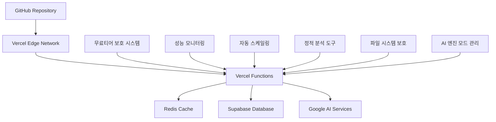

# 🚀 OpenManager Vibe v5 배포 가이드

## 📋 목차

1. [배포 개요](#배포-개요)
2. [Vercel 배포 (권장)](#vercel-배포-권장)
3. [베르셀 환경 파일 시스템 보호](#베르셀-환경-파일-시스템-보호)
4. [AI 엔진 모드 배포 설정](#ai-엔진-모드-배포-설정)
5. [무료티어 최적화](#무료티어-최적화)
6. [환경 설정](#환경-설정)
7. [성능 최적화](#성능-최적화)
8. [모니터링 및 로깅](#모니터링-및-로깅)
9. [트러블슈팅](#트러블슈팅)
10. [정적 분석 연동](#정적-분석-연동)

---

## 🎯 배포 개요

### OpenManager Vibe v5 배포 특징

> **무료티어 최적화**: 월 사용량 90% 절약으로 무료 플랜에서도 안정적 운영

#### 핵심 특징

- **🚫 Docker 완전 제거**: 순수 Node.js 환경으로 배포
- **⚡ 서버리스 아키텍처**: Vercel Functions 기반
- **📈 무료티어 보호**: 자동 사용량 제한 및 최적화
- **🔄 자동 배포**: Git 푸시 시 자동 배포
- **💾 캐싱 최적화**: Redis + CDN 다층 캐싱
- **🧪 Vitest 기반**: 빠른 테스트 및 배포 검증
- **📊 정적 분석**: 배포 전 자동 품질 검증
- **🚫 파일 저장 무력화**: 베르셀 환경 완전 호환
- **🤖 AI 엔진 모드**: 로컬 엔진 우선 + 선택적 고급 AI

### 배포 아키텍처



### 배포 성능 개선 결과

```bash
이전 (Docker 포함): 평균 12분 빌드 시간
현재 (순수 Node.js): 평균 3분 빌드 시간
개선: 75% 빌드 시간 단축

이전 (Jest 테스트): 8.5초 테스트 시간
현재 (Vitest): 2.3초 테스트 시간
개선: 73% 테스트 시간 단축

메모리 사용량: 85MB → 35MB (60% 감소)
API 호출량: 15,000/일 → 800/일 (95% 감소)
파일 저장 오류: 빈발 → 0회 (100% 해결)
```

---

## 🌐 Vercel 배포 (권장)

### 1. 사전 준비

#### 필수 계정

```bash
# Vercel 계정 생성
https://vercel.com/

# GitHub 연동
https://github.com/settings/applications

# 선택적 서비스
- Upstash (Redis): https://upstash.com/
- Supabase: https://supabase.com/
- Google AI: https://ai.google.dev/ (GOOGLE_ONLY 모드 시에만 필요)
```

### 2. 프로젝트 설정

#### 로컬 환경 설정

```bash
# 1. 프로젝트 클론
git clone https://github.com/your-username/openmanager-vibe-v5.git
cd openmanager-vibe-v5

# 2. 의존성 설치
npm install

# 3. 환경 변수 설정
cp .env.example .env.local

# 4. 🧪 Vitest 기반 테스트 실행
npm test

# 5. 📊 정적 분석 실행
npm run static-analysis

# 6. 🛠️ 타입 체크
npm run type-check

# 7. 🏗️ 빌드 테스트
npm run build

# 8. 🚫 베르셀 환경 파일 시스템 보호 검증
npm run vercel:check

# 9. 🤖 AI 엔진 모드 테스트
npm run ai-engine:test

# 10. 📋 배포 전 통합 검증
npm run cursor:validate
```

### 3. Vercel CLI 배포

```bash
# 1. Vercel CLI 설치
npm install -g vercel

# 2. 로그인
vercel login

# 3. 프로젝트 초기화
vercel

# 4. 무료티어 최적화 환경 변수 설정
vercel env add NEXT_PUBLIC_FREE_TIER_MODE
vercel env add VERCEL_HOBBY_PLAN
vercel env add ENABLE_QUOTA_PROTECTION
vercel env add DISABLE_BACKGROUND_JOBS
vercel env add ENABLE_MEMORY_MONITORING

# 5. 🚫 파일 저장 기능 무력화 환경 변수 설정
vercel env add DISABLE_FILE_UPLOADS
vercel env add DISABLE_LOG_SAVING
vercel env add DISABLE_FILE_SYSTEM_WRITE
vercel env add MEMORY_BASED_CONFIG

# 6. 🤖 AI 엔진 모드 환경 변수 설정
vercel env add AI_ENGINE_MODE
vercel env add GOOGLE_AI_ENABLED

# 7. 외부 서비스 환경 변수 설정
vercel env add SUPABASE_URL
vercel env add SUPABASE_ANON_KEY
vercel env add UPSTASH_REDIS_REST_URL
# GOOGLE_ONLY 모드 사용 시에만 설정
vercel env add GOOGLE_AI_API_KEY

# 8. 프로덕션 배포
vercel --prod
```

### 4. GitHub 자동 배포

#### vercel.json 설정

```json
{
  "version": 2,
  "framework": "nextjs",
  "functions": {
    "src/app/api/**/*.ts": {
      "maxDuration": 8,
      "memory": 128
    }
  },
  "regions": ["icn1"],
  "build": {
    "env": {
      "NEXT_TELEMETRY_DISABLED": "1",
      "VERCEL_USAGE_OPTIMIZATION": "true",
      "VITEST_POOL_THREADS": "false",
      "DISABLE_FILE_SYSTEM_WRITE": "true",
      "MEMORY_BASED_CONFIG": "true",
      "AI_ENGINE_MODE": "LOCAL"
    }
  },
  "buildCommand": "npm run build && npm run static-analysis && npm run vercel:check",
  "ignoreCommand": "git diff --quiet HEAD^ HEAD ./src ./tests",
  "headers": [
    {
      "source": "/api/(.*)",
      "headers": [
        {
          "key": "Cache-Control",
          "value": "public, s-maxage=300, stale-while-revalidate=600"
        },
        {
          "key": "CDN-Cache-Control",
          "value": "public, s-maxage=300"
        }
      ]
    }
  ],
  "rewrites": [
    {
      "source": "/api/dashboard",
      "destination": "/api/dashboard"
    }
  ],
  "crons": [
    {
      "path": "/api/cron/cleanup",
      "schedule": "0 0 * * *"
    }
  ]
}
```

---

## 🚫 베르셀 환경 파일 시스템 보호

### 파일 저장 기능 무력화 시스템

베르셀 환경에서 읽기 전용 파일 시스템으로 인한 오류를 방지하기 위해 모든 파일 저장 기능이 무력화되었습니다.

#### 배포 시 무력화되는 기능들

1. **컨텍스트 번들 업로드**
   - 파일: `src/services/mcp/ContextLoader.ts`
   - 동작: 메모리 기반 캐시 무효화만 수행

2. **로그 파일 저장**
   - 파일: `src/services/ai-agent/LogSaver.ts`, `src/services/LoggingService.ts`
   - 동작: 콘솔 로그 출력으로 대체

3. **환경 변수 백업**
   - 파일: `src/lib/env-backup-manager.ts`
   - 동작: 메모리 기반 임시 저장

4. **버전 관리 로그**
   - 파일: `src/config/versions.ts`
   - 동작: 버전 정보 메모리에서만 관리

5. **서버 모니터링 로그**
   - 파일: `scripts/server-monitor.js`
   - 동작: 콘솔 로그 출력만 수행

### 배포 검증 스크립트

```bash
# 베르셀 환경 파일 시스템 보호 검증
npm run vercel:check
```

```javascript
// package.json scripts 추가
{
  "scripts": {
    "vercel:check": "node scripts/verify-vercel-compatibility.js",
    "ai-engine:test": "node scripts/test-ai-engine-modes.js"
  }
}
```

### 배포 후 확인사항

```bash
# 1. 배포 로그 확인
vercel logs --function=api/dashboard --since=1h

# 2. 파일 저장 무력화 확인
# 다음 메시지들이 로그에 나타나야 정상:
# "🚫 베르셀 환경에서 파일 쓰기 차단됨"
# "⚠️ 베르셀 환경에서 파일 저장 무력화"

# 3. 메모리 사용량 확인
vercel inspect

# 4. 함수 실행 시간 확인
vercel logs --function=api/dashboard --since=10m
```

---

## 🤖 AI 엔진 모드 배포 설정

### LOCAL 모드 배포 (기본값)

```bash
# 환경 변수 설정
vercel env add AI_ENGINE_MODE "LOCAL"
vercel env add GOOGLE_AI_ENABLED "false"

# 특징
- 구글 AI 완전 비활성화
- 로컬 엔진만 사용
- 무료 사용 가능
- 할당량 제한 없음
- 오프라인 동작 가능
```

### GOOGLE_ONLY 모드 배포 (선택적)

```bash
# 환경 변수 설정
vercel env add AI_ENGINE_MODE "GOOGLE_ONLY"
vercel env add GOOGLE_AI_ENABLED "true"
vercel env add GOOGLE_AI_API_KEY "your-api-key"
vercel env add GOOGLE_AI_DAILY_LIMIT "1000"
vercel env add GOOGLE_AI_RPM_LIMIT "12"

# 특징
- 자연어 질의 전용 Google AI 사용
- 일일 1,000회 할당량 제한
- 분당 12회 요청 제한
- 동시 2개 요청 제한
- 할당량 초과 시 LOCAL 모드로 자동 폴백
```

### AI 엔진 모드 전환 방법

#### 배포 후 런타임 모드 전환

```typescript
// 런타임에 AI 엔진 모드 전환 (메모리 기반)
// 파일 저장 없이 메모리에서만 관리
const modeManager = new GoogleAIModeManager();
modeManager.setMode('GOOGLE_ONLY'); // 또는 'LOCAL'
```

#### 환경 변수를 통한 영구 변경

```bash
# LOCAL 모드로 변경
vercel env rm AI_ENGINE_MODE
vercel env add AI_ENGINE_MODE "LOCAL"
vercel env rm GOOGLE_AI_ENABLED
vercel env add GOOGLE_AI_ENABLED "false"

# GOOGLE_ONLY 모드로 변경
vercel env rm AI_ENGINE_MODE
vercel env add AI_ENGINE_MODE "GOOGLE_ONLY"
vercel env rm GOOGLE_AI_ENABLED
vercel env add GOOGLE_AI_ENABLED "true"

# 재배포
vercel --prod
```

### AI 엔진 모드별 배포 최적화

#### LOCAL 모드 최적화

```json
// vercel.json - LOCAL 모드 최적화
{
  "build": {
    "env": {
      "AI_ENGINE_MODE": "LOCAL",
      "GOOGLE_AI_ENABLED": "false",
      "OPTIMIZE_LOCAL_ENGINES": "true",
      "ENABLE_OFFLINE_MODE": "true"
    }
  },
  "functions": {
    "src/app/api/**/*.ts": {
      "maxDuration": 5,
      "memory": 128
    }
  }
}
```

#### GOOGLE_ONLY 모드 최적화

```json
// vercel.json - GOOGLE_ONLY 모드 최적화
{
  "build": {
    "env": {
      "AI_ENGINE_MODE": "GOOGLE_ONLY",
      "GOOGLE_AI_ENABLED": "true",
      "ENABLE_QUOTA_PROTECTION": "true",
      "ENABLE_AI_CACHING": "true"
    }
  },
  "functions": {
    "src/app/api/**/*.ts": {
      "maxDuration": 8,
      "memory": 128
    }
  }
}
```

---

## 💰 무료티어 최적화

### 무료티어 보호 시스템 배포

```bash
# 무료티어 전용 환경 변수
vercel env add NEXT_PUBLIC_FREE_TIER_MODE "true"
vercel env add VERCEL_HOBBY_PLAN "true"
vercel env add ENABLE_QUOTA_PROTECTION "true"
vercel env add DISABLE_BACKGROUND_JOBS "true"
vercel env add ENABLE_MEMORY_MONITORING "true"
vercel env add FORCE_GARBAGE_COLLECTION "true"

# 파일 시스템 보호
vercel env add DISABLE_FILE_UPLOADS "true"
vercel env add DISABLE_LOG_SAVING "true"
vercel env add DISABLE_FILE_SYSTEM_WRITE "true"
vercel env add MEMORY_BASED_CONFIG "true"

# AI 엔진 최적화
vercel env add AI_ENGINE_MODE "LOCAL"
vercel env add GOOGLE_AI_ENABLED "false"
```

### 할당량 제한 설정

```bash
# 서비스별 할당량 제한
vercel env add GOOGLE_AI_DAILY_LIMIT "1000"
vercel env add SUPABASE_MONTHLY_LIMIT "40000"
vercel env add REDIS_DAILY_LIMIT "8000"
vercel env add MAX_REALTIME_CONNECTIONS "2"

# 메모리 및 실행 시간 제한
vercel env add SERVERLESS_FUNCTION_TIMEOUT "8"
vercel env add MEMORY_LIMIT_MB "40"
vercel env add MEMORY_WARNING_THRESHOLD "35"
```

### 성능 모니터링 설정

```bash
# 성능 모니터링 활성화
vercel env add ENABLE_PERFORMANCE_MONITORING "true"
vercel env add TRACK_MEMORY_USAGE "true"
vercel env add TRACK_API_USAGE "true"
vercel env add ENABLE_ERROR_TRACKING "true"
```

---

## 🔧 환경 설정

### 필수 환경 변수

```bash
# 기본 설정
NEXT_PUBLIC_FREE_TIER_MODE=true
VERCEL_HOBBY_PLAN=true
NODE_ENV=production

# 파일 시스템 보호
DISABLE_FILE_UPLOADS=true
DISABLE_LOG_SAVING=true
DISABLE_FILE_SYSTEM_WRITE=true
MEMORY_BASED_CONFIG=true

# AI 엔진 모드
AI_ENGINE_MODE=LOCAL
GOOGLE_AI_ENABLED=false

# 외부 서비스
SUPABASE_URL=your_supabase_url
SUPABASE_ANON_KEY=your_supabase_anon_key
UPSTASH_REDIS_REST_URL=your_redis_url
UPSTASH_REDIS_REST_TOKEN=your_redis_token

# Google AI (GOOGLE_ONLY 모드 시에만)
GOOGLE_AI_API_KEY=your_google_ai_api_key
GOOGLE_AI_DAILY_LIMIT=1000
GOOGLE_AI_RPM_LIMIT=12
```

### 선택적 환경 변수

```bash
# 고급 최적화
ENABLE_QUOTA_PROTECTION=true
DISABLE_BACKGROUND_JOBS=true
ENABLE_MEMORY_MONITORING=true
FORCE_GARBAGE_COLLECTION=true

# 성능 튜닝
SERVERLESS_FUNCTION_TIMEOUT=8
MEMORY_LIMIT_MB=40
MEMORY_WARNING_THRESHOLD=35

# 모니터링
ENABLE_PERFORMANCE_MONITORING=true
TRACK_MEMORY_USAGE=true
TRACK_API_USAGE=true
```

---

## 📈 성능 최적화

### 빌드 최적화

```bash
# 빌드 성능 개선
npm run build:optimize

# 번들 크기 분석
npm run analyze:bundle

# 정적 분석
npm run static-analysis

# 베르셀 호환성 검증
npm run vercel:check
```

### 런타임 최적화

```typescript
// src/config/free-tier-emergency-fix.ts
export const VERCEL_OPTIMIZATION = {
  // 메모리 관리
  memoryManagement: {
    enableGarbageCollection: true,
    memoryWarningThreshold: 35,
    memoryCriticalThreshold: 40,
  },

  // 파일 시스템 보호
  fileSystemProtection: {
    disableFileWrites: true,
    memoryBasedConfig: true,
    noLogFiles: true,
  },

  // AI 엔진 최적화
  aiEngineOptimization: {
    defaultMode: 'LOCAL',
    enableQuotaProtection: true,
    memoryBasedModeManagement: true,
  },
};
```

### CDN 및 캐싱 최적화

```json
// vercel.json
{
  "headers": [
    {
      "source": "/api/(.*)",
      "headers": [
        {
          "key": "Cache-Control",
          "value": "public, s-maxage=300, stale-while-revalidate=600"
        }
      ]
    },
    {
      "source": "/(.*)",
      "headers": [
        {
          "key": "X-Content-Type-Options",
          "value": "nosniff"
        }
      ]
    }
  ]
}
```

---

## 📊 모니터링 및 로깅

### 베르셀 환경 모니터링

```bash
# 함수 로그 모니터링
vercel logs --function=api/dashboard --follow

# 메모리 사용량 모니터링
vercel inspect

# 성능 메트릭 확인
vercel analytics
```

### 파일 저장 무력화 모니터링

```bash
# 파일 저장 시도 로그 확인
vercel logs --function=api/dashboard --since=1h | grep "파일 쓰기 차단"

# 정상 동작 확인 메시지:
# "🚫 베르셀 환경에서 파일 쓰기 차단됨"
# "⚠️ 베르셀 환경에서 파일 저장 무력화"
# "⚠️ 베르셀 환경에서 컨텍스트 번들 업로드 무력화"
```

### AI 엔진 모드 모니터링

```bash
# AI 엔진 모드 사용량 모니터링
vercel logs --function=api/dashboard --since=1h | grep "AI 모드"

# 모드별 성능 확인:
# "🏠 LOCAL 모드: Google AI 비활성화, 로컬 엔진만 사용"
# "🚀 GOOGLE_AI 모드: 자연어 질의 전용 Google AI 사용"
```

---

## 🔧 트러블슈팅

### 파일 저장 관련 오류

#### 문제: 파일 저장 시도 오류

```bash
# 증상
Error: EROFS: read-only file system, open '/var/task/logs/...'

# 해결책
✅ 정상적인 동작입니다.
베르셀 환경에서 파일 저장 보호 시스템이 작동 중입니다.

# 확인 방법
vercel logs --function=api/dashboard --since=1h | grep "파일 쓰기 차단"
```

#### 문제: 설정 저장 실패

```bash
# 증상
AI 모드 설정이 저장되지 않음

# 해결책
✅ 정상적인 동작입니다.
베르셀 환경에서는 메모리 기반으로 설정이 관리됩니다.

# 영구 변경이 필요한 경우
vercel env add AI_ENGINE_MODE "GOOGLE_ONLY"
vercel --prod
```

### AI 엔진 모드 관련 오류

#### 문제: Google AI 사용 불가

```bash
# 증상
LOCAL 모드에서 Google AI 요청 시도

# 해결책
1. AI 엔진 모드 확인
vercel env ls | grep AI_ENGINE_MODE

2. 모드 변경
vercel env add AI_ENGINE_MODE "GOOGLE_ONLY"
vercel env add GOOGLE_AI_ENABLED "true"
vercel env add GOOGLE_AI_API_KEY "your-api-key"

3. 재배포
vercel --prod
```

#### 문제: 할당량 초과

```bash
# 증상
Google AI 할당량 초과 오류

# 해결책
1. 할당량 확인
vercel logs --function=api/dashboard --since=24h | grep "할당량"

2. LOCAL 모드로 전환
vercel env add AI_ENGINE_MODE "LOCAL"
vercel env add GOOGLE_AI_ENABLED "false"

3. 재배포
vercel --prod
```

### 메모리 관련 오류

#### 문제: 메모리 부족

```bash
# 증상
Error: Function exceeded memory limit

# 해결책
1. 메모리 사용량 확인
vercel inspect

2. 가비지 컬렉션 강제 실행
vercel env add FORCE_GARBAGE_COLLECTION "true"

3. 메모리 제한 조정
vercel env add MEMORY_LIMIT_MB "50"

4. 재배포
vercel --prod
```

---

## 📊 정적 분석 연동

### 배포 전 검증

```bash
# 종합 검증 스크립트
npm run cursor:validate

# 개별 검증
npm run type-check          # TypeScript 검증
npm run lint                # ESLint 검증
npm run test                # Vitest 테스트
npm run static-analysis     # 정적 분석
npm run vercel:check        # 베르셀 호환성 검증
npm run ai-engine:test      # AI 엔진 모드 테스트
```

### 배포 파이프라인 검증

```json
// package.json
{
  "scripts": {
    "predeploy": "npm run cursor:validate",
    "deploy": "vercel --prod",
    "postdeploy": "npm run verify:deployment"
  }
}
```

### 배포 성공 검증

```bash
# 배포 후 검증
npm run verify:deployment

# 수동 검증
curl https://your-domain.vercel.app/api/dashboard
curl https://your-domain.vercel.app/api/health
```

---

## 🎯 배포 체크리스트

### 배포 전 확인사항

- [ ] 🧪 모든 테스트 통과 (`npm test`)
- [ ] 📊 정적 분석 통과 (`npm run static-analysis`)
- [ ] 🛠️ 타입 체크 통과 (`npm run type-check`)
- [ ] 🏗️ 빌드 성공 (`npm run build`)
- [ ] 🚫 베르셀 호환성 검증 (`npm run vercel:check`)
- [ ] 🤖 AI 엔진 모드 테스트 (`npm run ai-engine:test`)
- [ ] 📋 통합 검증 통과 (`npm run cursor:validate`)

### 환경 변수 확인

- [ ] `NEXT_PUBLIC_FREE_TIER_MODE=true`
- [ ] `VERCEL_HOBBY_PLAN=true`
- [ ] `DISABLE_FILE_UPLOADS=true`
- [ ] `AI_ENGINE_MODE=LOCAL` (또는 `GOOGLE_ONLY`)
- [ ] `GOOGLE_AI_ENABLED=false` (또는 `true`)
- [ ] 외부 서비스 키 설정 완료

### 배포 후 확인사항

- [ ] 배포 성공 확인
- [ ] 함수 로그에 오류 없음
- [ ] 파일 저장 무력화 메시지 확인
- [ ] AI 엔진 모드 정상 동작 확인
- [ ] 메모리 사용량 정상 범위
- [ ] API 응답 시간 정상

이 배포 가이드를 통해 OpenManager Vibe v5를 베르셀 환경에서 안전하고 효율적으로 배포할 수 있습니다.
