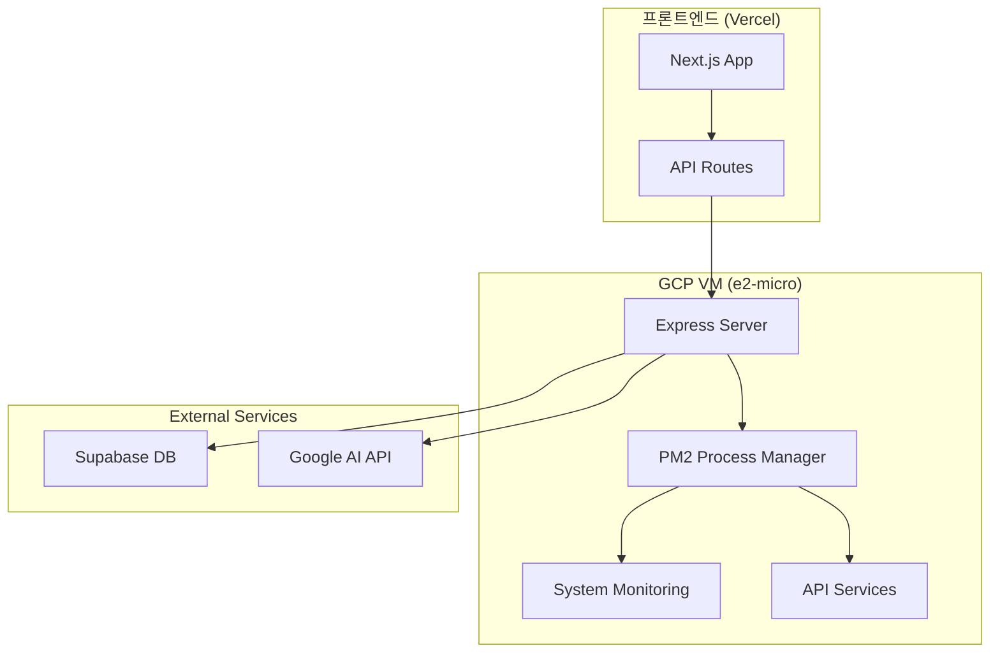

# ☁️ GCP 배포 완전 가이드

> Google Cloud Platform 무료 티어 최적화 배포

## 🎯 개요

OpenManager VIBE v5의 GCP 백엔드 서비스를 무료 티어(e2-micro)로 완전 활용하는 배포 가이드입니다.

## 🏗️ 아키텍처 구성



## 🚀 VM 인스턴스 설정

### 1. 기본 인스턴스 생성

```bash
# GCP 인증
gcloud auth login
gcloud config set project openmanager-free-tier

# VM 인스턴스 생성
gcloud compute instances create mcp-server \
  --zone=us-central1-a \
  --machine-type=e2-micro \
  --image-family=ubuntu-2404-lts \
  --image-project=ubuntu-os-cloud \
  --boot-disk-size=10GB \
  --boot-disk-type=pd-standard \
  --tags=http-server,https-server

# 방화벽 규칙 설정
gcloud compute firewall-rules create allow-node-app \
  --allow tcp:10000 \
  --source-ranges 0.0.0.0/0 \
  --description "Allow Node.js app on port 10000"
```

### 2. VM 기본 설정

```bash
# VM 접속
gcloud compute ssh mcp-server --zone=us-central1-a

# 시스템 업데이트
sudo apt update && sudo apt upgrade -y

# Node.js 22 설치
curl -fsSL https://deb.nodesource.com/setup_22.x | sudo -E bash -
sudo apt-get install -y nodejs

# PM2 설치 (글로벌)
sudo npm install -g pm2

# 방화벽 포트 개방
sudo ufw allow 10000
sudo ufw enable
```

## 📦 애플리케이션 배포

### 1. 프로젝트 설정

```bash
# 프로젝트 디렉토리 생성
mkdir ~/openmanager-backend
cd ~/openmanager-backend

# Git 저장소 클론
git clone https://github.com/your-username/openmanager-vibe-v5.git .

# 백엔드 의존성 설치
npm install express cors helmet dotenv
npm install -D @types/node @types/express typescript
```

### 2. Express 서버 설정

```typescript
// server/index.ts
import express from 'express';
import cors from 'cors';
import helmet from 'helmet';

const app = express();
const PORT = 10000;

// 미들웨어
app.use(helmet());
app.use(cors());
app.use(express.json());

// 헬스 체크
app.get('/health', (req, res) => {
  res.json({
    status: 'healthy',
    timestamp: new Date().toISOString(),
    uptime: process.uptime(),
    memory: process.memoryUsage(),
    version: '2.0',
    port: PORT,
  });
});

// API 상태
app.get('/api/status', async (req, res) => {
  try {
    const pm2Status = await getPM2Status();
    const systemInfo = await getSystemInfo();

    res.json({
      pm2: pm2Status,
      system: systemInfo,
      apis: {
        health: '/health',
        status: '/api/status',
        metrics: '/api/metrics',
      },
    });
  } catch (error) {
    res.status(500).json({ error: error.message });
  }
});

app.listen(PORT, '0.0.0.0', () => {
  console.log(`🚀 Server running on port ${PORT}`);
});
```

### 3. PM2 설정

```json
// ecosystem.config.js
module.exports = {
  apps: [{
    name: 'openmanager-backend',
    script: './dist/server/index.js',
    instances: 1,
    autorestart: true,
    watch: false,
    max_memory_restart: '1G',
    env: {
      NODE_ENV: 'production',
      PORT: 10000
    },
    error_file: './logs/err.log',
    out_file: './logs/out.log',
    log_file: './logs/combined.log',
    time: true
  }]
};
```

## 🔧 배포 자동화

### 1. 배포 스크립트

```bash
#!/bin/bash
# deploy.sh

echo "🚀 OpenManager Backend 배포 시작..."

# Git 업데이트
git pull origin main

# TypeScript 컴파일
npm run build

# PM2로 앱 재시작
pm2 restart openmanager-backend

# PM2 상태 확인
pm2 status

echo "✅ 배포 완료!"
```

### 2. GitHub Actions 연동

```yaml
# .github/workflows/deploy-gcp.yml
name: Deploy to GCP VM

on:
  push:
    branches: [main]
    paths: ['server/**']

jobs:
  deploy:
    runs-on: ubuntu-latest
    steps:
      - name: Checkout code
        uses: actions/checkout@v4

      - name: Setup SSH
        run: |
          mkdir -p ~/.ssh
          echo "${{ secrets.GCP_SSH_KEY }}" > ~/.ssh/id_rsa
          chmod 600 ~/.ssh/id_rsa
          ssh-keyscan -H ${{ secrets.GCP_VM_IP }} >> ~/.ssh/known_hosts

      - name: Deploy to VM
        run: |
          ssh -i ~/.ssh/id_rsa ${{ secrets.GCP_VM_USER }}@${{ secrets.GCP_VM_IP }} << 'EOF'
            cd ~/openmanager-backend
            git pull origin main
            npm run build
            pm2 restart openmanager-backend
            pm2 status
          EOF
```

## 📊 모니터링 설정

### 1. 시스템 모니터링

```typescript
// server/monitoring.ts
export const getSystemInfo = async () => {
  const os = await import('os');
  const fs = await import('fs').then((m) => m.promises);

  return {
    hostname: os.hostname(),
    platform: os.platform(),
    arch: os.arch(),
    uptime: os.uptime(),
    loadavg: os.loadavg(),
    memory: {
      total: os.totalmem(),
      free: os.freemem(),
      used: os.totalmem() - os.freemem(),
    },
    cpu: {
      count: os.cpus().length,
      model: os.cpus()[0]?.model,
    },
  };
};
```

### 2. PM2 모니터링

```bash
# PM2 모니터링 설정
pm2 install pm2-logrotate
pm2 set pm2-logrotate:max_size 10M
pm2 set pm2-logrotate:retain 30

# PM2 모니터링 웹 대시보드
pm2 web
```

## 🔐 보안 설정

### 1. 환경 변수 설정

```bash
# .env (VM에서)
NODE_ENV=production
PORT=10000
ALLOWED_ORIGINS=https://openmanager-vibe-v5.vercel.app
API_SECRET=your_secure_api_secret
```

### 2. 네트워크 보안

```bash
# UFW 방화벽 설정
sudo ufw default deny incoming
sudo ufw default allow outgoing
sudo ufw allow ssh
sudo ufw allow 10000
sudo ufw enable

# fail2ban 설치 (SSH 보안)
sudo apt install fail2ban
sudo systemctl enable fail2ban
sudo systemctl start fail2ban
```

## 🚀 Cloud Functions 연동

### 1. Korean NLP Function

```python
# functions/korean_nlp/main.py
import functions_framework
from google.cloud import translate

@functions_framework.http
def korean_nlp(request):
    request_json = request.get_json(silent=True)

    if not request_json or 'text' not in request_json:
        return {'error': 'Text is required'}, 400

    # 한국어 자연어 처리
    result = process_korean_text(request_json['text'])

    return {
        'original': request_json['text'],
        'processed': result,
        'timestamp': datetime.now().isoformat()
    }
```

### 2. ML Analytics Function

```python
# functions/ml_analytics/main.py
import functions_framework
import pandas as pd
from sklearn.ensemble import IsolationForest

@functions_framework.http
def ml_analytics(request):
    request_json = request.get_json(silent=True)

    if not request_json or 'metrics' not in request_json:
        return {'error': 'Metrics data is required'}, 400

    # 이상 징후 탐지
    anomalies = detect_anomalies(request_json['metrics'])

    return {
        'anomalies': anomalies,
        'recommendations': generate_recommendations(anomalies),
        'timestamp': datetime.now().isoformat()
    }
```

## 📈 성능 최적화

### 1. 메모리 최적화

```typescript
// server/optimization.ts
export const optimizeMemory = () => {
  // 가비지 컬렉션 강제 실행
  if (global.gc) {
    global.gc();
  }

  // 메모리 사용량 모니터링
  const memUsage = process.memoryUsage();
  if (memUsage.heapUsed > 500 * 1024 * 1024) {
    // 500MB
    console.warn('High memory usage detected:', memUsage);
  }
};

// 30초마다 메모리 최적화 실행
setInterval(optimizeMemory, 30000);
```

### 2. 캐싱 설정

```typescript
// server/cache.ts
import NodeCache from 'node-cache';

export const cache = new NodeCache({
  stdTTL: 600, // 10분
  checkperiod: 120, // 2분마다 체크
  maxKeys: 1000,
});

export const cacheMiddleware = (duration: number) => {
  return (req: Request, res: Response, next: NextFunction) => {
    const key = req.originalUrl;
    const cached = cache.get(key);

    if (cached) {
      return res.json(cached);
    }

    res.sendResponse = res.json;
    res.json = (body) => {
      cache.set(key, body, duration);
      res.sendResponse(body);
    };

    next();
  };
};
```

## 🛠️ 문제 해결

### 1. 일반적인 문제들

```bash
# VM 메모리 부족
free -h
sudo swapon --show
sudo fallocate -l 1G /swapfile
sudo chmod 600 /swapfile
sudo mkswap /swapfile
sudo swapon /swapfile

# PM2 프로세스 재시작
pm2 restart all
pm2 logs --lines 100

# 포트 사용 확인
sudo netstat -tlnp | grep :10000
sudo lsof -i :10000
```

### 2. 로그 모니터링

```bash
# 실시간 로그 확인
pm2 logs openmanager-backend --lines 50 -f

# 시스템 로그 확인
sudo journalctl -u ssh -f
sudo tail -f /var/log/syslog
```

## 📚 관련 문서

### 배포 관련

- **[Vercel 배포](./vercel-deployment.md)**
- **[무료 티어 최적화](./free-tier-optimization.md)**

### 개발 환경

- **[개발 가이드](../development/development-guide.md)**
- **[API 최적화](../performance/api-optimization-guide.md)**

### 모니터링

- **[시스템 모니터링](../monitoring/system-status-monitoring-guide.md)**
- **[성능 엔진 테스트](../performance/performance-engine-testing-guide.md)**

---

> **GCP 배포 문제가 있나요?** [문제 해결 가이드](../TROUBLESHOOTING.md#gcp-관련-문제)를 확인해주세요.
