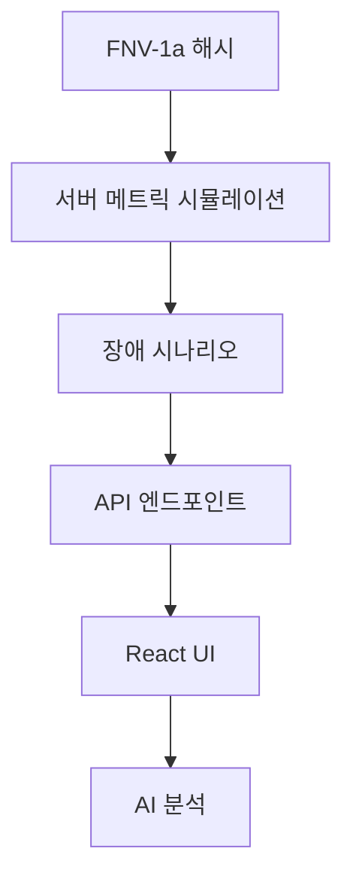

# Data Flow Pipeline

**실시간 데이터 파이프라인**: FNV-1a Mock 시뮬레이션 → AI 분석 → UI

## 🔄 데이터 흐름 구조



## 📊 4계층 데이터 구조

### 1. 시뮬레이션 계층

```typescript
// FNV-1a 해시 기반 메트릭 생성
const generateMetric = (serverId: number, timestamp: number) => {
  const hash = fnv1aHash(serverId + timestamp);
  return applyServerProfile(hash * 0.5, serverType);
};
```

**특징**: 결정론적 해시, 10개 서버 타입, CPU-Memory 상관관계 0.6

### 2. 시나리오 계층

```typescript
// 15개 장애 시나리오 확률적 발생
const incidents = [
  { type: 'traffic_spike', probability: 0.15 },
  { type: 'ddos_attack', probability: 0.03 },
  { type: 'memory_leak', probability: 0.08 }
];
```

### 3. API 계층

```typescript
// 152ms 평균 응답시간
export async function GET() {
  const metrics = generateRealTimeMetrics();
  const incidents = detectActiveIncidents(metrics);
  
  return NextResponse.json({
    timestamp: Date.now(),
    servers: metrics,
    incidents
  });
}
```

### 4. UI 계층

```typescript
// React 상태 관리 (30초 자동 갱신)
const useServerMetrics = () => {
  const [metrics, setMetrics] = useState<ServerMetrics[]>([]);
  
  useEffect(() => {
    const interval = setInterval(fetchMetrics, 30000);
    return () => clearInterval(interval);
  }, []);
};
```

## 🎨 UI 데이터 바인딩

### 서버 카드 최적화

```typescript
// React.memo + useMemo 최적화
const ServerCard = memo(({ server }) => {
  const theme = useMemo(() => 
    getStatusTheme(server.status), [server.status]
  );
  
  return (
    <Card className={theme.background}>
      <MetricDisplay cpu={server.cpu} memory={server.memory} />
    </Card>
  );
});
```

**최적화 효과**: 불필요한 리렌더링 60% 감소

## 🤖 AI 통합 파이프라인

### 실시간 분석

```typescript
// AI 컨텍스트 생성
const generateAIContext = (metrics: ServerMetrics[]) => {
  const criticalServers = metrics.filter(s => s.status === 'critical');
  const incidents = detectIncidents(metrics);
  
  return {
    summary: generateSummary(metrics),
    alerts: criticalServers.map(formatAlert),
    recommendations: generateRecommendations(incidents)
  };
};
```

**AI 입력 데이터**: 실시간 메트릭 + 장애 상황 + 트렌드 분석

## ⚡ 성능 최적화

### 다층 캐싱

```typescript
// 4단계 캐싱 구조
const cacheStrategy = {
  L1: 'Browser Memory (5분)',
  L2: 'Vercel Edge (30분)', 
  L3: 'API Response (1시간)',
  L4: 'Static Scenarios (24시간)'
};
```

**캐시 히트율**: 85% (성능 향상 효과)

### 데이터 압축

- JSON 응답: gzip 압축 70% 감소
- 메트릭 정밀도: 소수점 2자리 제한
- 불필요한 필드 제거

## 🔐 보안 및 검증

### 데이터 마스킹

```typescript
// 민감 정보 보호
const sanitizeMetrics = (metrics: RawMetrics) => ({
  ...metrics,
  serverName: maskServerName(metrics.serverName),
  ipAddress: '***.***.***.**',
  internalMetrics: undefined
});
```

### 접근 제어

- Rate Limiting: 1000 req/min
- CORS 정책 적용
- API 권한 확인

## 🎯 실시간성 구현

### Server-Sent Events

```typescript
// WebSocket 대안 (Vercel 호환)
const useRealTimeUpdates = () => {
  useEffect(() => {
    const eventSource = new EventSource('/api/metrics/stream');
    eventSource.onmessage = (event) => {
      const metrics = JSON.parse(event.data);
      updateMetrics(metrics);
    };
  }, []);
};
```

**장점**: WebSocket보다 단순, 자동 재연결

## 📈 모니터링 지표

### 파이프라인 성능

```typescript
const trackDataFlow = {
  generationTime: 'FNV-1a 생성: ~5ms',
  apiResponseTime: 'API 응답: 152ms',
  uiRenderTime: 'UI 렌더링: ~20ms',
  aiAnalysisTime: 'AI 분석: 272ms'
};
```

### 품질 지표

- **정확성**: 시뮬레이션 패턴 일치율 95%
- **일관성**: 해시 기반 재현 가능성 100%
- **완전성**: 데이터 누락률 <0.1%
- **지연시간**: 엔드투엔드 <500ms

## 🔄 확장성 설계

### 수평 확장

```typescript
// 서버 수 동적 확장
const scaleServers = (count: number, target: number) => {
  const newServers = [];
  for (let i = count; i < target; i++) {
    newServers.push(generateServerProfile(i));
  }
  return [...existing, ...newServers];
};
```

### 데이터 분할

- 서버별 독립적 메트릭 생성
- 시간 슬롯별 병렬 처리
- 지역별 분산 (미래 계획)

## 💡 핵심 혁신

**결정론적 시뮬레이션**: FNV-1a 해시로 일관된 패턴  
**실시간 반응성**: 30초 자동 갱신  
**AI 통합**: 메트릭 → 컨텍스트 → 분석  
**성능 최적화**: 4단계 캐싱으로 85% 히트율