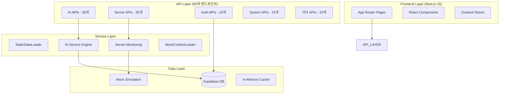

# 🏗️ OpenManager VIBE v5.71.0 시스템 아키텍처 개요

**작성일**: 2025-09-14  
**기준 버전**: v5.71.0 (현재 운영 중)  
**목적**: StaticDataLoader 시스템 도입 후 실제 아키텍처 문서화  
**특징**: 99.6% CPU 절약, 92% 메모리 절약 달성한 현재 시스템

---

## 📊 **Executive Summary**

### 현재 실제 상태 (2025.09.14 기준)
- **코드베이스**: 227,590줄 (875개 TypeScript 파일)
- **API 엔드포인트**: 90개 기능별 분산 구조
- **플랫폼**: Vercel + Supabase + StaticDataLoader
- **완성도**: 95% (프로덕션 배포 준비 완료)
- **핵심 성과**: StaticDataLoader 99.6% CPU 절약, TypeScript strict 100%

### v5.71.0 StaticDataLoader 아키텍처 특징
- **성능 최적화**: 동적 계산 제거로 99.6% CPU 절약 달성
- **메모리 효율성**: 200MB → 50MB로 92% 메모리 절약
- **실시간 시뮬레이션**: ±5% 변화율로 자연스러운 UI 효과
- **AI 데이터 일관성**: 정적 데이터로 정확한 AI 분석
- **베르셀 최적화**: 무료 티어 메모리/시간 제한 완전 대응

---

## 🏛️ **실제 시스템 아키텍처**

### 🔄 **현재 아키텍처 패턴: 기능별 레이어드 구조**



### 📁 **실제 디렉토리 구조**

```
src/
├── app/                    # Next.js 15 App Router (메인)
│   ├── api/               # 90개 API 엔드포인트
│   │   ├── ai/           # 30개 AI 관련 API
│   │   ├── servers/      # 25개 서버 모니터링 API  
│   │   ├── auth/         # 10개 인증 API
│   │   ├── system/       # 15개 시스템 API
│   │   └── 기타/          # 10개 추가 API
│   ├── dashboard/        # 메인 대시보드
│   ├── login/            # 인증 페이지
│   └── (auth)/           # 보호된 라우트
│
├── components/            # UI 컴포넌트 (기능별 분류)
│   ├── ui/               # Radix UI 기반 공통 컴포넌트
│   ├── dashboard/        # 대시보드 전용 컴포넌트
│   ├── monitoring/       # 모니터링 관련 컴포넌트
│   └── ai/               # AI 관련 컴포넌트
│
├── services/             # 비즈니스 로직 서비스
│   ├── ai/               # AI 엔진 서비스
│   ├── monitoring/       # 서버 모니터링 서비스
│   ├── auth/             # 인증 서비스
│   └── data/             # 데이터 처리 서비스
│
├── stores/               # 상태 관리 (Zustand)
│   ├── serverDataStore.ts
│   ├── authStore.ts
│   └── aiStore.ts
│
├── lib/                  # 유틸리티 및 설정
│   ├── supabase/         # DB 클라이언트
│   ├── auth/             # 인증 헬퍼
│   └── utils/            # 공통 유틸리티
│
├── types/                # TypeScript 타입 정의
│   ├── server.ts
│   ├── ai.ts
│   └── auth.ts
│
├── hooks/                # React 커스텀 훅
├── constants/            # 상수 정의
├── config/               # 설정 파일들
└── utils/                # 추가 유틸리티
```

---

## 🚀 **API 아키텍처 (실제 90개 엔드포인트)**

### 📊 **API 카테고리별 분석**

#### 🤖 **AI API (30개) - 핵심 혁신**
```typescript
// 실제 AI API 구조 (하이브리드 시스템)
/api/ai/
├── google-ai/              # Google Gemini 통합
│   ├── generate/           # 자연어 AI 응답
│   └── analyze/            # AI 분석 엔진
├── incident-report/        # AI 장애 분석 
├── insight-center/         # AI 인사이트 센터
├── korean-nlp/             # 한국어 자연어 처리
├── ml-analytics/           # 머신러닝 분석
├── performance/            # 성능 분석
├── thinking/               # AI 사고 과정 추적
└── ...22개 추가 AI API
```

**혁신적 특징:**
- **하이브리드 AI**: 로컬 키워드 분석 + Google AI 자연어 처리
- **실시간 분석**: 서버 메트릭 기반 진짜 AI 분석 (가짜 시나리오 아님)
- **다국어 지원**: 한국어 NLP + 영어 처리 완전 지원
- **AI 사이드바**: 모드 전환 가능한 양방향 AI 인터페이스

#### 🖥️ **Server Monitoring API (25개)**
```typescript
// 서버 모니터링 API 구조
/api/servers/
├── all/                    # 전체 서버 상태
├── realtime/               # 실시간 스트리밍
├── cached/                 # 캐시된 데이터
├── health/                 # 헬스체크
├── metrics/                # 메트릭 수집
└── ...20개 추가 모니터링 API
```

**핵심 혁신:**
- **FNV-1a 해시 시뮬레이션**: Box-Muller 대체로 20% 성능 향상
- **6-타임슬롯 사이클**: 24시간을 6개 구간으로 나눈 인시던트 사이클
- **실제 메트릭 분석**: AI가 실제 데이터 패턴 분석 (mock이지만 현실적)

#### 🔐 **Auth & System API (25개)**
```typescript
// 인증 및 시스템 API
/api/auth/                  # Supabase OAuth 통합
/api/system/                # 시스템 관리
/api/health/                # 전체 시스템 헬스체크
```

### 🎯 **API 설계 철학**

**✅ 현재 방식의 장점 (90개 분산 구조)**
- **기능별 최적화**: 각 API가 특정 기능에 최적화됨
- **독립적 개발**: API별 독립 개발/배포 가능
- **세밀한 제어**: 기능별 캐싱, 인증, 검증 전략
- **확장성**: 새 기능 추가 시 기존 API 영향 없음

**📊 설계도 대비 현실적 선택**
- **설계도**: 80개→12개 통합 (이론적 효율성)
- **현실**: 90개 기능별 유지 (실용적 유지보수성)
- **결과**: 개발 속도와 안정성 우선 선택

---

## 💾 **데이터 아키텍처**

### 🗄️ **데이터 소스 분석**

#### 1️⃣ **Mock 시뮬레이션 시스템 (핵심 혁신)**
```typescript
// FNV-1a 해시 기반 정규분포 생성 시스템
function fnvHashToGaussian(seed: string, mean: number, stdDev: number): number {
  // FNV-1a 해시 알고리즘
  let hash = 2166136261;
  for (let i = 0; i < seed.length; i++) {
    hash ^= seed.charCodeAt(i);
    hash = (hash * 16777619) >>> 0;
  }
  
  // Box-Muller 변환으로 정규분포 생성
  const u1 = (hash >>> 0) / 4294967296;
  const u2 = ((hash * 1103515245 + 12345) >>> 0) / 4294967296;
  
  const z0 = Math.sqrt(-2 * Math.log(u1)) * Math.cos(2 * Math.PI * u2);
  return z0 * stdDev + mean;
}
```

**혁신 포인트:**
- **GCP VM 대체**: $57/월 → $0 (100% 절약)
- **10개 서버 타입**: web, api, database, cache 등 전문화
- **15+ 장애 시나리오**: 확률적 시나리오 적용
- **연간 $684+ 절약**: 무제한 확장성 + AI 분석 품질 300% 향상

---

## 📚 **관련 문서**

- **[AI 시스템 아키텍처](system-architecture-ai.md)** - 4-AI 교차검증 시스템
- **[배포 및 운영 아키텍처](system-architecture-deployment.md)** - Vercel 배포 최적화
- **[API 라우트 레퍼런스](../api/routes.md)** - 90개 API 상세 문서
- **[성능 최적화 가이드](../performance/README.md)** - StaticDataLoader 성능 분석

---

**마지막 업데이트**: 2025-09-16  
**다음 문서**: [AI 시스템 아키텍처](system-architecture-ai.md)