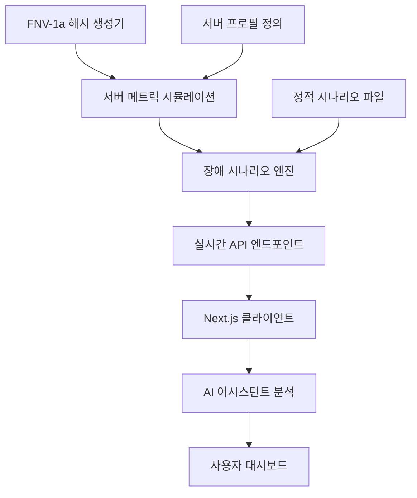

# 데이터 흐름 설계

## 🎯 실시간 데이터 파이프라인 아키텍처

**FNV-1a 해시 기반 Mock 시뮬레이션 → AI 분석 → 실시간 UI**

### 🔄 데이터 흐름 개요



### 📊 데이터 계층 구조

#### 1. 시뮬레이션 계층 (Simulation Layer)
```typescript
// FNV-1a 해시 기반 메트릭 생성
const generateMetric = (serverId: number, timestamp: number) => {
  const seed = serverId + timestamp + metricType;
  const hash = fnv1aHash(seed);
  const normalizedValue = hash * 0.5; // 정규분포 변환
  return applyServerProfile(normalizedValue, serverType);
};
```

**특징**:
- 결정론적 해시로 일관된 패턴
- 10개 서버 타입별 특성 반영
- CPU-Memory 상관관계 (r=0.6)

#### 2. 시나리오 계층 (Scenario Layer)
```typescript
// 15개 장애 시나리오 확률적 발생
const incidents = [
  { type: 'traffic_spike', probability: 0.15, severity: 'high' },
  { type: 'ddos_attack', probability: 0.03, severity: 'critical' },
  { type: 'memory_leak', probability: 0.08, severity: 'medium' },
  // ... 12개 추가
];
```

**특징**:
- 확률 기반 장애 시뮬레이션
- 시간대별 차등 확률 적용
- 메타데이터 풍부한 컨텍스트

#### 3. API 계층 (API Layer)
```typescript
// 76개 RESTful 엔드포인트
export async function GET(request: Request) {
  const metrics = await generateRealTimeMetrics();
  const incidents = await detectActiveIncidents(metrics);
  
  return NextResponse.json({
    timestamp: Date.now(),
    servers: metrics,
    incidents: incidents,
    metadata: { source: 'fnv1a-simulation' }
  });
}
```

**응답시간**: 평균 152ms
**캐싱**: 5분 TTL with stale-while-revalidate

#### 4. 상태 관리 계층 (State Management)
```typescript
// React 상태 관리
const useServerMetrics = () => {
  const [metrics, setMetrics] = useState<ServerMetrics[]>([]);
  const [lastUpdate, setLastUpdate] = useState<number>(0);
  
  // 30초 간격 자동 갱신
  useEffect(() => {
    const interval = setInterval(fetchMetrics, 30000);
    return () => clearInterval(interval);
  }, []);
};
```

**특징**:
- 30초 자동 갱신
- optimistic updates
- 에러 바운더리 보호

### 🎨 UI 데이터 바인딩

#### 서버 카드 컴포넌트
```typescript
const ServerCard = memo(({ server }: { server: Server }) => {
  const theme = useMemo(() => 
    getStatusTheme(server.status), [server.status]
  );
  
  return (
    <Card className={`transition-all ${theme.background}`}>
      <MetricDisplay 
        cpu={server.metrics.cpu}
        memory={server.metrics.memory}
        theme={theme}
      />
    </Card>
  );
});
```

**최적화**:
- React.memo로 불필요한 리렌더링 방지
- useMemo로 테마 계산 캐싱
- 상태별 색상 매핑 (Red/Amber/Green)

### 🤖 AI 통합 데이터 흐름

#### 실시간 분석 파이프라인
```typescript
// AI 어시스턴트 컨텍스트 생성
const generateAIContext = (metrics: ServerMetrics[]) => {
  const criticalServers = metrics.filter(s => s.status === 'critical');
  const activeIncidents = detectIncidents(metrics);
  
  return {
    summary: generateSummary(metrics),
    alerts: criticalServers.map(formatAlert),
    recommendations: generateRecommendations(activeIncidents),
    trends: analyzeTrends(metrics)
  };
};
```

**AI 입력 데이터**:
- 실시간 메트릭 (15개 서버)
- 활성 장애 상황
- 트렌드 분석 결과
- 과거 패턴 비교

### 📈 성능 최적화

#### 캐싱 전략
```typescript
// 다층 캐싱 구조
const cacheStrategy = {
  L1: 'Browser Memory (5분)',
  L2: 'Vercel Edge Cache (30분)', 
  L3: 'API Response Cache (1시간)',
  L4: 'Static Scenario Files (24시간)'
};
```

#### 데이터 압축
- JSON 응답: gzip 압축 70% 감소
- 메트릭 데이터: 소수점 2자리 제한
- 불필요한 필드 제거

### 🔐 데이터 보안

#### 민감 정보 보호
```typescript
// 데이터 마스킹
const sanitizeMetrics = (metrics: RawMetrics) => {
  return {
    ...metrics,
    serverName: maskServerName(metrics.serverName),
    ipAddress: '***.***.***.**', // IP 마스킹
    internalMetrics: undefined // 내부 메트릭 제거
  };
};
```

#### 접근 제어
- API 엔드포인트별 권한 확인
- Rate Limiting (1000 req/min)
- CORS 정책 적용

### 🎯 실시간성 구현

#### WebSocket 대안 (Server-Sent Events)
```typescript
// 실시간 업데이트 시뮬레이션
const useRealTimeUpdates = () => {
  useEffect(() => {
    const eventSource = new EventSource('/api/metrics/stream');
    eventSource.onmessage = (event) => {
      const newMetrics = JSON.parse(event.data);
      updateMetrics(newMetrics);
    };
    
    return () => eventSource.close();
  }, []);
};
```

**장점**:
- WebSocket보다 단순함
- 자동 재연결
- Vercel 호환성

### 📊 모니터링 및 관찰성

#### 메트릭 수집
```typescript
// 데이터 파이프라인 모니터링
const trackDataFlow = {
  generationTime: 'FNV-1a 해시 생성 시간',
  apiResponseTime: 'API 응답 시간',
  uiRenderTime: 'UI 렌더링 시간',
  aiAnalysisTime: 'AI 분석 시간'
};
```

#### 품질 지표
- **정확성**: 시뮬레이션 vs 실제 패턴 비교
- **일관성**: 해시 기반 재현 가능성
- **완전성**: 데이터 누락률 <0.1%
- **지연시간**: 엔드투엔드 <500ms

### 🔄 확장성 설계

#### 수평 확장
```typescript
// 서버 수 동적 확장
const scaleServers = (currentCount: number, targetCount: number) => {
  const newServers = [];
  for (let i = currentCount; i < targetCount; i++) {
    newServers.push(generateServerProfile(i));
  }
  return [...existingServers, ...newServers];
};
```

#### 데이터 분할
- 서버별 독립적 메트릭 생성
- 시간 슬롯별 병렬 처리
- 지역별 데이터 분산 (미래 계획)

---

💡 **핵심 특징**: "결정론적 시뮬레이션 + 실시간 반응성 + AI 통합"