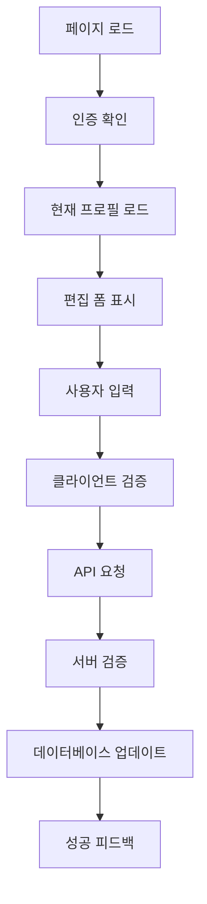

# 🏗️ 사용자 프로필 수정 기능 설계

> **기반**: [📋 요구사항 문서](../requirements/user-profile-edit.md)  
> **목적**: OpenManager VIBE 프로젝트 컨텍스트에서 사용자 프로필 수정 기능의 기술적 설계

## 🎯 설계 개요

### 기술 스택 (OpenManager VIBE 준수)
```yaml
frontend:
  framework: "Next.js 15"
  runtime: "React 18"
  language: "TypeScript (strict)"
  styling: "Tailwind CSS + shadcn/ui"
  
backend:
  platform: "Next.js API Routes"
  database: "Supabase PostgreSQL"
  storage: "Supabase Storage"
  
deployment:
  platform: "Vercel"
  cdn: "Vercel Edge Network"
  
security:
  authentication: "Supabase Auth (JWT)"
  authorization: "Row Level Security (RLS)"
```

### 아키텍처 원칙
```typescript
// Type-First Development (CLAUDE.md 원칙)
interface UserProfileEditDesign {
  approach: "Type-First + Side-Effect First";
  quality: "TypeScript strict mode 100%";
  testing: "70%+ coverage";
  commit: "emoji + 간결한 메시지";
}
```

## 🎨 UI/UX 설계

### 컴포넌트 구조
```
src/components/profile/
├── ProfileEditForm.tsx          # 메인 편집 폼
├── ProfileImageUpload.tsx       # 이미지 업로드 컴포넌트
├── ProfileFieldInput.tsx       # 재사용 가능한 입력 필드
└── ProfileEditSkeleton.tsx     # 로딩 스켈레톤
```

### 페이지 구조
```typescript
// src/app/profile/edit/page.tsx
interface ProfileEditPageProps {
  searchParams: { [key: string]: string | string[] | undefined };
}

export default function ProfileEditPage({ searchParams }: ProfileEditPageProps) {
  // 1. 인증 상태 확인
  // 2. 현재 프로필 데이터 로드
  // 3. ProfileEditForm 렌더링
}
```

### UI 플로우


## 🔗 API 설계

### REST API 엔드포인트
```typescript
// src/app/api/profile/route.ts

// GET /api/profile - 현재 사용자 프로필 조회
export async function GET(request: Request): Promise<Response> {
  // 1. JWT 토큰 검증
  // 2. 사용자 ID 추출
  // 3. 프로필 데이터 조회
  // 4. 응답 반환
}

// PUT /api/profile - 프로필 정보 업데이트
export async function PUT(request: Request): Promise<Response> {
  // 1. JWT 토큰 검증
  // 2. 요청 데이터 파싱
  // 3. 입력 검증
  // 4. 데이터베이스 업데이트
  // 5. 응답 반환
}
```

### API 스키마
```typescript
// src/types/profile.ts

export interface UserProfile {
  id: string;
  email: string;
  displayName?: string;
  bio?: string;
  profileImageUrl?: string;
  createdAt: string;
  updatedAt: string;
}

export interface ProfileUpdateRequest {
  displayName?: string;
  email: string;
  bio?: string;
}

export interface ProfileUpdateResponse {
  success: boolean;
  data?: UserProfile;
  error?: string;
}
```

### 이미지 업로드 API
```typescript
// src/app/api/profile/image/route.ts

export async function POST(request: Request): Promise<Response> {
  // 1. JWT 토큰 검증
  // 2. 이미지 파일 검증 (타입, 크기)
  // 3. Supabase Storage 업로드
  // 4. 프로필 이미지 URL 업데이트
  // 5. 이전 이미지 삭제 (옵션)
}
```

## 🗄️ 데이터베이스 설계

### Supabase 테이블 스키마
```sql
-- users 테이블 확장 (기존 auth.users 연동)
CREATE TABLE public.user_profiles (
  id UUID PRIMARY KEY REFERENCES auth.users(id) ON DELETE CASCADE,
  email TEXT NOT NULL UNIQUE,
  display_name TEXT CHECK (char_length(display_name) BETWEEN 2 AND 50),
  bio TEXT CHECK (char_length(bio) <= 500),
  profile_image_url TEXT,
  created_at TIMESTAMPTZ DEFAULT NOW(),
  updated_at TIMESTAMPTZ DEFAULT NOW()
);

-- RLS 정책 (Row Level Security)
ALTER TABLE public.user_profiles ENABLE ROW LEVEL SECURITY;

-- 본인 프로필만 조회/수정 가능
CREATE POLICY "Users can view own profile" ON public.user_profiles
  FOR SELECT USING (auth.uid() = id);

CREATE POLICY "Users can update own profile" ON public.user_profiles
  FOR UPDATE USING (auth.uid() = id);

-- 관리자는 모든 프로필 접근 가능
CREATE POLICY "Admins can manage all profiles" ON public.user_profiles
  FOR ALL USING (auth.jwt() ->> 'role' = 'admin');
```

### 인덱스 최적화
```sql
-- 이메일 중복 검사용 인덱스
CREATE UNIQUE INDEX idx_user_profiles_email ON public.user_profiles(email);

-- 검색 성능 향상용 인덱스
CREATE INDEX idx_user_profiles_display_name ON public.user_profiles(display_name);
CREATE INDEX idx_user_profiles_updated_at ON public.user_profiles(updated_at);
```

## 📁 파일 저장소 설계

### Supabase Storage 구조
```
openmanager-vibe-bucket/
└── profiles/
    └── {user_id}/
        ├── avatar.jpg          # 메인 프로필 이미지
        ├── avatar_thumb.jpg    # 썸네일 (자동 생성)
        └── old/               # 이전 이미지 백업
            └── avatar_20250916.jpg
```

### 이미지 처리 정책
```typescript
// src/lib/imageProcessing.ts

export interface ImageUploadConfig {
  maxSize: 2 * 1024 * 1024;  // 2MB
  allowedTypes: ['image/jpeg', 'image/png'];
  dimensions: {
    max: { width: 1024, height: 1024 };
    thumbnail: { width: 150, height: 150 };
  };
}

export async function processProfileImage(file: File): Promise<{
  original: Blob;
  thumbnail: Blob;
}> {
  // 1. 파일 검증
  // 2. 이미지 리사이징
  // 3. 썸네일 생성
  // 4. 압축 최적화
}
```

## 🔧 TypeScript 타입 정의

### 핵심 타입 시스템
```typescript
// src/types/profile.ts

// 요구사항 기반 입력 타입
export interface ProfileFormData {
  displayName?: string;  // 2-50자, 특수문자 제한
  email: string;         // 이메일 형식, 중복 검사
  bio?: string;          // 최대 500자
  profileImage?: File;   // JPG/PNG, 최대 2MB
}

// 검증 스키마 (Zod)
export const profileUpdateSchema = z.object({
  displayName: z.string()
    .min(2, "이름은 2자 이상이어야 합니다")
    .max(50, "이름은 50자 이하여야 합니다")
    .regex(/^[가-힣a-zA-Z0-9\s]+$/, "특수문자는 사용할 수 없습니다")
    .optional(),
  
  email: z.string()
    .email("올바른 이메일 형식이 아닙니다")
    .min(1, "이메일은 필수입니다"),
  
  bio: z.string()
    .max(500, "소개는 500자 이하여야 합니다")
    .optional()
});

// API 응답 타입
export interface ProfileApiResponse<T = any> {
  success: boolean;
  data?: T;
  error?: {
    message: string;
    code: string;
    field?: string;
  };
}
```

### 훅 타입 정의
```typescript
// src/hooks/useProfileEdit.ts

export interface UseProfileEditReturn {
  profile: UserProfile | null;
  isLoading: boolean;
  isUpdating: boolean;
  error: string | null;
  updateProfile: (data: ProfileFormData) => Promise<void>;
  uploadImage: (file: File) => Promise<string>;
  resetForm: () => void;
}
```

## 🛡️ 보안 설계

### 인증 및 권한 제어
```typescript
// src/middleware.ts - Next.js 미들웨어

export async function middleware(request: NextRequest) {
  const token = request.cookies.get('supabase-auth-token');
  
  if (request.nextUrl.pathname.startsWith('/profile/edit')) {
    if (!token) {
      return NextResponse.redirect(new URL('/login', request.url));
    }
    
    // JWT 토큰 검증
    const user = await verifySupabaseToken(token.value);
    if (!user) {
      return NextResponse.redirect(new URL('/login', request.url));
    }
  }
  
  return NextResponse.next();
}
```

### 입력 검증 및 XSS 방어
```typescript
// src/lib/validation.ts

export function sanitizeInput(input: string): string {
  return DOMPurify.sanitize(input, {
    ALLOWED_TAGS: [],
    ALLOWED_ATTR: []
  });
}

export function validateProfileData(data: ProfileFormData): ValidationResult {
  // 1. 스키마 검증
  // 2. XSS 패턴 검사
  // 3. SQL 인젝션 패턴 검사
  // 4. 이메일 중복 검사
}
```

### CSRF 보호
```typescript
// src/lib/csrf.ts

export async function validateCSRFToken(
  request: Request
): Promise<boolean> {
  const token = request.headers.get('X-CSRF-Token');
  const sessionToken = await getSessionCSRFToken();
  
  return token === sessionToken;
}
```

## 📊 성능 최적화 설계

### 클라이언트 사이드 최적화
```typescript
// src/components/profile/ProfileEditForm.tsx

export default function ProfileEditForm() {
  // 1. React.memo 적용
  // 2. useCallback으로 함수 메모이제이션
  // 3. useMemo로 계산 결과 캐싱
  // 4. 디바운싱으로 API 호출 최적화
  
  const debouncedEmailCheck = useMemo(
    () => debounce(checkEmailAvailability, 500),
    []
  );
}
```

### 서버 사이드 최적화
```typescript
// src/app/api/profile/route.ts

export async function PUT(request: Request) {
  // 1. 요청 본문 크기 제한
  if (request.headers.get('content-length') > '1048576') { // 1MB
    return Response.json({ error: 'Request too large' }, { status: 413 });
  }
  
  // 2. 데이터베이스 쿼리 최적화
  const result = await supabase
    .from('user_profiles')
    .update(data)
    .eq('id', userId)
    .select('id, email, display_name, bio, profile_image_url')
    .single();
  
  // 3. 응답 캐싱 헤더
  return Response.json(result, {
    headers: {
      'Cache-Control': 'private, max-age=60'
    }
  });
}
```

## 🧪 테스트 설계

### 테스트 구조
```
tests/
├── components/
│   ├── ProfileEditForm.test.tsx
│   └── ProfileImageUpload.test.tsx
├── api/
│   └── profile.test.ts
├── lib/
│   ├── validation.test.ts
│   └── imageProcessing.test.ts
└── e2e/
    └── profile-edit.spec.ts
```

### 핵심 테스트 케이스
```typescript
// tests/components/ProfileEditForm.test.tsx

describe('ProfileEditForm', () => {
  it('사용자 인증이 필요함을 표시해야 함', () => {
    // Given: 미인증 사용자
    // When: 컴포넌트 렌더링
    // Then: 로그인 요구 메시지 표시
  });
  
  it('현재 프로필 데이터를 폼에 표시해야 함', () => {
    // Given: 인증된 사용자와 프로필 데이터
    // When: 컴포넌트 렌더링
    // Then: 기존 데이터가 폼에 표시됨
  });
  
  it('유효하지 않은 입력에 대해 오류를 표시해야 함', () => {
    // Given: 잘못된 이메일 형식
    // When: 폼 제출
    // Then: 검증 오류 메시지 표시
  });
});
```

## 🔄 데이터 플로우

### 프로필 조회 플로우
```typescript
// 1. 페이지 로드
app/profile/edit/page.tsx
  ↓
// 2. 인증 확인
middleware.ts (JWT 검증)
  ↓
// 3. 프로필 데이터 조회
useProfileEdit hook → GET /api/profile
  ↓
// 4. UI 렌더링
ProfileEditForm (현재 데이터 표시)
```

### 프로필 업데이트 플로우
```typescript
// 1. 사용자 입력
ProfileEditForm (폼 입력)
  ↓
// 2. 클라이언트 검증
profileUpdateSchema.parse()
  ↓
// 3. API 요청
PUT /api/profile (검증된 데이터)
  ↓
// 4. 서버 처리
JWT 검증 → 데이터 검증 → DB 업데이트
  ↓
// 5. 응답 처리
성공/오류 피드백 → UI 업데이트
```

## 📱 접근성 설계

### WCAG 2.1 AA 준수
```typescript
// src/components/profile/ProfileEditForm.tsx

export default function ProfileEditForm() {
  return (
    <form
      role="form"
      aria-labelledby="profile-edit-heading"
      aria-describedby="profile-edit-description"
    >
      <h1 id="profile-edit-heading">프로필 수정</h1>
      <p id="profile-edit-description">
        개인 정보를 안전하게 수정할 수 있습니다.
      </p>
      
      <div className="space-y-4">
        <label htmlFor="displayName" className="sr-only">
          표시 이름
        </label>
        <input
          id="displayName"
          type="text"
          aria-describedby="displayName-error"
          aria-invalid={errors.displayName ? 'true' : 'false'}
        />
        {errors.displayName && (
          <div
            id="displayName-error"
            role="alert"
            aria-live="polite"
          >
            {errors.displayName.message}
          </div>
        )}
      </div>
    </form>
  );
}
```

## 🚀 배포 설계 (Vercel)

### 환경 변수 설정
```bash
# Vercel 환경 변수
NEXT_PUBLIC_SUPABASE_URL=your_supabase_url
NEXT_PUBLIC_SUPABASE_ANON_KEY=your_supabase_anon_key
SUPABASE_SERVICE_ROLE_KEY=your_service_role_key

# 이미지 업로드 설정
MAX_FILE_SIZE=2097152  # 2MB
ALLOWED_IMAGE_TYPES=image/jpeg,image/png
```

### 빌드 최적화
```javascript
// next.config.js
module.exports = {
  images: {
    domains: ['your-supabase-project.supabase.co'],
    formats: ['image/webp', 'image/avif'],
  },
  
  experimental: {
    optimizeCss: true,
    optimizeServerReact: true,
  },
  
  // API Routes 최적화
  api: {
    bodyParser: {
      sizeLimit: '2mb',
    },
  },
};
```

## 🔄 다음 단계

### Phase 3: Tasks 문서 생성
```yaml
next_phase:
  file: "../tasks/user-profile-edit.md"
  focus: "설계를 구현 가능한 작업 단위로 분할"
  deliverables:
    - "컴포넌트별 구현 작업"
    - "API 엔드포인트 구현 작업"
    - "테스트 케이스 작성 작업"
    - "배포 및 검증 작업"

validation_checklist:
  requirements_coverage: "100% (모든 요구사항 설계에 반영)"
  technical_feasibility: "OpenManager VIBE 기술 스택 호환"
  security_compliance: "JWT + RLS + XSS/CSRF 방어"
  performance_targets: "2초 이내 응답, 100 동시 사용자"
```

### 설계 검증 체크리스트
```typescript
interface DesignValidation {
  requirements_traceability: boolean;  // ✅ 모든 요구사항 추적 가능
  technology_alignment: boolean;       // ✅ Next.js 15 + Supabase 호환
  security_coverage: boolean;          // ✅ 인증, 권한, 입력 검증
  performance_optimization: boolean;   // ✅ 응답시간 + 동시 사용자 대응
  accessibility_compliance: boolean;   // ✅ WCAG 2.1 AA 준수
  test_coverage_plan: boolean;        // ✅ 70%+ 커버리지 계획
}
```

---

**✨ SDD Phase 2 완료** → **Phase 3: [작업 분할 문서](../tasks/user-profile-edit.md)** 작성 준비