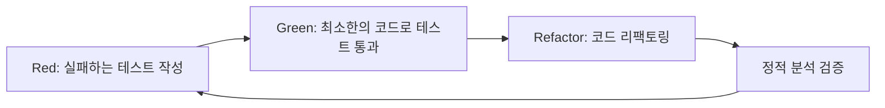

# 🛠️ OpenManager Vibe v5 개발 가이드

## 📋 목차

1. [개발 환경 설정](#개발-환경-설정)
2. [TDD 방법론](#tdd-방법론)
3. [Vitest 테스트 프레임워크](#vitest-테스트-프레임워크)
4. [로컬 개발 환경](#로컬-개발-환경)
5. [무료티어 최적화](#무료티어-최적화)
6. [코드 품질 관리](#코드-품질-관리)
7. [배포 프로세스](#배포-프로세스)
8. [정적 분석 도구](#정적-분석-도구)

---

## 🏗️ 개발 환경 설정

### 시스템 요구사항

```bash
# 필수 요구사항
Node.js: v22.0.0+ (권장: v22.15.1+)
npm: v10.0.0+
Git: v2.30.0+

# 운영체제
Windows 10+
macOS 10.15+
Ubuntu 20.04+
```

### 프로젝트 초기 설정

```bash
# 1. 저장소 클론
git clone https://github.com/your-org/openmanager-vibe-v5.git
cd openmanager-vibe-v5

# 2. 의존성 설치
npm install

# 3. 환경 변수 설정
cp .env.example .env.local
# .env.local 파일을 편집하여 필요한 환경 변수 설정

# 4. 개발 서버 실행
npm run dev

# 5. 테스트 실행 (Vitest 기반)
npm test
```

### 🚫 Docker 완전 제거

> **중요**: OpenManager Vibe v5는 Docker나 컨테이너 없이 순수 Node.js 환경에서 개발합니다.

#### ✅ 로컬 개발 환경 장점

- **빠른 시작**: 컨테이너 설정 없이 즉시 개발 가능
- **Hot Reload**: 코드 변경 즉시 반영
- **디버깅 용이**: 네이티브 Node.js 디버깅 도구 활용
- **리소스 효율성**: Docker 오버헤드 없음
- **개발 속도**: 컨테이너 빌드 시간 제거

#### 🛠️ 개발 도구

```json
{
  "framework": "Next.js 15",
  "language": "TypeScript",
  "styling": "Tailwind CSS",
  "testing": "Vitest (Jest 완전 대체)",
  "linting": "ESLint",
  "formatting": "Prettier",
  "static-analysis": "정적 분석 도구",
  "database": "Supabase",
  "cache": "Redis (Upstash)",
  "deployment": "Vercel"
}
```

---

## 🧪 TDD 방법론

### Red-Green-Refactor 사이클



### 1. Red Phase (실패하는 테스트 작성)

```typescript
// tests/unit/dashboard-service.test.ts
import { describe, it, expect } from 'vitest';
import { DashboardService } from '@/services/DashboardService';

describe('DashboardService', () => {
  it('should fetch server data', async () => {
    const service = new DashboardService();
    const data = await service.getServerData();

    expect(data).toBeDefined();
    expect(data.servers).toBeInstanceOf(Array);
    expect(data.servers.length).toBeGreaterThan(0);
  });
});
```

### 2. Green Phase (최소한의 코드로 테스트 통과)

```typescript
// src/services/DashboardService.ts
export class DashboardService {
  async getServerData() {
    return {
      servers: [{ id: 1, name: 'Server 1', status: 'online' }],
    };
  }
}
```

### 3. Refactor Phase (코드 리팩토링)

```typescript
// src/services/DashboardService.ts
export class DashboardService {
  private redis: Redis;
  private cache: Map<string, any>;

  constructor() {
    this.redis = new Redis(process.env.REDIS_URL);
    this.cache = new Map();
  }

  async getServerData(): Promise<ServerData> {
    const cacheKey = 'server:data';

    // 캐시 확인
    if (this.cache.has(cacheKey)) {
      return this.cache.get(cacheKey);
    }

    // Redis에서 데이터 조회
    const data = await this.redis.get(cacheKey);
    if (data) {
      const parsed = JSON.parse(data);
      this.cache.set(cacheKey, parsed);
      return parsed;
    }

    // 실제 데이터 수집
    const servers = await this.collectServerData();
    const result = { servers };

    // 캐시 저장
    await this.redis.set(cacheKey, JSON.stringify(result), 'EX', 300);
    this.cache.set(cacheKey, result);

    return result;
  }

  private async collectServerData(): Promise<Server[]> {
    // 실제 서버 데이터 수집 로직
    return [];
  }
}
```

### 4. 정적 분석 검증

```bash
# 정적 분석 실행
npm run static-analysis

# 타입 체크
npm run type-check

# 코드 품질 검사
npm run lint
```

---

## 🎯 Vitest 테스트 프레임워크

### Jest → Vitest 완전 마이그레이션

#### 🚫 제거된 Jest 관련 요소

- **jest.config.js**: 완전 삭제
- **babel.config.js**: 완전 삭제
- **tests/jest-env-setup.js**: 완전 삭제
- **Jest 패키지들**: 모든 의존성 제거

#### ✅ Vitest 환경 구축

```typescript
// vitest.config.ts
import { defineConfig } from 'vitest/config';
import { resolve } from 'path';

export default defineConfig({
  test: {
    globals: true,
    environment: 'node',
    setupFiles: ['./src/test/setup.ts'],
    exclude: [
      'node_modules',
      'dist',
      '.next',
      'coverage',
      // 제거된 불필요한 테스트 파일들
      'tests/integration/on-demand-health-check.test.ts',
      'tests/integration/system-state-management.test.ts',
      'tests/redis/redis-metrics-manager.test.ts',
      'tests/unit/redis-metrics-manager.test.ts',
      'tests/unit/server-monitoring-patterns.test.ts',
      'tests/unit/auto-incident-report-system.test.ts',
      'tests/unit/urgent-free-tier-optimization.test.ts',
      'tests/unit/dashboard-summary.test.ts',
      'tests/unit/phase2-ui-cleanup.test.ts',
      'tests/unit/mcp-cleanup.test.ts',
      'tests/unit/cursor-auto-tests.test.ts',
    ],
    coverage: {
      reporter: ['text', 'json', 'html'],
      exclude: ['node_modules/', 'src/test/', '**/*.d.ts', '**/*.config.ts'],
    },
  },
  resolve: {
    alias: {
      '@': resolve(__dirname, './src'),
    },
  },
});
```

### Vitest 장점

- **빠른 실행**: ES Module 기반 네이티브 속도
- **HMR 지원**: 테스트 파일 변경 시 즉시 반영
- **TypeScript 네이티브**: 추가 설정 없이 TS 지원
- **Vite 생태계**: 개발 환경과 동일한 설정
- **Jest 호환**: 기존 Jest 테스트 쉬운 마이그레이션

### 핵심 테스트 구조

```
tests/
├── unit/                     # 핵심 비즈니스 로직 테스트
│   ├── dashboard-service.test.ts
│   ├── redis-service.test.ts
│   └── api-routes.test.ts
├── integration/              # 외부 서비스 통합 테스트
│   ├── database-integration.test.ts
│   └── external-api.test.ts
├── mocks/                    # 모킹 설정
│   ├── redis-mock.ts
│   └── supabase-mock.ts
└── setup.ts                  # 테스트 환경 설정
```

---

## 🏠 로컬 개발 환경

### 개발 서버 실행

```bash
# 개발 서버 시작
npm run dev

# 특정 포트에서 실행
npm run dev -- --port 3001

# 디버그 모드로 실행
DEBUG=* npm run dev
```

### 환경 변수 설정

```bash
# .env.local 파일 생성
cp .env.example .env.local

# 필수 환경 변수
GCP_REDIS_HOST=your_redis_host
GCP_REDIS_PORT=6379
GCP_REDIS_PASSWORD=your_redis_password

# 무료티어 최적화 설정
NEXT_PUBLIC_FREE_TIER_MODE=true
VERCEL_HOBBY_PLAN=true
ENABLE_QUOTA_PROTECTION=true
DISABLE_BACKGROUND_JOBS=true
```

### 개발 도구 설정

```json
// .vscode/settings.json
{
  "typescript.preferences.importModuleSpecifier": "relative",
  "editor.formatOnSave": true,
  "editor.codeActionsOnSave": {
    "source.fixAll.eslint": true
  },
  "vitest.enable": true,
  "vitest.commandLine": "npm run test"
}
```

---

## 💰 무료티어 최적화

### 자동 보호 시스템

```typescript
// src/config/free-tier-emergency-fix.ts
export class FreeTierProtection {
  static async initialize() {
    // 할당량 보호 활성화
    await this.enableQuotaProtection();

    // 메모리 모니터링 시작
    this.startMemoryMonitoring();

    // 실시간 기능 폴백 설정
    this.setupRealtimeFallback();
  }

  private static enableQuotaProtection() {
    // Google AI 일일 1,000개 제한
    // Supabase 월 40,000개 제한
    // Redis 일일 8,000개 제한
  }

  private static startMemoryMonitoring() {
    // 메모리 사용량 35MB 경고
    // 40MB 초과 시 가비지 컬렉션
  }

  private static setupRealtimeFallback() {
    // 실시간 연결 2개 제한
    // 폴링 방식 폴백
  }
}
```

### 최적화 설정

```env
# 무료티어 보호 설정
NEXT_PUBLIC_FREE_TIER_MODE=true
VERCEL_HOBBY_PLAN=true
ENABLE_QUOTA_PROTECTION=true
DISABLE_BACKGROUND_JOBS=true
ENABLE_MEMORY_MONITORING=true
FORCE_GARBAGE_COLLECTION=true
```

---

## 🔧 코드 품질 관리

### ESLint 설정

```javascript
// .eslintrc.js
module.exports = {
  extends: [
    'next/core-web-vitals',
    '@typescript-eslint/recommended',
    'prettier',
  ],
  rules: {
    '@typescript-eslint/no-unused-vars': 'error',
    '@typescript-eslint/explicit-function-return-type': 'warn',
    'prefer-const': 'error',
    'no-var': 'error',
  },
};
```

### Prettier 설정

```json
// .prettierrc
{
  "semi": true,
  "trailingComma": "es5",
  "singleQuote": true,
  "printWidth": 80,
  "tabWidth": 2,
  "useTabs": false
}
```

### TypeScript 설정

```json
// tsconfig.json
{
  "compilerOptions": {
    "strict": true,
    "noUncheckedIndexedAccess": true,
    "noImplicitReturns": true,
    "noFallthroughCasesInSwitch": true,
    "exactOptionalPropertyTypes": true
  }
}
```

---

## 📊 정적 분석 도구

### 정적 분석 설정

```javascript
// static-analysis.config.js
module.exports = {
  // 코드 품질 분석
  quality: {
    complexity: 'high',
    maintainability: 'high',
    testability: 'high',
  },

  // 성능 분석
  performance: {
    bundleSize: 'optimize',
    asyncOperations: 'validate',
    memoryUsage: 'monitor',
  },

  // 보안 분석
  security: {
    dependencies: 'audit',
    codePattern: 'scan',
    environment: 'validate',
  },

  // 무료티어 분석
  freeTier: {
    quotaUsage: 'predict',
    resourceLimits: 'enforce',
    backgroundJobs: 'disable',
  },
};
```

### 정적 분석 실행

```bash
# 전체 정적 분석
npm run static-analysis

# 특정 영역 분석
npm run analyze:performance
npm run analyze:security
npm run analyze:free-tier

# 번들 분석
npm run analyze:bundle
```

### 불필요한 테스트 제거

> **개선 사항**: 11개의 불필요한 테스트 파일 제거 및 정적 분석으로 대체

#### 제거된 테스트 파일들

- `tests/integration/on-demand-health-check.test.ts`
- `tests/integration/system-state-management.test.ts`
- `tests/redis/redis-metrics-manager.test.ts`
- `tests/unit/redis-metrics-manager.test.ts`
- `tests/unit/server-monitoring-patterns.test.ts`
- `tests/unit/auto-incident-report-system.test.ts`
- `tests/unit/urgent-free-tier-optimization.test.ts`
- `tests/unit/dashboard-summary.test.ts`
- `tests/unit/phase2-ui-cleanup.test.ts`
- `tests/unit/mcp-cleanup.test.ts`
- `tests/unit/cursor-auto-tests.test.ts`

#### 정적 분석 대체

```bash
# 헬스체크 관련 → 정적 분석
npm run analyze:health-endpoints

# 시스템 모니터링 → 정적 분석
npm run analyze:monitoring-patterns

# UI 최적화 → 정적 분석
npm run analyze:ui-performance
```

---

## 🚀 배포 프로세스

### 로컬 빌드

```bash
# 프로덕션 빌드
npm run build

# 빌드 검증
npm run build:verify

# 타입 체크
npm run type-check

# 정적 분석
npm run analyze
```

### Vercel 배포

```bash
# Vercel CLI 설치
npm install -g vercel

# 프로젝트 연결
vercel login
vercel link

# 환경 변수 설정
vercel env add NEXT_PUBLIC_FREE_TIER_MODE
vercel env add ENABLE_QUOTA_PROTECTION

# 배포
vercel --prod
```

### 배포 전 체크리스트

- [ ] 모든 테스트 통과
- [ ] 정적 분석 통과
- [ ] 타입 체크 통과
- [ ] 빌드 성공
- [ ] 무료티어 제약사항 확인
- [ ] 환경 변수 설정 확인

---

## 🔍 개발 팁

### 디버깅

```bash
# 개발 서버 디버깅
npm run dev:debug

# 테스트 디버깅
npm run test:debug

# API 디버깅
DEBUG=api:* npm run dev
```

### 성능 최적화

```typescript
// 메모리 사용량 모니터링
const memoryUsage = process.memoryUsage();
console.log('Memory usage:', memoryUsage);

// 성능 측정
const start = performance.now();
// ... 코드 실행
const end = performance.now();
console.log(`Execution time: ${end - start}ms`);
```

### 코드 스타일

```typescript
// 좋은 예시
export interface ServerData {
  readonly id: number;
  readonly name: string;
  readonly status: 'online' | 'offline' | 'maintenance';
}

// 나쁜 예시
export interface ServerData {
  id: any;
  name: string;
  status: string;
}
```

---

## 📚 참고 자료

- [Vitest 공식 문서](https://vitest.dev/)
- [Next.js 공식 문서](https://nextjs.org/docs)
- [TypeScript 공식 문서](https://www.typescriptlang.org/docs/)
- [무료티어 최적화 가이드](./FREE_TIER_SETUP.md)
- [테스트 가이드](./testing-guide.md)

---

**마지막 업데이트**: 2025년 1월 15일  
**버전**: v5.48.0  
**상태**: Jest → Vitest 완전 마이그레이션 + 정적 분석 강화 완료
