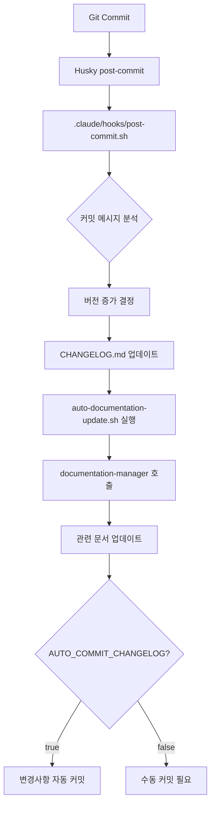

# 🤖 자동 CHANGELOG 갱신 시스템 가이드

## 📋 개요

커밋할 때마다 자동으로 CHANGELOG.md를 갱신하고, documentation-manager 서브에이전트를 통해 관련 문서들까지 함께 업데이트하는 시스템입니다.

## 🚀 주요 기능

### 1. 자동 버전 증가
- **Major**: `breaking`, `major`, `BREAKING` 키워드
- **Minor**: `feat`, `✨`, `🚀`, `feature` 키워드  
- **Patch**: `fix`, `🐛`, `🔧`, `⚡`, `docs`, `refactor` 등

### 2. 커밋 타입별 카테고리 분류
- `✨ Added`: 새로운 기능 추가
- `🐛 Fixed`: 버그 수정
- `⚡ Performance`: 성능 개선
- `📚 Documentation`: 문서 업데이트
- `🔄 Refactored`: 리팩토링
- `🔧 Changed`: 기타 변경사항

### 3. documentation-manager 서브에이전트 자동 호출
- CHANGELOG.md 품질 검증
- README.md 버전 동기화
- 관련 문서 업데이트
- JBGE 원칙 검증
- 링크 무결성 검사

## 🛠️ 시스템 구성

### 핵심 파일들
```
.claude/
├── hooks/
│   └── post-commit.sh           # 메인 훅 스크립트
├── changelog.config.sh          # 설정 파일
└── logs/                        # 로그 디렉토리

.husky/
└── post-commit                  # Husky 훅 연결

scripts/
├── update-changelog.sh          # 수동 업데이트 도구
└── auto-documentation-update.sh # 문서 자동 갱신
```

## ⚙️ 설정 방법

### 1. 환경변수 설정 (`.claude/changelog.config.sh`)

```bash
# 자동 커밋 여부 (기본값: false)
export AUTO_COMMIT_CHANGELOG=false

# 버전 증가 키워드 설정
export VERSION_MINOR_KEYWORDS="feat|✨|🚀|feature"
export VERSION_PATCH_KEYWORDS="fix|🐛|🔧|⚡|docs|📚"

# 디버그 모드 (기본값: false)  
export DEBUG_CHANGELOG=true
```

### 2. Husky 훅 활성화

```bash
# Husky 설치 및 활성화
npm install --save-dev husky
npx husky install

# post-commit 훅 권한 확인
chmod +x .husky/post-commit
chmod +x .claude/hooks/post-commit.sh
```

## 🚀 사용 방법

### 자동 사용 (권장)
일반적인 커밋을 하면 자동으로 동작합니다:

```bash
git add .
git commit -m "✨ feat: 새로운 기능 추가"
# → 자동으로 CHANGELOG.md 업데이트 및 문서 관리
```

### 수동 사용
필요에 따라 수동으로 CHANGELOG를 업데이트할 수 있습니다:

```bash
# 자동 버전 증가
./scripts/update-changelog.sh auto "🐛 fix: 중요한 버그 수정"

# 특정 버전 지정
./scripts/update-changelog.sh 5.70.11 "✨ feat: 새로운 기능 추가"

# 문서 업데이트만 실행
./scripts/auto-documentation-update.sh
```

## 📊 작동 흐름



## 🎯 documentation-manager 자동 작업

### 수행되는 작업들
1. **CHANGELOG.md 품질 검증**
   - 마크다운 문법 검사
   - 버전 번호 일관성 확인
   - 내부 링크 무결성 검증

2. **README.md 버전 동기화**  
   - package.json 버전과 일치 확인
   - 기능 목록 최신 상태 유지
   - 설치 가이드 업데이트

3. **관련 문서 자동 업데이트**
   - 기술 문서 버전 참조 수정
   - API 문서 버전 정보 동기화
   - 가이드 문서 최신화

4. **문서 구조 JBGE 검증**
   - 루트 .md 파일 6개 이하 유지
   - 중복 문서 식별 및 정리
   - docs/ 폴더 체계화 확인

5. **링크 및 참조 무결성**
   - 내부 링크 유효성 검사  
   - 외부 링크 접근 확인
   - 이미지 경로 검증

## 📋 커밋 메시지 규칙

### 권장 형식
```
[이모지] [타입]: [간단한 설명]

예시:
✨ feat: 사용자 인증 기능 추가
🐛 fix: 로그인 버그 수정
⚡ perf: 데이터베이스 쿼리 최적화
📚 docs: API 문서 업데이트
♻️ refactor: 사용자 서비스 리팩토링
```

### 지원하는 이모지/타입
- `✨ feat` → Minor 버전 증가 (새 기능)
- `🐛 fix` → Patch 버전 증가 (버그 수정)
- `🔧 fix` → Patch 버전 증가 (수정/개선)
- `⚡ perf` → Patch 버전 증가 (성능 개선)
- `📚 docs` → Patch 버전 증가 (문서)
- `♻️ refactor` → Patch 버전 증가 (리팩토링)
- `🎨 style` → Patch 버전 증가 (스타일)

## 🔧 트러블슈팅

### 1. 훅이 실행되지 않을 때
```bash
# 권한 확인 및 부여
chmod +x .husky/post-commit
chmod +x .claude/hooks/post-commit.sh

# Husky 재설치
rm -rf .husky
npx husky install
```

### 2. 버전 증가가 안 될 때
```bash
# 디버그 모드 활성화
export DEBUG_CHANGELOG=true
git commit -m "test"

# 설정 파일 확인
cat .claude/changelog.config.sh
```

### 3. documentation-manager 호출 실패
```bash
# Claude Code 실행 상태 확인
pgrep -f claude

# 수동으로 서브에이전트 호출
Task documentation-manager "CHANGELOG 품질 검증 및 문서 동기화 수행"
```

### 4. 자동 커밋 문제
```bash
# 자동 커밋 비활성화 (권장)
export AUTO_COMMIT_CHANGELOG=false

# 수동으로 커밋
git add CHANGELOG.md
git commit -m "📚 docs: CHANGELOG.md 업데이트"
```

## 📈 고급 기능

### 1. 커스텀 키워드 설정
`.claude/changelog.config.sh`에서 키워드를 변경할 수 있습니다:

```bash
# 한국어 키워드 추가
export VERSION_MINOR_KEYWORDS="feat|✨|🚀|feature|기능|추가"
export VERSION_PATCH_KEYWORDS="fix|🐛|🔧|수정|버그|개선"
```

### 2. 무시할 커밋 패턴
```bash
# CHANGELOG 업데이트를 건너뛸 패턴
export IGNORE_COMMIT_PATTERNS="chore|merge|temp|wip"
```

### 3. 배치 모드 실행
```bash
# 여러 커밋을 한 번에 처리
for commit in $(git log --oneline -10 --pretty=format:%h); do
    ./scripts/auto-documentation-update.sh $commit
done
```

## 📊 통계 및 모니터링

### 자동 생성되는 로그
- `.claude/logs/changelog-updates.log` - 업데이트 이력
- `.claude/logs/documentation-tasks.log` - 문서 작업 기록
- `/tmp/doc_update_task_*.md` - 서브에이전트 작업 명세서

### 성과 확인
```bash
# CHANGELOG 업데이트 통계
grep "CHANGELOG.md updated" .claude/logs/changelog-updates.log | wc -l

# 최근 10개 업데이트 확인  
tail -10 .claude/logs/changelog-updates.log
```

## 🎯 베스트 프랙티스

### 1. 커밋 메시지 작성
- 명확하고 간결한 설명
- 일관된 이모지/타입 사용
- 작업 내용을 정확히 반영

### 2. 설정 관리
- `AUTO_COMMIT_CHANGELOG=false` 권장 (수동 검토)
- 디버그 모드는 개발 시에만 활성화
- 정기적인 설정 파일 백업

### 3. 문서 품질
- CHANGELOG 항목은 사용자 관점에서 작성
- 기술적 세부사항보다 영향도 중심
- 링크와 참조는 항상 검증

### 4. 협업 시 주의사항
- 팀원들과 커밋 컨벤션 통일
- 자동 커밋 설정 팀 차원에서 결정
- 정기적인 CHANGELOG 리뷰 세션

---

📝 **마지막 업데이트**: 2025-09-05  
🤖 **관련 서브에이전트**: documentation-manager  
📚 **관련 문서**: [서브에이전트 가이드](../claude/sub-agents-complete-guide.md)