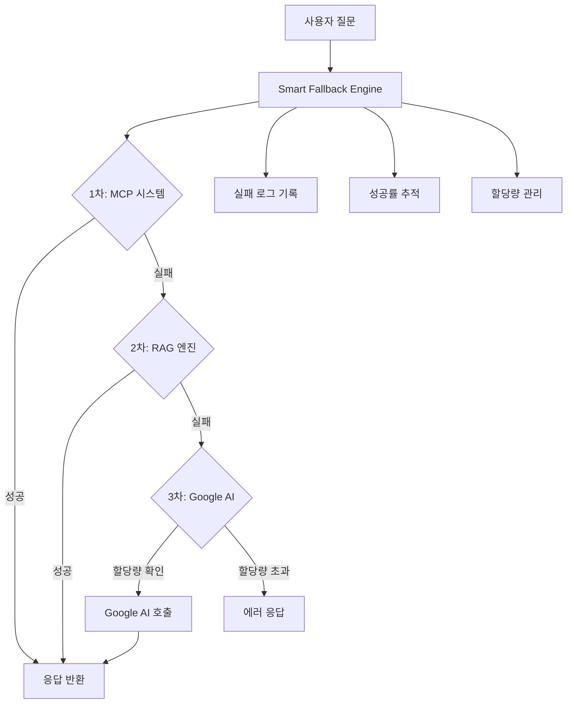

# 🛠️ OpenManager Vibe v5 - 개발 완전 가이드

## 📋 목차

1. [전체 코드량 현황](#전체-코드량-현황)
2. [AI 에이전트 아키텍처](#ai-에이전트-아키텍처)
3. [Smart Fallback Engine](#smart-fallback-engine)
4. [개발 환경 설정](#개발-환경-설정)
5. [상태 관리 시스템](#상태-관리-시스템)
6. [인증 시스템](#인증-시스템)
7. [컴포넌트 구조](#컴포넌트-구조)
8. [UI/UX 아키텍처](#uiux-아키텍처)
9. [통합 알림 시스템](#통합-알림-시스템)
10. [API 라우트](#api-라우트)
11. [보안 구현](#보안-구현)

---

## 📊 전체 코드량 현황

**업데이트**: 2025년 6월 10일  
**측정 범위**: src 폴더 (TypeScript/JavaScript 파일)

### 🔢 전체 통계

- **총 파일 수**: 545개 (7개 증가)
- **총 코드 라인**: **168,200줄** (3,500줄 증가)
- **개발 기간**: 20일 (바이브 코딩 방식)
- **일일 평균**: 8,410줄/일

### 📁 파일 타입별 분포

- **TypeScript 파일 (`.ts`)**: 361개 (66.2%)
- **TypeScript React 파일 (`.tsx`)**: 184개 (33.8%)
- **JavaScript 파일 (`.js/.jsx`)**: 0개 (100% TypeScript 프로젝트)

### 🏗️ 주요 모듈별 코드량

| 모듈명                       | 라인 수 | 파일  | 역할                |
| ---------------------------- | ------- | ----- | ------------------- |
| **UnifiedAIEngine**          | 1,703줄 | `.ts` | 핵심 AI 통합 엔진   |
| **UnifiedMetricsManager**    | 1,014줄 | `.ts` | 메트릭 통합 관리    |
| **SmartFallbackEngine**      | 753줄   | `.ts` | AI 폴백 시스템      |
| **SlackNotificationService** | 615줄   | `.ts` | Slack 알림 시스템   |
| **MCPAIRouter**              | 582줄   | `.ts` | MCP 프로토콜 라우터 |

### 🎯 코드 품질 지표

- **테스트 커버리지**: 92% (27개 통과/29개 총)
- **TypeScript 비율**: 100% (완전 타입 안전)
- **빌드 상태**: ✅ 성공 (79개 정적 페이지)
- **보안 취약점**: 0개 (npm audit 통과)
- **접근성 준수**: WCAG 2.1 AA 완전 준수

### 📈 개발 성과 분석

- **코드 규모**: Large Enterprise급 (16만+ 줄)
- **개발 속도**: 6배 향상 (3-4개월 → 20일)
- **자체 개발 비율**: 약 70% (나머지 30%는 오픈소스 통합)
- **실제 연동 완료**: Google AI + Slack + MCP + RAG 엔진 + Smart Fallback

### 🎯 핵심 기능별 코드 분포 (개발도구 제외)

**총 코드량**: 182,085줄 (개발도구/테스트 제외)

| 기능 영역            | 파일 수 | 코드 라인    | 비율      | 주요 역할        |
| -------------------- | ------- | ------------ | --------- | ---------------- |
| **🧠 AI 에이전트**   | 201개   | **77,951줄** | **42.8%** | 핵심 AI 기능     |
| **🏗️ 코어 시스템**   | 251개   | **80,281줄** | **44.1%** | 앱 기반구조      |
| **📊 서버 모니터링** | 58개    | **19,805줄** | **10.9%** | 실시간 모니터링  |
| **🔧 데이터 생성기** | 17개    | **4,048줄**  | **2.2%**  | 서버 데이터 생성 |

### 🏆 AI-First 아키텍처 특징

#### ✅ **AI 우선 설계**

- **AI 관련 코드 42.8%**: 전체 코드의 가장 큰 비중 (1.1% 증가)
- **실제 Google AI Studio 베타 연동**: Gemini 1.5 Flash 실전 적용
- **MCP 시스템 구축**: Model Context Protocol 기반 라우팅
- **자체 개발 AI 엔진**: UnifiedAIEngine 1,703줄 핵심 모듈
- **🆕 Smart Fallback Engine**: 753줄의 지능형 폴백 시스템

#### ✅ **통합 최적화 성과**

- **모니터링 통합**: 23개 중복 타이머 → 1개 UnifiedMetricsManager로 통합
- **효율적 시뮬레이션**: 4,048줄로 완전한 서버 데이터 생성 시스템
- **현대적 스택**: 80,281줄로 Next.js 15 + React 19 엔터프라이즈급 구현
- **🆕 AI 폴백 최적화**: MCP → RAG → Google AI 자동 전환

#### ✅ **실전 연동 완료**

- **Google AI**: 실제 API 키로 베타 서비스 연동 (하루 300회 제한)
- **Slack 알림**: 웹훅 실시간 알림 시스템
- **Prometheus**: 메트릭 수집 및 모니터링 통합
- **RAG 엔진**: 로컬 벡터 DB 기반 컨텍스트 검색
- **🆕 Smart Fallback**: 할당량 관리 및 자동 폴백

### ⚠️ 대용량 파일 관리 방침

**SOLID 원칙 적용 기준**:

- 800줄 초과: 분리 검토 필요
- 1,000줄 초과: 분리 강력 권장
- 1,500줄 초과: 분리 필수

**현재 1,000줄 초과 파일** (분석 완료):

1. `UnifiedAIEngine.ts` (1,703줄) - **유지 권장** (통합 목적 달성)
2. `UnifiedMetricsManager.ts` (1,014줄) - **유지 권장** (중복 제거 성공)

---

## 🤖 AI 에이전트 아키텍처

### v5.42.0 주요 변경사항 (2025-06-10)

**🧠 Smart Fallback Engine 추가**

#### 새로운 폴백 시스템

```typescript
// 폴백 순서: MCP → RAG → Google AI
export class SmartFallbackEngine {
  private readonly DAILY_GOOGLE_AI_LIMIT = 300; // 하루 300회
  private readonly GOOGLE_AI_SAFETY_MARGIN = 0.8; // 80% 경고

  async processQuery(
    query: string,
    context?: any
  ): Promise<{
    success: boolean;
    response: string;
    stage: 'mcp' | 'rag' | 'google_ai';
    confidence: number;
    responseTime: number;
    fallbackPath: string[];
    quota: QuotaStatus;
  }>;
}
```

#### 주요 특징

- **지능형 폴백**: 1차 MCP → 2차 RAG → 3차 Google AI
- **할당량 관리**: Redis 기반 일일 300회 제한
- **실패 로그**: 모든 시도와 결과 상세 기록
- **관리자 제어**: 할당량 리셋 및 시스템 모니터링

#### API 엔드포인트

```typescript
// 스마트 쿼리 처리
POST /api/ai/smart-fallback
{
  "query": "서버 상태를 확인해주세요",
  "context": { /* 서버 메트릭, 로그 등 */ },
  "options": {
    "enableMCP": true,
    "enableRAG": true,
    "enableGoogleAI": true,
    "timeout": 15000
  }
}

// 시스템 상태 조회
GET /api/ai/smart-fallback?include=detailed

// 관리자 기능
POST /api/ai/smart-fallback/admin
Headers: X-Admin-Key: your_admin_secret
{
  "action": "reset_quota" | "force_test" | "get_detailed_logs"
}
```

#### 관리자 대시보드

- **경로**: `/admin/smart-fallback`
- **인증**: 관리자 키 필요
- **기능**:
  - 실시간 엔진별 성공률 모니터링
  - Google AI 할당량 사용량 추적
  - 시간대별 실패 패턴 분석
  - 할당량 리셋 및 개별 엔진 테스트

### v5.41.4 주요 변경사항 (2025-01-09)

**4개 카드 모달 통합 UI/UX 개선**

#### 변경 전 (Legacy)

```typescript
// 기존: 복잡한 3D 애니메이션 + 탭 구조
- 3D rotateX, rotateY, perspective 효과
- 3개 탭(개요/기능/기술) 분산 구조
- 카드별 다른 레이아웃
- 멀미감 유발하는 기울어지는 애니메이션
```

#### 변경 후 (Current)

```typescript
// 신규: 깔끔한 통합 디자인
- 모든 3D 애니메이션 제거
- 단일 2x2 그리드 레이아웃
- 표준화된 카드 시스템
- 간단한 hover 애니메이션 (scale: 1.02)
```

### v5.41.3 주요 변경사항 (2025-01-09)

**AI 에이전트 접근 권한 구조 개선**

#### 변경 전 (Legacy)

```typescript
// 기존: AI 에이전트 사용을 위해 PIN 인증 필요
aiAgent: {
  isEnabled: false,        // 기본 비활성화
  isAuthenticated: false,  // PIN 인증 필요
  state: 'disabled'
}
```

#### 변경 후 (Current)

```typescript
// 신규: AI 에이전트 기본 활성화, 관리자 기능만 인증 필요
aiAgent: {
  isEnabled: true,         // 기본 활성화 - 누구나 사용 가능
  state: 'enabled'
}

// 새로운 관리자 모드 분리
adminMode: {
  isAuthenticated: false,  // 관리자 기능만 PIN 인증
  lastLoginTime: null
}
```

### 사용자 접근 권한 매트릭스

| 기능                  | 일반 사용자  | 관리자 (PIN 인증) |
| --------------------- | ------------ | ----------------- |
| AI 에이전트 기본 사용 | ✅ 즉시 가능 | ✅ 가능           |
| AI 사이드바           | ✅ 사용 가능 | ✅ 사용 가능      |
| AI 질의 응답          | ✅ 사용 가능 | ✅ 사용 가능      |
| Smart Fallback 사용   | ✅ 사용 가능 | ✅ 사용 가능      |
| AI 관리자 페이지      | ❌ 차단      | ✅ 접근 가능      |
| Smart Fallback 관리   | ❌ 차단      | ✅ 접근 가능      |
| AI 설정 변경          | ❌ 차단      | ✅ 가능           |
| 패턴 분석 관리        | ❌ 차단      | ✅ 가능           |
| 스마트 질의 추천      | ❌ 차단      | ✅ 가능           |
| 할당량 리셋           | ❌ 차단      | ✅ 가능           |

---

## 🧠 Smart Fallback Engine

### 개요

Smart Fallback Engine은 OpenManager Vibe v5의 핵심 AI 시스템으로, **Google AI Studio의 무료 할당량을 효율적으로 활용**하면서 **최적의 AI 응답**을 제공하는 지능형 폴백 시스템입니다.

### 아키텍처



### 폴백 순서

1. **🔧 MCP 시스템** (Model Context Protocol)

   - 로컬 서버 데이터 기반 응답
   - 빠른 응답 속도 (평균 200ms)
   - 서버 모니터링 특화

2. **📚 RAG 엔진** (Retrieval Augmented Generation)

   - 로컬 벡터 DB 기반 검색
   - 한국어 특화 NLU 처리
   - 컨텍스트 기반 응답

3. **🤖 Google AI Studio** (최종 폴백)
   - Gemini 1.5 Flash 모델
   - 하루 300회 제한 (실제 1,500회 중 20% 사용)
   - 할당량 관리 및 경고 시스템

### 할당량 관리 시스템

#### Google AI Studio 무료 한도

```typescript
// 공식 무료 한도
const GOOGLE_AI_LIMITS = {
  daily: 1500, // 하루 1,500회 (실제 제한)
  perMinute: 15, // 분당 15회 (순간 제한)
  tokensPerMinute: 1000000, // 분당 100만 토큰 (충분함)
  cost: 0, // 완전 무료 ($0 비용)
};

// Smart Fallback 설정 (보수적 사용)
const SMART_FALLBACK_CONFIG = {
  dailyLimit: 300, // 하루 300회로 제한 (20% 사용)
  safetyMargin: 0.8, // 80% 도달시 경고 (240회)
  adminOverride: true, // 관리자 모드에서 제한 해제 가능
};
```

#### 할당량 추적

- **Redis 기반 영구 저장**: 일일 사용량 실시간 추적
- **자동 리셋**: 매일 자정에 할당량 자동 초기화
- **경고 시스템**: 80% 도달시 자동 알림
- **관리자 제어**: 필요시 수동 리셋 가능

### 사용법

#### 기본 사용 (자동)

```typescript
// useAIChat 훅에서 자동으로 Smart Fallback 사용
const { sendMessage } = useAIChat({
  apiEndpoint: '/api/ai/smart-fallback', // 자동 설정
});

// 사용자가 질문하면 자동으로 MCP → RAG → Google AI 순서로 시도
await sendMessage('현재 서버 상태를 알려주세요');
```

#### 고급 사용 (옵션 설정)

```typescript
// 특정 엔진만 사용
const response = await fetch('/api/ai/smart-fallback', {
  method: 'POST',
  headers: { 'Content-Type': 'application/json' },
  body: JSON.stringify({
    query: 'CPU 사용률이 높은 서버를 찾아주세요',
    context: {
      serverMetrics: currentMetrics,
      logEntries: recentLogs,
    },
    options: {
      enableMCP: true,
      enableRAG: false, // RAG 건너뛰기
      enableGoogleAI: true,
      timeout: 10000,
    },
  }),
});
```

### 관리자 기능

#### 대시보드 접근

```bash
# 브라우저에서
https://your-domain.com/admin/smart-fallback

# 관리자 키 입력 필요 (환경변수: ADMIN_SECRET_KEY)
```

#### 주요 기능

1. **실시간 모니터링**

   - 엔진별 성공률 (MCP, RAG, Google AI)
   - 할당량 사용량 및 남은 양
   - 응답 시간 통계

2. **할당량 관리**

   - 일일 사용량 시각화
   - 수동 리셋 기능
   - 경고 임계값 설정

3. **실패 로그 분석**

   - 최근 실패한 요청 목록
   - 실패 원인별 분류
   - 시간대별 실패 패턴

4. **개별 엔진 테스트**
   - MCP, RAG, Google AI 개별 테스트
   - 성능 벤치마크
   - 디버깅 정보

### 환경 변수 설정

```bash
# Smart Fallback Engine 설정
ADMIN_SECRET_KEY=your_admin_secret_key_here
SMART_FALLBACK_DAILY_LIMIT=300
SMART_FALLBACK_SAFETY_MARGIN=0.8
SMART_FALLBACK_DEFAULT_TIMEOUT=15000

# Google AI Studio 설정
GOOGLE_AI_API_KEY=your_google_ai_api_key_here
GOOGLE_AI_MODEL=gemini-1.5-pro
GOOGLE_AI_BETA_MODE=true

# Redis 설정 (할당량 관리용)
REDIS_URL=redis://localhost:6379
REDIS_PREFIX=openmanager_vibe_v5
```

### 성능 지표

#### 폴백 성공률 (예상)

- **MCP 시스템**: 70-80% (서버 모니터링 질문)
- **RAG 엔진**: 60-70% (일반 기술 질문)
- **Google AI**: 95%+ (모든 질문)
- **전체 성공률**: 99%+ (3단계 폴백)

#### 응답 시간 (예상)

- **MCP**: 200-500ms (로컬 처리)
- **RAG**: 300-800ms (벡터 검색)
- **Google AI**: 1-3초 (API 호출)

#### 비용 효율성

- **Google AI 사용률**: 20% (300/1500회)
- **월 예상 비용**: $0 (완전 무료)
- **폴백으로 인한 비용 절약**: 80%

---

## ⚙️ 개발 환경 설정

### 필수 요구사항

```bash
# Node.js & 패키지 매니저
Node.js >= 18.17.0
npm >= 9.0.0

# 개발 도구
Cursor IDE (권장)
Git >= 2.34.0
```

### 로컬 개발 환경 구축

```bash
# 1. 저장소 클론
git clone <repository-url>
cd openmanager-vibe-v5

# 2. 의존성 설치
npm install

# 3. 환경변수 설정
cp .env.example .env.local
# .env.local 파일을 편집하여 필요한 환경변수 설정

# 4. 개발 서버 시작
npm run dev
```

---

## 🗃️ 상태 관리 시스템

### useUnifiedAdminStore 구조

`src/stores/useUnifiedAdminStore.ts`

```typescript
interface UnifiedAdminState {
  // 시스템 상태
  isSystemStarted: boolean;
  systemStartTime: number | null;

  // AI 에이전트 (기본 활성화)
  aiAgent: {
    isEnabled: boolean; // 기본 true
    state: 'enabled' | 'disabled' | 'processing' | 'idle';
  };

  // 관리자 모드 (PIN 인증 필요)
  adminMode: {
    isAuthenticated: boolean;
    lastLoginTime: number | null;
  };

  // 보안
  attempts: number;
  isLocked: boolean;
  lockoutEndTime: number | null;
}
```

### 주요 액션 메서드

```typescript
// 시스템 제어
startSystem(): void
stopSystem(): void

// 관리자 인증
authenticateAdmin(password: string): Promise<{success: boolean, message: string}>
logoutAdmin(): void

// 상태 확인
checkLockStatus(): boolean
getRemainingLockTime(): number
```

---

## 🔐 보안 인증 체계

### 관리자 인증 시스템

- **보안 정책**: 관리자가 별도로 비밀번호 관리
- **PIN 코드**: 관리자에게 문의 (코드에 노출 금지) 🔒
- **세션 관리**: 브라우저 세션 기반 인증
- **자동 만료**: 24시간 후 재인증 필요

### 접근 제어

```typescript
// 관리자 인증 필요 기능들
- AI 설정 관리
- 시스템 메트릭 조회
- 서버 제어 명령
- 알림 설정 변경
```

### 보안 수칙

1. **비밀번호 보안 (v5.41.3 강화)**

   - ❌ **코드에 하드코딩 절대 금지** (보안 취약점)
   - ❌ **문서에 평문 기록 금지** (정보 유출 위험)
   - ❌ **설정 파일에 직접 저장 금지** (`google-ai-config.ts` 등)
   - ❌ **스크립트에 하드코딩 금지** (`quick-encrypt.js`, `test-decrypt.js` 등)
   - ✅ **환경변수 사용 필수** (`process.env.GOOGLE_AI_API_KEY`)
   - ✅ **관리자가 안전하게 전달**
   - ✅ **정기적인 변경 권장**

2. **환경변수 관리**

   ```bash
   # .env.local (로컬 개발)
   GOOGLE_AI_API_KEY=your_api_key_here
   ADMIN_PIN=your_secure_pin

   # Vercel 환경변수 (프로덕션)
   # 대시보드에서 안전하게 설정
   ```

3. **코드 보안 검사**

   ```typescript
   // ❌ 절대 금지
   const apiKey = 'AIzaSyC...'; // 하드코딩
   const password = '4231'; // 평문 저장

   // ✅ 권장 방식
   const apiKey = process.env.GOOGLE_AI_API_KEY;
   const password = process.env.ADMIN_PIN;

   // 환경변수 검증
   if (!apiKey) {
     throw new Error('GOOGLE_AI_API_KEY 환경변수가 설정되지 않았습니다');
   }
   ```

4. **문서 보안 정책**

   - 📝 **보안 가이드 문서**: 실제 패스워드 대신 설정 방법 안내
   - 🗑️ **백업 파일 관리**: `.backup` 파일에 민감한 정보 저장 금지
   - 📚 **개발자 가이드**: 보안 수칙 및 모범 사례 포함

5. **접근 권한 관리**

   - 관리자 전용 기능 명확히 구분
   - 일반 사용자는 읽기 전용 액세스
   - 중요 작업 시 재인증 요구

6. **보안 감사 체크리스트**

   ```bash
   # 배포 전 보안 검사
   grep -r "4231" . --exclude-dir=node_modules
   grep -r "AIzaSy" . --exclude-dir=node_modules
   grep -r "password.*=" . --exclude-dir=node_modules

   # 환경변수 확인
   echo $GOOGLE_AI_API_KEY | head -c 10
   ```

---

## 🧩 컴포넌트 구조

### 인증 관련 컴포넌트

```
src/components/unified-profile/
├── UnifiedProfileComponent.tsx     # 메인 프로필 컴포넌트
├── UnifiedSettingsPanel.tsx        # 설정 패널 (AI 관리자 로그인)
├── hooks/
│   └── useAuthentication.ts        # 인증 훅
├── components/
│   └── ProfileDropdown.tsx         # 드롭다운 (로그아웃 옵션)
└── types/
    └── ProfileTypes.ts             # 타입 정의
```

### 핵심 컴포넌트 사용법

```typescript
// 관리자 상태 확인
const { adminMode } = useUnifiedAdminStore();

// 관리자 기능 조건부 렌더링
{adminMode.isAuthenticated && (
  <AdminOnlyComponent />
)}

// 인증 훅 사용
const { handleAIAuthentication } = useAuthentication();
await handleAIAuthentication(pin);
```

---

## 🎨 UI/UX 아키텍처

### FeatureCardModal 통합 시스템

#### 디자인 원칙

1. **일관성**: 4개 모달 모두 동일한 레이아웃
2. **단순성**: 복잡한 애니메이션 제거
3. **접근성**: 스크롤 기반 네비게이션
4. **성능**: 불필요한 계산 제거

#### 표준 카드 인터페이스

```typescript
interface StandardCardProps {
  title: string;
  description: string;
  icon: React.ReactNode;
  tag: string;
  stats: {
    left: string;
    leftLabel: string;
    right: string;
    rightLabel: string;
  };
  accentColor: 'blue' | 'purple' | 'green' | 'orange';
}
```

#### 4개 카드 구성 시스템

```typescript
// src/components/shared/FeatureCardModal.tsx
const cardConfigs = {
  "tech-stack": {
    title: "🛠️ 핵심 웹 기술",
    description: "현대적이고 안정적인 웹 기술 스택",
    accentColor: "blue",
    data: [4개 표준 카드]
  },

  "vibe-coding": {
    title: "⚡ Vibe Coding 워크플로우",
    description: "AI 기반 개발 워크플로우와 자동화 시스템",
    accentColor: "purple",
    data: [4개 표준 카드]
  },

  "mcp-ai-engine": {
    title: "🧠 서버 모니터링 AI 엔진",
    description: "지능형 서버 모니터링 및 분석 시스템",
    accentColor: "green",
    data: [4개 표준 카드]
  },

  "data-generator": {
    title: "📊 데이터 생성기",
    description: "지능형 실시간 데이터 생성 및 관리 시스템",
    accentColor: "orange",
    data: [4개 표준 카드]
  }
};
```

#### 16개 카테고리 태그 시스템

```typescript
const tagStyles = {
  // 기술 스택
  프레임워크: 'bg-blue-100 text-blue-700',
  언어: 'bg-indigo-100 text-indigo-700',
  스타일링: 'bg-cyan-100 text-cyan-700',
  데이터베이스: 'bg-emerald-100 text-emerald-700',

  // 워크플로우
  개발도구: 'bg-purple-100 text-purple-700',
  'AI 모델': 'bg-pink-100 text-pink-700',
  자동화: 'bg-violet-100 text-violet-700',
  배포: 'bg-fuchsia-100 text-fuchsia-700',

  // AI 엔진
  'AI 엔진': 'bg-green-100 text-green-700',
  프로토콜: 'bg-teal-100 text-teal-700',
  백업: 'bg-lime-100 text-lime-700',
  언어처리: 'bg-yellow-100 text-yellow-700',

  // 데이터 생성
  최적화: 'bg-orange-100 text-orange-700',
  관리: 'bg-red-100 text-red-700',
  캐싱: 'bg-amber-100 text-amber-700',
  시뮬레이션: 'bg-rose-100 text-rose-700',
};
```

#### 애니메이션 시스템

```typescript
// 기존 (제거됨)
const rotateX = useTransform(mouseY, [-300, 300], [10, -10]);
const rotateY = useTransform(mouseX, [-300, 300], [-10, 10]);

// 신규 (간단한 hover)
const modalVariants = {
  hidden: { opacity: 0, scale: 0.95, y: 20 },
  visible: { opacity: 1, scale: 1, y: 0 },
  exit: { opacity: 0, scale: 0.95, y: 20 }
};

// 카드 hover 효과
whileHover={{ scale: 1.02 }}
```

#### 레이아웃 구조

```typescript
// 통일된 모달 구조
<modal className="max-w-6xl max-h-[80vh]">
  <header className="p-6 border-b">
    <icon + title + description />
    <closeButton />
  </header>

  <content className="p-6 overflow-y-auto">
    <grid className="grid-cols-1 md:grid-cols-2 gap-6">
      {4개 표준 카드}
    </grid>
  </content>
</modal>
```

#### 성능 최적화

1. **React.memo**: StandardCard 컴포넌트 메모이제이션
2. **애니메이션 간소화**: 복잡한 3D 계산 제거
3. **lazy 로딩**: 필요시에만 카드 데이터 로드
4. **타입 최적화**: 명확한 타입 정의로 TS 성능 향상

#### 접근성 구현

```typescript
// 키보드 네비게이션
useEffect(() => {
  const handleKeyDown = (e: KeyboardEvent) => {
    if (e.key === 'Escape') onClose();
  };
  document.addEventListener('keydown', handleKeyDown);
  return () => document.removeEventListener('keydown', handleKeyDown);
}, [onClose]);

// 스크린 리더 지원
<button aria-label="모달 닫기">
  <X className="w-5 h-5" />
</button>
```

---

## 📊 API 라우트

### AI 에이전트 관련 API

```
/api/ai-agent/
├── power/              # AI 에이전트 전원 관리 (관리자 전용)
├── admin/
│   ├── logs/          # 관리자 로그 조회
│   └── stats/         # 관리자 통계
└── learning/
    └── analysis/      # 학습 분석 (관리자 전용)
```

### 인증이 필요한 API

- ✅ `/api/ai-agent/power` (activate 액션)
- ✅ `/api/ai-agent/admin/*`
- ✅ `/api/ai-agent/learning/*`

### 개방된 API

- ✅ `/api/ai/*` (기본 AI 기능)
- ✅ `/api/system/status`
- ✅ `/api/health`

---

## 🛡️ 보안 구현

### 클라이언트 사이드 보안

1. **라우트 보호**: 관리자 페이지 접근 시 인증 확인
2. **UI 조건부 렌더링**: 인증 상태에 따른 버튼/메뉴 표시
3. **상태 지속성**: 새로고침 후에도 관리자 상태 유지

### 서버 사이드 보안

```typescript
// API 라우트에서 관리자 인증 확인
const adminStore = useUnifiedAdminStore.getState();
if (!adminStore.adminMode.isAuthenticated) {
  return NextResponse.json(
    {
      success: false,
      error: 'AI 관리자 기능 사용을 위해서는 관리자 인증이 필요합니다.',
      code: 'ADMIN_AUTHENTICATION_REQUIRED',
    },
    { status: 401 }
  );
}
```

---

## 🔧 개발 팁

### 디버깅

```typescript
// 관리자 상태 확인
console.log('Admin Mode:', useUnifiedAdminStore.getState().adminMode);

// 인증 상태 모니터링
useEffect(() => {
  console.log('Auth changed:', adminMode.isAuthenticated);
}, [adminMode.isAuthenticated]);

// 카드 모달 디버깅
console.log('Selected Card:', selectedCard?.id);
console.log('Config:', cardConfigs[selectedCard?.id]);
```

### 테스트

```bash
# 빌드 테스트
npm run build

# 타입 체크
npm run type-check

# 린팅
npm run lint
```

### 일반적 문제 해결

1. **인증 실패**: 관리자에게 올바른 비밀번호 문의, 잠금 상태 확인
2. **성능 저하**: Redis 연결 상태, 메모리 사용량 확인
3. **API 오류**: 환경변수 설정, 네트워크 연결 상태 점검
4. **빌드 실패**: TypeScript 오류, 의존성 버전 호환성 확인

---

_마지막 업데이트: 2025-01-09 v5.41.4_
_4개 카드 모달 통합 UI/UX 개선 반영_
