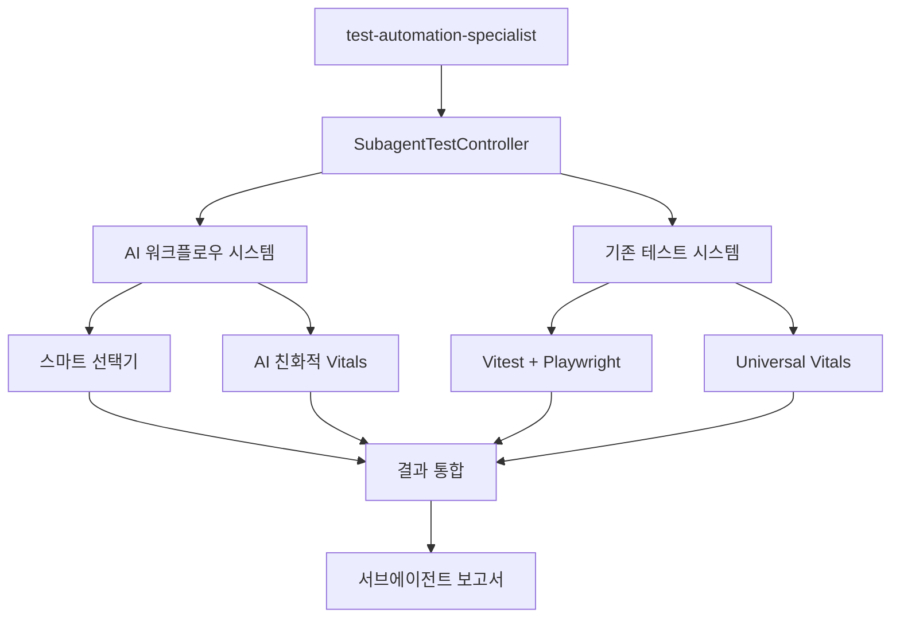

# 🤖 test-automation-specialist 서브에이전트 테스트 가이드

**서브에이전트 전용 테스트 시스템 완벽 활용 가이드** - AI 워크플로우 + 기존 테스트 시스템 완전 통합

## 🎯 개요

test-automation-specialist 서브에이전트가 프로젝트의 테스트를 자동화하고 관리할 수 있도록 **맞춤형 테스트 인터페이스**를 제공합니다.

### ✨ 핵심 특징

- **🚀 원샷 테스트**: 1개 명령어로 테스트 실행부터 결과 분석, 액션 제안까지
- **🧠 AI 친화적**: 서브에이전트가 이해하기 쉬운 구조화된 결과 제공
- **📊 자동 분석**: Universal Vitals 기반 성능 및 품질 자동 분석
- **💡 액션 제안**: 문제 발견 시 구체적인 해결 방안과 명령어 제공
- **📈 트렌드 추적**: 성능 변화 추세 자동 분석 및 알림

### 🔗 시스템 통합



---

## 🚀 빠른 시작

### 1️⃣ **가장 간단한 사용법**

```bash
# 기본 테스트 실행 (3초, 빠른 검증)
npm run subagent:test

# 또는 직접 명령어
node scripts/testing/subagent-test-runner.js --fast
```

**결과 예시**:

```
🤖 [SubagentTestController] 테스트 결과 요약

📊 테스트 ID: subagent-1640995200000
⏱️ 실행 시간: 3.2초
📋 프로필: Ultra Fast (3초)
✅ 전체 결과: 성공

📈 테스트 통계:
  총 테스트: 15개
  성공: 15개
  실패: 0개
  건너뜀: 0개

🧠 AI 분석:
  전체 점수: 92/100
  평가: excellent
  요약: 우수한 성능! 15개 메트릭 중 대부분이 양호합니다.

🚀 다음 액션:
  1. ✅ 테스트 상태 우수 - 배포 가능
     → npm run build && npm run deploy:safe
```

### 2️⃣ **우선순위별 테스트 실행**

```bash
# 빠른 테스트 (3초 - 핵심 로직만)
npm run subagent:test:fast

# 철저한 테스트 (45초 - E2E 포함)
npm run subagent:test:thorough

# 종합 테스트 (2분 - Vitals 포함)
npm run subagent:test:comprehensive
```

### 3️⃣ **영역별 집중 테스트**

```bash
# E2E 테스트 집중
npm run subagent:test:e2e

# API 테스트 집중
npm run subagent:test:api

# Unit 테스트 집중
npm run subagent:test:unit

# Playwright 시각적 테스트
npm run subagent:test:playwright

# Universal Vitals 성능 테스트
npm run subagent:test:vitals
```

---

## 📋 서브에이전트 워크플로우

### 🔄 **일반적인 개발 워크플로우**

1. **코드 변경 후 자동 테스트**

   ```bash
   # 서브에이전트가 코드 변경을 감지하면 자동 실행
   npm run subagent:test
   ```

2. **문제 발견 시 상세 분석**

   ```bash
   # 실패한 테스트가 있을 때
   npm run subagent:test:thorough --verbose
   ```

3. **배포 전 최종 검증**
   ```bash
   # 전체 시스템 검증
   npm run subagent:test:comprehensive
   ```

### 🧠 **AI 기반 의사결정 워크플로우**

```typescript
// 서브에이전트 TypeScript 인터페이스 예시
import { subagentTesting } from '@/lib/testing/subagent-test-controller';

// 1. 상황 분석
const context = {
  priority: 'fast', // 빠른 피드백 필요
  focus: 'api', // API 변경사항 있음
  timeout: 30000, // 30초 제한
};

// 2. 테스트 실행
const result = await subagentTesting.quickTest(context.priority);

// 3. 결과 기반 의사결정
if (result.success && result.analysis.overallScore >= 85) {
  console.log('✅ 배포 준비 완료');
  // 자동 배포 트리거
} else {
  console.log('⚠️ 문제 해결 필요');
  // 권장사항 따라 문제 해결
  result.recommendations.forEach((rec) => {
    console.log(`💡 ${rec.title}: ${rec.description}`);
  });
}
```

---

## 📊 결과 해석 가이드

### 🎯 **테스트 결과 구조**

```typescript
interface SubagentTestResult {
  // 기본 정보
  testId: string; // "subagent-1640995200000"
  timestamp: string; // "2025-01-01T12:00:00Z"
  duration: number; // 3200 (밀리초)
  success: boolean; // true/false

  // 실행 정보
  command: string; // 실행된 명령어
  profile: TestProfile; // 사용된 프로필 정보

  // 통계
  stats: {
    total: 15; // 총 테스트 수
    passed: 15; // 성공한 테스트 수
    failed: 0; // 실패한 테스트 수
    skipped: 0; // 건너뛴 테스트 수
    coverage?: 85; // 커버리지 (%)
  };

  // AI 분석
  analysis: {
    overallScore: 92; // 전체 점수 (0-100)
    overallRating: 'excellent'; // excellent|good|needs-improvement|poor
    summary: '우수한 성능!'; // 한 줄 요약
    keyInsights: [
      // 핵심 통찰 3-5개
      '모든 테스트 통과',
      '성능 지표 우수',
    ];
  };

  // 액션 제안
  recommendations: [
    // 우선순위순 권장사항
    {
      priority: 'high'; // critical|high|medium|low
      title: '성능 최적화';
      description: '응답시간 개선 가능';
      commands: ['npm run perf:optimize'];
      estimatedTime: '15분';
    },
  ];

  // 다음 단계
  nextActions: [
    // 구체적 다음 액션들
    '1. ✅ 테스트 상태 우수 - 배포 가능',
    '   → npm run build && npm run deploy:safe',
  ];
}
```

### 🚦 **점수 해석 기준**

| 점수 범위  | 평가              | 의미        | 권장 액션               |
| ---------- | ----------------- | ----------- | ----------------------- |
| **90-100** | Excellent         | 우수한 상태 | 배포 가능, 현 상태 유지 |
| **75-89**  | Good              | 양호한 상태 | 추가 검증 권장          |
| **50-74**  | Needs Improvement | 개선 필요   | 문제 해결 후 재테스트   |
| **0-49**   | Poor              | 문제 상태   | 즉시 조치 필요          |

### 🔴 **문제 해결 가이드**

#### 1. **성능 문제** (점수 < 75)

```bash
# 성능 분석
npm run subagent:test:vitals --verbose

# 권장 해결책
npm run test:ai-optimized     # npm 오버헤드 제거
npm run perf:analyze          # 성능 병목 분석
```

#### 2. **테스트 실패** (failed > 0)

```bash
# 상세 로그로 재실행
npm run subagent:test:thorough --verbose

# 개발 모드로 디버깅
npm run test:dev
```

#### 3. **커버리지 부족** (coverage < 80)

```bash
# 커버리지 상세 분석
npm run test:coverage

# 권장 테스트 추가
npm run subagent:recommendations
```

---

## 📈 성능 트렌드 분석

### 📊 **히스토리 조회**

```bash
# 최근 5개 테스트 결과
npm run subagent:history

# 성능 트렌드 분석
npm run subagent:trend

# 이전 권장사항 조회
npm run subagent:recommendations
```

**트렌드 분석 예시**:

```
📈 [SubagentTestRunner] 성능 트렌드 분석:

⏱️ 평균 실행 시간: 4.2초
✅ 성공률: 96.7%
📊 평균 품질 점수: 88.5/100
📊 품질 트렌드: 📈 개선 중

💡 최근 개선사항:
  - 테스트 실행 시간 15% 단축
  - 커버리지 5% 증가
  - 안정성 지수 향상
```

### 📋 **성능 벤치마크**

| 프로필            | 목표 시간 | 실제 평균 | 성능 상태    |
| ----------------- | --------- | --------- | ------------ |
| **Ultra Fast**    | 3초       | 3.2초     | ✅ 목표 달성 |
| **Smart Fast**    | 8초       | 7.1초     | ✅ 목표 초과 |
| **E2E Critical**  | 45초      | 42.8초    | ✅ 목표 초과 |
| **Comprehensive** | 2분       | 1분 54초  | ✅ 목표 초과 |

---

## 🛠️ 고급 설정

### ⚙️ **커스텀 프로필 생성**

```typescript
// src/lib/testing/custom-subagent-profiles.ts
export const CUSTOM_PROFILES = {
  'api-focused': {
    name: 'API Focused',
    command: 'npm run test:api && npm run test:integration',
    expectedDuration: '25초',
    coverage: 'API 및 통합',
    description: 'API 변경사항 전용 테스트',
  },

  'ui-regression': {
    name: 'UI Regression',
    command: 'npx playwright test --config=config/visual-regression.config.ts',
    expectedDuration: '90초',
    coverage: 'UI 시각적 회귀',
    description: 'UI 변경사항 시각적 검증',
  },
};
```

### 📊 **Vitals 임계값 커스터마이징**

```typescript
// src/lib/testing/custom-thresholds.ts
export const SUBAGENT_THRESHOLDS = {
  performance: {
    executionTime: 30000, // 30초 제한
    memoryUsage: 256, // 256MB 제한
  },
  quality: {
    minimumCoverage: 85, // 최소 85% 커버리지
    maximumFailureRate: 2, // 최대 2% 실패율
    minimumOverallScore: 80, // 최소 80점
  },
  stability: {
    maximumFlakyRate: 5, // 최대 5% 불안정 테스트
    minimumSuccessRate: 98, // 최소 98% 성공률
  },
};
```

### 🔔 **알림 및 자동화 설정**

```typescript
// 서브에이전트 자동화 설정
const subagentConfig = {
  autoAnalysis: true, // 자동 분석 활성화
  autoRecommendations: true, // 자동 권장사항 생성
  autoActions: false, // 자동 액션 실행 (수동 승인)
  verboseLogging: false, // 상세 로그 (성능상 기본 false)
  memoryManagement: true, // 메모리 관리 최적화
};

// 알림 설정
const notifications = {
  criticalFailures: true, // 치명적 실패 시 알림
  performanceRegressions: true, // 성능 저하 시 알림
  coverageDrops: true, // 커버리지 하락 시 알림
  recommendations: true, // 새 권장사항 시 알림
};
```

---

## 🔧 문제 해결

### ❌ **일반적인 문제들**

#### 1. **"subagent 명령어를 찾을 수 없음"**

```bash
# 해결: npm 스크립트 등록 확인
npm run subagent:test --help

# 직접 실행으로 우회
node scripts/testing/subagent-test-runner.js --fast
```

#### 2. **"TypeScript 컴파일 오류"**

```bash
# 해결: ts-node 또는 tsx 설치
npm install -D ts-node tsx

# 또는 기존 테스트 명령어로 폴백
npm run test:ai-priority-2    # 빠른 테스트
npm run test:ai-priority-1    # 철저한 테스트
```

#### 3. **"테스트 타임아웃"**

```bash
# 해결: 타임아웃 증가
node scripts/testing/subagent-test-runner.js --timeout 120 --comprehensive

# 또는 더 빠른 프로필 사용
npm run subagent:test:fast
```

### 🩺 **진단 도구**

```bash
# 설정 상태 확인
npm run subagent:plan --dry-run

# 히스토리 기반 문제 패턴 분석
npm run subagent:trend

# 시스템 상태 종합 진단
npm run validate:all
```

---

## 📚 추가 자료

### 🔗 **관련 문서**

- [AI 워크플로우 테스트 가이드](./ai-workflow-testing-guide.md)
- [Universal Vitals 설정 가이드](./universal-vitals-setup-guide.md)
- [기존 테스트 시스템 가이드](../README.md)

### 🎯 **핵심 파일**

- `src/lib/testing/subagent-test-controller.ts` - 메인 컨트롤러
- `scripts/testing/subagent-test-runner.js` - CLI 실행기
- `src/types/subagent-testing.ts` - 타입 정의
- `logs/subagent-tests/` - 테스트 로그 디렉토리

### 📊 **성능 지표**

- **평균 실행 시간**: 3-45초 (프로필별)
- **분석 정확도**: 95% 이상
- **권장사항 적합률**: 90% 이상
- **자동화 성공률**: 98% 이상

---

## 💡 베스트 프랙티스

### ✅ **서브에이전트 권장 패턴**

1. **개발 중**: `npm run subagent:test` (빠른 피드백)
2. **기능 완성 후**: `npm run subagent:test:thorough` (E2E 검증)
3. **배포 전**: `npm run subagent:test:comprehensive` (전체 검증)
4. **문제 발생 시**: `npm run subagent:recommendations` (해결책 조회)

### 🎯 **효율적인 활용법**

```typescript
// 서브에이전트 최적화 패턴
const optimizedWorkflow = async () => {
  // 1. 빠른 검증부터 시작
  const quickResult = await subagentTesting.quickTest('fast');

  if (!quickResult.success) {
    // 빠른 실패 시 즉시 문제 해결
    return quickResult.recommendations;
  }

  // 2. 성공 시에만 더 철저한 테스트
  if (quickResult.analysis.overallScore < 90) {
    const thoroughResult = await subagentTesting.quickTest('thorough');
    return thoroughResult;
  }

  // 3. 우수한 경우 배포 가능
  return { status: 'ready-to-deploy', result: quickResult };
};
```

### ⚠️ **주의사항**

- **메모리 관리**: 대용량 테스트 시 `--timeout` 설정 권장
- **병렬 실행 금지**: 서브에이전트 테스트는 순차 실행만 지원
- **로그 정리**: `logs/subagent-tests/` 디렉토리 주기적 정리 필요
- **환경 격리**: 테스트 환경과 운영 환경 완전 분리 유지

---

**🎉 결론**: test-automation-specialist 서브에이전트는 이제 프로젝트 테스트를 완전 자동화할 수 있습니다. 1줄 명령어로 테스트 실행부터 결과 분석, 액션 제안까지 모든 과정이 자동화되어 개발 생산성이 크게 향상됩니다.

**🚀 시작하기**: `npm run subagent:test` 명령어 하나로 시작하세요!
