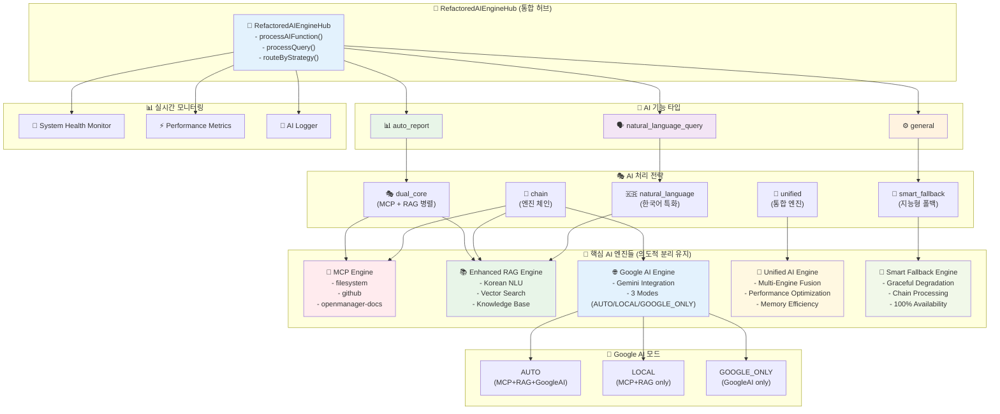

# 🏗️ 전체 AI 엔진 아키텍처 다이어그램

## Mermaid 다이어그램 코드

## 아키텍처 구성 요소

### 🎯 RefactoredAIEngineHub (통합 허브)

- **역할**: 모든 AI 요청의 중앙 진입점
- **기능**: 지능형 라우팅, 전략 선택, 결과 융합
- **특징**: 단일 책임 원칙, 높은 확장성

### 🔄 AI 기능 타입

1. **natural_language_query**: 자연어 질의 응답 처리
2. **auto_report**: 자동 장애 보고서 생성
3. **general**: 일반적인 AI 요청 처리

### 🎭 AI 처리 전략

1. **dual_core**: MCP + RAG 병렬 처리 (최고 정확도)
2. **smart_fallback**: 지능형 폴백 체인 (높은 가용성)
3. **unified**: 통합 엔진 처리 (빠른 응답)
4. **chain**: 순차적 엔진 체인 (단계적 처리)
5. **natural_language**: 한국어 특화 처리 (언어 최적화)

### 🤖 핵심 AI 엔진들

각 엔진은 고유한 역할과 책임을 가지며 의도적으로 분리됨:

#### MCP Engine (🔧)

- 외부 도구 및 파일시스템 접근
- 실제 시스템 데이터 수집
- 3개 서버 운영 (filesystem, github, openmanager-docs)

#### Enhanced RAG Engine (📚)

- 문서 기반 지식 검색
- 한국어 자연어 이해 (Korean NLU)
- 벡터 검색 및 지식 베이스 관리

#### Google AI Engine (🌐)

- Gemini 모델 통합
- 3가지 모드 지원 (AUTO/LOCAL/GOOGLE_ONLY)
- 최신 AI 기술 활용

#### Unified AI Engine (🚀)

- 멀티 엔진 융합
- 성능 최적화 및 메모리 효율성
- 실시간 데이터 처리

#### Smart Fallback Engine (🧠)

- Graceful Degradation
- 다단계 폴백 체인
- 100% 가용성 보장

### 🔄 Google AI 모드별 처리

- **AUTO**: 자동 최적화 (MCP+RAG+GoogleAI)
- **LOCAL**: 로컬 전용 (MCP+RAG only)
- **GOOGLE_ONLY**: Google AI 전용

### 📊 실시간 모니터링

- **System Health Monitor**: 시스템 헬스 체크
- **Performance Metrics**: 성능 지표 수집
- **AI Logger**: AI 상호작용 로깅

## 설계 원칙

### ✅ 의도적 분리 (Intentional Separation)

- 각 AI 엔진의 고유 역할과 책임 유지
- 단일 책임 원칙 (Single Responsibility Principle)
- 느슨한 결합 (Loose Coupling)

### ✅ 상호보완적 협업 (Complementary Collaboration)

- 여러 AI 엔진의 강점 융합
- 결과 가중 평균 및 신뢰도 계산
- 최적 응답 생성을 위한 협업

### ✅ 지능형 라우팅 (Intelligent Routing)

- 질의 의도 분석 기반 전략 선택
- 복잡도 및 요구사항 고려
- 동적 최적화 및 적응형 처리

### ✅ 100% 가용성 (Full Availability)

- 다단계 폴백 메커니즘
- Graceful Degradation
- 완전한 서비스 연속성 보장
