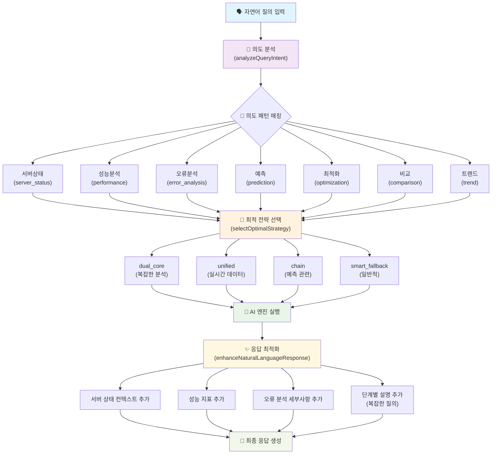

# 🗣️ 자연어 처리 방식 플로우 다이어그램

## Mermaid 다이어그램 코드

## 처리 단계 설명

### 1단계: 자연어 질의 입력

- 사용자가 한국어로 시스템 관련 질문 입력
- 예: "CPU 사용률이 높은 서버를 찾아주세요"

### 2단계: 의도 분석 (analyzeQueryIntent)

- 7가지 의도 패턴 매칭
- 정규표현식 기반 한국어 특화 분석
- 신뢰도 점수 계산

### 3단계: 최적 전략 선택 (selectOptimalStrategy)

- 의도 분석 결과 기반 전략 선택
- 복잡도 및 데이터 요구사항 고려
- 4가지 AI 처리 전략 중 최적 선택

### 4단계: AI 엔진 실행

- 선택된 전략에 따른 AI 엔진 조합 실행
- MCP, RAG, Google AI 등 적절한 조합 활용

### 5단계: 응답 최적화 (enhanceNaturalLanguageResponse)

- 의도별 응답 개선
- 컨텍스트 정보 추가
- 복잡한 질의의 경우 단계별 설명 추가

### 6단계: 최종 응답 생성

- 사용자 친화적 형태로 응답 포맷팅
- 추가 메트릭 및 권장사항 포함
- 한국어 자연어 응답 완성
