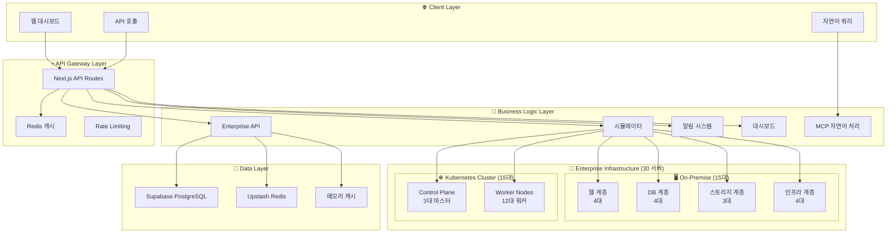

# 🏢 Enterprise IDC 아키텍처

OpenManager Vibe V5의 기업 환경을 위한 대규모 인프라 모니터링 시스템 설계 문서입니다.

## 📊 시스템 개요

### 인프라 구성
- **총 30대 서버**: 쿠버네티스 15대 + 온프레미스 15대
- **8개 IDC 랙**: IDC-A ~ IDC-H 지역별 분산
- **장애 시나리오**: 3개 Critical + 6개 Warning 연쇄 장애
- **비즈니스 패턴**: 시간대별 부하 최적화

## 🏗️ 시스템 아키텍처



## 🔧 핵심 컴포넌트

### 1. 서버 분류 체계
```typescript
interface ServerClassification {
  kubernetes: {
    masters: 3,      // Control Plane HA
    workers: 12      // Frontend(4) + Backend(4) + Data(4)
  },
  onPremise: {
    web: 4,         // HAProxy(2) + Web App(2)
    database: 4,    // Master(1) + Slave(2) + Cache(1)
    storage: 3,     // NFS(1) + Backup(1) + MinIO(1)
    infrastructure: 4 // Monitor(1) + Log(1) + Proxy(1) + DNS(1)
  }
}
```

### 2. 장애 시나리오 설계
```typescript
interface FailureScenario {
  critical: [
    "DB 마스터 서버 과부하 → 연쇄 영향",
    "K8s Control Plane 불안정 → Pod 장애",
    "스토리지 I/O 병목 → 백업 실패"
  ],
  warning: [
    "DB 슬레이브 읽기 부하 집중",
    "웹 애플리케이션 응답 지연",
    "K8s 워커 Pod 재시작",
    "K8s 스케줄링 지연",
    "백업 시스템 실패",
    "NFS 응답 지연"
  ]
}
```

### 3. 비즈니스 시간 패턴
```typescript
interface BusinessPattern {
  morning_peak: "09:00-12:00 (부하 8/10)",
  lunch_low: "12:00-13:00 (부하 3/10)",
  afternoon_peak: "13:00-17:00 (부하 10/10)",
  evening_decline: "17:00-18:00 (부하 5/10)",
  overnight_batch: "18:00-09:00 (부하 6/10)"
}
```

## 🚨 장애 분석 시스템

### 상관관계 분석
- **장애 전파 시간**: 3-8분
- **비즈니스 영향도**: 1-10 스케일
- **복구 우선순위**: 자동 계산

### AI 권장사항
```typescript
interface AIRecommendations {
  immediate: ["DB 최적화", "스토리지 확장", "K8s 재시작"],
  shortTerm: ["부하 분산", "Pod 재배치", "백업 중단"],
  longTerm: ["자동화 구축", "용량 계획", "예측 시스템"],
  preventive: ["모니터링 강화", "테스트 정기화"]
}
```

## 📈 성능 최적화

### 캐싱 전략
- **Enterprise API**: 1분 캐시
- **Dashboard**: 30초 캐시
- **Alerts**: 15초 캐시
- **MCP Query**: 5분 캐시

### 데이터 흐름
1. **실시간 메트릭**: 시뮬레이터 → Supabase
2. **캐시 계층**: Redis → 메모리 fallback
3. **API 응답**: 캐시 우선 → DB 조회

## 🔍 모니터링 지표

### SLA 목표
- **가용성**: 99.9% (현재: 97.2%)
- **응답시간**: 100ms (현재: 280ms)
- **처리량**: 1000 req/s (현재: 680 req/s)
- **오류율**: 0.1% (현재: 2.8%)

### 핵심 메트릭
- **서버 상태**: CPU, 메모리, 디스크, 네트워크
- **비즈니스 메트릭**: 처리량, 응답시간, 오류율
- **장애 메트릭**: MTTR, MTBF, 복구 성공률

## 🛠️ 운영 고려사항

### 확장성
- **수평 확장**: 서버 추가 시 자동 감지
- **수직 확장**: 메트릭 임계값 동적 조정
- **지역 확장**: 다중 IDC 지원

### 보안
- **API 인증**: 키 기반 접근 제어
- **데이터 암호화**: 전송/저장 시 암호화
- **감사 로그**: 모든 작업 기록

### 재해 복구
- **백업 정책**: 실시간 + 일일 백업
- **페일오버**: 자동 대체 서버 전환
- **복구 절차**: 우선순위 기반 복구

---

이 아키텍처는 실제 기업 환경의 복잡성을 시뮬레이션하여 AI 기반 모니터링 시스템의 효과를 검증하기 위해 설계되었습니다. 