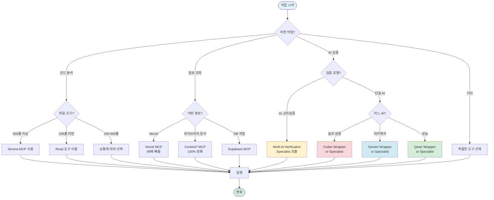
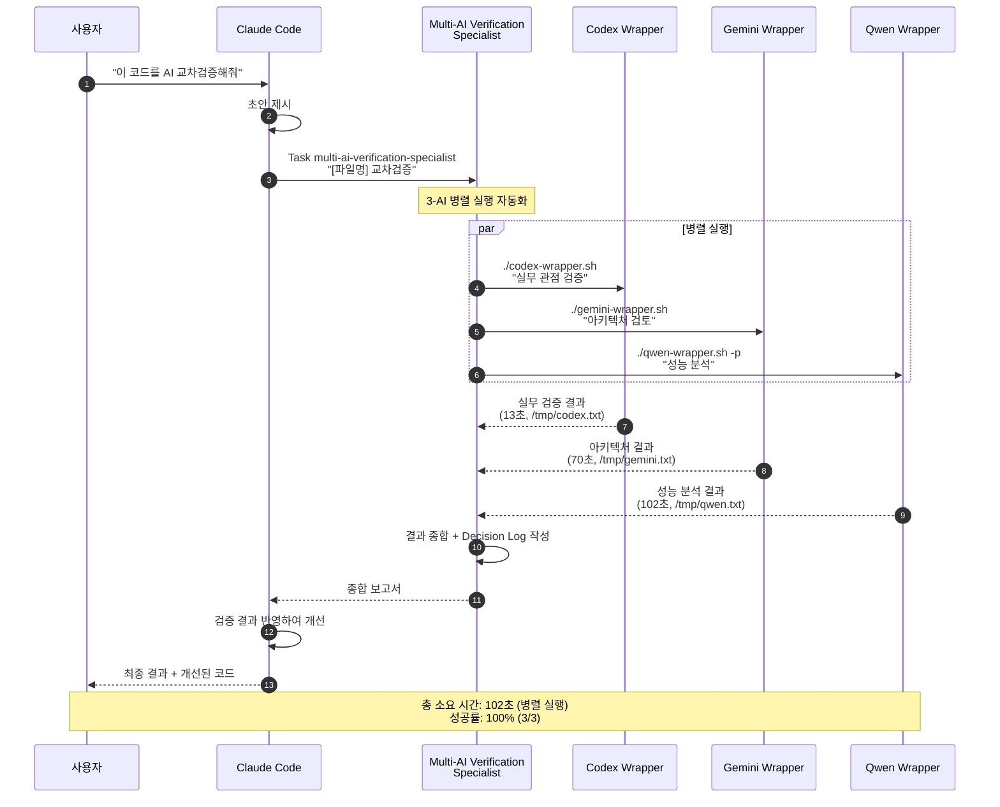
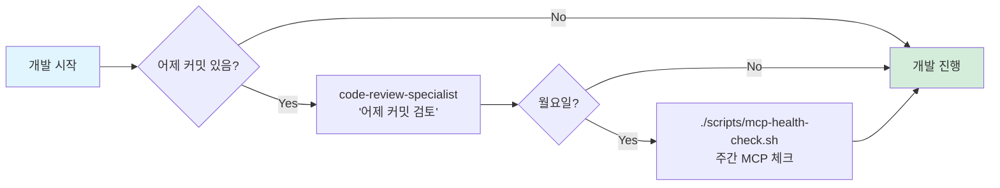
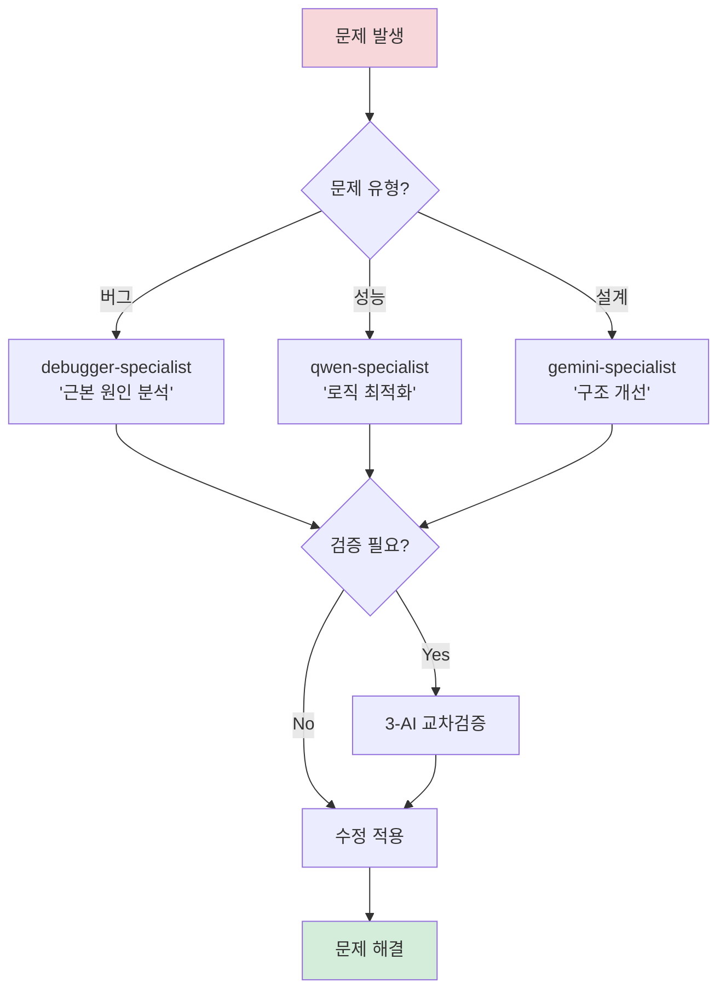
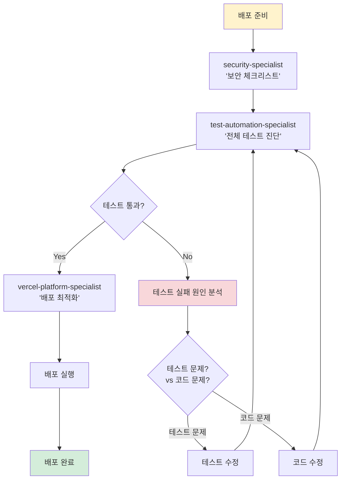
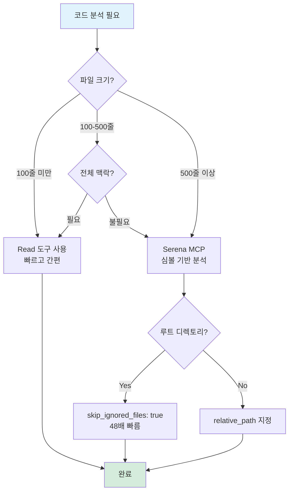
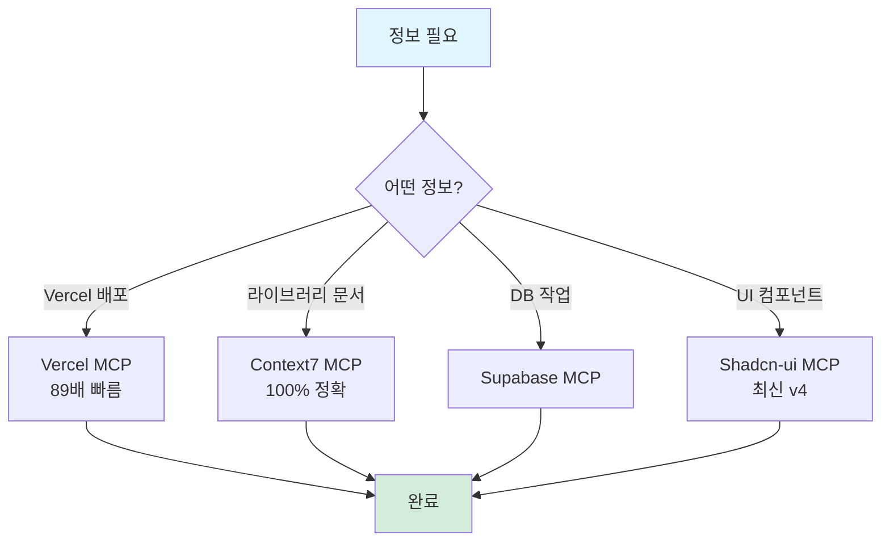
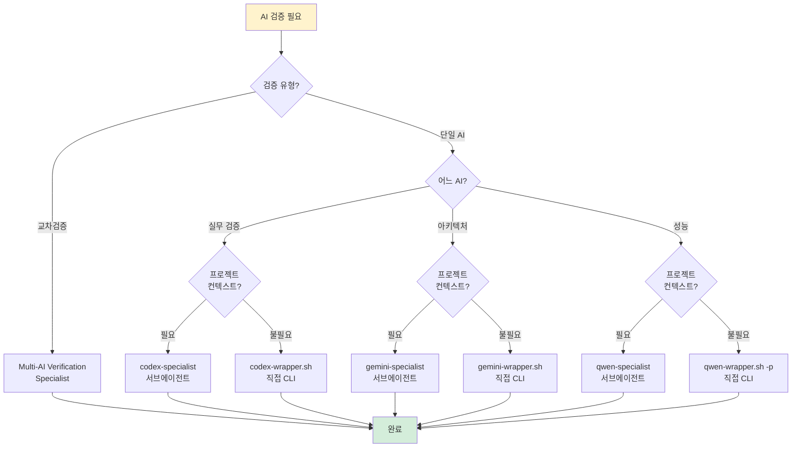

# AI 워크플로우 가이드

**MCP vs Wrapper 역할 명확화 및 재사용 가능한 호출 경로**

최종 업데이트: 2025-10-16

---

## 📊 Executive Summary

### 목적

- MCP와 Wrapper 간 역할 명확화
- 중복 로직 제거
- 재사용 가능한 호출 경로 문서화

### 핵심 원칙

1. **MCP 우선**: 통합 환경에서 직접 사용 (Claude Code 내장)
2. **Wrapper 보조**: 타임아웃 보호, 로깅, 외부 실행
3. **서브에이전트 위임**: 복잡한 작업 자동화

---

## 🔀 AI 도구 사용 결정 트리



---

## 🔧 MCP vs Wrapper 비교

### 역할 구분

| 구분          | MCP (Claude Code 내장)   | Wrapper (외부 스크립트)                  |
| ------------- | ------------------------ | ---------------------------------------- |
| **목적**      | 통합 환경 직접 사용      | 타임아웃 보호 + 로깅                     |
| **사용 상황** | 일반적인 개발 작업       | 외부 실행, 긴 작업                       |
| **호출 방법** | `mcp__[server]__[tool]`  | `./scripts/ai-subagents/[ai]-wrapper.sh` |
| **타임아웃**  | 없음 (무제한)            | 있음 (300-600초)                         |
| **로그**      | Claude Code 내부         | 파일 저장 (`/tmp/*.txt`)                 |
| **결과**      | 즉시 반환                | 파일 + stdout                            |
| **장점**      | 빠름, 통합, 간편         | 안전, 추적 가능, 재현                    |
| **단점**      | 타임아웃 없음, 로그 한계 | 외부 의존성, 설정 필요                   |

### 사용 가이드라인

#### MCP 사용 권장

```bash
# ✅ 일반적인 코드 분석
mcp__serena__get_symbols_overview("file.tsx")

# ✅ Vercel 정보 조회 (@open-mcp/vercel v0.0.13)
mcp__vercel__getprojects(teamId)  # 참고: list_projects → getprojects

# ✅ 라이브러리 문서
mcp__context7__get_library_docs("/vercel/next.js")
```

#### Wrapper 사용 권장

```bash
# ✅ 3-AI 교차검증 (타임아웃 보호)
./scripts/ai-subagents/codex-wrapper.sh "복잡한 분석"
./scripts/ai-subagents/gemini-wrapper.sh "아키텍처 검토"
./scripts/ai-subagents/qwen-wrapper.sh -p "성능 분석"

# ✅ 외부 스크립트/cron에서 실행
# ✅ 로그 파일이 필요한 경우
# ✅ 재현 가능성이 중요한 경우
```

---

## 🤖 3-AI 교차검증 플로우차트



### 핵심 포인트

1. **서브에이전트 위임 필수**: "AI 교차검증" 명시 시 multi-ai-verification-specialist 호출
2. **자동 병렬 실행**: Subagent가 3-AI Wrapper를 병렬로 실행
3. **타임아웃 보호**: 각 Wrapper에 타임아웃 설정 (Codex 300초, Gemini 300초, Qwen 600초)
4. **결과 파일 저장**: `/tmp/[ai]-[timestamp].txt`로 재현 가능
5. **Claude 최종 결정**: 검증 결과를 반영하여 Claude Code가 최종 개선

---

## 📅 일일 개발 워크플로우

### 🌅 아침 (개발 시작)



**명령어**:

```bash
# 1. 어제 커밋 검토 (있는 경우)
code-review-specialist: "어제 커밋한 코드 품질 검토"

# 2. MCP 헬스 체크 (월요일)
./scripts/mcp-health-check.sh
```

---

### 🔧 개발 중 (문제 해결)



**명령어**:

```bash
# 버그 발생 시
debugger-specialist: "이 에러의 근본 원인을 찾아주세요"

# 성능 문제 시
qwen-specialist: "이 로직을 더 효율적으로 개선해주세요"

# 설계 검토 시
gemini-specialist: "이 구조를 SOLID 관점에서 검토해주세요"

# 교차검증 필요 시
Task multi-ai-verification-specialist "[파일명] 교차검증"
```

---

### 🚀 배포 전 (품질 검증)



**명령어**:

```bash
# 1. 보안 체크
security-specialist: "배포 전 보안 체크리스트 확인"

# 2. 테스트 진단 및 실행
test-automation-specialist: "전체 테스트를 진단하고 실행"

# 3. 배포 최적화
vercel-platform-specialist: "Vercel 배포 설정 최적화"

# 4. 배포 실행
git push  # Vercel 자동 배포
```

---

## 🎯 의사결정 가이드

### 시나리오 1: 코드 분석



**사용 예시**:

```typescript
// ✅ 작은 파일 (100줄 미만)
Read('src/utils/helper.ts');

// ✅ 큰 파일 (500줄 이상)
mcp__serena__get_symbols_overview('src/components/Dashboard.tsx');
mcp__serena__find_symbol('handleSubmit', {
  relative_path: 'src/components/Dashboard.tsx',
  include_body: true,
  skip_ignored_files: true, // 루트 작업 시 필수
});
```

---

### 시나리오 2: 정보 조회



**사용 예시**:

```typescript
// ✅ Vercel 정보 (89배 빠름) (@open-mcp/vercel v0.0.13)
mcp__vercel__getprojects(teamId); // list_projects → getprojects
mcp__vercel__getdeployment(deploymentId, teamId); // get_deployment → getdeployment

// ✅ 라이브러리 문서 (100% 정확)
mcp__context7__resolve_library_id('Next.js');
mcp__context7__get_library_docs('/vercel/next.js', { topic: 'server-actions' });

// ✅ UI 컴포넌트 (최신 v4)
mcp__shadcn_ui__get_component('button');
mcp__shadcn_ui__get_component_demo('button');
```

---

### 시나리오 3: AI 검증



**사용 예시**:

```bash
# ✅ 3-AI 교차검증 (프로젝트 컨텍스트 필요)
Task multi-ai-verification-specialist "LoginClient.tsx 교차검증"

# ✅ 서브에이전트 (프로젝트 컨텍스트 필요)
codex: "타입스크립트 안전성을 전체 분석해주세요"
gemini: "시스템 아키텍처 설계를 검토해주세요"
qwen: "알고리즘 성능을 최적화 분석해주세요"

# ✅ 직접 CLI (간단한 질문)
codex exec "이 함수에 버그 있나요?"
gemini "이 구조가 SOLID 원칙에 맞나요?"
qwen -p "시간복잡도는?"
```

---

## 📊 중복 로직 제거 매트릭스

### Before (중복 존재)

| 작업            | MCP         | Wrapper | Specialist | 중복도 |
| --------------- | ----------- | ------- | ---------- | ------ |
| Codex 실무 검증 | ❌          | ✅      | ✅         | 50%    |
| Gemini 아키텍처 | ❌          | ✅      | ✅         | 50%    |
| Qwen 성능 분석  | ❌          | ✅      | ✅         | 50%    |
| Vercel 조회     | ✅          | ❌      | ✅         | 50%    |
| 코드 분석       | ✅ (Serena) | ❌      | ❌         | 0%     |

**문제**: MCP-Wrapper-Specialist 간 역할 불명확, 중복 오케스트레이션

---

### After (역할 명확화)

| 작업            | MCP            | Wrapper            | Specialist             | 역할       |
| --------------- | -------------- | ------------------ | ---------------------- | ---------- |
| Codex 실무 검증 | ❌             | ✅ (타임아웃 보호) | ✅ (프로젝트 컨텍스트) | **분리됨** |
| Gemini 아키텍처 | ❌             | ✅ (타임아웃 보호) | ✅ (프로젝트 컨텍스트) | **분리됨** |
| Qwen 성능 분석  | ❌             | ✅ (타임아웃 보호) | ✅ (프로젝트 컨텍스트) | **분리됨** |
| Vercel 조회     | ✅ (일반 조회) | ❌                 | ✅ (배포 최적화)       | **분리됨** |
| 코드 분석       | ✅ (Serena)    | ❌                 | ❌                     | **단일**   |

**해결**:

- **Wrapper**: 타임아웃 보호 + 로깅 (외부 실행, 재현 가능)
- **Specialist**: 프로젝트 컨텍스트 활용 (복잡한 분석)
- **MCP**: 통합 환경 직접 사용 (일반 작업)

---

## 🎯 빠른 참조 체크리스트

### 작업 시작 전

- [ ] **코드 분석?** → 파일 크기 확인 (100줄/500줄 기준)
  - 100줄 미만: Read
  - 500줄 이상: Serena MCP
  - 루트 작업: `skip_ignored_files: true`

- [ ] **정보 조회?** → MCP 우선
  - Vercel: Vercel MCP (89배 빠름)
  - 라이브러리: Context7 MCP (100% 정확)
  - DB: Supabase MCP

- [ ] **AI 검증?** → 유형 확인
  - 교차검증: Multi-AI Verification Specialist
  - 단일 AI: Specialist (프로젝트 컨텍스트) vs Wrapper (간단한 질문)

### AI 검증 전

- [ ] **프로젝트 컨텍스트 필요?**
  - Yes: Specialist 서브에이전트
  - No: Wrapper 직접 CLI

- [ ] **타임아웃 우려?**
  - Yes: Wrapper (300-600초 보호)
  - No: Specialist 또는 MCP

- [ ] **로그 파일 필요?**
  - Yes: Wrapper (`/tmp/*.txt`)
  - No: Specialist 또는 MCP

---

## 📚 관련 문서

- **AI Registry**: config/ai/registry-core.yaml (SSOT)
- **3-AI 쿼리 최적화**: docs/ai/3-ai-query-optimization-guide.md
- **서브에이전트 가이드**: docs/ai/subagents-complete-guide.md
- **Multi-AI 전략**: docs/claude/environment/multi-ai-strategy.md
- **MCP 우선순위**: docs/claude/environment/mcp/mcp-priority-guide.md

---

## 💡 핵심 원칙

1. **MCP 우선**: 통합 환경 직접 사용 (일반 작업)
2. **Wrapper 보조**: 타임아웃 보호 + 로깅 (외부 실행)
3. **Specialist 활용**: 프로젝트 컨텍스트 필요 시
4. **역할 명확화**: 중복 없이 각자의 역할
5. **의사결정 간소화**: 플로우차트로 빠른 판단

---

**💬 피드백**: 이 워크플로우가 도움이 되었다면 AI Registry (config/ai/registry-core.yaml)를 업데이트하세요!

🤖 Generated with [Claude Code](https://claude.com/claude-code)

Co-Authored-By: Claude <noreply@anthropic.com>
