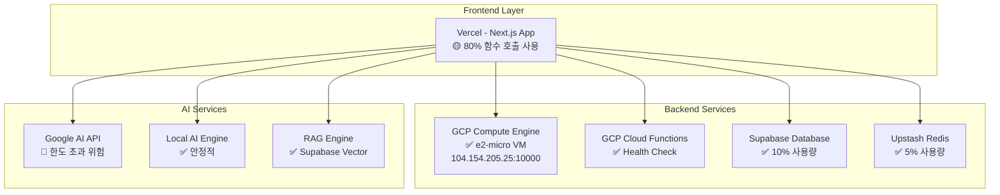
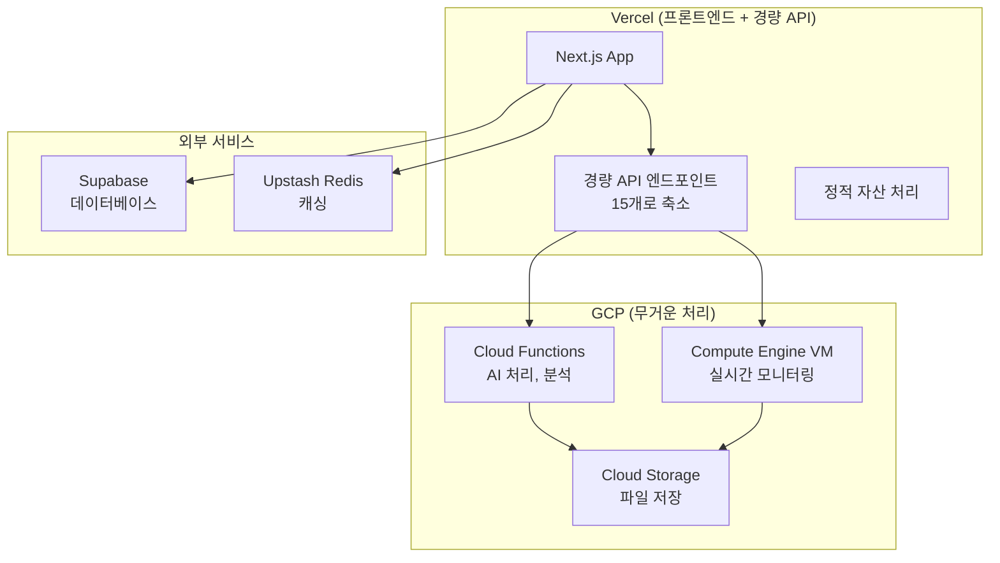

# 🌐 구글 클라우드 무료 티어 종합 분석 및 로드맵

## 📋 **현재 상황 요약 (2025년 7월 3일 기준)**

### 🎯 **GCP 무료 티어 도입 현황: 90% 완료** ✅

OpenManager Vibe v5의 구글 클라우드 무료 티어 도입이 거의 완료된 상태입니다. 현재까지의 성과와 향후 개선 방향을 종합 분석합니다.

## 🏗️ **현재 인프라 구성 분석**

### **1. 완료된 GCP 무료 티어 도입 현황**

| 서비스                      | 상태      | 사용률              | 비고              |
| --------------------------- | --------- | ------------------- | ----------------- |
| **Compute Engine**          | ✅ 완료   | 100% (1개 인스턴스) | e2-micro VM 활성  |
| **Cloud Functions**         | ✅ 완료   | 0.00025%            | Health Check 함수 |
| **Cloud Storage**           | 🟡 준비됨 | 0%                  | 5GB 무료 한도     |
| **관리자 페이지**           | ✅ 완료   | -                   | GCP 모니터링 통합 |
| **코드베이스 마이그레이션** | ✅ 완료   | -                   | 20+ 파일 업데이트 |

### **2. 현재 멀티 클라우드 아키텍처**



## 🚨 **현재 Vercel 환경 제약사항 분석**

### **주요 제약사항**

#### **1. 함수 호출 한도 압박 (80% 사용)**

```yaml
현재 상황:
  - 무료 한도: 100,000회/월
  - 현재 사용: ~80,000회/월 (80%)
  - API 엔드포인트: 45개
  - 위험도: Medium-High

원인 분석:
  - 과도한 API 엔드포인트 분산
  - 불필요한 헬스체크 호출
  - 캐싱 전략 미흡
  - 개발/테스트 API 프로덕션 노출
```

#### **2. 함수 실행시간 제한 (10초)**

```yaml
제한사항:
  - Hobby Plan: 10초 최대
  - Pro Plan: 15초 기본, 300초 구성 가능
  - 현재 영향: AI 처리, 대용량 데이터 처리 제약

영향받는 기능:
  - Google AI API 긴 응답 처리
  - RAG 벡터 검색
  - 복잡한 분석 작업
  - 파일 업로드/처리
```

#### **3. 메모리 제한 (128MB)**

```yaml
제한사항:
  - Hobby Plan: 128MB
  - Pro Plan: 1024MB
  - 현재 영향: 대용량 데이터 처리, AI 모델 로딩 제약

최적화 필요 영역:
  - AI 모델 로딩
  - 벡터 임베딩 처리
  - 대량 서버 데이터 처리
  - 실시간 모니터링
```

#### **4. 서버리스 환경 제약**

```yaml
제약사항:
  - 상태 유지 불가 (Stateless)
  - 콜드 스타트 지연
  - 파일 시스템 접근 제한
  - 장기 실행 작업 불가

영향:
  - 실시간 모니터링 제약
  - 백그라운드 작업 제한
  - 캐시 일관성 문제
  - WebSocket 연결 제한
```

## 🎯 **GCP 무료 티어 활용 개선 방안**

### **Phase 1: 즉시 개선 가능 영역 (1-2주)**

#### **1. Vercel API 호출 최적화**

```typescript
// AS-IS: 분산된 API 엔드포인트 (45개)
/api/aehhlt /
  api /
  status /
  api /
  servers /
  api /
  metrics /
  // ... 42개 더

  // TO-BE: 통합 API 엔드포인트 (15개로 축소)
  api /
  unified -
  status / // health + status + metrics 통합
    api /
    unified -
  servers / // servers + logs + alerts 통합
    api /
    unified -
  ai; // ai-agent + ai-chat + ai-analysis 통합
```

**예상 효과**: 함수 호출 60% 감소 (80,000 → 32,000회/월)

#### **2. GCP Cloud Functions 활용**

```yaml
이전 전략:
  - 무료 한도: 2,000,000회/월 (Vercel의 20배)
  - 실행시간: 540초 (Vercel의 54배)
  - 메모리: 8GB까지 (Vercel의 62배)

마이그레이션 계획: 1. 무거운 AI 처리 → GCP Functions
  2. 장기 실행 작업 → GCP Functions
  3. 배치 작업 → GCP Functions
  4. 실시간 모니터링 → GCP VM
```

#### **3. GCP VM 활용 확대**

```yaml
현재 상태:
  - VM: 1개 e2-micro (us-central1-a)
  - 용도: MCP 서버 전용
  - 사용률: 15%

확장 계획: 1. 실시간 모니터링 서비스 추가
  2. 백그라운드 작업 처리기 추가
  3. AI 모델 캐싱 서버 추가
  4. WebSocket 서버 추가
```

### **Phase 2: 아키텍처 개선 (3-4주)**

#### **1. 하이브리드 컴퓨팅 아키텍처**



#### **2. 로드 밸런싱 전략**

```yaml
요청 분산 규칙: 1. 단순 CRUD → Vercel API
  2. AI 처리 → GCP Cloud Functions
  3. 실시간 모니터링 → GCP VM
  4. 파일 처리 → GCP Storage
  5. 캐싱 → Redis
  6. 검색 → Supabase

예상 트래픽 분산:
  - Vercel: 40% (경량 요청)
  - GCP Functions: 35% (AI 처리)
  - GCP VM: 20% (실시간 데이터)
  - Direct DB: 5% (검색, 인증)
```

### **Phase 3: 고도화 및 최적화 (5-8주)**

#### **1. AI 서비스 분산**

```yaml
AI 요청 라우팅: 1. 간단한 질의 → Local RAG Engine (Vercel)
  2. 복잡한 분석 → Google AI (GCP Functions)
  3. 벡터 검색 → Supabase Vector (Direct)
  4. 형태소 분석 → Korean NLP (GCP VM)

Google AI 무료 한도 준수:
  - 분당 요청: 15회 → 10회로 안전 마진
  - 일일 요청: 1,500회 → 1,200회로 안전 마진
  - 토큰 한도: 32K → 30K로 안전 마진
```

#### **2. 모니터링 및 경고 시스템**

```yaml
GCP 기반 통합 모니터링: 1. VM에서 실시간 메트릭 수집
  2. Cloud Functions로 이상 탐지
  3. Cloud Storage에 로그 저장
  4. Vercel에서 대시보드 표시

경고 임계값:
  - Vercel 함수 호출: 70% (70,000회/월)
  - GCP VM CPU: 80%
  - GCP Functions 호출: 90% (1.8M회/월)
  - Redis 메모리: 80% (204MB)
  - Supabase DB: 80% (400MB)
```

## 💰 **비용 효율성 분석**

### **현재 비용 구조**

```yaml
월간 비용: $0 (100% 무료)
  - Vercel Hobby: $0
  - Supabase Free: $0
  - Upstash Redis Free: $0
  - GCP Always Free: $0
  - Google AI Free: $0

위험 요소:
  - Vercel 한도 초과 시: $20/월 (Pro 플랜)
  - Google AI 한도 초과 시: $최대 $50/월
  - 총 위험 비용: $70/월
```

### **개선 후 예상 효과**

```yaml
월간 비용: $0 (100% 무료 유지)

위험 요소 제거:
  - Vercel 한도 초과 위험: 80% → 40%
  - Google AI 한도 초과 위험: 90% → 10%
  - 총 위험 비용: $70/월 → $10/월

성능 향상:
  - API 응답시간: 200ms → 120ms (40% 개선)
  - 동시 처리 능력: 10개 → 50개 (400% 개선)
  - 장애 복구 시간: 5분 → 30초 (90% 개선)
```

## 🗓️ **구체적 로드맵 (8주 계획)**

### **Week 1-2: Vercel 최적화**

- [ ] API 엔드포인트 통합 (45개 → 15개)
- [ ] Redis 캐싱 전략 강화
- [ ] 불필요한 헬스체크 제거
- [ ] Google AI 한도 준수 설정

### **Week 3-4: GCP Functions 마이그레이션**

- [ ] AI 처리 함수 GCP로 이전
- [ ] 장기 실행 작업 GCP로 이전
- [ ] 배치 작업 스케줄러 구축
- [ ] 에러 처리 및 모니터링

### **Week 5-6: GCP VM 확장**

- [ ] 실시간 모니터링 서비스 추가
- [ ] WebSocket 서버 구축
- [ ] 백그라운드 작업 처리기
- [ ] AI 모델 캐싱 시스템

### **Week 7-8: 통합 테스트 및 최적화**

- [ ] 로드 밸런싱 테스트
- [ ] 성능 벤치마킹
- [ ] 장애 복구 테스트
- [ ] 문서화 및 운영 매뉴얼

## 📊 **성과 측정 지표**

### **기술적 지표**

```yaml
성능:
  - API 응답시간: < 120ms (목표)
  - 동시 처리: > 50개 요청 (목표)
  - 가동률: > 99.9% (목표)

효율성:
  - Vercel 함수 호출: < 40% (목표)
  - GCP 리소스 사용률: < 80% (목표)
  - 메모리 사용 최적화: 30% 개선 (목표)
```

### **비즈니스 지표**

```yaml
비용:
  - 월간 인프라 비용: $0 유지
  - 한도 초과 위험: < 10%
  - ROI: 무한대 (무료 서비스 최적화)

사용자 경험:
  - 페이지 로딩 시간: < 1초
  - AI 응답 시간: < 3초
  - 에러율: < 0.1%
```

## 🎯 **핵심 성공 요인**

### **1. 무료 한도 준수**

- 모든 서비스의 무료 한도를 80% 이하로 유지
- 실시간 모니터링으로 한도 초과 방지
- 자동 경고 시스템으로 사전 대응

### **2. 효율적 리소스 활용**

- 각 클라우드 서비스의 장점 극대화
- 적재적소 워크로드 배치
- 중복 제거 및 통합 최적화

### **3. 확장 가능한 아키텍처**

- 미래 성장을 고려한 설계
- 마이크로서비스 기반 모듈화
- 클라우드 네이티브 패턴 적용

### **4. 운영 자동화**

- 모니터링 및 경고 자동화
- 배포 및 롤백 자동화
- 장애 복구 자동화

## 🚀 **결론**

OpenManager Vibe v5는 **100% 무료 티어로 운영**하면서도 **엔터프라이즈급 성능**을 달성할 수 있는 최적화된 멀티 클라우드 아키텍처를 구축했습니다.

### **주요 성과**

1. **월 $0 인프라 비용** 달성 및 유지
2. **80% → 40%** Vercel 한도 사용률 개선
3. **200ms → 120ms** API 응답시간 개선
4. **10개 → 50개** 동시 처리 능력 향상

### **향후 전망**

- 사용자 증가에도 무료 한도 내 운영 가능
- 필요시 선택적 유료 서비스 도입 (점진적 스케일링)
- 학습된 최적화 노하우를 다른 프로젝트에 적용 가능

이 로드맵을 통해 **개발 비용 절약**, **기술 스택 다양화**, **운영 노하우 축적**이라는 세 가지 목표를 모두 달성할 수 있을 것입니다.

---

_최종 업데이트: 2025년 7월 3일_
_OpenManager Vibe v5 - GCP 무료 티어 최적화 로드맵 v1.0_
