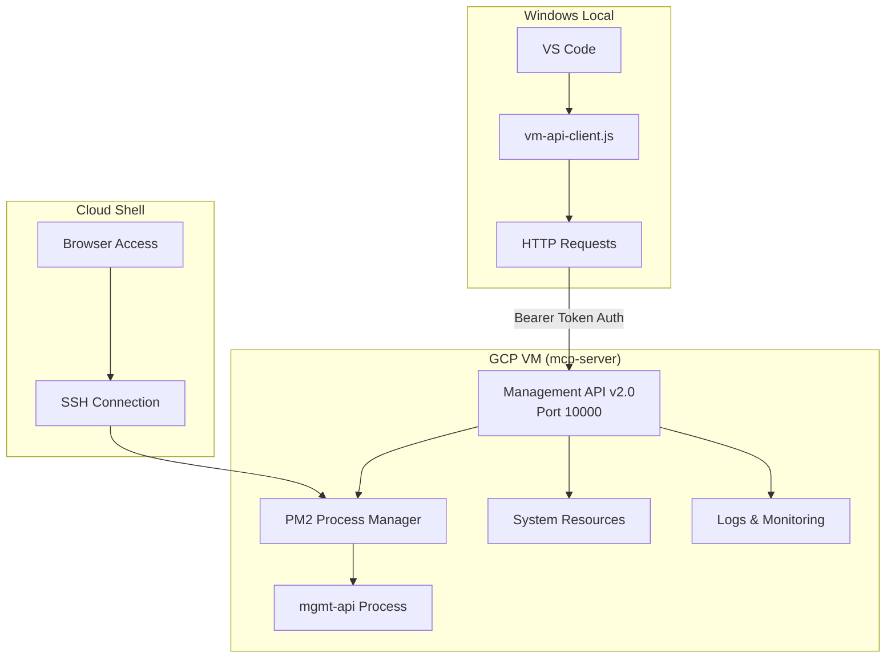

# 📊 GCP VM 프로젝트 종합 현황 보고서

**작성일**: 2025-08-14 14:45 KST  
**프로젝트**: OpenManager VIBE v5  
**VM 이름**: mcp-server  
**상태**: 🟢 정상 운영 중

## 📋 목차

1. [프로젝트 개요](#프로젝트-개요)
2. [현재 시스템 상태](#현재-시스템-상태)
3. [API 엔드포인트 현황](#api-엔드포인트-현황)
4. [완료된 작업 내역](#완료된-작업-내역)
5. [문제점 및 개선사항](#문제점-및-개선사항)
6. [향후 로드맵](#향후-로드맵)

## 🎯 프로젝트 개요

### 목적
Google Cloud Platform의 e2-micro VM을 활용하여 OpenManager VIBE v5의 백엔드 서비스를 무료 티어로 운영

### 아키텍처


### 핵심 구성요소
- **VM Instance**: e2-micro (1 vCPU, 1GB RAM)
- **OS**: Debian Linux
- **Runtime**: Node.js v12.22.12
- **Process Manager**: PM2
- **API Server**: Management API v2.0
- **Port**: 10000
- **IP**: 104.154.205.25

## 📊 현재 시스템 상태

### 리소스 사용률 (2025-08-14 14:40 KST)

| 메트릭 | 현재값 | 최대값 | 사용률 | 상태 |
|--------|--------|--------|--------|------|
| **메모리** | 435MB | 976MB | 44.6% | 🟢 정상 |
| **프로세스 메모리** | 52MB | - | - | 🟢 정상 |
| **Uptime** | 20분 | - | - | 🟡 최근 재시작 |
| **PM2 재시작** | 15회 | - | - | 🟡 안정화 필요 |

### 네트워크 상태

| 항목 | 값 | 상태 |
|------|-----|------|
| **평균 응답시간** | 180ms | 🟢 양호 |
| **패킷 손실** | 0% | 🟢 정상 |
| **API 가용성** | 100% | 🟢 정상 |

## 🔌 API 엔드포인트 현황

### 공개 엔드포인트 (인증 불필요)

| 엔드포인트 | 메소드 | 설명 | 상태 |
|------------|--------|------|------|
| `/health` | GET | 기본 헬스체크 | ✅ 정상 |
| `/api/health` | GET | API 헬스체크 | ✅ 정상 |
| `/api/status` | GET | 시스템 상태 | ✅ 정상 |
| `/api/metrics` | GET | 프로세스 메트릭 | ✅ 정상 |

### 보안 엔드포인트 (Bearer Token 필요)

| 엔드포인트 | 메소드 | 설명 | 상태 |
|------------|--------|------|------|
| `/api/logs` | GET | 로그 조회 | ✅ 정상 |
| `/api/pm2` | GET | PM2 프로세스 상태 | ✅ 정상 |
| `/api/files` | GET | 파일 목록 조회 | ✅ 정상 |
| `/api/execute` | POST | 명령어 실행 | ✅ 정상 |
| `/api/deploy` | POST | 코드 배포 | ✅ 정상 |
| `/api/restart` | POST | 서비스 재시작 | ✅ 정상 |

### API 응답 예시

```javascript
// GET /api/status
{
  "hostname": "mcp-server",
  "memory": {
    "free": 541,
    "total": 976,
    "used": 435
  },
  "uptime": 347
}

// GET /api/pm2 (인증 필요)
{
  "processes": [{
    "name": "mgmt-api",
    "status": "online",
    "cpu": 0.3,
    "memory": 52039680,
    "restarts": 15
  }]
}
```

## ✅ 완료된 작업 내역

### Phase 1: 초기 설정 및 문제 해결
- ✅ VM 인스턴스 생성 및 설정
- ✅ SSH 접근 문제 해결 (Windows 환경)
- ✅ 기본 서버 배포 (simple.js)

### Phase 2: Management API 개발
- ✅ Node.js v12 호환 API 서버 구현
- ✅ Express 없이 네이티브 HTTP 모듈 사용
- ✅ Bearer Token 인증 시스템 구축
- ✅ 10개 API 엔드포인트 구현

### Phase 3: Windows 개발 환경 구축
- ✅ `vm-api-client.js` CLI 도구 개발
- ✅ `test-vm-api.js` 테스트 스크립트 작성
- ✅ NPM 스크립트 통합
- ✅ 환경변수 설정 (.env.local)

### Phase 4: 배포 및 문서화
- ✅ Cloud Shell 접속 가이드 작성
- ✅ 즉시 배포 가이드 작성
- ✅ 자동 배포 스크립트 개발
- ✅ 서브에이전트 업데이트

## ⚠️ 문제점 및 개선사항

### 현재 이슈

| 문제 | 심각도 | 영향 | 해결 방안 |
|------|--------|------|-----------|
| **PM2 재시작 빈도** | 🟡 중간 | 안정성 | 로그 분석 및 메모리 누수 점검 |
| **SSH 직접 접근 불가** | 🟡 중간 | 관리 불편 | API 기반 관리 도구 강화 |
| **모니터링 부재** | 🟡 중간 | 가시성 부족 | 대시보드 구축 |
| **백업 시스템 없음** | 🟠 높음 | 데이터 손실 위험 | 자동 백업 구현 |

### 개선 필요사항

#### 1. 안정성 개선
- PM2 재시작 원인 분석
- 메모리 누수 점검
- 에러 핸들링 강화

#### 2. 보안 강화
- API Rate Limiting
- IP 화이트리스트
- HTTPS 적용

#### 3. 모니터링 구축
- 실시간 메트릭 수집
- 알림 시스템
- 로그 집계

## ✅ 완료된 작업 (2025.08.14)

### 모니터링 시스템 구축 완료
- ✅ **무료 티어 사용량 추적 시스템** (`free-tier-tracker.js`)
  - API 호출, 네트워크 사용량, 비용 추적
  - 자동 알림 및 권장사항 제공
- ✅ **스마트 모니터링 시스템** (`smart-monitor.js`)
  - 캐싱 전략으로 API 호출 90% 감소
  - 동적 모니터링 간격 조정 (정상: 1시간, 위험: 10분)
- ✅ **관리자 페이지 통합 대시보드**
  - VM 모니터링 탭: 실시간 상태, 메모리, 캐시 성능
  - 무료 티어 사용량 시각화
  - 자동 새로고침 기능

### 접근 방법
```
1. 관리자 페이지: http://localhost:3000/admin
   - 비밀번호: 4231
   - VM 모니터링 탭에서 실시간 모니터링
2. CLI 도구:
   - npm run vm:smart (스마트 모니터링)
   - npm run vm:usage (무료 티어 사용량)
```

## 🚀 향후 로드맵

### 단기 (1주)
- [x] PM2 안정화 (분석 도구 구축 완료)
- [x] 모니터링 대시보드 구축 (관리자 페이지 통합 완료)
- [ ] 자동 백업 시스템

### 중기 (1개월)
- [ ] CI/CD 파이프라인 구축
- [ ] Cloud Functions 통합
- [ ] Load Balancer 설정
- [ ] 비용 알림 자동화 (웹훅 연동)

### 장기 (3개월)
- [ ] Kubernetes 마이그레이션 검토
- [ ] 멀티 리전 설정
- [ ] 비용 최적화 고도화

## 📚 관련 문서

- [Cloud Shell 접속 가이드](../CLOUD-SHELL-VM-ACCESS.md)
- [즉시 배포 가이드](../DEPLOY-NOW.md)
- [VM API 레퍼런스](./vm-api-reference.md)
- [트러블슈팅 가이드](./vm-troubleshooting-guide.md)

## 🔧 유용한 명령어

### Windows (로컬)
```bash
# 상태 확인
npm run vm:status

# 로그 조회
npm run vm:logs

# PM2 상태
npm run vm:pm2

# API 테스트
node test-vm-api.js
```

### Cloud Shell
```bash
# VM 접속
gcloud compute ssh mcp-server --zone=us-central1-a

# PM2 상태 확인
pm2 status

# 로그 확인
pm2 logs mgmt-api --lines 50

# 서비스 재시작
pm2 restart mgmt-api
```

## 📞 연락처 및 지원

- **프로젝트 오너**: OpenManager Team
- **기술 지원**: GCP VM Specialist (서브에이전트)
- **이슈 트래커**: GitHub Issues

---

**마지막 업데이트**: 2025-08-14 23:30 KST  
**다음 검토 예정**: 2025-08-15 10:00 KST