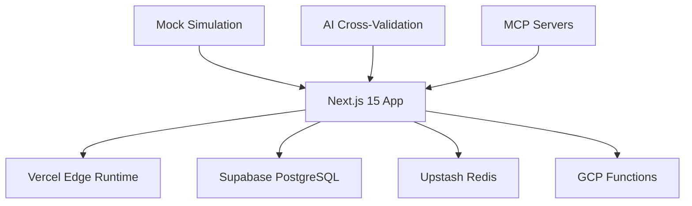

# System Architecture

## 🏗️ Current Stack (v5.77)



## 📊 Key Metrics

```typescript
// Current System State (2025.09.09)
const systemStats = {
  codebase: "229,451 lines (881 TS files)",
  apis: "76 functional endpoints", 
  architecture: "Feature-based layered",
  typescript: "100% strict mode",
  completion: "90% portfolio level"
}
```

## 🎯 Architecture Principles

```typescript
// Feature-First Structure
src/
├── app/           // Next.js App Router
├── components/    // Reusable UI components
├── lib/           // Core utilities
├── services/      // Business logic
├── hooks/         // React hooks
└── types/         // TypeScript definitions

// Layer Responsibilities
- Presentation: React components + UI
- Business: Service layer + hooks
- Data: Supabase queries + caching
- External: GCP Functions + MCP
```

## 🔄 Data Flow

```typescript
// Request Flow
User → Next.js → Service Layer → Supabase/External APIs
     ← Response ← Caching Layer ← Processing

// AI Analysis Flow
Query → AI Router → GCP Functions → Gemini API
      ← Response ← Processing ← Analysis
```

## 🎲 Mock Simulation System

```typescript
// FNV-1a Hash Based Metrics
const generateRealisticMetrics = (serverId: string, timestamp: number) => {
  const hash = fnv1aHash(`${serverId}-${timestamp}`)
  return {
    cpu: normalDistribution(hash, serverProfile.cpuRange),
    memory: correlatedMemory(cpu, 0.6), // 60% correlation
    scenarios: randomScenarios(hash) // 15 incident types
  }
}
```

## 💡 Key Innovations

- **100% Free Tier**: $0/month operation cost
- **AI Cross-Validation**: 4-AI system (Claude+Gemini+Codex+Qwen)  
- **TypeScript Safety**: 100% strict mode compliance
- **Mock Realism**: FNV-1a hash for deterministic patterns