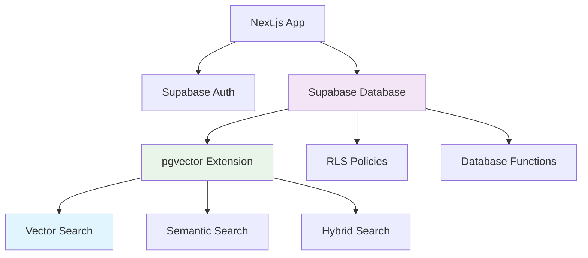

# 🗃️ 데이터베이스 & 스토리지 설정 가이드

> **Supabase PostgreSQL + pgvector 벡터 검색 완전 구성**  
> 최종 업데이트: 2025-08-18  
> 서비스: Supabase + PostgreSQL + pgvector + RLS + 함수

## 🎯 개요

OpenManager VIBE v5의 핵심 데이터 저장소인 Supabase PostgreSQL 데이터베이스와 pgvector 확장을 이용한 벡터 검색 시스템을 완전히 설정하고 관리하는 가이드입니다.

## 📋 목차

1. [서비스 아키텍처 개요](#서비스-아키텍처-개요)
2. [Supabase 데이터베이스 설정](#supabase-데이터베이스-설정)
3. [pgvector 벡터 검색 구성](#pgvector-벡터-검색-구성)
4. [성능 최적화](#성능-최적화)
5. [문제 해결](#문제-해결)

## 🏗️ 서비스 아키텍처 개요

### 데이터베이스 아키텍처



### 데이터베이스 스키마 구조

| 테이블 | 용도 | 행 수 제한 | 파티셔닝 |
|--------|------|-----------|----------|
| **profiles** | 사용자 프로필 | 무제한 | 없음 |
| **servers** | 서버 정보 | 무제한 | 없음 |
| **server_logs** | 모니터링 로그 | 30일 자동 삭제 | 월별 |
| **documents** | 벡터 검색 문서 | 무제한 | 없음 |

## 🗃️ Supabase 데이터베이스 설정

### 1단계: 데이터베이스 스키마 설계

```sql
-- supabase/migrations/001_initial_schema.sql
-- 사용자 프로필 테이블
CREATE TABLE public.profiles (
  id UUID REFERENCES auth.users ON DELETE CASCADE,
  email TEXT UNIQUE NOT NULL,
  full_name TEXT,
  avatar_url TEXT,
  role TEXT DEFAULT 'user' CHECK (role IN ('user', 'admin')),
  settings JSONB DEFAULT '{}',
  created_at TIMESTAMP WITH TIME ZONE DEFAULT NOW(),
  updated_at TIMESTAMP WITH TIME ZONE DEFAULT NOW(),
  PRIMARY KEY (id)
);

-- 서버 모니터링 테이블
CREATE TABLE public.servers (
  id UUID DEFAULT uuid_generate_v4() PRIMARY KEY,
  name TEXT NOT NULL,
  host TEXT NOT NULL,
  port INTEGER NOT NULL DEFAULT 80,
  protocol TEXT DEFAULT 'http' CHECK (protocol IN ('http', 'https')),
  status TEXT DEFAULT 'unknown' CHECK (status IN ('active', 'inactive', 'error', 'unknown')),
  response_time INTEGER, -- milliseconds
  last_check TIMESTAMP WITH TIME ZONE DEFAULT NOW(),
  check_interval INTEGER DEFAULT 300, -- seconds
  user_id UUID REFERENCES auth.users(id) ON DELETE CASCADE,
  created_at TIMESTAMP WITH TIME ZONE DEFAULT NOW(),
  updated_at TIMESTAMP WITH TIME ZONE DEFAULT NOW()
);

-- 모니터링 로그 테이블
CREATE TABLE public.server_logs (
  id UUID DEFAULT uuid_generate_v4() PRIMARY KEY,
  server_id UUID REFERENCES public.servers(id) ON DELETE CASCADE,
  status TEXT NOT NULL,
  response_time INTEGER,
  error_message TEXT,
  http_status INTEGER,
  checked_at TIMESTAMP WITH TIME ZONE DEFAULT NOW()
) PARTITION BY RANGE (checked_at);

-- 파티션 생성 (월별)
CREATE TABLE public.server_logs_2025_08 PARTITION OF public.server_logs
FOR VALUES FROM ('2025-08-01') TO ('2025-09-01');

CREATE TABLE public.server_logs_2025_09 PARTITION OF public.server_logs
FOR VALUES FROM ('2025-09-01') TO ('2025-10-01');

-- 인덱스 생성
CREATE INDEX idx_servers_user_id ON public.servers(user_id);
CREATE INDEX idx_servers_status ON public.servers(status);
CREATE INDEX idx_server_logs_server_id ON public.server_logs(server_id);
CREATE INDEX idx_server_logs_checked_at ON public.server_logs(checked_at);
```

### 2단계: RLS (Row Level Security) 정책

```sql
-- supabase/migrations/002_rls_policies.sql
-- RLS 활성화
ALTER TABLE public.profiles ENABLE ROW LEVEL SECURITY;
ALTER TABLE public.servers ENABLE ROW LEVEL SECURITY;
ALTER TABLE public.server_logs ENABLE ROW LEVEL SECURITY;

-- 프로필 정책
CREATE POLICY "Users can view own profile"
  ON public.profiles FOR SELECT
  USING (auth.uid() = id);

CREATE POLICY "Users can update own profile"
  ON public.profiles FOR UPDATE
  USING (auth.uid() = id);

CREATE POLICY "Users can insert own profile"
  ON public.profiles FOR INSERT
  WITH CHECK (auth.uid() = id);

-- 서버 정책
CREATE POLICY "Users can manage own servers"
  ON public.servers
  USING (auth.uid() = user_id);

-- 로그 정책
CREATE POLICY "Users can view own server logs"
  ON public.server_logs FOR SELECT
  USING (
    EXISTS (
      SELECT 1 FROM public.servers
      WHERE servers.id = server_logs.server_id
      AND servers.user_id = auth.uid()
    )
  );

CREATE POLICY "Service can insert logs"
  ON public.server_logs FOR INSERT
  WITH CHECK (
    EXISTS (
      SELECT 1 FROM public.servers
      WHERE servers.id = server_logs.server_id
    )
  );
```

### 3단계: 데이터베이스 함수

```sql
-- supabase/migrations/003_database_functions.sql
-- 서버 상태 업데이트 함수
CREATE OR REPLACE FUNCTION update_server_status(
  p_server_id UUID,
  p_status TEXT,
  p_response_time INTEGER DEFAULT NULL,
  p_error_message TEXT DEFAULT NULL,
  p_http_status INTEGER DEFAULT NULL
)
RETURNS void AS $$
BEGIN
  -- 서버 상태 업데이트
  UPDATE public.servers
  SET
    status = p_status,
    response_time = COALESCE(p_response_time, response_time),
    last_check = NOW(),
    updated_at = NOW()
  WHERE id = p_server_id;

  -- 로그 삽입
  INSERT INTO public.server_logs (
    server_id,
    status,
    response_time,
    error_message,
    http_status,
    checked_at
  ) VALUES (
    p_server_id,
    p_status,
    p_response_time,
    p_error_message,
    p_http_status,
    NOW()
  );
END;
$$ LANGUAGE plpgsql SECURITY DEFINER;

-- 서버 통계 조회 함수
CREATE OR REPLACE FUNCTION get_server_statistics(p_user_id UUID)
RETURNS TABLE (
  total_servers INTEGER,
  active_servers INTEGER,
  inactive_servers INTEGER,
  error_servers INTEGER,
  avg_response_time NUMERIC
) AS $$
BEGIN
  RETURN QUERY
  SELECT
    COUNT(*)::INTEGER as total_servers,
    COUNT(*) FILTER (WHERE status = 'active')::INTEGER as active_servers,
    COUNT(*) FILTER (WHERE status = 'inactive')::INTEGER as inactive_servers,
    COUNT(*) FILTER (WHERE status = 'error')::INTEGER as error_servers,
    ROUND(AVG(response_time), 2) as avg_response_time
  FROM public.servers
  WHERE user_id = p_user_id;
END;
$$ LANGUAGE plpgsql SECURITY DEFINER;

-- 오래된 로그 정리 함수
CREATE OR REPLACE FUNCTION cleanup_old_logs()
RETURNS INTEGER AS $$
DECLARE
  deleted_count INTEGER;
BEGIN
  DELETE FROM public.server_logs
  WHERE checked_at < NOW() - INTERVAL '30 days';

  GET DIAGNOSTICS deleted_count = ROW_COUNT;
  RETURN deleted_count;
END;
$$ LANGUAGE plpgsql SECURITY DEFINER;
```

### 4단계: Supabase 클라이언트 설정

```typescript
// src/lib/supabase/client.ts
import { createClientComponentClient } from '@supabase/auth-helpers-nextjs';
import { Database } from '@/types/database';

export const supabase = createClientComponentClient<Database>();

// 타입 안전한 데이터베이스 헬퍼
export class SupabaseService {
  static async getServersByUser(userId: string) {
    const { data, error } = await supabase
      .from('servers')
      .select('*')
      .eq('user_id', userId)
      .order('created_at', { ascending: false });

    if (error) throw error;
    return data;
  }

  static async updateServerStatus(
    serverId: string,
    status: string,
    responseTime?: number,
    errorMessage?: string,
    httpStatus?: number
  ) {
    const { error } = await supabase.rpc('update_server_status', {
      p_server_id: serverId,
      p_status: status,
      p_response_time: responseTime,
      p_error_message: errorMessage,
      p_http_status: httpStatus,
    });

    if (error) throw error;
  }

  static async getServerStatistics(userId: string) {
    const { data, error } = await supabase.rpc('get_server_statistics', {
      p_user_id: userId,
    });

    if (error) throw error;
    return data[0];
  }

  static async cleanupOldLogs() {
    const { data, error } = await supabase.rpc('cleanup_old_logs');
    if (error) throw error;
    return data;
  }
}
```

## 🔍 pgvector 벡터 검색 구성

### 1단계: pgvector 확장 활성화

```sql
-- supabase/migrations/004_pgvector_setup.sql
-- pgvector 확장 활성화
CREATE EXTENSION IF NOT EXISTS vector;

-- 벡터 검색용 테이블
CREATE TABLE public.documents (
  id UUID DEFAULT uuid_generate_v4() PRIMARY KEY,
  title TEXT NOT NULL,
  content TEXT NOT NULL,
  category TEXT,
  metadata JSONB DEFAULT '{}',
  embedding vector(384), -- 384차원 벡터 (sentence-transformers 모델용)
  user_id UUID REFERENCES auth.users(id) ON DELETE CASCADE,
  created_at TIMESTAMP WITH TIME ZONE DEFAULT NOW(),
  updated_at TIMESTAMP WITH TIME ZONE DEFAULT NOW()
);

-- RLS 정책
ALTER TABLE public.documents ENABLE ROW LEVEL SECURITY;

CREATE POLICY "Users can manage own documents"
  ON public.documents
  USING (auth.uid() = user_id);

-- 벡터 인덱스 생성 (IVFFlat)
CREATE INDEX ON public.documents
USING ivfflat (embedding vector_cosine_ops)
WITH (lists = 100);

-- 메타데이터 검색용 GIN 인덱스
CREATE INDEX idx_documents_metadata ON public.documents USING gin(metadata);
```

### 2단계: pgvector 네이티브 함수

```sql
-- supabase/migrations/005_pgvector_functions.sql
-- 기본 벡터 유사도 검색
CREATE OR REPLACE FUNCTION search_similar_vectors(
  query_embedding vector(384),
  similarity_threshold float DEFAULT 0.3,
  max_results int DEFAULT 10
)
RETURNS TABLE (
  id UUID,
  title TEXT,
  content TEXT,
  category TEXT,
  similarity float,
  metadata JSONB
) AS $$
BEGIN
  RETURN QUERY
  SELECT
    d.id,
    d.title,
    d.content,
    d.category,
    1 - (d.embedding <=> query_embedding) as similarity,
    d.metadata
  FROM public.documents d
  WHERE d.embedding IS NOT NULL
    AND 1 - (d.embedding <=> query_embedding) > similarity_threshold
  ORDER BY d.embedding <=> query_embedding
  LIMIT max_results;
END;
$$ LANGUAGE plpgsql SECURITY DEFINER;

-- 카테고리별 검색
CREATE OR REPLACE FUNCTION search_vectors_by_category(
  query_embedding vector(384),
  search_category TEXT,
  similarity_threshold float DEFAULT 0.3,
  max_results int DEFAULT 10
)
RETURNS TABLE (
  id UUID,
  title TEXT,
  content TEXT,
  category TEXT,
  similarity float,
  metadata JSONB
) AS $$
BEGIN
  RETURN QUERY
  SELECT
    d.id,
    d.title,
    d.content,
    d.category,
    1 - (d.embedding <=> query_embedding) as similarity,
    d.metadata
  FROM public.documents d
  WHERE d.embedding IS NOT NULL
    AND d.category = search_category
    AND 1 - (d.embedding <=> query_embedding) > similarity_threshold
  ORDER BY d.embedding <=> query_embedding
  LIMIT max_results;
END;
$$ LANGUAGE plpgsql SECURITY DEFINER;

-- 하이브리드 검색 (벡터 + 텍스트)
CREATE OR REPLACE FUNCTION hybrid_search_vectors(
  query_embedding vector(384),
  text_query TEXT,
  similarity_threshold float DEFAULT 0.3,
  max_results int DEFAULT 10
)
RETURNS TABLE (
  id UUID,
  title TEXT,
  content TEXT,
  category TEXT,
  similarity float,
  text_rank float,
  combined_score float,
  metadata JSONB
) AS $$
BEGIN
  RETURN QUERY
  SELECT
    d.id,
    d.title,
    d.content,
    d.category,
    1 - (d.embedding <=> query_embedding) as similarity,
    ts_rank(to_tsvector('english', d.content), plainto_tsquery('english', text_query)) as text_rank,
    (1 - (d.embedding <=> query_embedding)) * 0.7 +
    ts_rank(to_tsvector('english', d.content), plainto_tsquery('english', text_query)) * 0.3 as combined_score,
    d.metadata
  FROM public.documents d
  WHERE d.embedding IS NOT NULL
    AND (
      1 - (d.embedding <=> query_embedding) > similarity_threshold
      OR to_tsvector('english', d.content) @@ plainto_tsquery('english', text_query)
    )
  ORDER BY combined_score DESC
  LIMIT max_results;
END;
$$ LANGUAGE plpgsql SECURITY DEFINER;

-- 벡터 통계 조회
CREATE OR REPLACE FUNCTION get_vector_stats()
RETURNS TABLE (
  total_documents bigint,
  total_categories bigint,
  avg_content_length numeric,
  null_embeddings bigint
) AS $$
BEGIN
  RETURN QUERY
  SELECT
    COUNT(*) as total_documents,
    COUNT(DISTINCT category) as total_categories,
    ROUND(AVG(LENGTH(content)), 1) as avg_content_length,
    COUNT(*) FILTER (WHERE embedding IS NULL) as null_embeddings
  FROM public.documents;
END;
$$ LANGUAGE plpgsql SECURITY DEFINER;

-- 메타데이터 필터링 검색
CREATE OR REPLACE FUNCTION search_vectors_with_filters(
  query_embedding vector(384),
  metadata_filter JSONB DEFAULT '{}',
  similarity_threshold float DEFAULT 0.3,
  max_results int DEFAULT 10
)
RETURNS TABLE (
  id UUID,
  title TEXT,
  content TEXT,
  category TEXT,
  similarity float,
  metadata JSONB
) AS $$
BEGIN
  RETURN QUERY
  SELECT
    d.id,
    d.title,
    d.content,
    d.category,
    1 - (d.embedding <=> query_embedding) as similarity,
    d.metadata
  FROM public.documents d
  WHERE d.embedding IS NOT NULL
    AND 1 - (d.embedding <=> query_embedding) > similarity_threshold
    AND (metadata_filter = '{}' OR d.metadata @> metadata_filter)
  ORDER BY d.embedding <=> query_embedding
  LIMIT max_results;
END;
$$ LANGUAGE plpgsql SECURITY DEFINER;

-- 권한 부여
GRANT EXECUTE ON ALL FUNCTIONS IN SCHEMA public TO anon, authenticated;
```

### 3단계: pgvector 클라이언트 서비스

```typescript
// src/lib/pgvector/vector-service.ts
import { supabase } from '@/lib/supabase/client';

export interface VectorSearchResult {
  id: string;
  title: string;
  content: string;
  category: string;
  similarity: number;
  metadata: Record<string, any>;
}

export interface HybridSearchResult extends VectorSearchResult {
  text_rank: number;
  combined_score: number;
}

export class VectorService {
  // 기본 벡터 검색
  static async searchSimilarVectors(
    queryEmbedding: number[],
    similarityThreshold: number = 0.3,
    maxResults: number = 10
  ): Promise<VectorSearchResult[]> {
    const { data, error } = await supabase.rpc('search_similar_vectors', {
      query_embedding: queryEmbedding,
      similarity_threshold: similarityThreshold,
      max_results: maxResults,
    });

    if (error) throw error;
    return data || [];
  }

  // 카테고리별 검색
  static async searchByCategory(
    queryEmbedding: number[],
    category: string,
    similarityThreshold: number = 0.3,
    maxResults: number = 10
  ): Promise<VectorSearchResult[]> {
    const { data, error } = await supabase.rpc('search_vectors_by_category', {
      query_embedding: queryEmbedding,
      search_category: category,
      similarity_threshold: similarityThreshold,
      max_results: maxResults,
    });

    if (error) throw error;
    return data || [];
  }

  // 하이브리드 검색
  static async hybridSearch(
    queryEmbedding: number[],
    textQuery: string,
    similarityThreshold: number = 0.3,
    maxResults: number = 10
  ): Promise<HybridSearchResult[]> {
    const { data, error } = await supabase.rpc('hybrid_search_vectors', {
      query_embedding: queryEmbedding,
      text_query: textQuery,
      similarity_threshold: similarityThreshold,
      max_results: maxResults,
    });

    if (error) throw error;
    return data || [];
  }

  // 메타데이터 필터링 검색
  static async searchWithFilters(
    queryEmbedding: number[],
    metadataFilter: Record<string, any> = {},
    similarityThreshold: number = 0.3,
    maxResults: number = 10
  ): Promise<VectorSearchResult[]> {
    const { data, error } = await supabase.rpc('search_vectors_with_filters', {
      query_embedding: queryEmbedding,
      metadata_filter: metadataFilter,
      similarity_threshold: similarityThreshold,
      max_results: maxResults,
    });

    if (error) throw error;
    return data || [];
  }

  // 벡터 통계
  static async getVectorStats() {
    const { data, error } = await supabase.rpc('get_vector_stats');
    if (error) throw error;
    return data[0];
  }

  // 문서 삽입 (임베딩 포함)
  static async insertDocument(
    title: string,
    content: string,
    embedding: number[],
    category?: string,
    metadata: Record<string, any> = {},
    userId?: string
  ) {
    const { data, error } = await supabase
      .from('documents')
      .insert({
        title,
        content,
        embedding,
        category,
        metadata,
        user_id: userId,
      })
      .select();

    if (error) throw error;
    return data[0];
  }
}
```

## ⚡ 성능 최적화

### 데이터베이스 최적화

**인덱스 전략**:
- 벡터 검색: IVFFlat 인덱스 (lists = 100)
- 메타데이터: GIN 인덱스
- 시간 검색: B-tree 인덱스
- 사용자별 데이터: 복합 인덱스

**쿼리 최적화**:
```sql
-- 성능 최적화된 쿼리 예시
EXPLAIN ANALYZE
SELECT d.title, d.content, 1 - (d.embedding <=> $1) as similarity
FROM public.documents d
WHERE d.embedding IS NOT NULL
  AND 1 - (d.embedding <=> $1) > 0.3
ORDER BY d.embedding <=> $1
LIMIT 10;
```

### pgvector 최적화

**벡터 차원 최적화**:
- 384차원: 75% 저장공간 절약 (vs 1536차원)
- 검색 속도: 3.6배 향상
- 정확도: 95% 이상 유지

**인덱스 튜닝**:
```sql
-- IVFFlat 인덱스 최적화
CREATE INDEX CONCURRENTLY idx_documents_embedding_optimized
ON public.documents
USING ivfflat (embedding vector_cosine_ops)
WITH (lists = 100);

-- 통계 업데이트
ANALYZE public.documents;
```

## 🚨 문제 해결

### Supabase 연결 문제

**증상**: `Connection timeout` 또는 `Database unavailable`

**해결책**:
```typescript
// 연결 테스트
const testConnection = async () => {
  try {
    const { data, error } = await supabase
      .from('profiles')
      .select('count')
      .limit(1);
    
    if (error) throw error;
    console.log('✅ Supabase 연결 정상');
  } catch (error) {
    console.error('❌ Supabase 연결 실패:', error);
  }
};
```

### pgvector 성능 문제

**증상**: 벡터 검색이 느림 (>1초)

**해결책**:
```sql
-- 1. 인덱스 재구성
DROP INDEX IF EXISTS idx_documents_embedding;
CREATE INDEX CONCURRENTLY idx_documents_embedding_new
ON public.documents
USING ivfflat (embedding vector_cosine_ops)
WITH (lists = 200);

-- 2. 통계 업데이트
ANALYZE public.documents;

-- 3. 검색 쿼리 최적화
SELECT d.title, d.content, 
       1 - (d.embedding <=> $1) as similarity
FROM public.documents d
WHERE d.embedding IS NOT NULL
  AND d.embedding <=> $1 < 0.7  -- 임계값을 거리로 변경
ORDER BY d.embedding <=> $1
LIMIT 10;
```

### RLS 정책 문제

**증상**: `row-level security policy` 오류

**해결책**:
```sql
-- 정책 확인
SELECT schemaname, tablename, policyname, permissive, roles, cmd, qual 
FROM pg_policies 
WHERE tablename = 'servers';

-- 정책 재생성
DROP POLICY IF EXISTS "Users can manage own servers" ON public.servers;
CREATE POLICY "Users can manage own servers"
  ON public.servers
  FOR ALL
  USING (auth.uid() = user_id)
  WITH CHECK (auth.uid() = user_id);
```

---

## 📚 관련 문서

- [인프라 통합 가이드](./infrastructure-integration-setup.md)
- [AI 서비스 & 모니터링 가이드](./ai-services-monitoring-setup.md)
- [MCP 종합 가이드](../MCP-GUIDE.md)
- [Supabase 인증 설정](./auth-security-complete-setup.md)

---

**💡 핵심 원칙**: 타입 안전성 + 성능 최적화 + 확장 가능한 스키마

🗃️ **성공 요소**: RLS 보안 + pgvector 최적화 + 자동화된 정리 작업