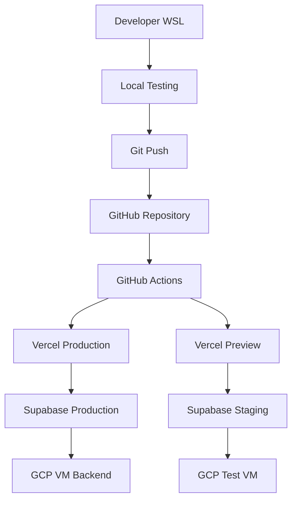

# 🌐 플랫폼 구성 가이드

> **Vercel + Supabase + GCP 통합 플랫폼 설정**  
> 최종 업데이트: 2025-08-18  
> 플랫폼: Vercel + Supabase + GCP + 무료 티어 최적화

## 🎯 개요

OpenManager VIBE v5의 핵심 배포 플랫폼(Vercel, Supabase, GCP)을 통합적으로 구성하고 관리하는 가이드입니다. 무료 티어 최적화와 효율적인 플랫폼 연동에 중점을 둡니다.

## 📋 목차

1. [배포 아키텍처 개요](#배포-아키텍처-개요)
2. [Vercel 배포 설정](#vercel-배포-설정)
3. [Supabase 백엔드 구성](#supabase-백엔드-구성)
4. [GCP 인프라 관리](#gcp-인프라-관리)
5. [플랫폼 통합](#플랫폼-통합)

## 🏗️ 배포 아키텍처 개요

### 플랫폼별 역할 분담

| 플랫폼         | 역할                      | 무료 티어 한계       | 비용 최적화              |
| -------------- | ------------------------- | -------------------- | ------------------------ |
| **Vercel**     | Frontend + Edge Functions | 100GB/월 대역폭      | 이미지 최적화, CDN 활용  |
| **Supabase**   | Database + Auth + Storage | 500MB DB, 2GB 대역폭 | 쿼리 최적화, 인덱스 관리 |
| **GCP**        | VM + Cloud Functions      | $300 크레딧/3개월    | f1-micro 인스턴스 활용   |
| **GitHub**     | Repository + Actions      | 2000분/월            | 효율적 워크플로우        |
| **Cloudflare** | DNS + CDN                 | 무제한               | 캐시 최적화              |

### 배포 환경 구성



## 🌐 Vercel 배포 설정

### 1단계: Vercel 프로젝트 초기화

```bash
# WSL 환경에서 실행
cd /mnt/d/cursor/openmanager-vibe-v5

# Vercel CLI 설치
sudo npm install -g vercel

# Vercel 로그인
vercel login

# 프로젝트 연결
vercel --prod
```

### 2단계: Vercel 환경변수 설정

```bash
# 프로덕션 환경변수 설정
vercel env add NEXT_PUBLIC_SUPABASE_URL production
vercel env add NEXT_PUBLIC_SUPABASE_ANON_KEY production
vercel env add SUPABASE_SERVICE_ROLE_KEY production
vercel env add GITHUB_CLIENT_ID production
vercel env add GITHUB_CLIENT_SECRET production

# 프리뷰 환경변수 설정 (테스트용)
vercel env add NEXT_PUBLIC_SUPABASE_URL preview
vercel env add NEXT_PUBLIC_SUPABASE_ANON_KEY preview
vercel env add SUPABASE_SERVICE_ROLE_KEY preview

# 개발 환경변수 (로컬 테스트용)
vercel env add NODE_ENV development
```

### 3단계: Vercel 프로젝트 설정

```json
// vercel.json
{
  "framework": "nextjs",
  "buildCommand": "npm run build",
  "outputDirectory": ".next",
  "installCommand": "npm install",
  "devCommand": "npm run dev",
  "regions": ["icn1", "hnd1"],
  "functions": {
    "app/api/**/*.ts": {
      "maxDuration": 10
    }
  },
  "headers": [
    {
      "source": "/(.*)",
      "headers": [
        {
          "key": "X-Content-Type-Options",
          "value": "nosniff"
        },
        {
          "key": "X-Frame-Options",
          "value": "DENY"
        },
        {
          "key": "X-XSS-Protection",
          "value": "1; mode=block"
        }
      ]
    }
  ],
  "rewrites": [
    {
      "source": "/api/vm/:path*",
      "destination": "http://104.154.205.25:10000/api/:path*"
    }
  ]
}
```

### 4단계: Next.js 프로덕션 최적화

```javascript
// next.config.mjs
/** @type {import('next').NextConfig} */
const nextConfig = {
  experimental: {
    optimizePackageImports: ['@radix-ui/react-icons'],
    serverComponentsExternalPackages: ['@supabase/supabase-js'],
  },
  images: {
    remotePatterns: [
      {
        protocol: 'https',
        hostname: '*.supabase.co',
        port: '',
        pathname: '/storage/v1/object/public/**',
      },
    ],
    formats: ['image/webp', 'image/avif'],
    minimumCacheTTL: 31536000,
  },
  compress: true,
  poweredByHeader: false,
  generateEtags: false,
  env: {
    CUSTOM_KEY: process.env.CUSTOM_KEY,
  },
  async headers() {
    return [
      {
        source: '/(.*)',
        headers: [
          {
            key: 'X-DNS-Prefetch-Control',
            value: 'on',
          },
          {
            key: 'Strict-Transport-Security',
            value: 'max-age=63072000; includeSubDomains; preload',
          },
        ],
      },
    ];
  },
  webpack: (config, { isServer }) => {
    if (!isServer) {
      config.resolve.fallback = {
        ...config.resolve.fallback,
        fs: false,
        net: false,
        tls: false,
      };
    }
    return config;
  },
};

export default nextConfig;
```

### 5단계: 배포 스크립트 자동화

```bash
# scripts/deploy/vercel-deploy.sh
#!/bin/bash

echo "🚀 Vercel 배포 시작..."

# 프리 체크
echo "1. 환경변수 확인..."
if ! vercel env ls --scope production | grep -q "NEXT_PUBLIC_SUPABASE_URL"; then
    echo "❌ 필수 환경변수가 없습니다."
    exit 1
fi

echo "2. 타입 체크..."
npm run type-check

echo "3. 테스트 실행..."
npm run test:quick

echo "4. 빌드 테스트..."
npm run build

echo "5. 프로덕션 배포..."
vercel --prod --confirm

echo "6. 배포 확인..."
curl -f https://openmanager-vibe-v5.vercel.app/api/health || {
    echo "❌ 배포 확인 실패"
    exit 1
}

echo "✅ 배포 완료: https://openmanager-vibe-v5.vercel.app"
```

## 🗃️ Supabase 백엔드 구성

### 1단계: Supabase 프로젝트 설정

```bash
# Supabase CLI 설치 및 로그인
sudo npm install -g supabase
supabase login

# 프로젝트 초기화
supabase init
supabase link --project-ref your-project-ref

# 로컬 개발 환경 시작
supabase start
```

### 2단계: 데이터베이스 마이그레이션

```sql
-- supabase/migrations/001_initial_schema.sql
CREATE EXTENSION IF NOT EXISTS "uuid-ossp";

-- Users 프로필 테이블
CREATE TABLE public.profiles (
  id UUID REFERENCES auth.users ON DELETE CASCADE,
  email TEXT,
  full_name TEXT,
  avatar_url TEXT,
  created_at TIMESTAMP WITH TIME ZONE DEFAULT NOW(),
  updated_at TIMESTAMP WITH TIME ZONE DEFAULT NOW(),
  PRIMARY KEY (id)
);

-- RLS 정책 설정
ALTER TABLE public.profiles ENABLE ROW LEVEL SECURITY;

CREATE POLICY "Users can view own profile"
  ON public.profiles FOR SELECT
  USING (auth.uid() = id);

CREATE POLICY "Users can update own profile"
  ON public.profiles FOR UPDATE
  USING (auth.uid() = id);

-- 서버 모니터링 테이블
CREATE TABLE public.servers (
  id UUID DEFAULT uuid_generate_v4() PRIMARY KEY,
  name TEXT NOT NULL,
  host TEXT NOT NULL,
  port INTEGER NOT NULL,
  status TEXT DEFAULT 'unknown',
  last_check TIMESTAMP WITH TIME ZONE DEFAULT NOW(),
  user_id UUID REFERENCES auth.users(id) ON DELETE CASCADE,
  created_at TIMESTAMP WITH TIME ZONE DEFAULT NOW()
);

ALTER TABLE public.servers ENABLE ROW LEVEL SECURITY;

CREATE POLICY "Users can manage own servers"
  ON public.servers
  USING (auth.uid() = user_id);
```

### 3단계: Supabase Edge Functions

```typescript
// supabase/functions/health-check/index.ts
import { serve } from 'https://deno.land/std@0.168.0/http/server.ts';
import { createClient } from 'https://esm.sh/@supabase/supabase-js@2';

serve(async (req) => {
  const { method } = req;

  if (method !== 'GET') {
    return new Response('Method not allowed', { status: 405 });
  }

  try {
    const supabase = createClient(
      Deno.env.get('SUPABASE_URL') ?? '',
      Deno.env.get('SUPABASE_SERVICE_ROLE_KEY') ?? ''
    );

    // 데이터베이스 연결 테스트
    const { data, error } = await supabase
      .from('profiles')
      .select('count')
      .limit(1);

    if (error) throw error;

    return new Response(
      JSON.stringify({
        status: 'healthy',
        timestamp: new Date().toISOString(),
        database: 'connected',
        version: '1.0.0',
      }),
      {
        headers: { 'Content-Type': 'application/json' },
        status: 200,
      }
    );
  } catch (error) {
    return new Response(
      JSON.stringify({
        status: 'unhealthy',
        error: error.message,
      }),
      {
        headers: { 'Content-Type': 'application/json' },
        status: 500,
      }
    );
  }
});
```

### 4단계: Supabase 배포 자동화

```bash
# scripts/deploy/supabase-deploy.sh
#!/bin/bash

echo "🗃️ Supabase 배포 시작..."

# 마이그레이션 적용
echo "1. 데이터베이스 마이그레이션..."
supabase db push

# Edge Functions 배포
echo "2. Edge Functions 배포..."
supabase functions deploy health-check

# RLS 정책 검증
echo "3. RLS 정책 검증..."
supabase test db

echo "✅ Supabase 배포 완료"
```

## ☁️ GCP 인프라 관리

### 1단계: GCP VM 인스턴스 설정

```bash
# GCP CLI 설치 및 인증 (WSL)
curl https://sdk.cloud.google.com | bash
exec -l $SHELL
gcloud init

# 프로젝트 설정
gcloud config set project openmanager-free-tier

# VM 인스턴스 생성 (f1-micro, 무료 티어)
gcloud compute instances create openmanager-vm \
  --zone=us-central1-a \
  --machine-type=f1-micro \
  --subnet=default \
  --network-tier=PREMIUM \
  --maintenance-policy=MIGRATE \
  --image=ubuntu-2004-focal-v20240830 \
  --image-project=ubuntu-os-cloud \
  --boot-disk-size=30GB \
  --boot-disk-type=pd-standard \
  --boot-disk-device-name=openmanager-vm \
  --tags=http-server,https-server
```

### 2단계: VM 환경 설정

```bash
# SSH 접속
gcloud compute ssh openmanager-vm --zone=us-central1-a

# VM 내부 설정
sudo apt update && sudo apt upgrade -y
sudo apt install -y nodejs npm nginx certbot python3-certbot-nginx

# Node.js 최신 버전 설치
curl -fsSL https://deb.nodesource.com/setup_22.x | sudo -E bash -
sudo apt-get install -y nodejs

# PM2 설치 (프로세스 관리)
sudo npm install -g pm2

# 방화벽 설정
sudo ufw allow 22
sudo ufw allow 80
sudo ufw allow 443
sudo ufw allow 10000
sudo ufw --force enable
```

### 3단계: 백엔드 API 서버 배포

```javascript
// server/app.js (GCP VM에서 실행될 Express 서버)
const express = require('express');
const cors = require('cors');
const helmet = require('helmet');
const rateLimit = require('express-rate-limit');

const app = express();
const PORT = process.env.PORT || 10000;

// 보안 미들웨어
app.use(helmet());
app.use(
  cors({
    origin: [
      'https://openmanager-vibe-v5.vercel.app',
      'http://localhost:3000',
      /https:\/\/.*\.vercel\.app$/,
    ],
    credentials: true,
  })
);

// Rate limiting
const limiter = rateLimit({
  windowMs: 15 * 60 * 1000, // 15분
  max: 100, // 최대 100 요청
  message: 'Too many requests from this IP',
});
app.use('/api/', limiter);

// 미들웨어
app.use(express.json({ limit: '10mb' }));
app.use(express.urlencoded({ extended: true }));

// 헬스체크 엔드포인트
app.get('/health', (req, res) => {
  res.json({
    status: 'healthy',
    version: '2.0',
    port: PORT,
    timestamp: new Date().toISOString(),
    uptime: process.uptime(),
  });
});

// API 라우트
app.use('/api', require('./routes/api'));

// 에러 핸들링
app.use((err, req, res, next) => {
  console.error(err.stack);
  res.status(500).json({ error: 'Internal Server Error' });
});

app.listen(PORT, '0.0.0.0', () => {
  console.log(`🚀 서버가 포트 ${PORT}에서 실행 중입니다.`);
});

module.exports = app;
```

### 4단계: PM2 프로세스 관리

```javascript
// ecosystem.config.js
module.exports = {
  apps: [
    {
      name: 'openmanager-api',
      script: './server/app.js',
      instances: 1,
      exec_mode: 'cluster',
      env: {
        NODE_ENV: 'production',
        PORT: 10000,
      },
      env_production: {
        NODE_ENV: 'production',
        PORT: 10000,
      },
      error_file: './logs/err.log',
      out_file: './logs/out.log',
      log_file: './logs/combined.log',
      time: true,
      max_memory_restart: '400M',
      restart_delay: 4000,
    },
  ],
};
```

### 5단계: GCP 배포 자동화

```bash
# scripts/deploy/gcp-deploy.sh
#!/bin/bash

echo "☁️ GCP VM 배포 시작..."

# 소스 코드 압축
echo "1. 소스 코드 압축..."
tar -czf server.tar.gz server/ package.json ecosystem.config.js

# GCP VM에 파일 전송
echo "2. 파일 전송..."
gcloud compute scp server.tar.gz openmanager-vm:~/ --zone=us-central1-a

# VM에서 배포 실행
echo "3. VM 배포 실행..."
gcloud compute ssh openmanager-vm --zone=us-central1-a --command="
  tar -xzf server.tar.gz
  npm install --production
  pm2 reload ecosystem.config.js --env production
  pm2 save
"

# 헬스체크
echo "4. 배포 확인..."
if curl -f http://104.154.205.25:10000/health; then
    echo "✅ GCP VM 배포 완료"
else
    echo "❌ 배포 확인 실패"
    exit 1
fi
```

## 🔗 플랫폼 통합

### 환경변수 통합 관리

```typescript
// src/lib/config/platform-config.ts
interface PlatformConfig {
  vercel: {
    url: string;
    token: string;
    projectId: string;
  };
  supabase: {
    url: string;
    anonKey: string;
    serviceKey: string;
  };
  gcp: {
    projectId: string;
    vmIP: string;
    vmPort: number;
  };
}

export const platformConfig: PlatformConfig = {
  vercel: {
    url: process.env.VERCEL_URL || 'https://openmanager-vibe-v5.vercel.app',
    token: process.env.VERCEL_TOKEN || '',
    projectId: process.env.VERCEL_PROJECT_ID || '',
  },
  supabase: {
    url: process.env.NEXT_PUBLIC_SUPABASE_URL || '',
    anonKey: process.env.NEXT_PUBLIC_SUPABASE_ANON_KEY || '',
    serviceKey: process.env.SUPABASE_SERVICE_ROLE_KEY || '',
  },
  gcp: {
    projectId: 'openmanager-free-tier',
    vmIP: '104.154.205.25',
    vmPort: 10000,
  },
};

export class PlatformValidator {
  static validateConfig(): boolean {
    const requiredVars = [
      'NEXT_PUBLIC_SUPABASE_URL',
      'NEXT_PUBLIC_SUPABASE_ANON_KEY',
      'SUPABASE_SERVICE_ROLE_KEY',
    ];

    const missing = requiredVars.filter(varName => !process.env[varName]);
    
    if (missing.length > 0) {
      console.error('필수 환경변수 누락:', missing);
      return false;
    }

    return true;
  }

  static async testPlatformConnections(): Promise<{
    vercel: boolean;
    supabase: boolean;
    gcp: boolean;
  }> {
    const results = {
      vercel: false,
      supabase: false,
      gcp: false,
    };

    // Vercel 연결 테스트
    try {
      const vercelResponse = await fetch(`${platformConfig.vercel.url}/api/health`);
      results.vercel = vercelResponse.ok;
    } catch (error) {
      console.error('Vercel 연결 실패:', error);
    }

    // Supabase 연결 테스트
    try {
      const supabaseResponse = await fetch(
        `${platformConfig.supabase.url}/rest/v1/profiles?select=count`,
        {
          headers: {
            apikey: platformConfig.supabase.anonKey,
            Authorization: `Bearer ${platformConfig.supabase.anonKey}`,
          },
        }
      );
      results.supabase = supabaseResponse.ok;
    } catch (error) {
      console.error('Supabase 연결 실패:', error);
    }

    // GCP VM 연결 테스트
    try {
      const gcpResponse = await fetch(
        `http://${platformConfig.gcp.vmIP}:${platformConfig.gcp.vmPort}/health`
      );
      results.gcp = gcpResponse.ok;
    } catch (error) {
      console.error('GCP VM 연결 실패:', error);
    }

    return results;
  }
}
```

---

## 📚 관련 문서

- [개발 & 빌드 도구 가이드](./development-build-tools-guide.md)
- [CI/CD & 운영 가이드](./cicd-operations-guide.md)
- [데이터베이스 & 스토리지 설정](./database-storage-setup.md)
- [인프라 통합 설정](./infrastructure-integration-setup.md)

---

**💡 핵심 원칙**: 무료 티어 최적화 + 플랫폼 간 원활한 연동 + 자동화된 배포

🌐 **성공 요소**: Vercel 프론트엔드 + Supabase 백엔드 + GCP 인프라 완전 통합