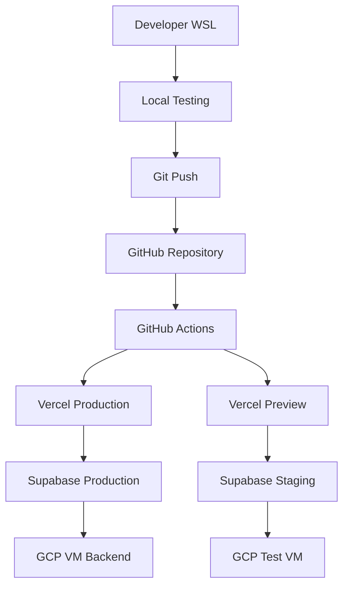

# 🚀 플랫폼 배포 설정 완전 가이드

> **통합 배포 플랫폼 관리 시스템**  
> 최종 업데이트: 2025-08-16  
> 플랫폼: Vercel + Supabase + GCP + GitHub Actions

## 🎯 개요

OpenManager VIBE v5의 전체 배포 플랫폼(Vercel, Supabase, GCP)과 개발 도구(TypeScript, npm, AI CLI)를 통합적으로 관리하는 완전 가이드입니다. 무료 티어 최적화와 효율적인 DevOps 파이프라인 구축을 목표로 합니다.

## 📋 목차

1. [배포 아키텍처 개요](#배포-아키텍처-개요)
2. [Vercel 배포 설정](#vercel-배포-설정)
3. [Supabase 백엔드 구성](#supabase-백엔드-구성)
4. [GCP 인프라 관리](#gcp-인프라-관리)
5. [TypeScript 프로덕션 설정](#typescript-프로덕션-설정)
6. [AI CLI 도구 배포 통합](#ai-cli-도구-배포-통합)
7. [CI/CD 파이프라인](#cicd-파이프라인)
8. [모니터링 및 알림](#모니터링-및-알림)
9. [무료 티어 최적화](#무료-티어-최적화)
10. [문제 해결 및 롤백](#문제-해결-및-롤백)

## 🏗️ 배포 아키텍처 개요

### 플랫폼별 역할 분담

| 플랫폼         | 역할                      | 무료 티어 한계       | 비용 최적화              |
| -------------- | ------------------------- | -------------------- | ------------------------ |
| **Vercel**     | Frontend + Edge Functions | 100GB/월 대역폭      | 이미지 최적화, CDN 활용  |
| **Supabase**   | Database + Auth + Storage | 500MB DB, 2GB 대역폭 | 쿼리 최적화, 인덱스 관리 |
| **GCP**        | VM + Cloud Functions      | $300 크레딧/3개월    | f1-micro 인스턴스 활용   |
| **GitHub**     | Repository + Actions      | 2000분/월            | 효율적 워크플로우        |
| **Cloudflare** | DNS + CDN                 | 무제한               | 캐시 최적화              |

### 배포 환경 구성



## 🌐 Vercel 배포 설정

### 1단계: Vercel 프로젝트 초기화

```bash
# WSL 환경에서 실행
cd /mnt/d/cursor/openmanager-vibe-v5

# Vercel CLI 설치
sudo npm install -g vercel

# Vercel 로그인
vercel login

# 프로젝트 연결
vercel --prod
```

### 2단계: Vercel 환경변수 설정

```bash
# 프로덕션 환경변수 설정
vercel env add NEXT_PUBLIC_SUPABASE_URL production
vercel env add NEXT_PUBLIC_SUPABASE_ANON_KEY production
vercel env add SUPABASE_SERVICE_ROLE_KEY production
vercel env add GITHUB_CLIENT_ID production
vercel env add GITHUB_CLIENT_SECRET production

# 프리뷰 환경변수 설정 (테스트용)
vercel env add NEXT_PUBLIC_SUPABASE_URL preview
vercel env add NEXT_PUBLIC_SUPABASE_ANON_KEY preview
vercel env add SUPABASE_SERVICE_ROLE_KEY preview

# 개발 환경변수 (로컬 테스트용)
vercel env add NODE_ENV development
```

### 3단계: Vercel 프로젝트 설정

```json
// vercel.json
{
  "framework": "nextjs",
  "buildCommand": "npm run build",
  "outputDirectory": ".next",
  "installCommand": "npm install",
  "devCommand": "npm run dev",
  "regions": ["icn1", "hnd1"],
  "functions": {
    "app/api/**/*.ts": {
      "maxDuration": 10
    }
  },
  "headers": [
    {
      "source": "/(.*)",
      "headers": [
        {
          "key": "X-Content-Type-Options",
          "value": "nosniff"
        },
        {
          "key": "X-Frame-Options",
          "value": "DENY"
        },
        {
          "key": "X-XSS-Protection",
          "value": "1; mode=block"
        }
      ]
    }
  ],
  "rewrites": [
    {
      "source": "/api/vm/:path*",
      "destination": "http://104.154.205.25:10000/api/:path*"
    }
  ]
}
```

### 4단계: Next.js 프로덕션 최적화

```javascript
// next.config.mjs
/** @type {import('next').NextConfig} */
const nextConfig = {
  experimental: {
    optimizePackageImports: ['@radix-ui/react-icons'],
    serverComponentsExternalPackages: ['@supabase/supabase-js'],
  },
  images: {
    remotePatterns: [
      {
        protocol: 'https',
        hostname: '*.supabase.co',
        port: '',
        pathname: '/storage/v1/object/public/**',
      },
    ],
    formats: ['image/webp', 'image/avif'],
    minimumCacheTTL: 31536000,
  },
  compress: true,
  poweredByHeader: false,
  generateEtags: false,
  env: {
    CUSTOM_KEY: process.env.CUSTOM_KEY,
  },
  async headers() {
    return [
      {
        source: '/(.*)',
        headers: [
          {
            key: 'X-DNS-Prefetch-Control',
            value: 'on',
          },
          {
            key: 'Strict-Transport-Security',
            value: 'max-age=63072000; includeSubDomains; preload',
          },
        ],
      },
    ];
  },
  webpack: (config, { isServer }) => {
    if (!isServer) {
      config.resolve.fallback = {
        ...config.resolve.fallback,
        fs: false,
        net: false,
        tls: false,
      };
    }
    return config;
  },
};

export default nextConfig;
```

### 5단계: 배포 스크립트 자동화

```bash
# scripts/deploy/vercel-deploy.sh
#!/bin/bash

echo "🚀 Vercel 배포 시작..."

# 프리 체크
echo "1. 환경변수 확인..."
if ! vercel env ls --scope production | grep -q "NEXT_PUBLIC_SUPABASE_URL"; then
    echo "❌ 필수 환경변수가 없습니다."
    exit 1
fi

echo "2. 타입 체크..."
npm run type-check

echo "3. 테스트 실행..."
npm run test:quick

echo "4. 빌드 테스트..."
npm run build

echo "5. 프로덕션 배포..."
vercel --prod --confirm

echo "6. 배포 확인..."
curl -f https://openmanager-vibe-v5.vercel.app/api/health || {
    echo "❌ 배포 확인 실패"
    exit 1
}

echo "✅ 배포 완료: https://openmanager-vibe-v5.vercel.app"
```

## 🗃️ Supabase 백엔드 구성

### 1단계: Supabase 프로젝트 설정

```bash
# Supabase CLI 설치 및 로그인
sudo npm install -g supabase
supabase login

# 프로젝트 초기화
supabase init
supabase link --project-ref your-project-ref

# 로컬 개발 환경 시작
supabase start
```

### 2단계: 데이터베이스 마이그레이션

```sql
-- supabase/migrations/001_initial_schema.sql
CREATE EXTENSION IF NOT EXISTS "uuid-ossp";

-- Users 프로필 테이블
CREATE TABLE public.profiles (
  id UUID REFERENCES auth.users ON DELETE CASCADE,
  email TEXT,
  full_name TEXT,
  avatar_url TEXT,
  created_at TIMESTAMP WITH TIME ZONE DEFAULT NOW(),
  updated_at TIMESTAMP WITH TIME ZONE DEFAULT NOW(),
  PRIMARY KEY (id)
);

-- RLS 정책 설정
ALTER TABLE public.profiles ENABLE ROW LEVEL SECURITY;

CREATE POLICY "Users can view own profile"
  ON public.profiles FOR SELECT
  USING (auth.uid() = id);

CREATE POLICY "Users can update own profile"
  ON public.profiles FOR UPDATE
  USING (auth.uid() = id);

-- 서버 모니터링 테이블
CREATE TABLE public.servers (
  id UUID DEFAULT uuid_generate_v4() PRIMARY KEY,
  name TEXT NOT NULL,
  host TEXT NOT NULL,
  port INTEGER NOT NULL,
  status TEXT DEFAULT 'unknown',
  last_check TIMESTAMP WITH TIME ZONE DEFAULT NOW(),
  user_id UUID REFERENCES auth.users(id) ON DELETE CASCADE,
  created_at TIMESTAMP WITH TIME ZONE DEFAULT NOW()
);

ALTER TABLE public.servers ENABLE ROW LEVEL SECURITY;

CREATE POLICY "Users can manage own servers"
  ON public.servers
  USING (auth.uid() = user_id);
```

### 3단계: Supabase Edge Functions

```typescript
// supabase/functions/health-check/index.ts
import { serve } from 'https://deno.land/std@0.168.0/http/server.ts';
import { createClient } from 'https://esm.sh/@supabase/supabase-js@2';

serve(async (req) => {
  const { method } = req;

  if (method !== 'GET') {
    return new Response('Method not allowed', { status: 405 });
  }

  try {
    const supabase = createClient(
      Deno.env.get('SUPABASE_URL') ?? '',
      Deno.env.get('SUPABASE_SERVICE_ROLE_KEY') ?? ''
    );

    // 데이터베이스 연결 테스트
    const { data, error } = await supabase
      .from('profiles')
      .select('count')
      .limit(1);

    if (error) throw error;

    return new Response(
      JSON.stringify({
        status: 'healthy',
        timestamp: new Date().toISOString(),
        database: 'connected',
        version: '1.0.0',
      }),
      {
        headers: { 'Content-Type': 'application/json' },
        status: 200,
      }
    );
  } catch (error) {
    return new Response(
      JSON.stringify({
        status: 'unhealthy',
        error: error.message,
      }),
      {
        headers: { 'Content-Type': 'application/json' },
        status: 500,
      }
    );
  }
});
```

### 4단계: Supabase 배포 자동화

```bash
# scripts/deploy/supabase-deploy.sh
#!/bin/bash

echo "🗃️ Supabase 배포 시작..."

# 마이그레이션 적용
echo "1. 데이터베이스 마이그레이션..."
supabase db push

# Edge Functions 배포
echo "2. Edge Functions 배포..."
supabase functions deploy health-check

# RLS 정책 검증
echo "3. RLS 정책 검증..."
supabase test db

echo "✅ Supabase 배포 완료"
```

## ☁️ GCP 인프라 관리

### 1단계: GCP VM 인스턴스 설정

```bash
# GCP CLI 설치 및 인증 (WSL)
curl https://sdk.cloud.google.com | bash
exec -l $SHELL
gcloud init

# 프로젝트 설정
gcloud config set project openmanager-free-tier

# VM 인스턴스 생성 (f1-micro, 무료 티어)
gcloud compute instances create openmanager-vm \
  --zone=us-central1-a \
  --machine-type=f1-micro \
  --subnet=default \
  --network-tier=PREMIUM \
  --maintenance-policy=MIGRATE \
  --image=ubuntu-2004-focal-v20240830 \
  --image-project=ubuntu-os-cloud \
  --boot-disk-size=30GB \
  --boot-disk-type=pd-standard \
  --boot-disk-device-name=openmanager-vm \
  --tags=http-server,https-server
```

### 2단계: VM 환경 설정

```bash
# SSH 접속
gcloud compute ssh openmanager-vm --zone=us-central1-a

# VM 내부 설정
sudo apt update && sudo apt upgrade -y
sudo apt install -y nodejs npm nginx certbot python3-certbot-nginx

# Node.js 최신 버전 설치
curl -fsSL https://deb.nodesource.com/setup_22.x | sudo -E bash -
sudo apt-get install -y nodejs

# PM2 설치 (프로세스 관리)
sudo npm install -g pm2

# 방화벽 설정
sudo ufw allow 22
sudo ufw allow 80
sudo ufw allow 443
sudo ufw allow 10000
sudo ufw --force enable
```

### 3단계: 백엔드 API 서버 배포

```javascript
// server/app.js (GCP VM에서 실행될 Express 서버)
const express = require('express');
const cors = require('cors');
const helmet = require('helmet');
const rateLimit = require('express-rate-limit');

const app = express();
const PORT = process.env.PORT || 10000;

// 보안 미들웨어
app.use(helmet());
app.use(
  cors({
    origin: [
      'https://openmanager-vibe-v5.vercel.app',
      'http://localhost:3000',
      /https:\/\/.*\.vercel\.app$/,
    ],
    credentials: true,
  })
);

// Rate limiting
const limiter = rateLimit({
  windowMs: 15 * 60 * 1000, // 15분
  max: 100, // 최대 100 요청
  message: 'Too many requests from this IP',
});
app.use('/api/', limiter);

// 미들웨어
app.use(express.json({ limit: '10mb' }));
app.use(express.urlencoded({ extended: true }));

// 헬스체크 엔드포인트
app.get('/health', (req, res) => {
  res.json({
    status: 'healthy',
    version: '2.0',
    port: PORT,
    timestamp: new Date().toISOString(),
    uptime: process.uptime(),
  });
});

// API 라우트
app.use('/api', require('./routes/api'));

// 에러 핸들링
app.use((err, req, res, next) => {
  console.error(err.stack);
  res.status(500).json({ error: 'Internal Server Error' });
});

app.listen(PORT, '0.0.0.0', () => {
  console.log(`🚀 서버가 포트 ${PORT}에서 실행 중입니다.`);
});

module.exports = app;
```

### 4단계: PM2 프로세스 관리

```javascript
// ecosystem.config.js
module.exports = {
  apps: [
    {
      name: 'openmanager-api',
      script: './server/app.js',
      instances: 1,
      exec_mode: 'cluster',
      env: {
        NODE_ENV: 'production',
        PORT: 10000,
      },
      env_production: {
        NODE_ENV: 'production',
        PORT: 10000,
      },
      error_file: './logs/err.log',
      out_file: './logs/out.log',
      log_file: './logs/combined.log',
      time: true,
      max_memory_restart: '400M',
      restart_delay: 4000,
    },
  ],
};
```

### 5단계: GCP 배포 자동화

```bash
# scripts/deploy/gcp-deploy.sh
#!/bin/bash

echo "☁️ GCP VM 배포 시작..."

# 소스 코드 압축
echo "1. 소스 코드 압축..."
tar -czf server.tar.gz server/ package.json ecosystem.config.js

# GCP VM에 파일 전송
echo "2. 파일 전송..."
gcloud compute scp server.tar.gz openmanager-vm:~/ --zone=us-central1-a

# VM에서 배포 실행
echo "3. VM 배포 실행..."
gcloud compute ssh openmanager-vm --zone=us-central1-a --command="
  tar -xzf server.tar.gz
  npm install --production
  pm2 reload ecosystem.config.js --env production
  pm2 save
"

# 헬스체크
echo "4. 배포 확인..."
if curl -f http://104.154.205.25:10000/health; then
    echo "✅ GCP VM 배포 완료"
else
    echo "❌ 배포 확인 실패"
    exit 1
fi
```

## 📘 TypeScript 프로덕션 설정

### 1단계: 프로덕션 TypeScript 구성

```json
// tsconfig.prod.json
{
  "extends": "./tsconfig.json",
  "compilerOptions": {
    "target": "ES2022",
    "lib": ["dom", "dom.iterable", "esnext"],
    "strict": true,
    "noUnusedLocals": true,
    "noUnusedParameters": true,
    "noImplicitReturns": true,
    "noFallthroughCasesInSwitch": true,
    "exactOptionalPropertyTypes": true,
    "noUncheckedIndexedAccess": true,
    "sourceMap": false,
    "removeComments": true,
    "declaration": false,
    "incremental": false
  },
  "exclude": [
    "**/*.test.ts",
    "**/*.test.tsx",
    "**/*.stories.tsx",
    "**/*.spec.ts",
    "scripts/**/*",
    "docs/**/*"
  ]
}
```

### 2단계: 타입 안전성 검증

```typescript
// scripts/build/type-safety-check.ts
import * as fs from 'fs';
import * as path from 'path';
import { execSync } from 'child_process';

interface TypeCheckResult {
  success: boolean;
  errors: string[];
  warnings: string[];
}

class TypeSafetyChecker {
  private projectRoot: string;

  constructor(projectRoot: string) {
    this.projectRoot = projectRoot;
  }

  async checkAllTypes(): Promise<TypeCheckResult> {
    console.log('🔍 TypeScript 타입 안전성 검사 시작...');

    try {
      // 프로덕션 설정으로 타입 체크
      const output = execSync('npx tsc --noEmit --project tsconfig.prod.json', {
        cwd: this.projectRoot,
        encoding: 'utf8',
      });

      return {
        success: true,
        errors: [],
        warnings: [],
      };
    } catch (error: any) {
      const errors = this.parseTypeScriptErrors(error.stdout || error.message);

      return {
        success: false,
        errors: errors.filter((e) => e.includes('error')),
        warnings: errors.filter((e) => e.includes('warning')),
      };
    }
  }

  private parseTypeScriptErrors(output: string): string[] {
    return output
      .split('\n')
      .filter((line) => line.trim())
      .filter((line) => line.includes('.ts(') || line.includes('.tsx('));
  }

  async generateTypeReport(): Promise<void> {
    const result = await this.checkAllTypes();

    const report = {
      timestamp: new Date().toISOString(),
      success: result.success,
      errorCount: result.errors.length,
      warningCount: result.warnings.length,
      errors: result.errors,
      warnings: result.warnings,
    };

    fs.writeFileSync(
      path.join(this.projectRoot, 'reports/type-safety-report.json'),
      JSON.stringify(report, null, 2)
    );

    console.log(`📊 타입 안전성 리포트 생성: ${result.success ? '✅' : '❌'}`);
    console.log(
      `   에러: ${result.errors.length}개, 경고: ${result.warnings.length}개`
    );
  }
}

export { TypeSafetyChecker };

// 직접 실행 시
if (require.main === module) {
  const checker = new TypeSafetyChecker(process.cwd());
  checker
    .generateTypeReport()
    .then(() => process.exit(0))
    .catch(() => process.exit(1));
}
```

### 3단계: 빌드 최적화

```json
// package.json (프로덕션 스크립트)
{
  "scripts": {
    "build:prod": "npm run type-check:prod && npm run build",
    "type-check:prod": "tsc --noEmit --project tsconfig.prod.json",
    "build:analyze": "ANALYZE=true npm run build",
    "build:clean": "rm -rf .next && npm run build:prod",
    "pre-deploy": "npm run type-check:prod && npm run test:coverage && npm run build:clean"
  }
}
```

## 🤖 AI CLI 도구 배포 통합

### 1단계: AI CLI 도구 배포 환경 설정

```bash
# scripts/deploy/ai-tools-setup.sh
#!/bin/bash

echo "🤖 AI CLI 도구 배포 환경 설정..."

# Claude Code 프로덕션 설정
echo "1. Claude Code 설정..."
cat > ~/.claude/deploy-settings.json << 'EOF'
{
  "statusLine": {
    "type": "command",
    "command": "ccusage statusline --production",
    "padding": 0
  },
  "deployment": {
    "environment": "production",
    "logLevel": "error",
    "maxTokens": 100000
  }
}
EOF

# Gemini CLI 프로덕션 설정
echo "2. Gemini CLI 설정..."
gemini config set --production \
  --max-tokens 32000 \
  --temperature 0.1 \
  --safety-level high

# Qwen CLI 프로덕션 설정
echo "3. Qwen CLI 설정..."
qwen config set --production \
  --max-tokens 32000 \
  --top-p 0.8 \
  --repetition-penalty 1.05

echo "✅ AI CLI 도구 배포 환경 설정 완료"
```

### 2단계: 배포 시 AI 검증

```typescript
// scripts/deploy/ai-validation.ts
import { execSync } from 'child_process';

interface AIValidationResult {
  claude: boolean;
  gemini: boolean;
  qwen: boolean;
  issues: string[];
}

class AIDeploymentValidator {
  async validateAllAITools(): Promise<AIValidationResult> {
    console.log('🤖 AI 도구 배포 검증 시작...');

    const result: AIValidationResult = {
      claude: false,
      gemini: false,
      qwen: false,
      issues: [],
    };

    // Claude Code 검증
    try {
      const claudeOutput = execSync('claude --version', { encoding: 'utf8' });
      result.claude = claudeOutput.includes('1.0.81');
      if (!result.claude) {
        result.issues.push('Claude Code 버전이 올바르지 않습니다');
      }
    } catch (error) {
      result.issues.push('Claude Code 실행 실패');
    }

    // Gemini CLI 검증
    try {
      const geminiOutput = execSync('gemini --version', { encoding: 'utf8' });
      result.gemini = geminiOutput.includes('0.1.21');
      if (!result.gemini) {
        result.issues.push('Gemini CLI 버전이 올바르지 않습니다');
      }
    } catch (error) {
      result.issues.push('Gemini CLI 실행 실패');
    }

    // Qwen CLI 검증
    try {
      const qwenOutput = execSync('qwen --version', { encoding: 'utf8' });
      result.qwen = qwenOutput.includes('0.0.6');
      if (!result.qwen) {
        result.issues.push('Qwen CLI 버전이 올바르지 않습니다');
      }
    } catch (error) {
      result.issues.push('Qwen CLI 실행 실패');
    }

    const allValid = result.claude && result.gemini && result.qwen;
    console.log(`🎯 AI 도구 검증 결과: ${allValid ? '✅' : '❌'}`);

    if (result.issues.length > 0) {
      console.log('⚠️  발견된 문제:');
      result.issues.forEach((issue) => console.log(`   - ${issue}`));
    }

    return result;
  }
}

export { AIDeploymentValidator };
```

## 🔄 CI/CD 파이프라인

### GitHub Actions 워크플로우

```yaml
# .github/workflows/deploy.yml
name: 🚀 Deploy to Production

on:
  push:
    branches: [main]
  pull_request:
    branches: [main]

env:
  NODE_VERSION: '22'
  VERCEL_ORG_ID: ${{ secrets.VERCEL_ORG_ID }}
  VERCEL_PROJECT_ID: ${{ secrets.VERCEL_PROJECT_ID }}

jobs:
  test:
    name: 🧪 Test & Quality Check
    runs-on: ubuntu-latest
    steps:
      - uses: actions/checkout@v4

      - name: Setup Node.js
        uses: actions/setup-node@v4
        with:
          node-version: ${{ env.NODE_VERSION }}
          cache: 'npm'

      - name: Install dependencies
        run: npm ci

      - name: Type check (Production)
        run: npm run type-check:prod

      - name: Lint check
        run: npm run lint:check

      - name: Run tests
        run: npm run test:coverage

      - name: AI tools validation
        run: |
          npm install -g @anthropic-ai/claude-code @google/gemini-cli @qwen-code/qwen-code
          npx ts-node scripts/deploy/ai-validation.ts

  build:
    name: 🏗️ Build Application
    needs: test
    runs-on: ubuntu-latest
    steps:
      - uses: actions/checkout@v4

      - name: Setup Node.js
        uses: actions/setup-node@v4
        with:
          node-version: ${{ env.NODE_VERSION }}
          cache: 'npm'

      - name: Install dependencies
        run: npm ci

      - name: Build application
        run: npm run build:prod
        env:
          NEXT_PUBLIC_SUPABASE_URL: ${{ secrets.NEXT_PUBLIC_SUPABASE_URL }}
          NEXT_PUBLIC_SUPABASE_ANON_KEY: ${{ secrets.NEXT_PUBLIC_SUPABASE_ANON_KEY }}

      - name: Upload build artifacts
        uses: actions/upload-artifact@v4
        with:
          name: build-files
          path: .next/

  deploy-vercel:
    name: 🌐 Deploy to Vercel
    needs: [test, build]
    runs-on: ubuntu-latest
    if: github.ref == 'refs/heads/main'
    steps:
      - uses: actions/checkout@v4

      - name: Install Vercel CLI
        run: npm install -g vercel

      - name: Deploy to Vercel
        run: vercel --prod --token ${{ secrets.VERCEL_TOKEN }}
        env:
          VERCEL_ORG_ID: ${{ secrets.VERCEL_ORG_ID }}
          VERCEL_PROJECT_ID: ${{ secrets.VERCEL_PROJECT_ID }}

  deploy-gcp:
    name: ☁️ Deploy to GCP
    needs: [test, build]
    runs-on: ubuntu-latest
    if: github.ref == 'refs/heads/main'
    steps:
      - uses: actions/checkout@v4

      - name: Setup GCP CLI
        uses: google-github-actions/setup-gcloud@v2
        with:
          service_account_key: ${{ secrets.GCP_SERVICE_ACCOUNT_KEY }}
          project_id: openmanager-free-tier

      - name: Deploy to GCP VM
        run: |
          chmod +x scripts/deploy/gcp-deploy.sh
          ./scripts/deploy/gcp-deploy.sh

  post-deploy:
    name: 📊 Post-deployment checks
    needs: [deploy-vercel, deploy-gcp]
    runs-on: ubuntu-latest
    steps:
      - name: Health check - Vercel
        run: |
          curl -f https://openmanager-vibe-v5.vercel.app/api/health || exit 1

      - name: Health check - GCP VM
        run: |
          curl -f http://104.154.205.25:10000/health || exit 1

      - name: Notify success
        run: |
          echo "🎉 배포 완료!"
          echo "- Vercel: https://openmanager-vibe-v5.vercel.app"
          echo "- GCP VM: http://104.154.205.25:10000"
```

## 📊 모니터링 및 알림

### 1단계: 헬스체크 모니터링

```typescript
// src/lib/monitoring/health-monitor.ts
interface HealthStatus {
  vercel: boolean;
  supabase: boolean;
  gcp: boolean;
  timestamp: string;
}

export class HealthMonitor {
  private endpoints = {
    vercel: 'https://openmanager-vibe-v5.vercel.app/api/health',
    gcp: 'http://104.154.205.25:10000/health',
    supabase: 'https://your-project.supabase.co/rest/v1/profiles?select=count',
  };

  async checkAllServices(): Promise<HealthStatus> {
    const status: HealthStatus = {
      vercel: false,
      supabase: false,
      gcp: false,
      timestamp: new Date().toISOString(),
    };

    // Vercel 헬스체크
    try {
      const vercelResponse = await fetch(this.endpoints.vercel);
      status.vercel = vercelResponse.ok;
    } catch (error) {
      console.error('Vercel health check failed:', error);
    }

    // GCP 헬스체크
    try {
      const gcpResponse = await fetch(this.endpoints.gcp);
      status.gcp = gcpResponse.ok;
    } catch (error) {
      console.error('GCP health check failed:', error);
    }

    // Supabase 헬스체크
    try {
      const supabaseResponse = await fetch(this.endpoints.supabase, {
        headers: {
          apikey: process.env.NEXT_PUBLIC_SUPABASE_ANON_KEY!,
          Authorization: `Bearer ${process.env.NEXT_PUBLIC_SUPABASE_ANON_KEY!}`,
        },
      });
      status.supabase = supabaseResponse.ok;
    } catch (error) {
      console.error('Supabase health check failed:', error);
    }

    return status;
  }

  async sendAlert(message: string, level: 'info' | 'warning' | 'error') {
    // Discord Webhook, Slack, 이메일 등으로 알림 발송
    console.log(`[${level.toUpperCase()}] ${message}`);

    // 실제 구현 시 webhook URL 사용
    if (process.env.DISCORD_WEBHOOK_URL) {
      await fetch(process.env.DISCORD_WEBHOOK_URL, {
        method: 'POST',
        headers: { 'Content-Type': 'application/json' },
        body: JSON.stringify({
          content: `🚨 **${level.toUpperCase()}**: ${message}`,
        }),
      });
    }
  }
}
```

### 2단계: 성능 모니터링

```typescript
// src/lib/monitoring/performance-monitor.ts
interface PerformanceMetrics {
  responseTime: number;
  memoryUsage: number;
  cpuUsage: number;
  activeUsers: number;
  errorRate: number;
}

export class PerformanceMonitor {
  async collectMetrics(): Promise<PerformanceMetrics> {
    const startTime = Date.now();

    // API 응답 시간 측정
    try {
      await fetch('/api/health');
    } catch (error) {
      console.error('API health check failed:', error);
    }

    const responseTime = Date.now() - startTime;

    return {
      responseTime,
      memoryUsage: this.getMemoryUsage(),
      cpuUsage: await this.getCPUUsage(),
      activeUsers: await this.getActiveUsers(),
      errorRate: await this.getErrorRate(),
    };
  }

  private getMemoryUsage(): number {
    if (typeof window !== 'undefined') {
      // 클라이언트 사이드: 브라우저 메모리 사용량
      return (performance as any).memory?.usedJSHeapSize || 0;
    } else {
      // 서버 사이드: Node.js 메모리 사용량
      return process.memoryUsage().heapUsed;
    }
  }

  private async getCPUUsage(): Promise<number> {
    // 간단한 CPU 사용량 측정
    const start = process.hrtime();
    await new Promise((resolve) => setTimeout(resolve, 100));
    const [seconds, nanoseconds] = process.hrtime(start);
    return (seconds * 1000 + nanoseconds / 1000000) / 100; // 백분율
  }

  private async getActiveUsers(): Promise<number> {
    // Supabase에서 활성 사용자 수 조회
    try {
      const response = await fetch('/api/analytics/active-users');
      const data = await response.json();
      return data.count || 0;
    } catch (error) {
      console.error('Failed to get active users:', error);
      return 0;
    }
  }

  private async getErrorRate(): Promise<number> {
    // 최근 1시간 에러율 계산
    try {
      const response = await fetch('/api/analytics/error-rate');
      const data = await response.json();
      return data.rate || 0;
    } catch (error) {
      console.error('Failed to get error rate:', error);
      return 0;
    }
  }
}
```

## 💰 무료 티어 최적화

### Vercel 최적화 전략

```typescript
// src/lib/optimization/vercel-optimizer.ts
export class VercelOptimizer {
  // 이미지 최적화로 대역폭 절약
  static optimizeImages() {
    return {
      formats: ['image/webp', 'image/avif'],
      sizes: [640, 750, 828, 1080, 1200, 1920, 2048, 3840],
      quality: 75,
      minimumCacheTTL: 31536000, // 1년
    };
  }

  // Edge Functions 실행 시간 최적화
  static optimizeEdgeFunctions() {
    return {
      maxDuration: 10, // 10초 제한
      regions: ['icn1', 'hnd1'], // 아시아 태평양 지역만
      runtime: 'edge',
    };
  }

  // 정적 파일 캐시 최적화
  static optimizeStaticAssets() {
    return {
      'Cache-Control': 'public, max-age=31536000, immutable',
      'X-Vercel-Cache': 'HIT',
    };
  }
}
```

### Supabase 최적화 전략

```sql
-- 데이터베이스 최적화 쿼리
-- 1. 인덱스 최적화
CREATE INDEX CONCURRENTLY idx_servers_user_id_status
ON public.servers(user_id, status)
WHERE status IN ('active', 'error');

-- 2. 파티셔닝 (로그 테이블)
CREATE TABLE public.server_logs_2025_08 PARTITION OF public.server_logs
FOR VALUES FROM ('2025-08-01') TO ('2025-09-01');

-- 3. 자동 정리 (오래된 로그 삭제)
CREATE OR REPLACE FUNCTION cleanup_old_logs()
RETURNS void AS $$
BEGIN
  DELETE FROM public.server_logs
  WHERE created_at < NOW() - INTERVAL '30 days';
END;
$$ LANGUAGE plpgsql;

-- 스케줄러 설정 (pg_cron 확장 필요)
SELECT cron.schedule('cleanup-logs', '0 2 * * *', 'SELECT cleanup_old_logs();');
```

### GCP 최적화 전략

```bash
# scripts/optimization/gcp-optimizer.sh
#!/bin/bash

echo "💰 GCP 무료 티어 최적화..."

# 1. 메모리 사용량 최적화
echo "1. 메모리 최적화..."
sudo sysctl vm.swappiness=10
sudo sysctl vm.dirty_ratio=15
sudo sysctl vm.dirty_background_ratio=5

# 2. 불필요한 서비스 중단
echo "2. 불필요한 서비스 중단..."
sudo systemctl disable snapd
sudo systemctl disable apache2 2>/dev/null || true
sudo systemctl disable mysql 2>/dev/null || true

# 3. 로그 로테이션 설정
echo "3. 로그 로테이션 설정..."
cat > /etc/logrotate.d/openmanager << 'EOF'
/home/*/logs/*.log {
    daily
    missingok
    rotate 7
    compress
    delaycompress
    notifempty
    create 644 $USER $USER
    copytruncate
}
EOF

# 4. 자동 정리 스크립트
echo "4. 자동 정리 크론 작업 설정..."
(crontab -l 2>/dev/null; echo "0 3 * * * find ~/logs -name '*.log' -mtime +7 -delete") | crontab -

echo "✅ GCP 최적화 완료"
```

## 🚨 문제 해결 및 롤백

### 배포 실패 시 자동 롤백

```bash
# scripts/deploy/rollback.sh
#!/bin/bash

echo "🔄 자동 롤백 시작..."

# 이전 배포 상태 확인
LAST_DEPLOY=$(vercel --scope production list | head -2 | tail -1 | awk '{print $1}')

if [ -z "$LAST_DEPLOY" ]; then
    echo "❌ 이전 배포를 찾을 수 없습니다."
    exit 1
fi

echo "📋 이전 배포로 롤백: $LAST_DEPLOY"

# Vercel 롤백
vercel --scope production promote $LAST_DEPLOY

# GCP VM 롤백
echo "☁️ GCP VM 롤백..."
gcloud compute ssh openmanager-vm --zone=us-central1-a --command="
    pm2 stop all
    git checkout HEAD~1
    npm install --production
    pm2 start ecosystem.config.js --env production
"

# 헬스체크
echo "🔍 롤백 후 헬스체크..."
sleep 30

if curl -f https://openmanager-vibe-v5.vercel.app/api/health && \
   curl -f http://104.154.205.25:10000/health; then
    echo "✅ 롤백 완료 및 서비스 정상"
else
    echo "❌ 롤백 후에도 서비스 문제 발생"
    exit 1
fi
```

### 장애 대응 매뉴얼

```typescript
// src/lib/incident/incident-manager.ts
interface Incident {
  id: string;
  severity: 'low' | 'medium' | 'high' | 'critical';
  description: string;
  affectedServices: string[];
  startTime: Date;
  endTime?: Date;
  status: 'open' | 'investigating' | 'resolved';
}

export class IncidentManager {
  private incidents: Incident[] = [];

  async createIncident(
    severity: Incident['severity'],
    description: string,
    affectedServices: string[]
  ): Promise<Incident> {
    const incident: Incident = {
      id: `INC-${Date.now()}`,
      severity,
      description,
      affectedServices,
      startTime: new Date(),
      status: 'open',
    };

    this.incidents.push(incident);
    await this.notifyIncident(incident);
    await this.triggerAutoResponse(incident);

    return incident;
  }

  private async triggerAutoResponse(incident: Incident) {
    switch (incident.severity) {
      case 'critical':
        // 즉시 롤백 실행
        await this.executeRollback();
        break;
      case 'high':
        // 트래픽 제한
        await this.enableRateLimit();
        break;
      case 'medium':
        // 모니터링 강화
        await this.increaseMonitoring();
        break;
    }
  }

  private async executeRollback() {
    console.log('🚨 긴급 롤백 실행...');
    // 롤백 스크립트 실행
  }

  private async enableRateLimit() {
    console.log('⚠️ 트래픽 제한 활성화...');
    // Vercel Edge Config 업데이트
  }

  private async increaseMonitoring() {
    console.log('📊 모니터링 강화...');
    // 모니터링 주기 단축
  }

  private async notifyIncident(incident: Incident) {
    // 팀 알림, 상태 페이지 업데이트 등
    console.log(`🚨 장애 발생: ${incident.description}`);
  }
}
```

## 📚 참고 문서 및 체크리스트

### 배포 전 체크리스트

- [ ] TypeScript 타입 에러 0개
- [ ] 테스트 커버리지 80% 이상
- [ ] 린트 에러 0개
- [ ] 환경변수 모든 플랫폼 설정 완료
- [ ] AI CLI 도구 정상 작동 확인
- [ ] 백업 시스템 작동 확인
- [ ] 모니터링 알림 설정 완료

### 배포 후 체크리스트

- [ ] Vercel 헬스체크 통과
- [ ] GCP VM 헬스체크 통과
- [ ] Supabase 연결 확인
- [ ] 주요 기능 수동 테스트
- [ ] 성능 메트릭 정상 범위
- [ ] 에러율 임계값 이하
- [ ] 사용자 피드백 모니터링

### 관련 문서

- **[개발 환경 가이드](./development-environment-complete.md)**: WSL 개발 환경
- **[인증 보안 가이드](./auth-security-complete-setup.md)**: 보안 설정
- **[MCP 종합 가이드](../MCP-GUIDE.md)**: MCP 서버 관리
- **[성능 최적화 가이드](../performance/performance-optimization-complete-guide.md)**: 성능 튜닝

---

💡 **핵심 원칙**: 무료 티어 최적화 + 자동화된 배포 + 실시간 모니터링

🚀 **성공 요소**: 점진적 배포 + 자동 롤백 + 지속적 모니터링
