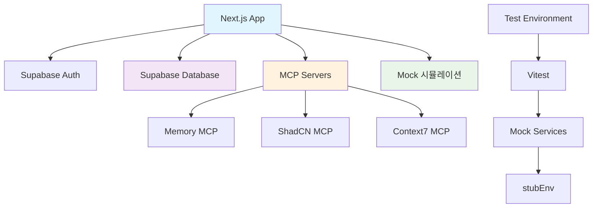

# 🔧 서비스 통합 설정 가이드

> **통합 서비스 연동 관리 시스템**  
> 최종 업데이트: 2025-09-03  
> 서비스: Supabase + Mock 시뮬레이션 + MCP + 테스트 환경

## 🎯 개요

OpenManager VIBE v5의 모든 외부 서비스와 내부 통합 시스템을 완전히 설정하고 관리하는 종합 가이드입니다. 각 서비스별로 모듈화되어 필요한 부분만 빠르게 접근할 수 있습니다.

---

## 🏗️ 서비스 아키텍처 개요

### 현재 서비스 구성



### 서비스별 역할

| 서비스 | 역할 | 상태 | 가이드 링크 |
|--------|------|------|-------------|
| **Supabase** | 인증 + PostgreSQL DB | ✅ 활성 | [DB 설정 가이드](./services-database-setup.md) |
| **Mock 시뮬레이션** | 서버 메트릭 생성 | ✅ 활성 | [Mock 서비스 가이드](./services-mock-setup.md) |
| **MCP 서버** | AI 도구 통합 | ✅ 활성 | [MCP 통합 가이드](./services-mcp-integration.md) |
| **테스트 환경** | 자동화 테스트 | ✅ 활성 | [테스트 환경 가이드](./services-testing-setup.md) |

---

## 📚 모듈별 상세 가이드

### 🗃️ [데이터베이스 설정](./services-database-setup.md)
**Supabase PostgreSQL + RLS + 스키마 관리**
- 데이터베이스 스키마 설계
- Row Level Security (RLS) 정책
- 마이그레이션 및 타입 생성
- 클라이언트 연동 설정

### 🎲 [Mock 시뮬레이션 서비스](./services-mock-setup.md)
**Box-Muller Transform 기반 현실적 서버 메트릭 생성**
- Mock 데이터 생성기 구현
- 15개 장애 시나리오 시뮬레이션
- 10개 서버 타입 프로필 관리
- CPU-Memory 상관관계 모델링

### 🔌 [MCP 서버 통합](./services-mcp-integration.md)
**8개 MCP 서버 관리 및 최적화**
- MCP 서버 설정 및 관리
- 서버별 도구 활용 최적화
- 성능 모니터링 및 디버깅
- 토큰 사용량 최적화 (27% 절약)

### 🧪 [테스트 환경 구성](./services-testing-setup.md)
**통합 테스트 및 Mock 서비스**
- Vitest 환경변수 관리
- Mock 서비스 구현
- 통합 테스트 예시
- E2E 테스트 자동화

---

## 🚀 빠른 시작

### 1️⃣ 환경 설정
```bash
# 환경변수 설정
cp .env.example .env.local
# Supabase 키, MCP 토큰 등 설정

# 의존성 설치
npm install
```

### 2️⃣ 서비스별 초기화
```bash
# Supabase 마이그레이션
npm run db:migrate

# MCP 서버 상태 확인
npm run mcp:status

# 테스트 환경 검증
npm run test:integration
```

### 3️⃣ 통합 헬스체크
```bash
# 모든 서비스 상태 확인
npm run health:check

# 개발 서버 시작
npm run dev
```

---

## 📊 서비스 통합 매트릭스

### 의존성 관계

| 서비스 | Supabase | Mock | MCP | 테스트 |
|--------|----------|------|-----|--------|
| **Next.js** | ✅ 인증/DB | ✅ 메트릭 | ✅ AI 도구 | ✅ 자동화 |
| **Supabase** | - | ❌ | ✅ 메모리 | ✅ DB 테스트 |
| **Mock** | ❌ | - | ❌ | ✅ 데이터 |
| **MCP** | ✅ DB 도구 | ❌ | - | ✅ 자동화 |

### 데이터 흐름

```
사용자 요청 → Next.js → Supabase 인증
           ↓
      Mock 메트릭 생성 → 실시간 표시
           ↓  
      MCP 도구 활용 → AI 분석
           ↓
      테스트 자동화 → 품질 보증
```

---

## 🏆 베스트 프랙티스

### 1. 환경 분리
- **개발**: Mock 데이터 + 로컬 Supabase
- **테스트**: 격리된 테스트 DB + Mock 서비스  
- **프로덕션**: 실제 Supabase + 최적화된 MCP

### 2. 오류 처리
- **Circuit Breaker**: 서비스 장애 시 자동 차단
- **Retry Logic**: 네트워크 오류 재시도
- **Fallback**: Mock 데이터로 대체

### 3. 성능 최적화
- **연결 풀링**: Supabase 연결 최적화
- **캐싱**: MCP 결과 캐싱 (1분 TTL)
- **배치 처리**: Mock 데이터 벌크 생성

---

## 🔧 문제 해결

### 일반적인 문제

| 문제 | 원인 | 해결 방법 |
|------|------|-----------|
| Supabase 연결 실패 | 환경변수 오류 | `.env.local` 키 확인 |
| MCP 서버 오류 | 토큰 만료 | MCP 토큰 갱신 |
| Mock 데이터 오류 | 스키마 불일치 | 타입 정의 동기화 |
| 테스트 실패 | 환경 오염 | 격리된 테스트 DB 사용 |

### 디버깅 명령어

```bash
# 서비스 상태 확인
npm run health:check

# 로그 확인  
npm run logs:services

# 테스트 실행
npm run test:integration --verbose

# MCP 서버 디버깅
npm run mcp:debug
```

---

## 📚 추가 자료

### 공식 문서
- **[Supabase 문서](https://supabase.com/docs)**
- **[MCP 프로토콜](https://modelcontextprotocol.io/docs)**
- **[Vitest 문서](https://vitest.dev/)**

### 프로젝트 가이드
- **[MCP 종합 가이드](../MCP-GUIDE.md)**
- **[빠른 시작](../QUICK-START.md)**
- **[문제 해결](../TROUBLESHOOTING.md)**

---

**💡 팁**: 각 서비스는 독립적으로 설정할 수 있지만, 전체 시스템의 일관성을 위해 순서대로 설정하는 것을 권장합니다.