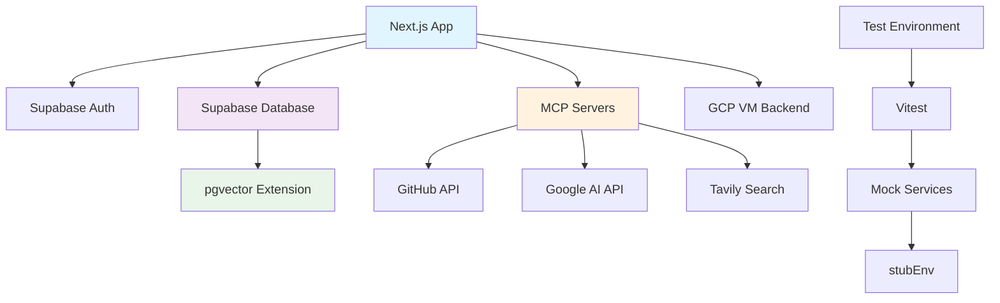

# 🔧 서비스 통합 설정 완전 가이드

> **통합 서비스 연동 관리 시스템**  
> 최종 업데이트: 2025-08-16  
> 서비스: Supabase + PostgreSQL + pgvector + MCP + 테스트 환경

## 🎯 개요

OpenManager VIBE v5의 모든 외부 서비스(Supabase 데이터베이스, pgvector 검색, MCP 서버, 테스트 환경)와 내부 통합 시스템을 완전히 설정하고 관리하는 종합 가이드입니다.

## 📋 목차

1. [서비스 아키텍처 개요](#서비스-아키텍처-개요)
2. [Supabase 데이터베이스 설정](#supabase-데이터베이스-설정)
3. [pgvector 벡터 검색 구성](#pgvector-벡터-검색-구성)
4. [MCP 서버 통합 관리](#mcp-서버-통합-관리)
5. [테스트 환경 구성](#테스트-환경-구성)
6. [개발 Mock 서비스](#개발-mock-서비스)
7. [AI 서비스 통합](#ai-서비스-통합)
8. [모니터링 및 헬스체크](#모니터링-및-헬스체크)
9. [성능 최적화](#성능-최적화)
10. [문제 해결](#문제-해결)

## 🏗️ 서비스 아키텍처 개요

### 서비스별 역할과 의존성



### 서비스 통합 매트릭스

| 서비스          | 환경           | 연결 방식           | 설정 파일          | 헬스체크          |
| --------------- | -------------- | ------------------- | ------------------ | ----------------- |
| **Supabase**    | Production/Dev | REST API + SDK      | `.env.local`       | `/api/health`     |
| **pgvector**    | Production/Dev | PostgreSQL Function | SQL Migration      | RPC 호출          |
| **MCP Servers** | Dev Only       | Protocol + CLI      | `.mcp.json`        | `claude mcp list` |
| **GitHub API**  | All            | REST API + Token    | `.env.local`       | Token Validation  |
| **Google AI**   | All            | REST API + Key      | `.env.local`       | Model Query       |
| **Test Mocks**  | Test Only      | Vitest + stubEnv    | `vitest.config.ts` | Test Suite        |

## 🗃️ Supabase 데이터베이스 설정

### 1단계: 데이터베이스 스키마 설계

```sql
-- supabase/migrations/001_initial_schema.sql
-- 사용자 프로필 테이블
CREATE TABLE public.profiles (
  id UUID REFERENCES auth.users ON DELETE CASCADE,
  email TEXT UNIQUE NOT NULL,
  full_name TEXT,
  avatar_url TEXT,
  role TEXT DEFAULT 'user' CHECK (role IN ('user', 'admin')),
  settings JSONB DEFAULT '{}',
  created_at TIMESTAMP WITH TIME ZONE DEFAULT NOW(),
  updated_at TIMESTAMP WITH TIME ZONE DEFAULT NOW(),
  PRIMARY KEY (id)
);

-- 서버 모니터링 테이블
CREATE TABLE public.servers (
  id UUID DEFAULT uuid_generate_v4() PRIMARY KEY,
  name TEXT NOT NULL,
  host TEXT NOT NULL,
  port INTEGER NOT NULL DEFAULT 80,
  protocol TEXT DEFAULT 'http' CHECK (protocol IN ('http', 'https')),
  status TEXT DEFAULT 'unknown' CHECK (status IN ('active', 'inactive', 'error', 'unknown')),
  response_time INTEGER, -- milliseconds
  last_check TIMESTAMP WITH TIME ZONE DEFAULT NOW(),
  check_interval INTEGER DEFAULT 300, -- seconds
  user_id UUID REFERENCES auth.users(id) ON DELETE CASCADE,
  created_at TIMESTAMP WITH TIME ZONE DEFAULT NOW(),
  updated_at TIMESTAMP WITH TIME ZONE DEFAULT NOW()
);

-- 모니터링 로그 테이블
CREATE TABLE public.server_logs (
  id UUID DEFAULT uuid_generate_v4() PRIMARY KEY,
  server_id UUID REFERENCES public.servers(id) ON DELETE CASCADE,
  status TEXT NOT NULL,
  response_time INTEGER,
  error_message TEXT,
  http_status INTEGER,
  checked_at TIMESTAMP WITH TIME ZONE DEFAULT NOW()
) PARTITION BY RANGE (checked_at);

-- 파티션 생성 (월별)
CREATE TABLE public.server_logs_2025_08 PARTITION OF public.server_logs
FOR VALUES FROM ('2025-08-01') TO ('2025-09-01');

CREATE TABLE public.server_logs_2025_09 PARTITION OF public.server_logs
FOR VALUES FROM ('2025-09-01') TO ('2025-10-01');

-- 인덱스 생성
CREATE INDEX idx_servers_user_id ON public.servers(user_id);
CREATE INDEX idx_servers_status ON public.servers(status);
CREATE INDEX idx_server_logs_server_id ON public.server_logs(server_id);
CREATE INDEX idx_server_logs_checked_at ON public.server_logs(checked_at);
```

### 2단계: RLS (Row Level Security) 정책

```sql
-- supabase/migrations/002_rls_policies.sql
-- RLS 활성화
ALTER TABLE public.profiles ENABLE ROW LEVEL SECURITY;
ALTER TABLE public.servers ENABLE ROW LEVEL SECURITY;
ALTER TABLE public.server_logs ENABLE ROW LEVEL SECURITY;

-- 프로필 정책
CREATE POLICY "Users can view own profile"
  ON public.profiles FOR SELECT
  USING (auth.uid() = id);

CREATE POLICY "Users can update own profile"
  ON public.profiles FOR UPDATE
  USING (auth.uid() = id);

CREATE POLICY "Users can insert own profile"
  ON public.profiles FOR INSERT
  WITH CHECK (auth.uid() = id);

-- 서버 정책
CREATE POLICY "Users can manage own servers"
  ON public.servers
  USING (auth.uid() = user_id);

-- 로그 정책
CREATE POLICY "Users can view own server logs"
  ON public.server_logs FOR SELECT
  USING (
    EXISTS (
      SELECT 1 FROM public.servers
      WHERE servers.id = server_logs.server_id
      AND servers.user_id = auth.uid()
    )
  );

CREATE POLICY "Service can insert logs"
  ON public.server_logs FOR INSERT
  WITH CHECK (
    EXISTS (
      SELECT 1 FROM public.servers
      WHERE servers.id = server_logs.server_id
    )
  );
```

### 3단계: 데이터베이스 함수

```sql
-- supabase/migrations/003_database_functions.sql
-- 서버 상태 업데이트 함수
CREATE OR REPLACE FUNCTION update_server_status(
  p_server_id UUID,
  p_status TEXT,
  p_response_time INTEGER DEFAULT NULL,
  p_error_message TEXT DEFAULT NULL,
  p_http_status INTEGER DEFAULT NULL
)
RETURNS void AS $$
BEGIN
  -- 서버 상태 업데이트
  UPDATE public.servers
  SET
    status = p_status,
    response_time = COALESCE(p_response_time, response_time),
    last_check = NOW(),
    updated_at = NOW()
  WHERE id = p_server_id;

  -- 로그 삽입
  INSERT INTO public.server_logs (
    server_id,
    status,
    response_time,
    error_message,
    http_status,
    checked_at
  ) VALUES (
    p_server_id,
    p_status,
    p_response_time,
    p_error_message,
    p_http_status,
    NOW()
  );
END;
$$ LANGUAGE plpgsql SECURITY DEFINER;

-- 서버 통계 조회 함수
CREATE OR REPLACE FUNCTION get_server_statistics(p_user_id UUID)
RETURNS TABLE (
  total_servers INTEGER,
  active_servers INTEGER,
  inactive_servers INTEGER,
  error_servers INTEGER,
  avg_response_time NUMERIC
) AS $$
BEGIN
  RETURN QUERY
  SELECT
    COUNT(*)::INTEGER as total_servers,
    COUNT(*) FILTER (WHERE status = 'active')::INTEGER as active_servers,
    COUNT(*) FILTER (WHERE status = 'inactive')::INTEGER as inactive_servers,
    COUNT(*) FILTER (WHERE status = 'error')::INTEGER as error_servers,
    ROUND(AVG(response_time), 2) as avg_response_time
  FROM public.servers
  WHERE user_id = p_user_id;
END;
$$ LANGUAGE plpgsql SECURITY DEFINER;

-- 오래된 로그 정리 함수
CREATE OR REPLACE FUNCTION cleanup_old_logs()
RETURNS INTEGER AS $$
DECLARE
  deleted_count INTEGER;
BEGIN
  DELETE FROM public.server_logs
  WHERE checked_at < NOW() - INTERVAL '30 days';

  GET DIAGNOSTICS deleted_count = ROW_COUNT;
  RETURN deleted_count;
END;
$$ LANGUAGE plpgsql SECURITY DEFINER;
```

### 4단계: Supabase 클라이언트 설정

```typescript
// src/lib/supabase/client.ts
import { createClientComponentClient } from '@supabase/auth-helpers-nextjs';
import { Database } from '@/types/database';

export const supabase = createClientComponentClient<Database>();

// 타입 안전한 데이터베이스 헬퍼
export class SupabaseService {
  static async getServersByUser(userId: string) {
    const { data, error } = await supabase
      .from('servers')
      .select('*')
      .eq('user_id', userId)
      .order('created_at', { ascending: false });

    if (error) throw error;
    return data;
  }

  static async updateServerStatus(
    serverId: string,
    status: string,
    responseTime?: number,
    errorMessage?: string,
    httpStatus?: number
  ) {
    const { error } = await supabase.rpc('update_server_status', {
      p_server_id: serverId,
      p_status: status,
      p_response_time: responseTime,
      p_error_message: errorMessage,
      p_http_status: httpStatus,
    });

    if (error) throw error;
  }

  static async getServerStatistics(userId: string) {
    const { data, error } = await supabase.rpc('get_server_statistics', {
      p_user_id: userId,
    });

    if (error) throw error;
    return data[0];
  }

  static async cleanupOldLogs() {
    const { data, error } = await supabase.rpc('cleanup_old_logs');
    if (error) throw error;
    return data;
  }
}
```

## 🔍 pgvector 벡터 검색 구성

### 1단계: pgvector 확장 활성화

```sql
-- supabase/migrations/004_pgvector_setup.sql
-- pgvector 확장 활성화
CREATE EXTENSION IF NOT EXISTS vector;

-- 벡터 검색용 테이블
CREATE TABLE public.documents (
  id UUID DEFAULT uuid_generate_v4() PRIMARY KEY,
  title TEXT NOT NULL,
  content TEXT NOT NULL,
  category TEXT,
  metadata JSONB DEFAULT '{}',
  embedding vector(384), -- 384차원 벡터 (sentence-transformers 모델용)
  user_id UUID REFERENCES auth.users(id) ON DELETE CASCADE,
  created_at TIMESTAMP WITH TIME ZONE DEFAULT NOW(),
  updated_at TIMESTAMP WITH TIME ZONE DEFAULT NOW()
);

-- RLS 정책
ALTER TABLE public.documents ENABLE ROW LEVEL SECURITY;

CREATE POLICY "Users can manage own documents"
  ON public.documents
  USING (auth.uid() = user_id);

-- 벡터 인덱스 생성 (IVFFlat)
CREATE INDEX ON public.documents
USING ivfflat (embedding vector_cosine_ops)
WITH (lists = 100);

-- 메타데이터 검색용 GIN 인덱스
CREATE INDEX idx_documents_metadata ON public.documents USING gin(metadata);
```

### 2단계: pgvector 네이티브 함수

```sql
-- supabase/migrations/005_pgvector_functions.sql
-- 기본 벡터 유사도 검색
CREATE OR REPLACE FUNCTION search_similar_vectors(
  query_embedding vector(384),
  similarity_threshold float DEFAULT 0.3,
  max_results int DEFAULT 10
)
RETURNS TABLE (
  id UUID,
  title TEXT,
  content TEXT,
  category TEXT,
  similarity float,
  metadata JSONB
) AS $$
BEGIN
  RETURN QUERY
  SELECT
    d.id,
    d.title,
    d.content,
    d.category,
    1 - (d.embedding <=> query_embedding) as similarity,
    d.metadata
  FROM public.documents d
  WHERE d.embedding IS NOT NULL
    AND 1 - (d.embedding <=> query_embedding) > similarity_threshold
  ORDER BY d.embedding <=> query_embedding
  LIMIT max_results;
END;
$$ LANGUAGE plpgsql SECURITY DEFINER;

-- 카테고리별 검색
CREATE OR REPLACE FUNCTION search_vectors_by_category(
  query_embedding vector(384),
  search_category TEXT,
  similarity_threshold float DEFAULT 0.3,
  max_results int DEFAULT 10
)
RETURNS TABLE (
  id UUID,
  title TEXT,
  content TEXT,
  category TEXT,
  similarity float,
  metadata JSONB
) AS $$
BEGIN
  RETURN QUERY
  SELECT
    d.id,
    d.title,
    d.content,
    d.category,
    1 - (d.embedding <=> query_embedding) as similarity,
    d.metadata
  FROM public.documents d
  WHERE d.embedding IS NOT NULL
    AND d.category = search_category
    AND 1 - (d.embedding <=> query_embedding) > similarity_threshold
  ORDER BY d.embedding <=> query_embedding
  LIMIT max_results;
END;
$$ LANGUAGE plpgsql SECURITY DEFINER;

-- 하이브리드 검색 (벡터 + 텍스트)
CREATE OR REPLACE FUNCTION hybrid_search_vectors(
  query_embedding vector(384),
  text_query TEXT,
  similarity_threshold float DEFAULT 0.3,
  max_results int DEFAULT 10
)
RETURNS TABLE (
  id UUID,
  title TEXT,
  content TEXT,
  category TEXT,
  similarity float,
  text_rank float,
  combined_score float,
  metadata JSONB
) AS $$
BEGIN
  RETURN QUERY
  SELECT
    d.id,
    d.title,
    d.content,
    d.category,
    1 - (d.embedding <=> query_embedding) as similarity,
    ts_rank(to_tsvector('english', d.content), plainto_tsquery('english', text_query)) as text_rank,
    (1 - (d.embedding <=> query_embedding)) * 0.7 +
    ts_rank(to_tsvector('english', d.content), plainto_tsquery('english', text_query)) * 0.3 as combined_score,
    d.metadata
  FROM public.documents d
  WHERE d.embedding IS NOT NULL
    AND (
      1 - (d.embedding <=> query_embedding) > similarity_threshold
      OR to_tsvector('english', d.content) @@ plainto_tsquery('english', text_query)
    )
  ORDER BY combined_score DESC
  LIMIT max_results;
END;
$$ LANGUAGE plpgsql SECURITY DEFINER;

-- 벡터 통계 조회
CREATE OR REPLACE FUNCTION get_vector_stats()
RETURNS TABLE (
  total_documents bigint,
  total_categories bigint,
  avg_content_length numeric,
  null_embeddings bigint
) AS $$
BEGIN
  RETURN QUERY
  SELECT
    COUNT(*) as total_documents,
    COUNT(DISTINCT category) as total_categories,
    ROUND(AVG(LENGTH(content)), 1) as avg_content_length,
    COUNT(*) FILTER (WHERE embedding IS NULL) as null_embeddings
  FROM public.documents;
END;
$$ LANGUAGE plpgsql SECURITY DEFINER;

-- 메타데이터 필터링 검색
CREATE OR REPLACE FUNCTION search_vectors_with_filters(
  query_embedding vector(384),
  metadata_filter JSONB DEFAULT '{}',
  similarity_threshold float DEFAULT 0.3,
  max_results int DEFAULT 10
)
RETURNS TABLE (
  id UUID,
  title TEXT,
  content TEXT,
  category TEXT,
  similarity float,
  metadata JSONB
) AS $$
BEGIN
  RETURN QUERY
  SELECT
    d.id,
    d.title,
    d.content,
    d.category,
    1 - (d.embedding <=> query_embedding) as similarity,
    d.metadata
  FROM public.documents d
  WHERE d.embedding IS NOT NULL
    AND 1 - (d.embedding <=> query_embedding) > similarity_threshold
    AND (metadata_filter = '{}' OR d.metadata @> metadata_filter)
  ORDER BY d.embedding <=> query_embedding
  LIMIT max_results;
END;
$$ LANGUAGE plpgsql SECURITY DEFINER;

-- 권한 부여
GRANT EXECUTE ON ALL FUNCTIONS IN SCHEMA public TO anon, authenticated;
```

### 3단계: pgvector 클라이언트 서비스

```typescript
// src/lib/pgvector/vector-service.ts
import { supabase } from '@/lib/supabase/client';

export interface VectorSearchResult {
  id: string;
  title: string;
  content: string;
  category: string;
  similarity: number;
  metadata: Record<string, any>;
}

export interface HybridSearchResult extends VectorSearchResult {
  text_rank: number;
  combined_score: number;
}

export class VectorService {
  // 기본 벡터 검색
  static async searchSimilarVectors(
    queryEmbedding: number[],
    similarityThreshold: number = 0.3,
    maxResults: number = 10
  ): Promise<VectorSearchResult[]> {
    const { data, error } = await supabase.rpc('search_similar_vectors', {
      query_embedding: queryEmbedding,
      similarity_threshold: similarityThreshold,
      max_results: maxResults,
    });

    if (error) throw error;
    return data || [];
  }

  // 카테고리별 검색
  static async searchByCategory(
    queryEmbedding: number[],
    category: string,
    similarityThreshold: number = 0.3,
    maxResults: number = 10
  ): Promise<VectorSearchResult[]> {
    const { data, error } = await supabase.rpc('search_vectors_by_category', {
      query_embedding: queryEmbedding,
      search_category: category,
      similarity_threshold: similarityThreshold,
      max_results: maxResults,
    });

    if (error) throw error;
    return data || [];
  }

  // 하이브리드 검색
  static async hybridSearch(
    queryEmbedding: number[],
    textQuery: string,
    similarityThreshold: number = 0.3,
    maxResults: number = 10
  ): Promise<HybridSearchResult[]> {
    const { data, error } = await supabase.rpc('hybrid_search_vectors', {
      query_embedding: queryEmbedding,
      text_query: textQuery,
      similarity_threshold: similarityThreshold,
      max_results: maxResults,
    });

    if (error) throw error;
    return data || [];
  }

  // 메타데이터 필터링 검색
  static async searchWithFilters(
    queryEmbedding: number[],
    metadataFilter: Record<string, any> = {},
    similarityThreshold: number = 0.3,
    maxResults: number = 10
  ): Promise<VectorSearchResult[]> {
    const { data, error } = await supabase.rpc('search_vectors_with_filters', {
      query_embedding: queryEmbedding,
      metadata_filter: metadataFilter,
      similarity_threshold: similarityThreshold,
      max_results: maxResults,
    });

    if (error) throw error;
    return data || [];
  }

  // 벡터 통계
  static async getVectorStats() {
    const { data, error } = await supabase.rpc('get_vector_stats');
    if (error) throw error;
    return data[0];
  }

  // 문서 삽입 (임베딩 포함)
  static async insertDocument(
    title: string,
    content: string,
    embedding: number[],
    category?: string,
    metadata: Record<string, any> = {},
    userId?: string
  ) {
    const { data, error } = await supabase
      .from('documents')
      .insert({
        title,
        content,
        embedding,
        category,
        metadata,
        user_id: userId,
      })
      .select();

    if (error) throw error;
    return data[0];
  }
}
```

## 🔌 MCP 서버 통합 관리

### 1단계: MCP 서버 설정 파일

```json
// .mcp.json (완전 설정)
{
  "mcpServers": {
    "filesystem": {
      "command": "npx",
      "args": [
        "@modelcontextprotocol/server-filesystem",
        "/mnt/d/cursor/openmanager-vibe-v5"
      ],
      "env": {},
      "disabled": false
    },
    "memory": {
      "command": "npx",
      "args": ["@modelcontextprotocol/server-memory"],
      "env": {},
      "disabled": false
    },
    "github": {
      "command": "npx",
      "args": ["@modelcontextprotocol/server-github"],
      "env": {
        "GITHUB_PERSONAL_ACCESS_TOKEN": "${GITHUB_PERSONAL_ACCESS_TOKEN}"
      },
      "disabled": false
    },
    "supabase": {
      "command": "npx",
      "args": ["mcp-server-supabase"],
      "env": {
        "SUPABASE_URL": "${SUPABASE_URL}",
        "SUPABASE_SERVICE_ROLE_KEY": "${SUPABASE_SERVICE_ROLE_KEY}"
      },
      "disabled": false
    },
    "gcp": {
      "command": "npx",
      "args": ["@google-cloud/mcp-server-gcp"],
      "env": {
        "GOOGLE_CLOUD_PROJECT": "openmanager-free-tier",
        "GOOGLE_APPLICATION_CREDENTIALS": "${GCP_SERVICE_ACCOUNT_KEY}"
      },
      "disabled": false
    },
    "tavily": {
      "command": "npx",
      "args": ["tavily-mcp"],
      "env": {
        "TAVILY_API_KEY": "${TAVILY_API_KEY}"
      },
      "disabled": false
    },
    "playwright": {
      "command": "npx",
      "args": ["@playwright/mcp"],
      "env": {},
      "disabled": false
    },
    "thinking": {
      "command": "npx",
      "args": ["@modelcontextprotocol/server-sequential-thinking"],
      "env": {},
      "disabled": false
    },
    "context7": {
      "command": "npx",
      "args": ["@upstash/context7-mcp"],
      "env": {},
      "disabled": false
    },
    "time": {
      "command": "uvx",
      "args": ["mcp-server-time"],
      "env": {},
      "disabled": false
    },
    "shadcn": {
      "command": "npx",
      "args": ["@upstash/shadcn-ui-mcp"],
      "env": {},
      "disabled": false
    },
    "serena": {
      "command": "uvx",
      "args": [
        "--from",
        "git+https://github.com/oraios/serena",
        "serena-mcp-server",
        "--context",
        "ide-assistant",
        "--project",
        "/mnt/d/cursor/openmanager-vibe-v5"
      ],
      "env": {},
      "disabled": false
    }
  }
}
```

### 2단계: MCP 서버 관리 유틸리티

```typescript
// src/lib/mcp/mcp-manager.ts
import { execSync } from 'child_process';

export interface MCPServerStatus {
  name: string;
  status: 'running' | 'stopped' | 'error';
  tools: string[];
  lastCheck: Date;
}

export class MCPManager {
  private static readonly REQUIRED_SERVERS = [
    'filesystem',
    'memory',
    'github',
    'supabase',
    'tavily',
    'thinking',
    'time',
  ];

  // MCP 서버 상태 확인
  static async checkAllServers(): Promise<MCPServerStatus[]> {
    const statuses: MCPServerStatus[] = [];

    try {
      const output = execSync('claude mcp list', { encoding: 'utf8' });
      const servers = this.parseServerList(output);

      for (const server of servers) {
        const status = await this.checkServerStatus(server);
        statuses.push(status);
      }
    } catch (error) {
      console.error('MCP 서버 상태 확인 실패:', error);
    }

    return statuses;
  }

  private static parseServerList(output: string): string[] {
    // claude mcp list 출력 파싱
    const lines = output.split('\n');
    return lines
      .filter((line) => line.trim() && !line.includes('MCP Servers'))
      .map((line) => line.trim().split(' ')[0]);
  }

  private static async checkServerStatus(
    serverName: string
  ): Promise<MCPServerStatus> {
    try {
      // 서버별 도구 목록 확인
      const toolsOutput = execSync(`claude mcp tools ${serverName}`, {
        encoding: 'utf8',
        timeout: 5000,
      });

      const tools = this.parseToolsList(toolsOutput);

      return {
        name: serverName,
        status: tools.length > 0 ? 'running' : 'stopped',
        tools,
        lastCheck: new Date(),
      };
    } catch (error) {
      return {
        name: serverName,
        status: 'error',
        tools: [],
        lastCheck: new Date(),
      };
    }
  }

  private static parseToolsList(output: string): string[] {
    const lines = output.split('\n');
    return lines
      .filter((line) => line.trim() && line.includes('Tool:'))
      .map((line) => line.replace('Tool:', '').trim());
  }

  // 필수 서버 확인
  static async validateRequiredServers(): Promise<boolean> {
    const statuses = await this.checkAllServers();
    const runningServers = statuses
      .filter((s) => s.status === 'running')
      .map((s) => s.name);

    const missingServers = this.REQUIRED_SERVERS.filter(
      (required) => !runningServers.includes(required)
    );

    if (missingServers.length > 0) {
      console.warn('누락된 필수 MCP 서버:', missingServers);
      return false;
    }

    return true;
  }

  // 서버 재시작
  static async restartServer(serverName: string): Promise<boolean> {
    try {
      execSync(`claude api restart`, { encoding: 'utf8' });

      // 재시작 후 확인
      await new Promise((resolve) => setTimeout(resolve, 3000));
      const status = await this.checkServerStatus(serverName);

      return status.status === 'running';
    } catch (error) {
      console.error(`${serverName} 서버 재시작 실패:`, error);
      return false;
    }
  }

  // MCP 헬스체크 리포트
  static async generateHealthReport(): Promise<object> {
    const statuses = await this.checkAllServers();
    const totalServers = statuses.length;
    const runningServers = statuses.filter(
      (s) => s.status === 'running'
    ).length;
    const errorServers = statuses.filter((s) => s.status === 'error').length;

    return {
      timestamp: new Date().toISOString(),
      totalServers,
      runningServers,
      errorServers,
      healthyPercentage: Math.round((runningServers / totalServers) * 100),
      details: statuses,
      requiredServersOk: await this.validateRequiredServers(),
    };
  }
}
```

## 🧪 테스트 환경 구성

### 1단계: Vitest 환경변수 관리

```typescript
// src/test/setup.ts
import { vi, beforeEach, afterEach } from 'vitest';

// 테스트 환경변수 기본값
export const TEST_ENV_DEFAULTS = {
  NODE_ENV: 'test',
  NEXT_PUBLIC_SUPABASE_URL: 'https://test-project.supabase.co',
  NEXT_PUBLIC_SUPABASE_ANON_KEY: 'test-anon-key',
  SUPABASE_SERVICE_ROLE_KEY: 'test-service-key',
  GITHUB_PERSONAL_ACCESS_TOKEN: 'test-github-token',
  GOOGLE_AI_API_KEY: 'test-google-ai-key',
  TAVILY_API_KEY: 'test-tavily-key',
} as const;

// 테스트 환경 설정 함수
export function setupTestEnvironment() {
  beforeEach(() => {
    // 모든 환경변수를 기본값으로 설정
    Object.entries(TEST_ENV_DEFAULTS).forEach(([key, value]) => {
      vi.stubEnv(key, value);
    });
  });

  afterEach(() => {
    // 테스트 후 정리
    vi.unstubAllEnvs();
    vi.clearAllMocks();
  });
}

// 특정 환경변수로 테스트 실행
export function withTestEnv<T>(
  envOverrides: Partial<typeof TEST_ENV_DEFAULTS>,
  testFn: () => T
): T {
  const originalEnv: Record<string, string | undefined> = {};

  // 현재 환경변수 백업
  Object.keys(envOverrides).forEach((key) => {
    originalEnv[key] = process.env[key];
  });

  try {
    // 새 환경변수 설정
    Object.entries(envOverrides).forEach(([key, value]) => {
      vi.stubEnv(key, value);
    });

    return testFn();
  } finally {
    // 원래 값으로 복원
    Object.entries(originalEnv).forEach(([key, value]) => {
      if (value === undefined) {
        vi.unstubEnv(key);
      } else {
        vi.stubEnv(key, value);
      }
    });
  }
}
```

### 2단계: Mock 서비스 구현

```typescript
// src/test/mocks/supabase-mock.ts
import { vi } from 'vitest';

export const createSupabaseMock = () => {
  const mockQuery = {
    select: vi.fn().mockReturnThis(),
    insert: vi.fn().mockReturnThis(),
    update: vi.fn().mockReturnThis(),
    delete: vi.fn().mockReturnThis(),
    eq: vi.fn().mockReturnThis(),
    filter: vi.fn().mockReturnThis(),
    order: vi.fn().mockReturnThis(),
    limit: vi.fn().mockReturnThis(),
    single: vi.fn().mockReturnThis(),
  };

  const mockSupabase = {
    from: vi.fn().mockReturnValue(mockQuery),
    rpc: vi.fn(),
    auth: {
      getSession: vi.fn(),
      getUser: vi.fn(),
      signInWithOAuth: vi.fn(),
      signOut: vi.fn(),
    },
    storage: {
      from: vi.fn().mockReturnValue({
        upload: vi.fn(),
        download: vi.fn(),
        remove: vi.fn(),
      }),
    },
  };

  return { mockSupabase, mockQuery };
};

// 기본 Supabase 응답 Mock
export const createMockSupabaseResponse = <T>(data: T, error: any = null) => ({
  data,
  error,
  status: error ? 400 : 200,
  statusText: error ? 'Bad Request' : 'OK',
});
```

### 3단계: 통합 테스트 예시

```typescript
// tests/integration/services-integration.test.ts
import { describe, it, expect, beforeEach, afterEach } from 'vitest';
import { setupTestEnvironment, withTestEnv } from '@/test/setup';
import { SupabaseService } from '@/lib/supabase/client';
import { VectorService } from '@/lib/pgvector/vector-service';
import { MCPManager } from '@/lib/mcp/mcp-manager';

describe('서비스 통합 테스트', () => {
  setupTestEnvironment();

  describe('Supabase 통합', () => {
    it('서버 상태 업데이트가 정상 작동해야 함', async () => {
      await withTestEnv({ NODE_ENV: 'test' }, async () => {
        // Mock 데이터 설정
        const mockServerId = 'test-server-id';
        const mockStatus = 'active';
        const mockResponseTime = 150;

        // 실제 함수 호출 (Mock 환경에서)
        await expect(
          SupabaseService.updateServerStatus(
            mockServerId,
            mockStatus,
            mockResponseTime
          )
        ).resolves.not.toThrow();
      });
    });

    it('서버 통계 조회가 정상 작동해야 함', async () => {
      const mockUserId = 'test-user-id';

      await withTestEnv({ NODE_ENV: 'test' }, async () => {
        const stats = await SupabaseService.getServerStatistics(mockUserId);
        expect(stats).toBeDefined();
      });
    });
  });

  describe('pgvector 통합', () => {
    it('벡터 검색이 정상 작동해야 함', async () => {
      const mockEmbedding = new Array(384).fill(0.1);

      const results = await VectorService.searchSimilarVectors(
        mockEmbedding,
        0.3,
        5
      );

      expect(Array.isArray(results)).toBe(true);
    });

    it('하이브리드 검색이 정상 작동해야 함', async () => {
      const mockEmbedding = new Array(384).fill(0.1);
      const textQuery = 'test query';

      const results = await VectorService.hybridSearch(
        mockEmbedding,
        textQuery,
        0.3,
        5
      );

      expect(Array.isArray(results)).toBe(true);
    });
  });

  describe('MCP 서버 통합', () => {
    it('MCP 서버 상태 확인이 정상 작동해야 함', async () => {
      const statuses = await MCPManager.checkAllServers();

      expect(Array.isArray(statuses)).toBe(true);
      expect(statuses.length).toBeGreaterThan(0);
    });

    it('필수 서버 검증이 정상 작동해야 함', async () => {
      const isValid = await MCPManager.validateRequiredServers();
      expect(typeof isValid).toBe('boolean');
    });
  });
});
```

## 🏥 개발 Mock 서비스

### 1단계: Mock 데이터 생성기

```typescript
// src/test/mock-data/generators.ts
import { faker } from '@faker-js/faker';

export interface MockServer {
  id: string;
  name: string;
  host: string;
  port: number;
  protocol: 'http' | 'https';
  status: 'active' | 'inactive' | 'error' | 'unknown';
  response_time?: number;
  user_id: string;
  created_at: string;
  updated_at: string;
}

export interface MockDocument {
  id: string;
  title: string;
  content: string;
  category: string;
  embedding: number[];
  metadata: Record<string, any>;
  user_id: string;
  created_at: string;
}

export class MockDataGenerator {
  static generateServer(overrides: Partial<MockServer> = {}): MockServer {
    return {
      id: faker.string.uuid(),
      name: faker.company.name(),
      host: faker.internet.domainName(),
      port: faker.internet.port(),
      protocol: faker.helpers.arrayElement(['http', 'https']),
      status: faker.helpers.arrayElement([
        'active',
        'inactive',
        'error',
        'unknown',
      ]),
      response_time: faker.number.int({ min: 50, max: 2000 }),
      user_id: faker.string.uuid(),
      created_at: faker.date.recent().toISOString(),
      updated_at: faker.date.recent().toISOString(),
      ...overrides,
    };
  }

  static generateServers(count: number = 10): MockServer[] {
    return Array.from({ length: count }, () => this.generateServer());
  }

  static generateDocument(overrides: Partial<MockDocument> = {}): MockDocument {
    return {
      id: faker.string.uuid(),
      title: faker.lorem.sentence(),
      content: faker.lorem.paragraphs(3),
      category: faker.helpers.arrayElement([
        'tech',
        'business',
        'health',
        'education',
      ]),
      embedding: Array.from({ length: 384 }, () =>
        faker.number.float({ min: -1, max: 1 })
      ),
      metadata: {
        author: faker.person.fullName(),
        tags: faker.helpers.arrayElements(['tag1', 'tag2', 'tag3'], 2),
        version: faker.system.semver(),
      },
      user_id: faker.string.uuid(),
      created_at: faker.date.recent().toISOString(),
      ...overrides,
    };
  }

  static generateDocuments(count: number = 20): MockDocument[] {
    return Array.from({ length: count }, () => this.generateDocument());
  }

  static generateVectorSearchResult(similarity: number = 0.8) {
    const doc = this.generateDocument();
    return {
      ...doc,
      similarity,
    };
  }
}
```

### 2단계: 개발 서버 Mock 모드

```typescript
// src/lib/dev/mock-service.ts
export class DevMockService {
  private static isEnabled =
    process.env.NODE_ENV === 'development' && process.env.MOCK_MODE === 'true';

  static async mockSupabaseResponse<T>(
    realCall: () => Promise<T>,
    mockData: T
  ): Promise<T> {
    if (this.isEnabled) {
      console.log('🎭 Mock 데이터 사용 중:', typeof mockData);
      return mockData;
    }

    return realCall();
  }

  static async mockVectorSearch(
    realCall: () => Promise<any[]>,
    mockResults: any[] = []
  ): Promise<any[]> {
    if (this.isEnabled) {
      console.log('🔍 벡터 검색 Mock 데이터 사용');
      return mockResults;
    }

    return realCall();
  }

  static async mockMCPCall<T>(
    realCall: () => Promise<T>,
    mockResponse: T
  ): Promise<T> {
    if (this.isEnabled) {
      console.log('🔌 MCP Mock 응답 사용');
      return mockResponse;
    }

    return realCall();
  }

  static logMockStatus() {
    if (this.isEnabled) {
      console.log('🎭 개발 Mock 모드 활성화됨');
    }
  }
}
```

## 🤖 AI 서비스 통합

### 1단계: AI 서비스 추상화

```typescript
// src/lib/ai/ai-service-manager.ts
export interface AIServiceConfig {
  name: string;
  endpoint: string;
  apiKey: string;
  enabled: boolean;
  rateLimit: number;
}

export interface AIResponse {
  content: string;
  model: string;
  usage: {
    inputTokens: number;
    outputTokens: number;
    totalTokens: number;
  };
  timestamp: Date;
}

export class AIServiceManager {
  private services: Map<string, AIServiceConfig> = new Map();

  constructor() {
    this.initializeServices();
  }

  private initializeServices() {
    // Claude AI
    this.services.set('claude', {
      name: 'Claude',
      endpoint: 'https://api.anthropic.com',
      apiKey: process.env.CLAUDE_API_KEY || '',
      enabled: !!process.env.CLAUDE_API_KEY,
      rateLimit: 60, // requests per minute
    });

    // Google AI
    this.services.set('google', {
      name: 'Google AI',
      endpoint: 'https://generativelanguage.googleapis.com',
      apiKey: process.env.GOOGLE_AI_API_KEY || '',
      enabled: !!process.env.GOOGLE_AI_API_KEY,
      rateLimit: 15,
    });

    // OpenAI
    this.services.set('openai', {
      name: 'OpenAI',
      endpoint: 'https://api.openai.com',
      apiKey: process.env.OPENAI_API_KEY || '',
      enabled: !!process.env.OPENAI_API_KEY,
      rateLimit: 50,
    });
  }

  async callAI(
    serviceName: string,
    prompt: string,
    options: {
      model?: string;
      maxTokens?: number;
      temperature?: number;
    } = {}
  ): Promise<AIResponse> {
    const service = this.services.get(serviceName);

    if (!service || !service.enabled) {
      throw new Error(`AI 서비스 '${serviceName}'을 사용할 수 없습니다`);
    }

    // 실제 AI 서비스 호출 구현
    // 각 서비스별 API 호출 로직
    return this.executeAICall(service, prompt, options);
  }

  private async executeAICall(
    service: AIServiceConfig,
    prompt: string,
    options: any
  ): Promise<AIResponse> {
    // 서비스별 구현
    switch (service.name) {
      case 'Claude':
        return this.callClaude(service, prompt, options);
      case 'Google AI':
        return this.callGoogleAI(service, prompt, options);
      case 'OpenAI':
        return this.callOpenAI(service, prompt, options);
      default:
        throw new Error(`지원하지 않는 AI 서비스: ${service.name}`);
    }
  }

  private async callClaude(
    service: AIServiceConfig,
    prompt: string,
    options: any
  ): Promise<AIResponse> {
    // Claude API 호출 구현
    throw new Error('Claude API 호출 구현 필요');
  }

  private async callGoogleAI(
    service: AIServiceConfig,
    prompt: string,
    options: any
  ): Promise<AIResponse> {
    // Google AI API 호출 구현
    throw new Error('Google AI API 호출 구현 필요');
  }

  private async callOpenAI(
    service: AIServiceConfig,
    prompt: string,
    options: any
  ): Promise<AIResponse> {
    // OpenAI API 호출 구현
    throw new Error('OpenAI API 호출 구현 필요');
  }

  getAvailableServices(): string[] {
    return Array.from(this.services.entries())
      .filter(([, service]) => service.enabled)
      .map(([name]) => name);
  }

  getServiceStatus(): Record<string, boolean> {
    const status: Record<string, boolean> = {};
    this.services.forEach((service, name) => {
      status[name] = service.enabled;
    });
    return status;
  }
}
```

## 📊 모니터링 및 헬스체크

### 통합 헬스체크 시스템

```typescript
// src/lib/monitoring/integrated-health-check.ts
import { SupabaseService } from '@/lib/supabase/client';
import { VectorService } from '@/lib/pgvector/vector-service';
import { MCPManager } from '@/lib/mcp/mcp-manager';
import { AIServiceManager } from '@/lib/ai/ai-service-manager';

export interface ServiceHealthStatus {
  service: string;
  status: 'healthy' | 'degraded' | 'unhealthy';
  responseTime: number;
  lastCheck: Date;
  details?: any;
}

export class IntegratedHealthCheck {
  private aiManager = new AIServiceManager();

  async checkAllServices(): Promise<ServiceHealthStatus[]> {
    const checks = await Promise.allSettled([
      this.checkSupabase(),
      this.checkPgVector(),
      this.checkMCPServers(),
      this.checkAIServices(),
    ]);

    return checks
      .map((result, index) => {
        if (result.status === 'fulfilled') {
          return result.value;
        } else {
          const serviceNames = ['Supabase', 'pgvector', 'MCP', 'AI Services'];
          return {
            service: serviceNames[index],
            status: 'unhealthy' as const,
            responseTime: 0,
            lastCheck: new Date(),
            details: { error: result.reason?.message },
          };
        }
      })
      .flat();
  }

  private async checkSupabase(): Promise<ServiceHealthStatus> {
    const startTime = Date.now();

    try {
      // 간단한 쿼리로 연결 테스트
      await SupabaseService.getServerStatistics('test-user-id');

      return {
        service: 'Supabase',
        status: 'healthy',
        responseTime: Date.now() - startTime,
        lastCheck: new Date(),
      };
    } catch (error) {
      return {
        service: 'Supabase',
        status: 'unhealthy',
        responseTime: Date.now() - startTime,
        lastCheck: new Date(),
        details: { error: error.message },
      };
    }
  }

  private async checkPgVector(): Promise<ServiceHealthStatus> {
    const startTime = Date.now();

    try {
      const stats = await VectorService.getVectorStats();

      return {
        service: 'pgvector',
        status: 'healthy',
        responseTime: Date.now() - startTime,
        lastCheck: new Date(),
        details: stats,
      };
    } catch (error) {
      return {
        service: 'pgvector',
        status: 'unhealthy',
        responseTime: Date.now() - startTime,
        lastCheck: new Date(),
        details: { error: error.message },
      };
    }
  }

  private async checkMCPServers(): Promise<ServiceHealthStatus> {
    const startTime = Date.now();

    try {
      const healthReport = await MCPManager.generateHealthReport();

      const status =
        healthReport.healthyPercentage >= 80
          ? 'healthy'
          : healthReport.healthyPercentage >= 50
            ? 'degraded'
            : 'unhealthy';

      return {
        service: 'MCP Servers',
        status,
        responseTime: Date.now() - startTime,
        lastCheck: new Date(),
        details: healthReport,
      };
    } catch (error) {
      return {
        service: 'MCP Servers',
        status: 'unhealthy',
        responseTime: Date.now() - startTime,
        lastCheck: new Date(),
        details: { error: error.message },
      };
    }
  }

  private async checkAIServices(): Promise<ServiceHealthStatus> {
    const startTime = Date.now();

    try {
      const serviceStatus = this.aiManager.getServiceStatus();
      const availableServices = this.aiManager.getAvailableServices();

      const status = availableServices.length > 0 ? 'healthy' : 'unhealthy';

      return {
        service: 'AI Services',
        status,
        responseTime: Date.now() - startTime,
        lastCheck: new Date(),
        details: {
          available: availableServices,
          status: serviceStatus,
        },
      };
    } catch (error) {
      return {
        service: 'AI Services',
        status: 'unhealthy',
        responseTime: Date.now() - startTime,
        lastCheck: new Date(),
        details: { error: error.message },
      };
    }
  }

  async generateDashboard(): Promise<object> {
    const services = await this.checkAllServices();

    const totalServices = services.length;
    const healthyServices = services.filter(
      (s) => s.status === 'healthy'
    ).length;
    const degradedServices = services.filter(
      (s) => s.status === 'degraded'
    ).length;
    const unhealthyServices = services.filter(
      (s) => s.status === 'unhealthy'
    ).length;

    const overallStatus =
      unhealthyServices > 0
        ? 'critical'
        : degradedServices > 0
          ? 'warning'
          : 'healthy';

    return {
      timestamp: new Date().toISOString(),
      overallStatus,
      services: {
        total: totalServices,
        healthy: healthyServices,
        degraded: degradedServices,
        unhealthy: unhealthyServices,
      },
      details: services,
      uptime: process.uptime(),
      version: process.env.npm_package_version || '1.0.0',
    };
  }
}
```

## 📚 참고 문서 및 체크리스트

### 서비스 통합 체크리스트

#### 초기 설정

- [ ] Supabase 프로젝트 생성 및 데이터베이스 스키마 적용
- [ ] pgvector 확장 활성화 및 네이티브 함수 설치
- [ ] MCP 서버 12개 설치 및 환경변수 설정
- [ ] 테스트 환경 Vitest + Mock 데이터 구성
- [ ] AI 서비스 API 키 설정 및 연동 테스트

#### 개발 과정

- [ ] 새 기능 개발 시 관련 서비스 통합 테스트
- [ ] 환경변수 변경 시 모든 환경 업데이트
- [ ] Mock 데이터 최신 상태 유지
- [ ] 서비스별 에러 핸들링 구현

#### 배포 전

- [ ] 전체 서비스 헬스체크 통과
- [ ] 통합 테스트 전체 통과
- [ ] 성능 테스트 (pgvector 3.6x 향상 확인)
- [ ] MCP 서버 정상 작동 확인
- [ ] AI 서비스 연결 상태 확인

### 관련 문서

- **[개발 환경 가이드](./development-environment-complete.md)**: WSL 개발 환경
- **[인증 보안 가이드](./auth-security-complete-setup.md)**: 보안 설정
- **[플랫폼 배포 가이드](./platform-deployment-setup.md)**: 배포 설정
- **[MCP 종합 가이드](../MCP-GUIDE.md)**: MCP 서버 상세 가이드

---

💡 **핵심 원칙**: 서비스 간 느슨한 결합 + 강력한 통합 테스트 + 실시간 모니터링

🔧 **성공 요소**: Mock 기반 개발 + 단계별 통합 + 자동화된 헬스체크
