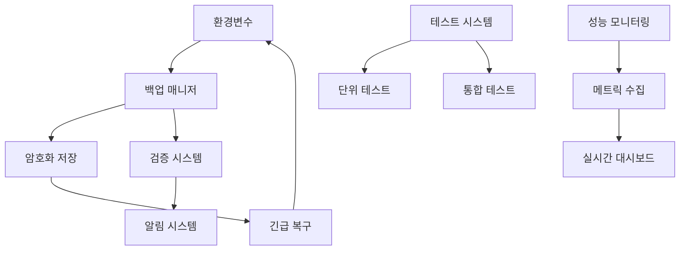

# 🔧 환경변수 관리 체계 가이드

> **OpenManager Vibe v5** - 환경변수 자동 백업, 복구, 검증 시스템

## 📋 목차

1. [시스템 개요](#시스템-개요)
2. [환경변수 백업 시스템](#환경변수-백업-시스템)
3. [긴급 복구 절차](#긴급-복구-절차)
4. [환경변수 검증](#환경변수-검증)
5. [성능 모니터링 활성화](#성능-모니터링-활성화)
6. [테스트 실행](#테스트-실행)
7. [트러블슈팅](#트러블슈팅)
8. [API 참조](#api-참조)

---

## 🎯 시스템 개요

OpenManager Vibe v5는 환경변수 관리를 위한 포괄적인 시스템을 제공합니다:

### 🔑 핵심 기능

- **자동 백업**: 중요 환경변수 자동 백업 및 암호화
- **긴급 복구**: 환경변수 누락 시 즉시 복구
- **실시간 검증**: 환경변수 유효성 실시간 모니터링
- **성능 모니터링**: 프로덕션 환경 성능 추적
- **자동화 테스트**: 환경변수 시스템 안정성 보장

### 🏗️ 아키텍처



---

## 🔄 환경변수 백업 시스템

### 📦 자동 백업 생성

```bash
# 개발 환경에서 백업 생성
npm run env:backup

# 또는 API 호출
curl -X POST http://localhost:3000/api/admin/env-backup
```

### 🔐 백업 파일 구조

```json
{
  "version": "1.0.0",
  "created": "2025-06-15T10:00:00.000Z",
  "lastBackup": "2025-06-15T10:00:00.000Z",
  "entries": [
    {
      "key": "NEXT_PUBLIC_SUPABASE_URL",
      "value": "https://vnswjnltnhpsueosfhmw.supabase.co",
      "encrypted": false,
      "priority": "critical",
      "lastUpdated": "2025-06-15T10:00:00.000Z"
    },
    {
      "key": "SUPABASE_SERVICE_ROLE_KEY",
      "value": "encrypted_value_here",
      "encrypted": true,
      "priority": "critical",
      "lastUpdated": "2025-06-15T10:00:00.000Z"
    }
  ],
  "checksum": "sha256_checksum_here"
}
```

### 🎯 우선순위 분류

| 우선순위    | 설명               | 예시                                          |
| ----------- | ------------------ | --------------------------------------------- |
| `critical`  | 시스템 동작에 필수 | `SUPABASE_SERVICE_ROLE_KEY`, `DATABASE_URL`   |
| `important` | 주요 기능에 필요   | `GOOGLE_AI_API_KEY`, `UPSTASH_REDIS_REST_URL` |
| `optional`  | 선택적 기능        | `ANALYZE`, `SKIP_ENV_VALIDATION`              |

---

## 🚨 긴급 복구 절차

### ⚡ 즉시 복구 (Critical Only)

```bash
# 중요 환경변수만 즉시 복구
npm run env:restore:critical

# API 호출
curl -X POST "http://localhost:3000/api/admin/env-backup?action=restore&priority=critical"
```

### 🔄 전체 복구

```bash
# 모든 환경변수 복구
npm run env:restore:all

# API 호출
curl -X POST "http://localhost:3000/api/admin/env-backup?action=restore&priority=all"
```

### 📋 복구 결과 확인

```json
{
  "success": true,
  "restored": [
    "NEXT_PUBLIC_SUPABASE_URL",
    "SUPABASE_SERVICE_ROLE_KEY",
    "DATABASE_URL"
  ],
  "skipped": [],
  "errors": [],
  "message": "3개 환경변수가 성공적으로 복구되었습니다."
}
```

---

## ✅ 환경변수 검증

### 🔍 실시간 검증

시스템은 다음 항목을 자동으로 검증합니다:

#### URL 형식 검증

- `NEXT_PUBLIC_SUPABASE_URL`: HTTPS URL 형식
- `DATABASE_URL`: PostgreSQL 연결 문자열
- `UPSTASH_REDIS_REST_URL`: HTTPS URL 형식

#### 필수 환경변수 존재 확인

- `NEXT_PUBLIC_SUPABASE_URL`
- `SUPABASE_SERVICE_ROLE_KEY`
- `DATABASE_URL`

### 📊 검증 결과

```json
{
  "isValid": false,
  "missing": ["SUPABASE_SERVICE_ROLE_KEY"],
  "invalid": ["NEXT_PUBLIC_SUPABASE_URL"],
  "priority": "critical",
  "details": {
    "NEXT_PUBLIC_SUPABASE_URL": "유효하지 않은 URL 형식",
    "SUPABASE_SERVICE_ROLE_KEY": "환경변수가 설정되지 않음"
  }
}
```

### 🛠️ 수동 검증

```bash
# 환경변수 검증 실행
npm run env:validate

# API 호출
curl http://localhost:3000/api/admin/env-backup?action=validate
```

---

## 📊 성능 모니터링 활성화

### 🚀 프로덕션 환경 설정

```bash
# 환경변수 설정
export PERFORMANCE_MONITORING_ENABLED=true
export NODE_ENV=production

# 또는 .env.production 파일에 추가
echo "PERFORMANCE_MONITORING_ENABLED=true" >> .env.production
```

### 📈 모니터링 대시보드

```bash
# 현재 성능 메트릭 조회
curl http://localhost:3000/api/performance

# 성능 히스토리 조회 (24시간)
curl "http://localhost:3000/api/performance?action=history&hours=24"

# 활성 알림 조회
curl "http://localhost:3000/api/performance?action=alerts"
```

### 🎛️ 모니터링 제어

```bash
# 모니터링 시작
curl -X POST "http://localhost:3000/api/performance?action=start"

# 모니터링 중지
curl -X POST "http://localhost:3000/api/performance?action=stop"

# 과금 절약 모드 활성화
curl -X POST "http://localhost:3000/api/performance?action=cost-saving"
```

---

## 🧪 테스트 실행

### 🔬 단위 테스트

```bash
# 환경변수 백업 매니저 테스트
npm run test:unit -- env-backup-manager.test.ts

# 모든 단위 테스트
npm run test:unit
```

### 🔗 통합 테스트

```bash
# 환경변수 시스템 통합 테스트
npm run test:integration -- env-system-integration.test.ts

# 모든 통합 테스트
npm run test:integration
```

### 📋 테스트 커버리지

```bash
# 커버리지 리포트 생성
npm run test:coverage

# 커버리지 HTML 리포트 열기
open coverage/index.html
```

---

## 🔧 트러블슈팅

### ❌ 일반적인 문제들

#### 1. 백업 파일 생성 실패

**증상**: `백업 생성 실패` 오류 메시지

**해결책**:

```bash
# 권한 확인
ls -la .env-backup/

# 디렉토리 생성
mkdir -p .env-backup

# 권한 설정
chmod 755 .env-backup
```

#### 2. 환경변수 복구 실패

**증상**: `복구 실패: 백업 파일이 존재하지 않습니다`

**해결책**:

```bash
# 백업 상태 확인
curl http://localhost:3000/api/admin/env-backup?action=status

# 새 백업 생성
curl -X POST http://localhost:3000/api/admin/env-backup
```

#### 3. 성능 모니터링 403 오류

**증상**: `개발 환경에서 성능 모니터링이 비활성화되었습니다`

**해결책**:

```bash
# 개발 환경에서 강제 활성화
export PERFORMANCE_MONITORING_ENABLED=true

# 또는 프로덕션 모드로 실행
export NODE_ENV=production
npm start
```

### 🔍 디버깅 도구

#### 로그 확인

```bash
# 시스템 로그 확인
tail -f logs/system.log

# AI 엔진 로그 확인
tail -f logs/ai-engine.log

# 성능 모니터링 로그 확인
tail -f logs/performance.log
```

#### 상태 점검

```bash
# 전체 시스템 상태
curl http://localhost:3000/api/status

# AI 엔진 상태
curl http://localhost:3000/api/ai/unified/status

# 서버 상태
curl http://localhost:3000/api/servers
```

---

## 📚 API 참조

### 🔄 환경변수 백업 API

#### `GET /api/admin/env-backup`

**쿼리 파라미터**:

- `action`: `status` | `validate`

**응답 예시**:

```json
{
  "success": true,
  "data": {
    "exists": true,
    "lastBackup": "2025-06-15T10:00:00.000Z",
    "entriesCount": 15,
    "isValid": true
  }
}
```

#### `POST /api/admin/env-backup`

**쿼리 파라미터**:

- `action`: `create` | `restore`
- `priority`: `critical` | `important` | `all` (restore 시)

### 📊 성능 모니터링 API

#### `GET /api/performance`

**쿼리 파라미터**:

- `action`: `current` | `history` | `alerts` | `stats`
- `hours`: 히스토리 조회 시간 (기본값: 24)

#### `POST /api/performance`

**쿼리 파라미터**:

- `action`: `start` | `stop` | `restart` | `cost-saving`

---

## 🎯 모범 사례

### ✅ 권장사항

1. **정기 백업**: 매일 자동 백업 스케줄 설정
2. **검증 자동화**: CI/CD 파이프라인에 환경변수 검증 포함
3. **모니터링 활성화**: 프로덕션 환경에서 성능 모니터링 필수
4. **테스트 실행**: 배포 전 환경변수 시스템 테스트 실행
5. **문서화**: 새로운 환경변수 추가 시 문서 업데이트

### ⚠️ 주의사항

1. **민감정보 보호**: API 키 등은 반드시 암호화 저장
2. **백업 보안**: 백업 파일 접근 권한 제한
3. **복구 테스트**: 정기적으로 복구 절차 테스트
4. **모니터링 비용**: 프로덕션 환경에서 모니터링 비용 고려
5. **로그 관리**: 민감정보가 로그에 노출되지 않도록 주의

---

## 📞 지원

### 🆘 문제 신고

문제가 발생하면 다음 정보와 함께 이슈를 생성해주세요:

1. **환경 정보**: OS, Node.js 버전, 환경 (개발/프로덕션)
2. **오류 메시지**: 전체 오류 스택 트레이스
3. **재현 단계**: 문제를 재현할 수 있는 단계별 설명
4. **로그 파일**: 관련 로그 파일 첨부

### 📖 추가 문서

- [API 전체 참조서](./api-reference-v5.43.5.md)
- [시스템 설계 명세서](./system-design-specification-v5.43.5.md)
- [배포 가이드](./deployment-guide-v5.43.5.md)

---

**마지막 업데이트**: 2025년 6월 15일  
**버전**: v5.44.0  
**작성자**: OpenManager Vibe v5 개발팀
