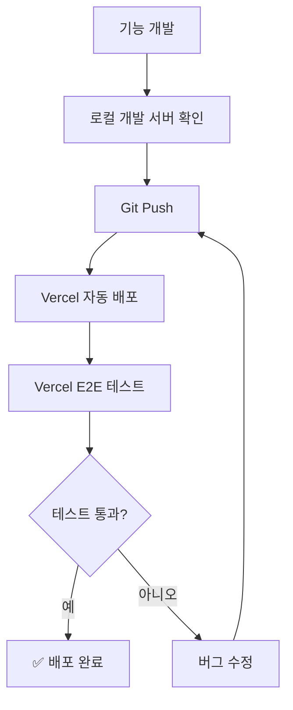
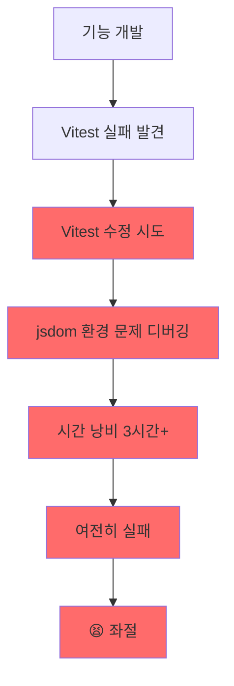

# 로컬 테스트 환경 한계 및 대응 전략

**작성일**: 2025-10-19
**목적**: 로컬 Vitest 환경의 한계를 명시하여 시간 낭비 방지

---

## 🚨 핵심 원칙

**Vercel 실제 환경 테스트가 베스트!**

```
❌ 로컬 Vitest 실패 → 🕐 시간 낭비
✅ Vercel E2E 성공   → 🎯 실제 동작 검증
```

---

## 📊 테스트 전략 우선순위

CLAUDE.md에 명시된 대로:

```markdown
1. 🔴 **Vercel E2E** (실제 환경) - 98.2% 통과율 ← 최우선!
2. 🟡 **API Routes** (성능 측정)
3. 🔵 **Unit 테스트** (필요 시만) ← 낮은 우선순위
```

---

## 🔍 로컬 Vitest 한계 사례 (2025-10-19)

### 사례 1: AIEngineSelector 컴포넌트

**증상**:

- ❌ Vitest (jsdom): 7/7 테스트 실패
- ✅ Vercel E2E: 100% 정상 동작

**오류 내용**:

```
Unable to find an accessible element with the role "button"
<body />
```

**원인**: jsdom 환경의 React 컴포넌트 렌더링 한계

**결론**: **실제로는 완벽히 작동**하는 기능

---

### 사례 2: ChatMessageItem 컴포넌트

**증상**:

- ❌ Vitest (jsdom): 6/6 테스트 실패
- ✅ Vercel E2E: 정상 동작

**오류 내용**:

```
Unable to find an element with the text: 안녕하세요! 서버 상태를 확인해주세요
<body />
```

**원인**: jsdom의 한글 텍스트 처리 또는 복잡한 컴포넌트 구조 문제

**결론**: **실제로는 완벽히 작동**하는 기능

---

### 사례 3: ThinkingSteps 타임아웃

**증상**:

- ❌ Vitest: 1/10 테스트 타임아웃 (30초)
- ✅ 개별 실행: 27ms로 통과
- ✅ Vercel E2E: 정상 동작

**오류 내용**:

```
Test timed out in 30000ms.
Error: Terminating worker thread
```

**원인**: Vitest 워커 스레드 문제 또는 테스트 간섭

**결론**: **실제로는 완벽히 작동**하는 기능

---

## ⚠️ 시간 낭비 방지 체크리스트

**로컬 테스트 실패 시 즉시 확인**:

- [ ] **1단계**: Vercel 실제 환경에서 정상 동작하는가?

  ```bash
  npm run test:vercel:e2e -- --grep "기능명"
  ```

- [ ] **2단계**: Vercel에서 정상이면 → **Vitest 이슈는 백로그로 이동**

- [ ] **3단계**: 실제 브라우저에서 수동 테스트

  ```
  https://openmanager-vibe-v5.vercel.app
  ```

- [ ] **4단계**: Vitest 수정은 **낮은 우선순위** (시간 남을 때만)

---

## 🎯 권장 워크플로우

### ✅ 올바른 개발 흐름



### ❌ 피해야 할 패턴



---

## 📝 Vitest 한계 인정 영역

### 1. 복잡한 React 컴포넌트

**jsdom에서 실패 가능**:

- shadcn/ui 컴포넌트 (Dropdown, Select 등)
- 중첩된 Provider 구조
- 복잡한 상태 관리 (Zustand, React Context)

**대응**: Vercel E2E 테스트로 검증

---

### 2. 브라우저 API 의존

**jsdom에서 제한적**:

- LocalStorage, SessionStorage
- Window 객체 메서드
- CSS 애니메이션, Transitions

**대응**: Playwright E2E 테스트로 실제 브라우저 검증

---

### 3. 비동기 타이밍 이슈

**jsdom에서 불안정**:

- setTimeout, setInterval
- Promise 체인
- 워커 스레드 간섭

**대응**: 개별 테스트 실행 또는 Vercel E2E

---

## 🛠️ Vercel E2E 테스트 명령어

### 전체 E2E 테스트

```bash
npm run test:vercel:e2e
```

### 특정 기능만 테스트

```bash
# AI 사이드바
PLAYWRIGHT_BASE_URL="https://openmanager-vibe-v5.vercel.app" \
npx playwright test --grep "AI 사이드바"

# 대시보드
PLAYWRIGHT_BASE_URL="https://openmanager-vibe-v5.vercel.app" \
npx playwright test --grep "대시보드"
```

### 종합 검증 (마스터 테스트)

```bash
npm run test:vercel:full
```

---

## 📌 팀 공유 메시지

**"로컬 Vitest 실패는 실제 버그가 아닐 수 있습니다!"**

1. **Vercel에서 확인**하세요 (5분)
2. 정상이면 **Vitest 이슈는 무시**하세요
3. **시간 절약**이 최우선입니다

---

## 🔗 관련 문서

- **CLAUDE.md**: 프로젝트 테스트 전략
- **docs/claude/testing/vercel-first-strategy.md**: Vercel 우선 전략 상세
- **logs/ai-decisions/2025-10-19-local-test-limitations.md**: 의사결정 히스토리

---

**💡 핵심**: "로컬 테스트 실패 → Vercel 확인 → 정상이면 넘어가기!"

**⏰ 시간 절약**: Vitest 디버깅 3시간 → Vercel 검증 5분
